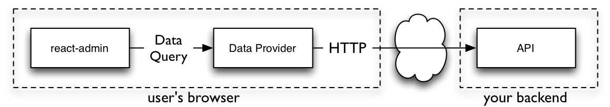

# react-admin

A frontend Framework for building data-driven applications running in the browser, on top of REST/GraphQL APIs, using [React](https://facebook.github.io/react/) and [Material Design](https://material.io/). Open sourced and maintained by [marmelab](https://marmelab.com/).

[](https://vimeo.com/474999017)

Check out [the demos page](./Demos.md) for real-life examples.

## Installation

React-admin is available from npm. You can install it (and its required dependencies)
using:

```sh
npm install react-admin
#or
yarn add react-admin
```

## How To Learn React-Admin

1. Read the [Tutorial](./Tutorial.md) for a 30 minutes introduction. 
2. Read the source code of [the demos](./Demos.md) for real-life examples.
3. Read the [Documentation](./Admin.md) for a deep dive into the react-admin components and hooks.
4. Red the [Architecture decisions](./Architecture.md) to better understand why features are implemented that way.
5. Check out the [API Reference](./Reference.md) for a complete list of the public API.
6. Get [Support](#support) for fixing your own problems

## Usage

Here is a simple example of how to use React-admin:

```jsx
// in app.js
import * as React from "react";
import { render } from 'react-dom';
import { Admin, Resource } from 'react-admin';
import simpleRestProvider from 'ra-data-simple-rest';

import { PostList, PostEdit, PostCreate, PostIcon } from './posts';

render(
    <Admin dataProvider={simpleRestProvider('http://localhost:3000')}>
        <Resource name="posts" list={PostList} edit={PostEdit} create={PostCreate} icon={PostIcon}/>
    </Admin>,
    document.getElementById('root')
);
```

The `<Resource>` component is a configuration component that allows defining sub components for each of the admin view: `list`, `edit`, and `create`. These components use Material UI and custom components from react-admin:


```jsx
// in posts.js
import * as React from "react";
import { List, Datagrid, Edit, Create, SimpleForm, DateField, TextField, EditButton, TextInput, DateInput } from 'react-admin';
import BookIcon from '@material-ui/icons/Book';
export const PostIcon = BookIcon;

export const PostList = (props) => (
    <List {...props}>
        <Datagrid>
            <TextField source="id" />
            <TextField source="title" />
            <DateField source="published_at" />
            <TextField source="average_note" />
            <TextField source="views" />
            <EditButton basePath="/posts" />
        </Datagrid>
    </List>
);

const PostTitle = ({ record }) => {
    return <span>Post {record ? `"${record.title}"` : ''}</span>;
};

export const PostEdit = (props) => (
    <Edit title={<PostTitle />} {...props}>
        <SimpleForm>
            <TextInput disabled source="id" />
            <TextInput source="title" />
            <TextInput source="teaser" options={{ multiline: true }} />
            <TextInput multiline source="body" />
            <DateInput label="Publication date" source="published_at" />
            <TextInput source="average_note" />
            <TextInput disabled label="Nb views" source="views" />
        </SimpleForm>
    </Edit>
);

export const PostCreate = (props) => (
    <Create title="Create a Post" {...props}>
        <SimpleForm>
            <TextInput source="title" />
            <TextInput source="teaser" options={{ multiline: true }} />
            <TextInput multiline source="body" />
            <TextInput label="Publication date" source="published_at" />
            <TextInput source="average_note" />
        </SimpleForm>
    </Create>
);
```


## Does It Work With My API?

Yes.

React-admin uses an adapter approach, with a concept called *Data Providers*. Existing providers can be used as a blueprint to design your API, or you can write your own Data Provider to query an existing API. Writing a custom Data Provider is a matter of hours.



See the [Data Providers documentation](./DataProviders.md) for details.

## Architecture: Batteries Included But Removable

React-admin is designed as a library of loosely coupled React components built on top of [material-ui](https://material-ui.com/), in addition to React hooks allowing to reuse the logic with a custom UI. 

You may replace one part of react-admin with your own, e.g. to use a custom Datagrid, GraphQL instead of REST, or Bootstrap instead of Material Design.

Read more about the [Architecture choices](./Architecture.md).

## Support

* Get professional support from Marmelab via [React-Admin Enterprise Edition](https://marmelab.com/ra-enterprise)
* Get community support via [StackOverflow](https://stackoverflow.com/questions/tagged/react-admin)

## Enterprise Edition

The [React-Admin Enterprise Edition](https://marmelab.com/ra-enterprise)  offers additional features and services for react-admin:

- Save weeks of development thanks to the **Private Modules**, valid on an unlimited number of domains and projects.
  - `ra-preferences`: Persist user preferences (language, theme, filters, datagrid columns, sidebar position, etc) in local storage.
  - `ra-navigation`: Multi-level menu and breadcrumb, with the ability to define a custom path for your resources.
  - `ra-realtime`: Display live notifications, auto-update content on the screen, lock content when editing, with adapters for real-time backends.
  - `ra-editable-datagrid`: Edit data directly in the list view, for better productivity. Excel-like editing experience.
  - `ra-form-layout`: New form layouts for complex data entry tasks (accordion, wizard, etc.)
  - `ra-relationships`: Visualize and edit complex relationships, including many-to-many relationships.
  - `ra-tree`: Edit and visualize tree structures. Reorganize by drag and drop. Adapts to any data structure on the backend (parent_id, children, nested sets, etc).
  - `ra-tour`: Guided tours for react-admin applications. Step-by-step instructions, Material-ui skin.
  - `ra-markdown`: Read Markdown data, and edit it using a WYSIWYG editor in your admin
- Get **Support** from experienced react and react-admin developers, who will help you find the right information and troubleshoot your bugs.
- Get a **50% Discount on Professional Services** in case you need coaching, audit, or custom development by our experts.
- Get access to exclusive **Learning Material**, including a Storybook full of examples, and a dedicated demo app.
- Prioritize your needs in the react-admin **Development Roadmap** thanks to a priority vote.

[](https://marmelab.com/ra-enterprise/)

## Contributing

If you want to give a hand: Thank you! There are many things you can do to help making react-admin better. 

The easiest task is **bug triaging**. Check that new issues on GitHub follow the issue template and give a way to reproduce the issue. If not, comment on the issue to ask precisions. Then, try and reproduce the issue following the description. If you managed to reproduce the issue, add a comment to say it. Otherwise, add a comment to say that something is missing. 

The second way to contribute is to **answer support questions on [StackOverflow](https://stackoverflow.com/questions/tagged/react-admin)**. There are many beginner questions there, so even if you're not super experienced with react-admin, there is someone you can help there. 

Pull requests for **bug fixes** are welcome on the [GitHub repository](https://github.com/marmelab/react-admin). There is always a bunch of [issues labeled "Good First Issue"](https://github.com/marmelab/react-admin/issues?q=is%3Aopen+is%3Aissue+label%3A%22good+first+issue%22) in the bug tracker - start with these. Check the contributing guidelines in [the repository README](https://github.com/marmelab/react-admin#contributing).

If you want to **add a feature**, you can open a Pull request on the `next` branch. We don't accept all features - we try to keep the react-admin code small and manageable. Try and see if your feature can be built as an additional `npm` package. If you're in doubt, open a "Feature Request" issue to see if the core team would accept your feature before developing it. 

## License

React-admin is licensed under the [MIT Licence](https://github.com/marmelab/react-admin/blob/master/LICENSE.md), sponsored and supported by [marmelab](https://marmelab.com).

## Donate

This library is free to use, even for commercial purpose. If you want to give back, please talk about it, help newcomers, or contribute code. But the best way to give back is to **donate to a charity**. We recommend [Doctors Without Borders](https://www.doctorswithoutborders.org/).
