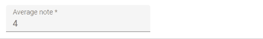

# `<NumberInput>`

`<NumberInput>` translates to an HTML `<input type="number">`.



It is necessary for numeric values because of a [known React bug](https://github.com/facebook/react/issues/1425), which prevents using the more generic [`<TextInput>`](./TextInput.md) in that case.

```jsx
import { NumberInput } from 'react-admin';

<NumberInput source="nb_views" />
```

## Properties

| Prop   | Required | Type     | Default | Description                                                                                             |
| ------ | -------- | -------- | ------- | ------------------------------------------------------------------------------------------------------- |
| `max`  | Optional | `number` | ''      | The maximum value to accept for this input                                                              |
| `min`  | Optional | `number` | ''      | The minimum value to accept for this input                                                              |
| `step` | Optional | `number` | `any`   | A stepping interval to use when using up and down arrows to adjust the value, as well as for validation |

`<NumberInput>` also accepts the [common input props](./Inputs.md#common-input-props).

## Usage

You can customize the `step` props (which defaults to "any"). For instance, to restrict the value to integers, ise a value of 1 for the `step`:

```jsx
<NumberInput source="nb_views" step={1} />
```
