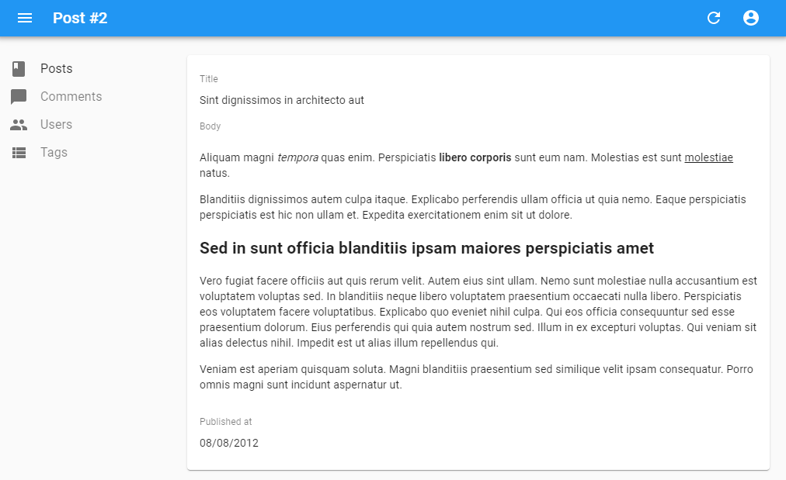

# `<RichTextField>`

This component displays some HTML content. The content is "rich" (i.e. unescaped) by default.



This component leverages [the `dangerouslySetInnerHTML` attribute](https://reactjs.org/docs/dom-elements.html#dangerouslysetinnerhtml), but uses [the DomPurify library](https://github.com/cure53/DOMPurify) to sanitize the HTML before rendering it. It means it is **safe from Cross-Site Scripting (XSS) attacks** - but it's still a good practice to sanitize the value server-side.

## Usage

```jsx
import { RichTextField } from 'react-admin';

<RichTextField source="body" />
```


## Props

| Prop        | Required | Type      | Default  | Description                                          |
| ----------- | -------- | --------- | -------- | ---------------------------------------------------- |
| `stripTags` | Optional | `boolean` | `false`  | If `true`, remove all HTML tags and render text only |

`<RichTextField>` also accepts the [common field props](./Fields.md#common-field-props).

## `stripTags`

The `stripTags` prop allows to remove all HTML markup, preventing some display glitches (which is especially useful in list views, or when truncating the content).

```jsx
import { RichTextField } from 'react-admin';

<RichTextField source="body" stripTags />
```
