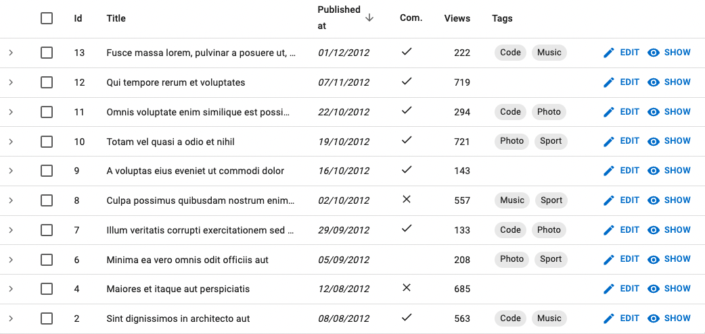

# `<SingleFieldList>`

Use `<SingleFieldList>` when you want to display only one property for each record in a list, for instance, to display the list of tag names for a post.


`<SingleFieldList>` is an **iterator** component: it gets `data` from the `ListContext`, and iterates over it to display each record. It creates a `<RecordContext>` for each record, and delegates the actual rendering to its child - usually a Field component. 

## Usage

`<SingleFieldList>` grabs the current `ListContext`, and renders a Material UI `<Stack>` with one `<ChipField>` for each record in the list, using the `recordRepresentation`. It is especially useful as child of `<ReferenceManyField>` and `<ReferenceArrayField>` components.

Here is an example of a Post show page showing the list of tags for the current post:

```jsx
import {
    Show,
    SimpleShowLayout,
    TextField,
    ReferenceArrayField,
    SingleFieldList
} from 'react-admin';

const PostShow = () => (
    <Show>
        <SimpleShowLayout>
            <TextField source="title" />
            <ReferenceArrayField label="Tags" reference="tags" source="tags">
                <SingleFieldList />
            </ReferenceArrayField>
        </SimpleShowLayout>
    </Show>
);
```

You can also use  `<SingleFieldList>` in a list view, e.g. to display the tags for each post in a `<DataTable>`:

```jsx
import { 
    List,
    DataTable,
    ReferenceArrayField,
    SingleFieldList,
    DateField,
    BooleanField,
    ChipField
} from 'react-admin';

const PostList = () => (
    <List>
        <DataTable>
            <DataTable.Col source="id" />
            <DataTable.Col source="title" />
            <DataTable.Col source="published_at" field={DateField} />
            <DataTable.Col source="commentable" field={BooleanField} />
            <DataTable.NumberCol source="views" />
            <DataTable.Col source="tags" label="Tags">
                <ReferenceArrayField  reference="tags" source="tags">
                    <SingleFieldList />
                </ReferenceArrayField>
            </DataTable.Col>
        </DataTable>
    </List>
)
```



You can customize how each record is displayed by passing a Field component as child. For example, you can change the field name used by the `<ChipField>`:

```jsx
<SingleFieldList>
    <ChipField source="tag" clickable />
</SingleFieldList>
```

## Props

`<SingleFieldList>` accepts the following props:

| Prop        | Required | Type                      | Default | Description                                     |
| ----------- | -------- | ------------------------- | ------- | ----------------------------------------------- |
| `children`  | Optional | `ReactNode`               |         | React element to render for each record         |
| `empty`     | Optional | `ReactNode`               |         | React element to display when the list is empty |
| `linkType`  | Optional | `'edit' | 'show' | false` | `edit`  | The target of the link on each item             |
| `sx`        | Optional | `object`                  |         | The sx props of the Material UI Box component   |

Additional props are passed down to the underlying [Material UI `<Stack>` component](https://mui.com/material-ui/react-stack/).

## `children`

By default, `<SingleFieldList>` renders a `<ChipField>` for each record. You can customize the rendering by passing a Field component as child. 

For example, if you want to customize the field name used by the `<ChipField>`:

```jsx
<SingleFieldList>
    <ChipField source="tag" clickable />
</SingleFieldList>
```

## `empty`

When the list is empty, `<SingleFieldList>` displays nothing. You can customize this behavior by passing a React element as the `empty` prop. For example, to display a message:

```jsx
<SingleFieldList empty={<p>Nothing to display</p>} />
```

## `linkType`

The `<SingleFieldList>` items link to the edition page by default. You can set the `linkType` prop to `show` to link to the `<Show>` page instead.

```jsx
// Display all the tags for the current post
<ReferenceArrayField
    label="Tags"
    reference="tags"
    source="tags"
>
    <SingleFieldList linkType="show" />
</ReferenceArrayField>
```

`linkType` accepts the following values:

* `linkType="edit"`: links to the edit page. This is the default behavior.
* `linkType="show"`: links to the show page.
* `linkType={false}`: does not create any link.

## `sx`: CSS API

The `<SingleFieldList>` component accepts the usual `className` prop. You can also override the styles of the inner components thanks to the `sx` property. This property accepts the following subclasses:

| Rule name                   | Description             |
|-----------------------------|-------------------------|
| `& .RaSingleFieldList-link` | Applied to each link    |

**Tip**: You can override these classes for all `<SingleFieldList>` instances by overriding them in a Material UI theme, using the key "RaSingleFieldList".
