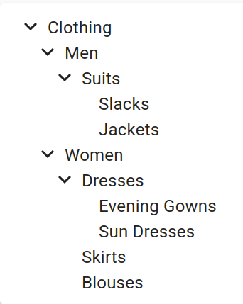

# `<Tree>`

This [Enterprise Edition](https://react-admin-ee.marmelab.com) component renders a tree based on tree data.



It is a wrapper for [rc-tree's `<Tree>`](https://github.com/react-component/tree#tree-props), with Material Design style.

## Usage

`<Tree>` expects a `data` prop containing a tree of nodes as returned by [the dataProvider tree methods](https://react-admin-ee.marmelab.com/documentation/ra-tree#dataprovider).

```tsx
import { Tree } from '@react-admin/ra-tree';

// tree data format
const data = [
    { id: 1, name: 'Clothing', children: [2, 6] },
    { id: 2, name: 'Men', children: [3] },
    { id: 3, name: 'Suits', children: [4, 5] },
    { id: 4, name: 'Slacks', children: [] },
    { id: 5, name: 'Jackets', children: [] },
    { id: 6, name: 'Women', children: [7, 10, 11] },
    { id: 7, name: 'Dresses', children: [8, 9] },
    { id: 8, name: 'Evening Gowns', children: [] },
    { id: 9, name: 'Sun Dresses', children: [] },
    { id: 10, name: 'Skirts', children: [] },
    { id: 11, name: 'Blouses', children: [] },
];

const SimpleTree = () => <Tree data={data} titleField="name" />;
```

## Props

The `<Tree>` component accepts the [rc-tree's `<Tree>`](https://github.com/react-component/tree#tree-props) props but a few of them differ from the original.

| Prop                  | Required | Type           | Default | Description                                                                                    |
| --------------------- | -------- | -------------- | ------- |----------------------------------------------------------------------------------------------- |
| `data`                | Required | `TreeRecord[]` | -       | The tree data to display in the format returned by the [dataProvider](https://react-admin-ee.marmelab.com/documentation/ra-tree#dataprovider). |
| `className`           | Optional | `string`       | -       | The CSS class name to apply on the Root component.                                             |
| `defaultExpandedKeys` | Optional | `Identifier[]` | -       | An array of identifiers defining the records that should be expanded by default.               |
| `defaultSelectedKeys` | Optional | `Identifier[]` | -       | An array of identifiers defining the records that should be selected by default.               |
| `expandedKeys`        | Optional | `Identifier[]` | -       | An array of identifiers defining the records that should be expanded (controlled mode).        |
| `hideRootNodes`       | Optional | `boolean`      | `false` | A boolean indicating whether the root nodes should be hidden.                                  |
| `motion`              | Optional | `boolean`      | `false` | To enable [rc-tree's `<Tree>`](https://github.com/react-component/tree#tree-props) transitions |
| `nodeActions`         | Optional | `ReactNode`    | -       | The React node to display at the end of each node.                                             |
| `onCheck`             | Optional | `function`     | -       | The function to execute when a node is checked or unchecked.                                   |
| `onClick`             | Optional | `function`     | -       | The function to execute when a node is clicked.                                                |
| `onDrop`              | Optional | `function`     | -       | The function to execute when a node is dropped on another.                                     |
| `onExpand`            | Optional | `function`     | -       | The function to execute when a node is expanded or collapsed.                                  |
| `onSelect`            | Optional | `function`     | -       | The function to execute when a node is selected.                                               |
| `selectedKeys`        | Optional | `Identifier[]` | -       | An array of identifiers defining the records that should be selected (controlled mode).        |
| `sx`                  | Optional | `SxProps`      | -       | Material UI shortcut for defining custom styles.                                               |
| `titleField`          | Optional | `string`       | -       | Set the record field to display in the tree.                                                   |

### `className`

The CSS class name to apply on the Root component.

```tsx
import { Tree } from '@react-admin/ra-tree';
import { data } from './data';

export const SimpleTree = () => <Tree data={data} className="my-class" />;
```

### `data`

The tree data to display in the format returned by the [dataProvider](https://react-admin-ee.marmelab.com/documentation/ra-tree#dataprovider).

```tsx
import { Tree } from '@react-admin/ra-tree';

// tree data format
const data = [
    { id: 1, name: 'Clothing', children: [2, 6] },
    { id: 2, name: 'Men', children: [3] },
    { id: 3, name: 'Suits', children: [4, 5] },
    { id: 4, name: 'Slacks', children: [] },
    { id: 5, name: 'Jackets', children: [] },
    { id: 6, name: 'Women', children: [7, 10, 11] },
    { id: 7, name: 'Dresses', children: [8, 9] },
    { id: 8, name: 'Evening Gowns', children: [] },
    { id: 9, name: 'Sun Dresses', children: [] },
    { id: 10, name: 'Skirts', children: [] },
    { id: 11, name: 'Blouses', children: [] },
];

export const SimpleTree = () => <Tree data={data} />;
```

### `defaultExpandedKeys`

An array of identifiers defining the records that should be expanded by default.

```tsx
import { Tree } from '@react-admin/ra-tree';
import { data } from './data';

export const SimpleTree = () => <Tree data={data} defaultExpandedKeys={[0, 1]} />;
```

### `defaultSelectedKeys`

An array of identifiers defining the records that should be selected by default.

```tsx
import { Tree } from '@react-admin/ra-tree';
import { data } from './data';

export const SimpleTree = () => <Tree data={data} defaultSelectedKeys={[0, 1]} />;
```

### `hideRootNodes`

A boolean indicating whether the root nodes should be hidden.

```tsx
import { Tree } from '@react-admin/ra-tree';
import { data } from './data';

export const SimpleTree = () => <Tree data={data} hideRootNodes />;
```

### `motion`

A boolean indicating whether to enable [rc-tree's `<Tree>`](https://github.com/react-component/tree#tree-props) transitions.

```tsx
import { Tree } from '@react-admin/ra-tree';
import { data } from './data';

export const SimpleTree = () => <Tree data={data} motion />;
```

With a custom motion:



```tsx
import { Tree } from '@react-admin/ra-tree';
import { data } from './data';

const motion = {
  motionName: 'node-motion',
  motionAppear: false,
  onAppearStart: node => {
    console.log('Start Motion:', node);
    return { height: 0 };
  },
  onAppearActive: node => ({ height: node.scrollHeight }),
  onLeaveStart: node => ({ height: node.offsetHeight }),
  onLeaveActive: () => ({ height: 0 }),
};

export const SimpleTree = () => (
    <Tree data={data} motion={motion} sx={{
        '& .rc-tree-child-tree': {
            display: 'block'
        }

        '& .node-motion' {
            transition: 'all .3s',
            overflowY: 'hidden',
        }
    }} />
);
```



### `nodeActions`

The React node to display at the end of each node.



```tsx
import { DeleteMenuItem, NodeActions, Tree } from '@react-admin/ra-tree';
import { data } from './data';

const MyCustomActionMenuItem = forwardRef(
    ({ record, resource, parentId }, ref) => {
        const handleClick = () => {
            // Do something with dataProvider ?
        };
        return (
            <MenuItem ref={ref} onClick={handleClick}>
                Do something
            </MenuItem>
        );
    }
);

const MyActions = () => (
    <NodeActions>
        <MyCustomActionMenuItem />
        <DeleteMenuItem />
    </NodeActions>
);

export const SimpleTree = () => <Tree data={data} nodeActions={<MyActions />} />;
```



### `onCheck`

The function to execute when a node is checked. It receives the event and an array of the checked `TreeRecord`.
It receives the following parameters:

- `event`: the original `MouseEvent`
- `selectedRecords`: an array of the currently selected `TreeRecord` objects
- `record`: the `TreeRecord` that has just been selected or unselected
- `isSelected`: a boolean indicating whether the `record` is now selected or not



```tsx
import { Tree } from '@react-admin/ra-tree';
import { data } from './data';

export const SimpleTree = () => (
    <Tree
        data={data}
        onCheck={(event, selectedRecords, record, isSelected) => console.log({ selectedRecords })}
    />
);
```



### `onClick`

The function to execute when a node is clicked. It receives the event and the clicked `TreeRecord`.



```tsx
import { Tree } from '@react-admin/ra-tree';
import { data } from './data';

export const SimpleTree = () => <Tree data={data} onClick={(event, record) => console.log({ record })} />;
```



### `onDrop`

The function to execute when a node is dropped on another. It receives the event and an object with the following properties:

- `source`: the `TreeRecord` that has been dropped
- `destination`: the `TreeRecord` onto which the node has been dropped
- `position`: the position at which the node has been dropped
- `type`: a value indicating whether the node should be moved as a `sibling` or a `child` of the `TreeRecord` in `destination`.



```tsx
import { Tree } from '@react-admin/ra-tree';
import { data } from './data';

export const SimpleTree = () => (
    <Tree
        data={data}
        onDrop={(event, { source, destination, position, type }) => {
            console.log(`Node ${source.id} has been moved as a ${type} of node ${destination.id} at position ${position}`)
        }}
    />
);
```



### `onExpand`

The function to execute when a node is expanded or collapsed. It receives the event and an array of the expanded `TreeRecord`.
It receives the following parameters:

- `event`: the original `MouseEvent`
- `expandedRecords`: an array of the currently expanded `TreeRecord` objects 
- `record`: the `TreeRecord` that has just been expanded or collapsed
- `isExpanded`: a boolean indicating whether the `record` is now expanded or collapsed



```tsx
import { Tree } from '@react-admin/ra-tree';
import { data } from './data';

export const SimpleTree = () => (
    <Tree
        data={data}
        onExpand={(event, expandedRecords, record, isExpanded) => console.log({ expandedRecords })}
    />
);
```



### `onSelect`

The function to execute when a node is expanded or collapsed. It receives the event and the selected `TreeRecord`.
It receives the following parameters:

- `event`: the original `MouseEvent`
- `selectedRecord`: The currently selected `TreeRecord` or `undefined` 
- `record`: the `TreeRecord` that has just been selected or unselected
- `isSelected`: a boolean indicating whether the `record` is now selected or not



```tsx
import { Tree } from '@react-admin/ra-tree';
import { data } from './data';

export const SimpleTree = () => (
    <Tree
        data={data}
        onSelect={(event, selectedRecord, record, isSelected) => console.log({ record })}
    />
);
```



### `selectedKeys`

An array of identifiers defining the records that should be selected (controlled mode).

```tsx
import { Tree } from '@react-admin/ra-tree';
import { data } from './data';

export const SimpleTree = () => <Tree data={data} selectedKeys={[0, 1]} />;
```

### `sx`

Material UI shortcut for defining custom styles.



```tsx
import { Tree } from '@react-admin/ra-tree';
import { data } from './data';

export const SimpleTree = () => (
    <Tree data={data} sx={{
        '&': {
            border: 'solid 1px red'
        }
    }} />
);
```



### `titleField`

The default node title uses the [`recordRepresentation`](./Resource.md#recordrepresentation) of the resource. Use the `titleField` prop to specify the name of the field holding the node title:

```tsx
import { Tree } from '@react-admin/ra-tree';

const data = [
    { id: 1, name: 'Clothing', children: [2, 6] },
    { id: 2, name: 'Men', children: [3] },
    { id: 3, name: 'Suits', children: [4, 5] },
    { id: 4, name: 'Slacks', children: [] },
    { id: 5, name: 'Jackets', children: [] },
    { id: 6, name: 'Women', children: [7, 10, 11] },
    { id: 7, name: 'Dresses', children: [8, 9] },
    { id: 8, name: 'Evening Gowns', children: [] },
    { id: 9, name: 'Sun Dresses', children: [] },
    { id: 10, name: 'Skirts', children: [] },
    { id: 11, name: 'Blouses', children: [] },
];

export const SimpleTree = () => <Tree data={data} titleField="name" />;
```
