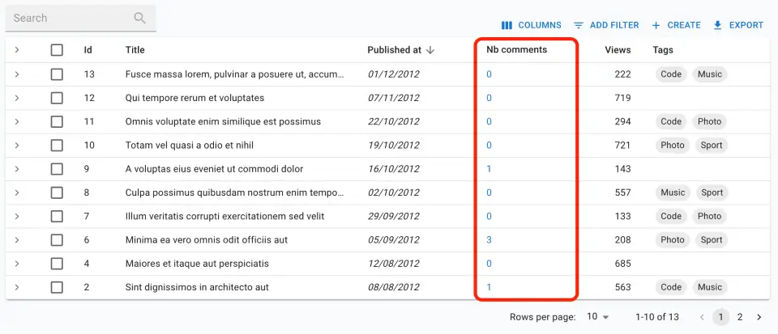

# `<ReferenceManyCount>`

When you need to render the number of records related to another record via a one-to-many relationship (e.g. the number of comments related to a post), use the `<ReferenceManyCount>` component. It calls `dataProvider.getManyReference()` with the `pagination` parameter set to retrieve no data - only the total number of records.

<iframe src="https://www.youtube-nocookie.com/embed/XCucarroK8o" title="YouTube video player" frameborder="0" allow="accelerometer; autoplay; clipboard-write; encrypted-media; gyroscope; picture-in-picture; web-share" allowfullscreen style="aspect-ratio: 16 / 9;width:100%;margin-bottom:1em;"></iframe>

## Usage

Use `<ReferenceManyCount>` as a regular Field in a `<DataTable>` or `<SimpleShowLayout>` - or anywhere inside a [`RecordContext`](./useRecordContext.md). You must set the `reference` and `target` props to match the relationship:

- `reference` is the name of the related resource to fetch (e.g. `comments`)
- `target` is the name of the field in the related resource that points to the current resource (e.g. `post_id`)

For instance, to display the number of comments related to a post in a List view:

```jsx
import { 
    List,
    DataTable,
    ChipField,
    DateField,
    ReferenceArrayField,
    ReferenceManyCount,
    SingleFieldList,
} from 'react-admin';

export const PostList = () => (
    <List>
        <DataTable>
            <DataTable.Col source="id" />
            <DataTable.Col source="title" />
            <DataTable.Col source="published_at" sortByOrder="DESC" field={DateField} />
            <DataTable.Col label="Nb comments">
                <ReferenceManyCount
                    reference="comments"
                    target="post_id"
                    link
                />
            </DataTable.Col>
            <DataTable.Col source="views" sortByOrder="DESC" field={NumberField} />
            <DataTable.Col source="tags" label="Tags">
                <ReferenceArrayField reference="tags" source="tags">
                    <SingleFieldList>
                        <ChipField source="name.en" size="small" />
                    </SingleFieldList>
                </ReferenceArrayField>
            </DataTable.Col>
        </DataTable>
    </List>
)
```



**Tip**: If you need to count all the records of a given resource, use [the `<Count>` component](./Count.md) instead.

## Props

| Prop        | Required | Type                                       | Default                           | Description                                                               |
| ----------- | -------- | ------------------------------------------ | --------------------------------- | ------------------------------------------------------------------------- |
| `reference` | Required | string                                     | -                                 | Name of the related resource to fetch (e.g. `comments`)                   |
| `target`    | Required | string                                     | -                                 | Name of the field in the related resource that points to the current one. |
| `filter`    | Optional | Object                                     | -                                 | Filter to apply to the query.                                             |
| `link`      | Optional | bool                                       | `false`                           | If true, the count is wrapped in a `<Link>` to the filtered list view.    |
| `offline`   | Optional | `ReactNode`                                |                                   | The component to render when there is no connectivity and the record isn't in the cache
| `resource`  | Optional | string                                     | -                                 | Resource to count. Default to the current `ResourceContext`               |
| `sort`      | Optional | `{ field: string, order: 'ASC' or 'DESC' }` | `{ field: 'id', order: 'DESC' }`  | The sort option sent to `getManyReference`                                |
| `timeout`   | Optional | number                                     | 1000                              | Number of milliseconds to wait before displaying the loading indicator.   |

`<ReferenceManyCount>` also accepts the [common field props](./Fields.md#common-field-props).

Additional props are passed to [the underlying Material UI `<Typography>` element](https://mui.com/material-ui/api/typography/).

## `filter`

If you want to count the number of records matching a given filter, pass it as the `filter` prop. For example, to count the number of comments already published:


```jsx
<ReferenceManyCount 
    label="Comments"
    reference="comments"
    target="post_id"
    filter={{ is_published: true }}
/>
```


## `link`

If you want to wrap the count in a `<Link>` to the list view filtered for the current record, pass `true` to the `link` prop.

```jsx
<ReferenceManyCount 
    label="Comments"
    reference="comments"
    target="post_id"
    link
/>
```

When used in conjunction to the `filter` prop, the link will point to the list view with the filter applied.


```jsx
<ReferenceManyCount 
    label="Comments"
    reference="comments"
    target="post_id"
    link 
    filter={{ is_published: true }}
/>
```


## `offline`

By default, `<ReferenceManyCount>` renders the `<Offline variant="inline">` component when there is no connectivity and the count hasn't been cached yet. You can provide your own component via the `offline` prop:

```jsx
<ReferenceManyCount
    reference="comments"
    target="post_id"
    offline={
        <Alert severity="warning">
            You are offline, data cannot be loaded
        </Alert>
    }
/>
```

## `reference`

The `reference` prop is required and must be the name of the related resource to fetch. For instance, to fetch the number of comments related to the current post:

```jsx
<ReferenceManyCount 
    label="Comments"
    reference="comments"
    target="post_id"
/>
```

## `resource`

By default, the `<ReferenceManyCount>` component uses the current `ResourceContext`, so you don't need to pass the `resource` prop to count the number of records in the current Resource. If you want to count a different resource, pass it as the `resource` prop.

```jsx
<ReferenceManyCount 
    label="Comments"
    reference="comments"
    target="post_id"
    resource="posts"
/>
```

## `sort`

If you want to customize the sort options passed to `getManyReference` (for instance because your relation table does not have an `id` column), you can pass a custom `sort` prop:


```jsx
<ReferenceManyCount 
    label="Comments"
    reference="comments"
    target="post_id"
    sort={{ field: 'custom_id', order: 'ASC' }}
/>
```


## `target`

The `target` prop is required and must be the name of the field in the related resource that points to the current one. For instance, when fetching the number of comments related to the current post, if a comment relates to a post via a `post_id` foreign key, you must set the `target` prop to `post_id`:

```jsx
<ReferenceManyCount 
    label="Comments"
    reference="comments"
    target="post_id"
/>
```

## `timeout`

The `<ReferenceManyCount>` component displays a loading indicator after 1 second. This is useful to avoid displaying a loading indicator when the count is retrieved in a few milliseconds. You can change this delay by passing a `timeout` prop.

```jsx
<ReferenceManyCount 
    label="Comments"
    reference="comments"
    target="post_id"
    timeout={500}
/>
```
