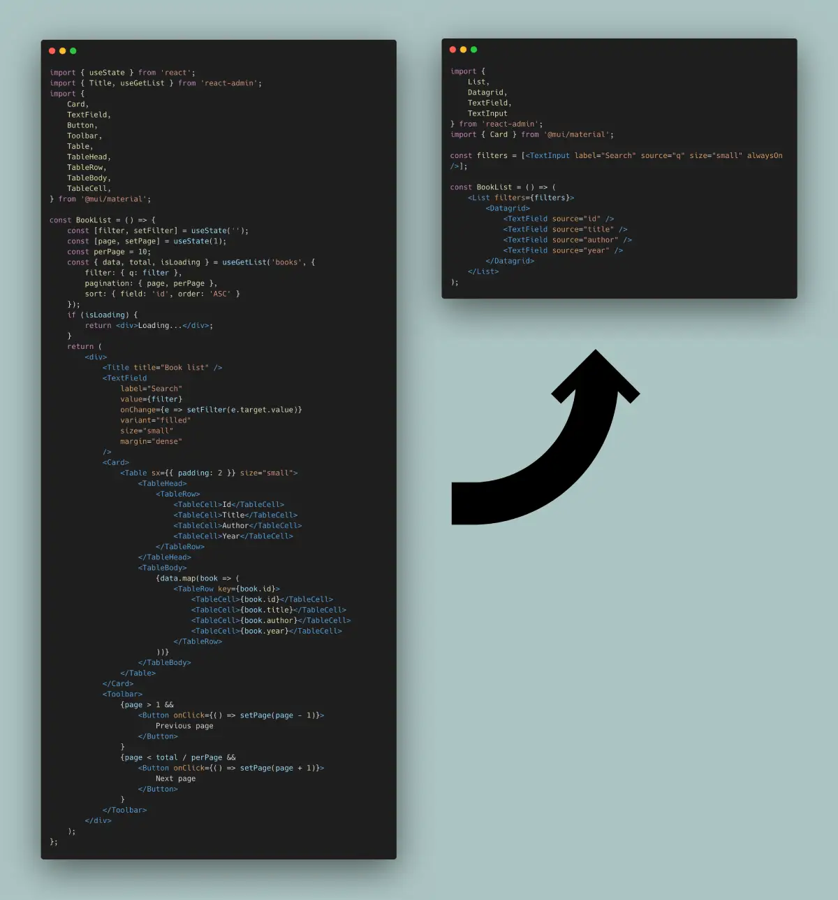

# The List Page

The List view displays a list of records, and lets users search for specific records using filters, sorting, and pagination. 


This tutorial explains the List view from first principles, and shows how react-admin allows you to reduce the amount of boilerplate code to focus on the business logic. 

## From Pure React To React-Admin

The List view fetches a list of records and renders them, together with UI controls for filter, sort and pagination. 

[](./img/list-from-react-to-react-admin.webp)

To better understand how to use the various react-admin hooks and components dedicated to editing and creating, let's start by building such an edition view by hand.

### A List View Built By Hand

You've probably developed it a dozen times, and in fact you don't need react-admin to build, say, a book List view:


```tsx
import { useState } from 'react';
import { Title, useGetList } from 'react-admin';
import {
    Card,
    TextField,
    Button,
    Toolbar,
    Table,
    TableHead,
    TableRow,
    TableBody,
    TableCell,
} from '@mui/material';

const BookList = () => {
    const [filter, setFilter] = useState('');
    const [page, setPage] = useState(1);
    const perPage = 10;
    const { data, total, isPending } = useGetList<Book>('books', {
        filter: { q: filter },
        pagination: { page, perPage },
        sort: { field: 'id', order: 'ASC' }
    });
    if (isPending) {
        return <div>Loading...</div>;
    }
    return (
        <div>
            <Title title="Book list" />
            <TextField
                label="Search"
                value={filter}
                onChange={e => setFilter(e.target.value)}
                variant="filled"
                size="small"
                margin="dense"
            />
            <Card>
                <Table sx={{ padding: 2 }} size="small">
                    <TableHead>
                        <TableRow>
                            <TableCell>Id</TableCell>
                            <TableCell>Title</TableCell>
                            <TableCell>Author</TableCell>
                            <TableCell>Year</TableCell>
                        </TableRow>
                    </TableHead>
                    <TableBody>
                        {data?.map(book => (
                            <TableRow key={book.id}>
                                <TableCell>{book.id}</TableCell>
                                <TableCell>{book.title}</TableCell>
                                <TableCell>{book.author}</TableCell>
                                <TableCell>{book.year}</TableCell>
                            </TableRow>
                        ))}
                    </TableBody>
                </Table>
            </Card>
            <Toolbar>
                {page > 1 && <Button onClick={() => setPage(page - 1)}>Previous page</Button>}
                {page < (total || 0) / perPage && <Button onClick={() => setPage(page + 1)}>Next page</Button>}
            </Toolbar>
        </div>
    );
};
```


You can pass this `BookList` component as the `list` prop of the `<Resource name="books" />`, and react-admin will render it on the `/books/` path.

This example uses the `useGetList` hook instead of `fetch` because `useGetList` already contains the authentication and request state logic. But you could totally write a List view with `fetch`.

This list is a bit rough in the edges (for instance, typing in the search input makes one call to the dataProvider per character), but it's good enough for the purpose of this chapter. 

### `<Datagrid>` Displays Fields In A Table

Table layouts usually require a lot of code to define the table head, row, columns, etc. React-admin `<Datagrid>` component, together with Field components, can help remove that boilerplate:


```diff
import { useState } from 'react';
-import { Title, useGetList } from 'react-admin';
+import { Title, useGetList, Datagrid, TextField } from 'react-admin';
import {
    Card,
    TextField as MuiTextField,
    Button,
    Toolbar,
-   Table,
-   TableHead,
-   TableRow,
-   TableBody,
-   TableCell,
} from '@mui/material';

const BookList = () => {
    const [filter, setFilter] = useState('');
    const [page, setPage] = useState(1);
    const perPage = 10;
+   const sort = { field: 'id', order: 'ASC' };
    const { data, total, isPending } = useGetList('books', {
        filter: { q: filter },
        pagination: { page, perPage },
+       sort
    });
    if (isPending) {
        return <div>Loading...</div>;
    }
    return (
        <div>
            <Title title="Book list" />
            <MuiTextField
                label="Search"
                value={filter}
                onChange={e => setFilter(e.target.value)}
                variant="filled"
                size="small"
                margin="dense"
            />
            <Card>
-               <Table sx={{ padding: 2 }} size="small">
-                   <TableHead>
-                       <TableRow>
-                           <TableCell>Id</TableCell>
-                           <TableCell>Title</TableCell>
-                           <TableCell>Author</TableCell>
-                           <TableCell>Year</TableCell>
-                       </TableRow>
-                   </TableHead>
-                   <TableBody>
-                       {data.map(book => (
-                           <TableRow key={book.id}>
-                               <TableCell>{book.id}</TableCell>
-                               <TableCell>{book.title}</TableCell>
-                               <TableCell>{book.author}</TableCell>
-                               <TableCell>{book.year}</TableCell>
-                           </TableRow>
-                       ))}
-                   </TableBody>
-               </Table>
+               <Datagrid data={data} sort={sort}>
+                   <TextField source="id" />
+                   <TextField source="title" />
+                   <TextField source="author" />
+                   <TextField source="year" />
+               </Datagrid>
            </Card>
            <Toolbar>
                {page > 1 && <Button onClick={() => setPage(page - 1)}>Previous page</Button>}
                {page < total / perPage && <Button onClick={() => setPage(page + 1)}>Next page</Button>}
            </Toolbar>
        </div>
    );
};
```


`<Datagrid>` does more than the previous table: it renders table headers depending on the current sort, and allows you to change the sort order by clicking a column header. Also, for each row, `<Datagrid>` creates a `RecordContext`, which lets you use react-admin Field and Buttons without explicitly passing the row data.

### `ListContext` Exposes List Data To Descendants

`<Datagrid>` requires a `data` prop to render, but it can grab it from a `ListContext` instead. Creating such a context with `<ListContextProvider>` also allows to use other react-admin components specialized in filtering (`<FilterForm>`) and pagination (`<Pagination>`), and to reduce the boilerplate code even further:


```diff
import { useState } from 'react';
import { 
    Title,
    useGetList,
    Datagrid,
    TextField,
+   ListContextProvider,
+   FilterForm,
+   Pagination,
+   TextInput
} from 'react-admin';
-import { Card, TextField as MuiTextField, Button, Toolbar } from '@mui/material';
+import { Card } from '@mui/material';

const BookList = () => {
    const [filter, setFilter] = useState('');
    const [page, setPage] = useState(1);
    const perPage = 10;
    const sort = { field: 'id', order: 'ASC' };
    const { data, total, isPending } = useGetList('books', {
        filter: { q: filter },
        pagination: { page, perPage },
        sort,
    });
    if (isPending) {
        return <div>Loading...</div>;
    }
+   const filters = [<TextInput label="Search" source="q" size="small" alwaysOn />];
+   const filterValues = { q: filter };
+   const setFilters = filters => setFilter(filters.q);
    return (
+       /* The ListContext actually does a lot more so we ignored the TS error to keep this example simple */
+       /* @ts-ignore */
+       <ListContextProvider value={{ data: data || [], total: total || 0, page, perPage, setPage, filterValues, setFilters, sort }}>
        <div>
            <Title title="Book list" />
-           <MuiTextField
-               label="Search"
-               value={filter}
-               onChange={e => setFilter(e.target.value)}
-               variant="filled"
-               size="small"
-               margin="dense"
-           />
+           <FilterForm filters={filters} />
            <Card>
-               <Datagrid data={data} sort={sort}>
+               <Datagrid>
                    <TextField source="id" />
                    <TextField source="title" />
                    <TextField source="author" />
                    <TextField source="year" />
                </Datagrid>
            </Card>
-           <Toolbar>
-               {page > 1 && <Button onClick={() => setPage(page - 1)}>Previous page</Button>}
-               {page < total / perPage && <Button onClick={() => setPage(page + 1)}>Next page</Button>}
-           </Toolbar>
+           <Pagination />
        </div>
+       </ListContextProvider>
    );
};
```


### `useListController` Handles Controller Logic

The initial logic that grabs the records from the API, handles the filter and pagination state, and creates callbacks to change them is also common, and react-admin exposes [the `useListController` hook](./useListController.md) to do it. It returns an object that fits perfectly the format expected by `<ListContextProvider>`:


```diff
-import { useState } from 'react';
import { 
    Title,
-   useGetList,
+   useListController,
    Datagrid,
    TextField,
    ListContextProvider,
    FilterForm,
    Pagination,
    TextInput
} from 'react-admin';
import { Card } from '@mui/material';

const BookList = () => {
-   const [filter, setFilter] = useState('');
-   const [page, setPage] = useState(1);
-   const perPage = 10;
-   const sort = { field: 'id', order: 'ASC' };
-   const { data, total, isPending } = useGetList('books', {
-       filter: { q: filter },
-       pagination: { page, perPage },
-       sort,
-   });
-   if (isPending) {
-       return <div>Loading...</div>;
-   }
+   const listContext = useListController();
+   if (listContext.isPending) {
+       return <div>Loading...</div>;
+   }
    const filters = [<TextInput label="Search" source="q" size="small" alwaysOn />];
-   const filterValues = { q: filter };
-   const setFilters = filters => setFilter(filters.q);
    return (
-       <ListContextProvider value={{ data, total, page, perPage, setPage, filterValues, setFilters, sort }}>
+       <ListContextProvider value={listContext}>
            <div>
                <Title title="Book list" />
                <FilterForm filters={filters} />
                <Card>
                    <Datagrid>
                        <TextField source="id" />
                        <TextField source="title" />
                        <TextField source="author" />
                        <TextField source="year" />
                    </Datagrid>
                </Card>
                <Pagination />
            </div>
        </ListContextProvider>
    );
};
```


Notice that `useListController` doesn't need the 'books' resource name - it relies on the `ResourceContext`, set by the `<Resource>` component, to guess it.

React-admin's List controller does much, much more than the code it replaces above:

- it uses sensible defaults for the sort and pagination state,
- it stores the list state (sort, pagination, filters) in the URL to make the page bookmarkable,
- it memorises this state to let users find the same filters when they come back to the list,
- it allows to select records for bulk actions,
- it debounces the calls to the API when the user types text in the filter form,
- it keeps the current data on screen while a new page is being fetched,
- it changes the current page if it's empty,
- it translates the title 

### `<ListBase>`: Component Version Of The Controller

As calling the List controller and putting its result into a context is also common, react-admin provides [the `<ListBase>` component](./ListBase.md) to do it. So the example can be further simplified to the following: 

```diff
import { 
    Title,
-   useListController,
    Datagrid,
    TextField,
-   ListContextProvider,
+   ListBase,
    FilterForm,
    Pagination,
    TextInput
} from 'react-admin';
import { Card } from '@mui/material';

+const filters = [<TextInput label="Search" source="q" size="small" alwaysOn />];

const BookList = () => {
-   const listContext = useListController();
-   if (listContext.isPending) {
-       return <div>Loading...</div>;
-   }
-   const filters = [<TextInput label="Search" source="q" size="small" alwaysOn />];
    return (
-       <ListContextProvider value={listContext}>
+       <ListBase>
            <div>
                <Title title="Book list" />
                <FilterForm filters={filters} />
                <Card>
                    <Datagrid>
                        <TextField source="id" />
                        <TextField source="title" />
                        <TextField source="author" />
                        <TextField source="year" />
                    </Datagrid>
                </Card>
                <Pagination />
            </div>
-       </ListContextProvider>
+       </ListBase>
    );
};
```

Notice that we're not handling the loading state manually anymore. In fact, the `<Datagrid>` component can render a skeleton while the data is being fetched.

### `useListContext` Accesses The List Context

Using the `<ListBase>` component has one drawback: you can no longer access the list context (`data`, `total`, etc.) in the component. Instead, you have to access it from the `ListContext` using [the `useListContext` hook](./useListContext.md).

The following example illustrates the usage of `useListContext` with a custom pagination component:

```tsx
import { useListContext } from 'react-admin';
import { Toolbar, Button } from '@mui/material';

const Pagination = () => {
    const { page, setPage, total } = useListContext();
    return (
        <Toolbar>
            {page > 1 && <Button onClick={() => setPage(page - 1)}>Previous page</Button>}
            {page < total / 10 && <Button onClick={() => setPage(page + 1)}>Next page</Button>}
        </Toolbar>
    )
}
```

### `<List>` Renders Title, Filters, And Pagination

`<ListBase>` is a headless component: it renders only its children. But almost every List view needs a wrapping `<div>`, a title, filters, pagination, a Material UI `<Card>`, etc. That's why react-admin provides [the `<List>` component](./List.md), which includes the `<ListBase>` component and a "classic" layout to reduce the boilerplate even further:

```diff
import { 
-   Title,
-   ListBase,
+   List,
    Datagrid,
    TextField,
-   FilterForm,
-   Pagination,
    TextInput
} from 'react-admin';
-import { Card } from '@mui/material';

const filters = [<TextInput label="Search" source="q" size="small" alwaysOn />];

const BookList = () => (
-   <ListBase>
-       <div>
-           <Title title="Book list" />
-           <FilterForm filters={filters} />
-           <Card>
+    <List filters={filters}>
                <Datagrid>
                    <TextField source="id" />
                    <TextField source="title" />
                    <TextField source="author" />
                    <TextField source="year" />
                </Datagrid>
-           </Card>
-           <Pagination />
-       </div>
-   </ListBase>
+   </List>
);
```

## A Typical React-Admin List View

Remember the first snippet in this page? The react-admin version is much shorter, and more expressive:

```tsx
import { 
    List,
    Datagrid,
    TextField,
    TextInput
} from 'react-admin';

const filters = [<TextInput label="Search" source="q" size="small" alwaysOn />];

const BookList = () => (
    <List filters={filters}>
        <Datagrid>
            <TextField source="id" />
            <TextField source="title" />
            <TextField source="author" />
            <TextField source="year" />
        </Datagrid>
    </List>
);
```

By encapsulating common CRUD logic, react-admin reduces the amount of code you need to write, and lets you focus on the business logic. As you've seen with the List controller and context, there is no magic: it's just standard React hooks and components designed for B2B apps and web developers with deadlines.

## `<ListGuesser>`: Zero-Configuration List

Sometimes typing `<Datagrid>` and a few `<Field>` components is too much - for instance if you want to prototype an admin for many resources, or search data through an API without worrying about the actual data structure.

For these cases, react-admin provides a `<ListGuesser>` component that will guess the datagrid columns from the data. It's a bit like the `<List>` component, but it doesn't require any configuration.

```tsx
import { Admin, Resource, ListGuesser } from 'react-admin';
import { dataProvider } from './dataProvider';

const App = () => (
    <Admin dataProvider={dataProvider}>
        <Resource name="posts" list={ListGuesser} />
    </Admin>
);
```

`<ListGuesser>` is also a good way to bootstrap a List view, as it outputs the code that it generated for the List into the console. Copy and paste that code in a custom List component, and you can start customizing the list view in no time.

## List Iterators

The components you can use as child of `<List>` are called "List Iterator". They render a list of records. `<Datagrid>` is such a List Iterator, but react-admin provides many more:

- [`<Datagrid>`](./Datagrid.md)
- [`<DatagridAG>`](./DatagridAG.md)
- [`<SimpleList>`](./SimpleList.md)
- [`<SingleFieldList>`](./SingleFieldList.md)
- [`<EditableDatagrid>`](./EditableDatagrid.md)
- [`<TreeWithDetails>`](./TreeWithDetails.md)
- [`<Calendar>`](./Calendar.md)

If that's not enough, [building a custom iterator](#building-a-custom-iterator) isn't hard. 

## Responsive Lists

On Mobile, `<Datagrid>` doesn't work well - the screen is too narrow. You should use [the  `<SimpleList>` component](./SimpleList.md) instead - it's another built-in List Iterator.

<video controls autoplay playsinline muted loop style="height:300px">
    <source src="./img/simple-list.webm" type="video/webm"/>
    <source src="./img/simple-list.mp4" type="video/mp4"/>
    Your browser does not support the video tag.
</video>

To use `<Datagrid>` on desktop and `<SimpleList>` on mobile, use the `useMediaQuery` hook:

```tsx
// in src/posts.tsx
import * as React from 'react';
import { useMediaQuery, Theme } from '@mui/material';
import { List, SimpleList, Datagrid, TextField, ReferenceField } from 'react-admin';

type Post = {
    id: number;
    userId: number;
    title: string;
    views: number;
    published_at: string;
}


export const PostList = () => {
    const isSmall = useMediaQuery<Theme>(theme => theme.breakpoints.down('sm'));
    return (
        <List>
            {isSmall ? (
                <SimpleList<Post>
                    primaryText={record => record.title}
                    secondaryText={record => `${record.views} views`}
                    tertiaryText={record => new Date(record.published_at).toLocaleDateString()}
                />
            ) : (
                <Datagrid>
                    <TextField source="id" />
                    <ReferenceField label="User" source="userId" reference="users">
                        <TextField source="name" />
                    </ReferenceField>
                    <TextField source="title" />
                    <TextField source="body" />
                </Datagrid>
            )}
        </List>
    );
};
```

Check [the dedicated `useMediaQuery` documentation](./useMediaQuery.md) for more information.

## Building a Custom Iterator

In some cases, neither the `<Datagrid>` nor the `<SimpleList>` components allow to display the records in an optimal way for a given task. In these cases, pass your layout component directly as children of the `<List>` component. 

As `<List>` takes care of fetching the data and putting it in a `ListContext`, you can leverage [the `<WithListContext>` component](./WithListContext.md) to get the list data in a render prop. 


```tsx
import { List, WithListContext } from 'react-admin';
import { Stack, Typography } from '@mui/material';

type Book = {
	id: number;
	title: string;
	author: string;
	year: number;
};

const BookList = () => (
    <List emptyWhileLoading>
        <WithListContext<Book> render={({ data }) => (
            <Stack spacing={2} sx={{ padding: 2 }}>
                {data.map(book => (
                    <Typography key={book.id}>
                        <i>{book.title}</i>, by {book.author} ({book.year})
                    </Typography>
                ))}
            </Stack>
        )} />
    </List>
);
```


If you prefer using a hook, you can use [the `useListContext` hook](./useListContext.md) instead:


```tsx
import { List, useListContext } from 'react-admin';
import { Stack, Typography } from '@mui/material';

type Book = {
	id: number;
	title: string;
	author: string;
	year: number;
};

const BookListView = () => {
    const { data } = useListContext<Book>();
    return (
        <Stack spacing={2} sx={{ padding: 2 }}>
            {data.map(book => (
                <Typography key={book.id}>
                    <i>{book.title}</i>, by {book.author} ({book.year})
                </Typography>
            ))}
        </Stack>
    );
};

const BookList = () => (
    <List emptyWhileLoading>
        <BookListView />
    </List>
);
```


**Tip**: With `emptyWhileLoading` turned on, the `<List>` component doesn't render its child component until the data is available. Without this flag, the `<SimpleBookList>` component would render even during the loading phase, break at `data.map()`. 

You can also handle the loading state inside a custom list layout by grabbing the `isPending` variable from the `ListContext`, but `emptyWhileLoading` is usually more convenient.

## Filtering the List

One of the most important features of the List page is the ability to search for a dedicated record. In this documentation, we use the term "filter" for the controls allowing to search the list.

React-admin provides 2 possible UIs for filters, and lets your own if they're not sufficient.

The first filter UI is called "the Filer/Form Combo". 

<video controls autoplay playsinline muted loop>
  <source src="./img/list_filter.mp4" type="video/mp4"/>
  Your browser does not support the video tag.
</video>


The second filter UI is called "the Filter List Sidebar".

<video controls autoplay playsinline muted loop>
  <source src="./img/filter-sidebar.webm" type="video/webm"/>
  <source src="./img/filter-sidebar.mp4" type="video/mp4"/>
  Your browser does not support the video tag.
</video>


Check [the dedicated Filter tutorial chapter](./FilteringTutorial.md) for more information on filtering.

## Sorting the List

The List view uses the `sort` and `order` query parameters to determine the sort field and order passed to `dataProvider.getList()`.

Here is a typical List URL:

> https://myadmin.dev/#/posts?displayedFilters=%7B%22commentable%22%3Atrue%7D&filter=%7B%22commentable%22%3Atrue%2C%22q%22%3A%22lorem%20%22%7D&order=DESC&page=1&perPage=10&sort=published_at

Once decoded, this URL reveals the intended sort:

```
sort=published_at
order=DESC
```

If you're using a `<Datagrid>` inside the List view, then the column headers are buttons allowing users to change the list sort field and order. This feature requires no configuration and works out fo the box. Check [the `<Datagrid>` documentation](./Datagrid.md#customizing-column-sort) to see how to disable or modify the field used for sorting on a particular column.

<video controls autoplay playsinline muted loop>
  <source src="./img/sort-column-header.webm" type="video/webm"/>
  <source src="./img/sort-column-header.mp4" type="video/mp4"/>
  Your browser does not support the video tag.
</video>


If you're using another List layout, check [the `<SortButton>` component](./SortButton.md): It's a standalone button that allows users to change the list sort field and order.

<video controls autoplay playsinline muted loop>
  <source src="./img/sort-button.webm" type="video/webm"/>
  <source src="./img/sort-button.mp4" type="video/mp4"/>
  Your browser does not support the video tag.
</video>


## Linking to a Pre-Sorted List

As the sort values are taken from the URL, you can link to a pre-sorted list by setting the `sort` and `order` query parameters.

For instance, if you have a list of posts ordered by publication date, and you want to provide a button to sort the list by number of views descendant:


```tsx
import Button from '@mui/material/Button';
import { Link } from 'react-router-dom';
import { stringify } from 'query-string';

const SortByViews = () => (
    <Button
        color="primary"
        component={Link}
        to={{
            pathname: '/posts',
            search: stringify({
                page: 1,
                perPage: 25,
                sort: 'nb_views',
                order: 'DESC',
                filter: {},
            }),
        }}
    >
        Sort by views 
    </Button>
);
```


**Tip**: You have to pass *all* the query string parameters - not just `sort` and `order`. That's a current limitation of react-admin.

## Building a Custom Sort Control

When neither the `<Datagrid>` or the `<SortButton>` fit your UI needs, you have to write a custom sort control. As with custom filters, this boils down to grabbing the required data and callbacks from the `ListContext`. Let's use the `<SortButton>` source as an example usage of `sort` and `setSort`:

```tsx
import * as React from 'react';
import { Button, Menu, MenuItem } from '@mui/material';
import SortIcon from '@mui/icons-material/Sort';
import ArrowDropDownIcon from '@mui/icons-material/ArrowDropDown';
import { useListSortContext, useTranslate } from 'react-admin';

const SortButton = ({ fields }) => {
    // sort is an object { field, order } containing the current sort
    // setSort is a callback ({ field, order }) => void allowing to change the sort field and order
    const { sort, setSort } = useListSortContext();
    // rely on the translations to display labels like 'Sort by sales descending'
    const translate = useTranslate();
    // open/closed state for dropdown
    const [anchorEl, setAnchorEl] = React.useState<HTMLButtonElement | null>(null);

    // mouse handlers
	const handleClick: React.MouseEventHandler<HTMLButtonElement> = (event) => {
        setAnchorEl(event.currentTarget);
    };
    const handleClose = () => {
        setAnchorEl(null);
    };
    const handleChangeSort: React.MouseEventHandler<HTMLLIElement> = (event) => {
        const field = event.currentTarget.dataset.sort;
        if (field) {
            setSort({
                field,
                order: field === sort.field ? inverseOrder(sort.order) : 'ASC'
            });
        }
        setAnchorEl(null);
    };

    // English stranslation is 'Sort by %{field} %{order}'
    const buttonLabel = translate('ra.sort.sort_by', {
        field: translate(`resources.products.fields.${sort.field}`),
        order: translate(`ra.sort.${sort.order}`),
    });

    return (<>
        <Button
            aria-controls="simple-menu"
            aria-haspopup="true"
            color="primary"
            onClick={handleClick}
            startIcon={<SortIcon />}
            endIcon={<ArrowDropDownIcon />}
            size="small"
        >
            {buttonLabel}
        </Button>
        <Menu
            id="simple-menu"
            anchorEl={anchorEl}
            keepMounted
            open={Boolean(anchorEl)}
            onClose={handleClose}
        >
            {fields.map(field => (
                <MenuItem
                    onClick={handleChangeSort}
                    // store the sort field in the element dataset to avoid creating a new click handler for each item (better for performance)
                    data-sort={field}
                    key={field}
                >
                    {translate(`resources.products.fields.${field}`)}{' '}
                    {translate(
                        `ra.sort.${
                            sort.field === field
                                ? inverseOrder(sort.order)
                                : 'ASC'
                        }`
                    )}
                </MenuItem>
            ))}
        </Menu>
    </>);
};

const inverseOrder = (sort: string) => (sort === 'ASC' ? 'DESC' : 'ASC');

export default SortButton;
```

## Building a Custom Pagination

The [`<Pagination>`](./Pagination.md) component gets the following constants from [the `useListContext` hook](./useListContext.md):

* `page`: The current page number (integer). First page is `1`.
* `perPage`: The number of records per page.
* `setPage`: `Function(page: number) => void`. A function that set the current page number.
* `total`: The total number of records (may be undefined when the data provider uses [Partial pagination](./DataProviderWriting.md#partial-pagination)).
* `hasPreviousPage`: True if the page number is greater than 1.
* `hasNextPage`: True if the page number is lower than the total number of pages.
* `actions`: A component that displays the pagination buttons (default: `<PaginationActions>`)

If you want to replace the default pagination by a "&lt; previous - next &gt;" pagination, create a pagination component like the following:

```tsx
import { List, useListContext } from 'react-admin';
import { Button, Toolbar } from '@mui/material';
import ChevronLeft from '@mui/icons-material/ChevronLeft';
import ChevronRight from '@mui/icons-material/ChevronRight';

const PostPagination = () => {
    const { page, hasPreviousPage, hasNextPage, setPage } = useListContext();
    if (!hasPreviousPage && !hasNextPage) return null;
    return (
        <Toolbar>
            {hasPreviousPage &&
                <Button 
                    key="previous"
                    onClick={() => setPage(page - 1)}
                    startIcon={<ChevronLeft />}
                >
                    Previous
                </Button>
            }
            {hasNextPage &&
                <Button 
                    key="next"
                    onClick={() => setPage(page + 1)}
                    startIcon={<ChevronRight />}
                >
                    Next                    
                </Button>
            }
        </Toolbar>
    );
}

export const PostList = () => (
    <List pagination={<PostPagination />}>
        ...
    </List>
);
```

But if you just want to change the color property of the pagination button, you can extend the existing components:

```tsx
import { List, Pagination, PaginationActions } from 'react-admin';

export const MyPaginationActions = () => (
    <PaginationActions
        // these props are passed down to the Material UI <Pagination> component
        color="primary"
        showFirstButton
        showLastButton
    />
);

export const MyPagination = () => <Pagination ActionsComponent={MyPaginationActions} />;

export const UserList = () => (
    <List pagination={<MyPagination />} >
        //...
    </List>
);
```

## Third-Party Components

You can find more List components for react-admin in third-party repositories.

- [ra-customizable-datagrid](https://github.com/fizix-io/ra-customizable-datagrid): plugin that allows to hide / show columns dynamically.
- [ra-datagrid](https://github.com/marmelab/ra-datagrid): Integration of [Material UI's `<Datagrid>`](https://mui.com/components/data-grid/) into react-admin.
