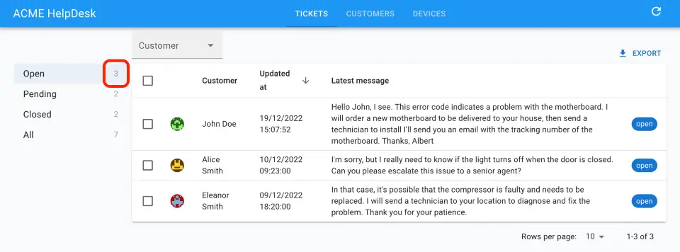

# `<Count>`

When you need to render the number of records of a given resource, use the `<Count>` component. It calls `dataProvider.getList()` with the `pagination` parameter set to retrieve no data - only the total number of records.



## Usage

The most basic usage is to count the number of records in the current resource. For example, to count the number of posts:

```jsx
import { Count } from 'react-admin';

const PostCount = () =>  <Count />;
```

`<Count>` is usually used inside custom Menus, to display the number of records in each category. This takes advantage of [the `filter` prop](#filter) to count the number of records matching a given filter. For example, to build a menu for the various statuses of tickets in a Helpdesk:


```jsx
import { Count, useStore } from 'react-admin';
import { MenuList, MenuItem, ListItemText } from '@mui/material';
import { isEqual } from 'lodash';

const TicketListAside = () => {
  const [statusFilter, setStatusFilter] = useStore("statusMenu", { status: 'open' });
  return (
    <MenuList>
        <MenuItem
            onClick={() => setStatusFilter({ status: 'open' })}
            selected={isEqual(statusFilter, { status: 'open' })}
        >
            <ListItemText>Open</ListItemText>
            <Count filter={{ status: 'open' }} />
        </MenuItem>
        <MenuItem
            onClick={() => setStatusFilter({ status: 'pending' })}
            selected={isEqual(statusFilter, { status: 'pending' })}
        >
            <ListItemText>Pending</ListItemText>
            <Count filter={{ status: 'pending' }} />
        </MenuItem>
        <MenuItem
            onClick={() => setStatusFilter({ status: 'closed' })}
            selected={isEqual(statusFilter, { status: 'closed' })}
        >
            <ListItemText>Closed</ListItemText>
            <Count filter={{ status: 'closed' }} />
        </MenuItem>
        <MenuItem
            onClick={() => setStatusFilter({})}
            selected={isEqual(statusFilter, {})}
        >
            <ListItemText>All</ListItemText>
            <Count filter={{}} />
        </MenuItem>
    </MenuList>
  );
};
```



## Props

| Prop       | Required | Type                                       | Default                           | Description                                                             |
| ---------- | -------- | ------------------------------------------ | --------------------------------- | ----------------------------------------------------------------------- |
| `filter`   | Optional | Object                                     | -                                 | Filter to apply to the query.                                           |
| `link`     | Optional | bool                                       | `false`                           | If true, the count is wrapped in a `<Link>` to the list view.           |
| `resource` | Optional | string                                     | -                                 | Resource to count. Default to the current `ResourceContext`             |
| `sort`     | Optional | `{ field: string, order: 'ASC' or 'DESC' }` | `{ field: 'id', order: 'DESC' }`  | The sort option sent to `getList`                                       |
| `timeout`  | Optional | number                                     | 1000                              | Number of milliseconds to wait before displaying the loading indicator. |

Additional props are passed to [the underlying Material UI `<Typography>` element](https://mui.com/material-ui/api/typography/).

## `filter`

If you want to count the number of records matching a given filter, pass it as the `filter` prop. For example, to count the number of posts already published:


```jsx
<Count resource="posts" filter={{ is_published: true }} />;
```


## `link`

If you want to wrap the count in a `<Link>` to the list view, pass `true` to the `link` prop. 
```jsx
<Count link />
```

When used in conjunction to the `filter` prop, the link will point to the list view with the filter applied.


```jsx
<Count link filter={{ is_published: true }} />
```


## `resource`

By default, the `<Count>` component uses the current `ResourceContext`, so you don't need to pass the `resource` prop to count the number of records in the current Resource.

```jsx
<Count />
```

If you want to count a different resource, pass it as the `resource` prop.

```jsx
<Count resource="comments" />
```

## `sort`

If you want to customize the sort options passed to `getList` (for instance because your table does not have an `id` column), you can pass a custom `sort` prop:


```jsx
<Count resource="posts" sort={{ field: 'custom_id', order: 'ASC' }} />;
```


## `timeout`

The `<Count>` component displays a loading indicator after 1 second. This is useful to avoid displaying a loading indicator when the count is retrieved in a few milliseconds. You can change this delay by passing a `timeout` prop.

```jsx
<Count timeout={500} />
```

## Counting Related Records

If you need to count the number of records related to the current one via a one-to-many relationship, use [the `<ReferenceManyCount>` component](./ReferenceManyCount.md) instead.


```jsx
import { 
    ChipField,
    Datagrid,
    DateField,
    List,
    NumberField,
    ReferenceArrayField,
    ReferenceManyCount,
    SingleFieldList,
    TextField,
} from 'react-admin';

export const PostList = () => (
    <List>
        <Datagrid>
            <TextField source="id" />
            <TextField source="title" />
            <DateField source="published_at" sortByOrder="DESC" />
            <ReferenceManyCount
                label="Comments"
                reference="comments"
                target="post_id"
            />
            <NumberField source="views" sortByOrder="DESC" />
            <ReferenceArrayField
                label="Tags"
                reference="tags"
                source="tags"
            >
                <SingleFieldList>
                    <ChipField source="name.en" size="small" />
                </SingleFieldList>
            </ReferenceArrayField>
        </Datagrid>
    </List>
)
```
