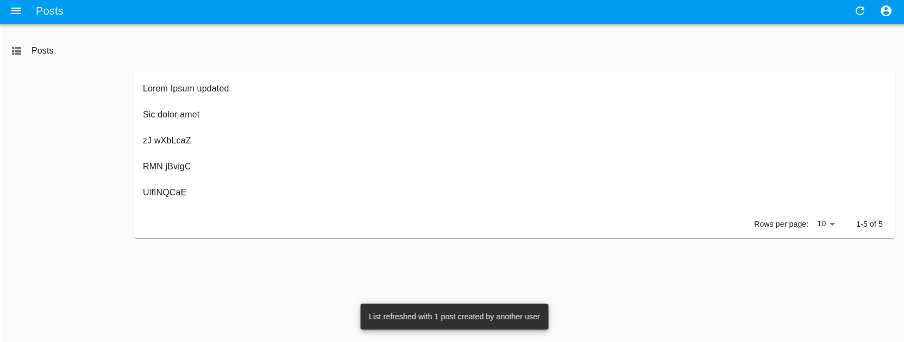

# `<ListLiveUpdate>`

`<ListLiveUpdate>` is an [Enterprise Edition](https://react-admin-ee.marmelab.com) component that refreshes its parent `ListContext` (e.g in a [`<List>`](./List.md)) when a record is created, updated, or deleted.



## Usage

Add the `<ListLiveUpdate>` in your `<List>` children:

```jsx
import { Datagrid, List TextField } from 'react-admin';
import { ListLiveUpdate } from '@react-admin/ra-realtime';

const PostList = () => (
    <List>
        <Datagrid>
            <TextField source="title" />
        </Datagrid>
        <ListLiveUpdate />
    </List>
);
```

To trigger refreshes of `<ListLiveUpdate>`, the API has to publish events containing at least the followings:

```js
{
    topic : '/resource/{resource}',
    event: {
        type: '{deleted || created || updated}',
        payload: { ids: [{listOfRecordIdentifiers}]},
    }
}
```


This also works with [`<ReferenceManyField>`](https://marmelab.com/react-admin/ReferenceManyField.html) or [`<ReferenceArrayField>`](https://marmelab.com/react-admin/ReferenceArrayField.html):
```tsx
import { Show, SimpleShowLayout, ReferenceManyField, Datagrid, TextField, DateField } from 'react-admin';
import { ListLiveUpdate } from '@react-admin/ra-realtime';
const AuthorShow = () => (
    <Show>
        <SimpleShowLayout>
            <TextField source="first_name" />
            <TextField source="last_name" />
            <ReferenceManyField reference="books" target="author_id" label="Books">
              <Datagrid>
                <TextField source="title" />
                <DateField source="published_at" />
              </Datagrid>
              <ListLiveUpdate />
            </ReferenceManyField>
        </SimpleShowLayout>
    </Show>
);
```

## `onEventReceived`

The `<ListLiveUpdate>` allows you to customize the side effects triggered when it receives a new event, by passing a function to the `onEventReceived` prop:

```jsx
import { Datagrid, List, TextField, useNotify, useRefresh } from 'react-admin';
import { ListLiveUpdate } from '@react-admin/ra-realtime';

const PostList = () => {
    const notify = useNotify();
    const refresh = useRefresh();

    const handleEventReceived = event => {
        const count = get(event, 'payload.ids.length', 1);
        notify(`${count} items updated by another user`);
        refresh();
    };

    return (
        <List>
            <Datagrid>
                <TextField source="title" />
            </Datagrid>
            <ListLiveUpdate onEventReceived={handleEventReceived} />
        </List>
    );
};
```
