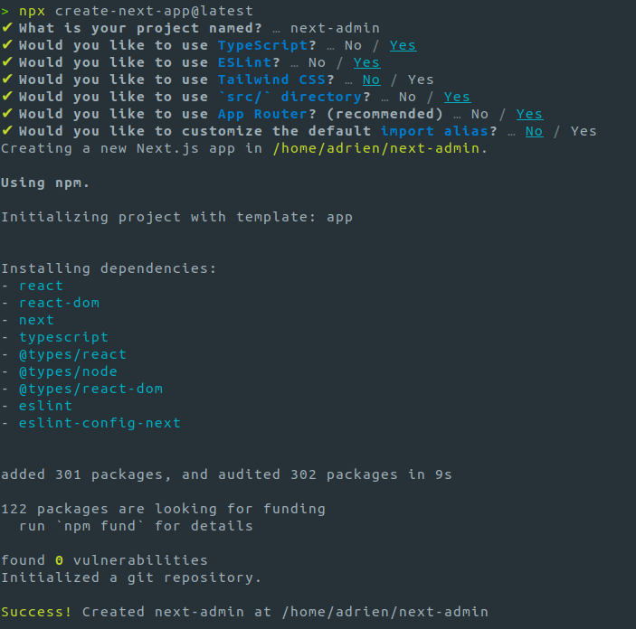
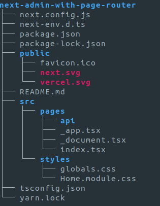
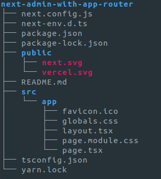

# Next.js Integration

React-admin runs seamlessly on [Next.js](https://nextjs.org/), with minimal configuration.

<iframe src="https://www.youtube-nocookie.com/embed/S3eGZEQ0WmQ" title="YouTube video player" frameborder="0" allow="accelerometer; autoplay; clipboard-write; encrypted-media; gyroscope; picture-in-picture; web-share" allowfullscreen style="aspect-ratio: 16 / 9;width:100%;margin-bottom:1em;"></iframe>

Next.js 13 proposes 2 ways to build a React project: 

- the classic [Pages router](https://nextjs.org/docs/pages/building-your-application/routing/pages-and-layouts),
- the new [App router](https://vercel.com/blog/nextjs-app-router-data-fetching) with React Server components. 

React-admin supports both ways. 

## Create a Next.js application

Use the `create-next-app` package to create a new Next.js project called `next-admin`.

```bash
npx create-next-app@latest
```

A prompt will asks you some questions, feel free to choose answers according to your needs. 
This tutorial assumes you're using a `src` folder, so answer `Yes` to the 5th question. As for the App Router, you can choose to use it or not, this tutorial will explain how to use both. (For new applications, Next.js recommends using the App Router).



This creates a project with the following folder structure:

| Pages Router                                                                                                 | App Router                                                                                                |
|-------------------------------------------------------------------------------------------------------------|-----------------------------------------------------------------------------------------------------------|
|  |  |

## Adding React-Admin Dependencies

Add the `react-admin` npm package, as well as a data provider package. In this example, we'll use `ra-data-json-server` to connect to a test API provided by [JSONPlaceholder](https://jsonplaceholder.typicode.com).

```bash
cd next-admin
npm install react-admin ra-data-json-server
```

**Tips**: If you prefer yarn, you could create the project with `npx create-next-app@latest --use-yarn` and add the dependencies with `yarn add react-admin ra-data-json-server`.

## Creating The Admin App Component

Next, create a `components` directory inside `src`, and an admin App component in `src/components/AdminApp.tsx`:

```jsx
// in src/components/AdminApp.tsx
"use client"; // remove this line if you choose Pages Router
import { Admin, Resource, ListGuesser, EditGuesser } from "react-admin";
import jsonServerProvider from "ra-data-json-server";

const dataProvider = jsonServerProvider("https://jsonplaceholder.typicode.com");

const AdminApp = () => (
  <Admin dataProvider={dataProvider}>
    <Resource
      name="users"
      list={ListGuesser}
      edit={EditGuesser}
      recordRepresentation="name"
    />
    <Resource
      name="posts"
      list={ListGuesser}
      edit={EditGuesser}
      recordRepresentation="title"
    />
    <Resource name="comments" list={ListGuesser} edit={EditGuesser} />
  </Admin>
);

export default AdminApp;
```

This is a minimal configuration to render CRUD pages for users, posts and comments. React-admin will guess the fields to display in the list and edition pages based on the API response. 

## Exposing The Admin App Component

React-admin is designed as a Single-Page Application, rendered on the client-side. It comes with various client-side only libraries (react-router, emotion, material-ui, react-query). So when you include the `AdminApp` component in the Next.js app, you must prevent Next.js from rendering it on the server.

To do that, import the `<AdminApp>` component in Next.js by using [lazy loading](https://nextjs.org/docs/pages/building-your-application/optimizing/lazy-loading) and specify the [`ssr` option to false](https://nextjs.org/docs/pages/building-your-application/optimizing/lazy-loading#with-no-ssr). 

The file to modify depends on the router system you chose during setup:

- App Router: `src/app/page.tsx`, 
- Pages Router: `src/pages/index.tsx`.

```tsx
import { NextPage } from "next";
import dynamic from "next/dynamic";
const AdminApp = dynamic(() => import("@/components/AdminApp"), { ssr: false });

const Home: NextPage = () => <AdminApp />;

export default Home;
```

Now, start the server with `yarn dev`, browse to `http://localhost:3000/`, and you should see the working admin:


Starting from there, you can [Add an API](#adding-an-api) as described in the next section, and/or add features to the Next.js app, as explained in the [Getting started tutorial](./Tutorial.md)

## Rendering React-Admin In A Sub Route

In many cases, the admin is only a part of the application. For instance, you may want to render the admin in a subpath, e.g. `/admin`.

This implies the creation of a new page in the Next.js app. Create a new file at the following location:

- App Router: `src/app/admin/page.tsx`
- Pages Router: `src/pages/admin/index.tsx`

No matter which system you choose, the file should contain the same code:

```tsx
import { NextPage } from "next";
import dynamic from "next/dynamic";
const AdminApp = dynamic(() => import("@/components/AdminApp"), { ssr: false });

const Admin: NextPage = () => {
  return <AdminApp />;
};

export default Admin;
```

Now the admin renders at `http://localhost:3000/admin`. You can use the Next.js routing system to add more pages - for instance, a frontend app.

**Tip**: If you migrated from the Pages Router, you might have to delete the `.next` directory in your project to ensure NextJS bundles the client dependencies correctly.

## Adding an API

[Next.js allows to serve an API](https://nextjs.org/docs/api-routes/introduction) from the same server. You *could* use this to build a CRUD API by hand. However, we consider that building a CRUD API on top of a relational database is a solved problem and that developers shouldn't spend time reimplementing it. 

For instance, if you store your data in a [PostgreSQL](https://www.postgresql.org/) database, you can use [PostgREST](https://postgrest.org/en/stable/) to expose the data as a REST API with zero configuration. Even better, you can use a Software-as-a-Service like [Supabase](https://supabase.com/) to do that for you. 

In such cases, the Next.js API can serve as a Proxy to authenticate client queries and pass them down to Supabase. Let's see an example in practice. 

First, create a Supabase REST API and its associated PostgreSQL database directly on the [Supabase website](https://app.supabase.com/) (it's free for tests and low usage). Once the setup is finished, use the Supabase manager to add the following tables:

- `users` with fields: `id`, `name`, and `email`
- `posts` with fields: `id`, `title`, and `body` 
- `comments` with fields: `id`, `name`, `body`, and `postId` (a foreign key to the `posts.id` field)

You can populate these tables via the Supabse UI if you want. Supabase exposes a REST API at `https://YOUR_INSTANCE.supabase.co/rest/v1`.

Copy the Supabase API URL and service role key into Next.js's `.env.local` file:

```sh
# in `.env.local`
SUPABASE_URL="https://MY_INSTANCE.supabase.co"
SUPABASE_SERVICE_ROLE="MY_SERVICE_ROLE_KEY"
```

**Tip**: This example uses the **service role key** here and not the anonymous role. This allows mutations without dealing with authorization (You may have to modify the safety policies). **You shouldn't do this in production**, but use the [Supabase authorization](https://supabase.com/docs/guides/auth) feature instead.

Create [a "catch-all" API route](https://nextjs.org/docs/app/building-your-application/routing/dynamic-routes#catch-all-segmentss) in the Next.js app by adding a new file at the following location:

- App Router: `src/app/api/admin/[...slug]/route.ts`
- Pages Router: `src/pages/api/admin/[[...slug]].ts`

/!\ The file name is important: it must be `route.ts` in the App Router and `[[...slug]].ts` in the Pages Router.

From this point on, the logic for handling is different depending on the router.

### App Router

```tsx
// in src/app/api/admin/[...slug]/route.ts

export const dynamic = 'force-dynamic'; // defaults to auto
export async function GET(request: Request) {
    return handler(request);
}

export async function POST(request: Request) {
    return handler(request);
}

export async function PUT(request: Request) {
    return handler(request);
}

export async function PATCH(request: Request) {
    return handler(request);
}

export async function DELETE(request: Request) {
    return handler(request);
}

async function handler(request: Request) {
    // get part after /api/admin/ in string url
    const requestUrl = request.url.split('/api/admin')[1];

    // build the CRUD request based on the incoming request
    const url = `${process.env.SUPABASE_URL}/rest/v1${requestUrl}`;

    const options: RequestInit = {
        method: request.method,
        headers: {
            prefer: (request.headers.get('prefer') as string) ?? '',
            accept: request.headers.get('accept') ?? 'application/json',
            ['content-type']:
                request.headers.get('content-type') ?? 'application/json',
            // supabase authentication
            apiKey: process.env.SUPABASE_SERVICE_ROLE ?? '',
            Authorization: "Bearer " + process.env.SUPABASE_SERVICE_ROLE ?? '',
        },
    };

    if (request.body) {
        const body = await request.json();
        options.body = JSON.stringify(body);
    }

    // call the CRUD API
    const response = await fetch(url, options);

    const contentRange = response.headers.get('content-range');

    const headers = new Headers();
    if (contentRange) {
        headers.set('Content-Range', contentRange);
    }
    const data = await response.text();
    return new Response(data, {
        status: 200,
        headers,
    });
}
```

For more information about routes handler with the App Router, see [the official documentation](https://nextjs.org/docs/app/building-your-application/routing/route-handlers).

### Pages Router

This API route redirects all calls from the react-admin app to the Supabase CRUD API:

```tsx
// in src/pages/api/admin/[[...slug]].ts
import { NextApiRequest, NextApiResponse } from "next";

export default async function handler(req: NextApiRequest, res: NextApiResponse) {
  // get the incoming request URL, e.g. 'posts?limit=10&offset=0&order=id.asc'
  const requestUrl = req.url?.substring("/api/admin/".length);
  // build the CRUD request based on the incoming request
  const url = `${process.env.SUPABASE_URL}/rest/v1/${requestUrl}`;
  const options: RequestInit = {
    method: req.method,
    headers: {
      prefer: req.headers["prefer"] as string ?? "",
      accept: req.headers["accept"] ?? "application/json",
      ["content-type"]: req.headers["content-type"] ?? "application/json",
      // supabase authentication
      apiKey: process.env.SUPABASE_SERVICE_ROLE ?? '',
      Authorization: "Bearer " + process.env.SUPABASE_SERVICE_ROLE ?? '',
    },
  };
  if (req.body) {
    options.body = JSON.stringify(req.body);
  }
  // call the CRUD API
  const response = await fetch(url, options);
  // send the response back to the client
  const contentRange = response.headers.get("content-range");
  if (contentRange) {
    res.setHeader("Content-Range", contentRange);
  }
  res.end(await response.text());
}
```

For more information about routes handler with the Pages Router, see [the official documentation](https://nextjs.org/docs/pages/building-your-application/routing/api-routes#optional-catch-all-api-routes).

**Tip**: Some of this code is really PostgREST-specific. The `prefer` header is required to let PostgREST return one record instead of an array containing one record in response to `getOne` requests. The `Content-Range` header is returned by PostgREST and must be passed down to the client. A proxy for another CRUD API will require different parameters.

### Data Provider

Finally, update the react-admin data provider to use the Supabase adapter instead of the JSON Server one. As Supabase provides a PostgREST endpoint, we'll use [`ra-data-postgrest`](https://github.com/raphiniert-com/ra-data-postgrest):

```sh
npm install @raphiniert/ra-data-postgrest
# or
yarn add @raphiniert/ra-data-postgrest
```

```jsx
// in src/components/AdminApp.tsx
import * as React from "react";
import { Admin, Resource, ListGuesser, EditGuesser, fetchUtils } from 'react-admin';
import postgrestRestProvider, {
    IDataProviderConfig,
    defaultPrimaryKeys,
    defaultSchema,
} from '@raphiniert/ra-data-postgrest';

const config: IDataProviderConfig = {
    apiUrl: '/api/admin',
    httpClient: fetchUtils.fetchJson,
    defaultListOp: 'eq',
    primaryKeys: defaultPrimaryKeys,
    schema: defaultSchema,
};

const dataProvider = postgrestRestProvider(config);

const AdminApp = () => (
  <Admin dataProvider={dataProvider}>
    <Resource name="users" list={ListGuesser} edit={EditGuesser} recordRepresentation="name" />
    <Resource name="posts" list={ListGuesser} edit={EditGuesser} recordRepresentation="title" />
    <Resource name="comments" list={ListGuesser} edit={EditGuesser} />
  </Admin>
);

export default AdminApp;
```

Your react-admin app now uses the Supabase API to fetch and update data.
