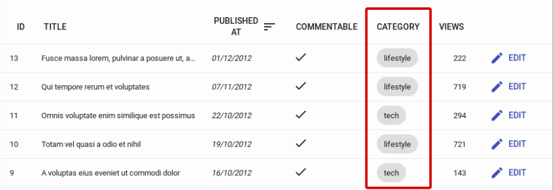

# `<ChipField>`

Displays a value inside a ["Chip"](https://mui.com/components/chips), which is Material UI's term for a label.

## Usage

```jsx
import { ChipField } from 'react-admin';

<ChipField source="category" />
```



This field type is especially useful for one-to-many relationships, e.g. to display a list of books for a given author:

```jsx
import { ChipField, SingleFieldList, ReferenceManyField } from 'react-admin';

<ReferenceManyField reference="books" target="author_id">
    <SingleFieldList>
        <ChipField source="title" />
    </SingleFieldList>
</ReferenceManyField>
```

Additional props are passed down to Material UI's `<Chip>` element. Check [The Material UI `<Chip>` documentation](https://mui.com/material-ui/api/chip/) for details.

## `sx`: CSS API

The `<ChipField>` component accepts the usual `className` prop. You can also override many styles of the inner components thanks to the `sx` property (see [the `sx` documentation](./SX.md) for syntax and examples). This property accepts the following subclasses:

| Rule name            | Description                                              |
|----------------------|----------------------------------------------------------|
| `&.RaChipField-chip` | Applied to the underlying Material UI's `Chip` component |

To override the style of all instances of `<ChipField>` using the [application-wide style overrides](./AppTheme.md#theming-individual-components), use the `RaChipField` key.
