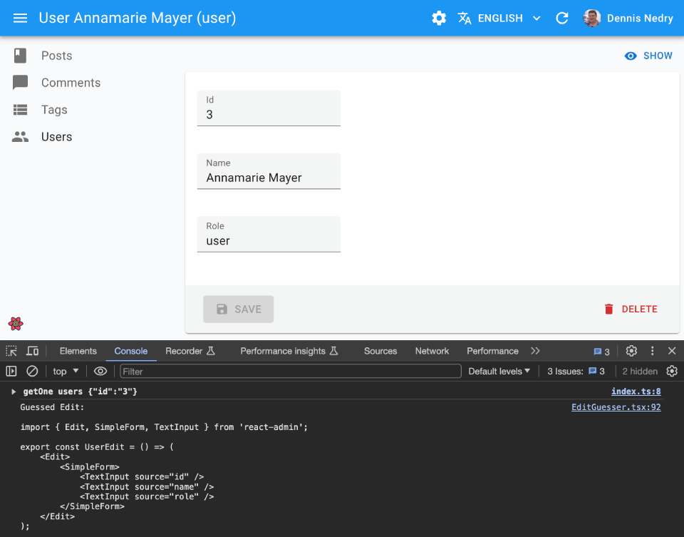

# `<EditGuesser>`

Use `<EditGuesser>` to quickly bootstrap an Edit view on top of an existing API, without adding the inputs one by one.

<iframe src="https://www.youtube-nocookie.com/embed/Qg5MCEkKh2U" title="YouTube video player" frameborder="0" allow="accelerometer; autoplay; clipboard-write; encrypted-media; gyroscope; picture-in-picture; web-share" allowfullscreen style="aspect-ratio: 16 / 9;width:100%;margin-bottom:1em;"></iframe>

Just like [`<Edit>`](./Edit.md), `<EditGuesser>` fetches the data. It then analyzes the response, and guesses the inputs it should use to display a basic `<SimpleForm>` with the data. It also dumps the components it has guessed in the console, so you can copy it into your own code.



## Usage

You can use the `<EditGuesser>` component to determine which fields to use based on the data returned by the API.

```jsx
// in src/App.js
import * as React from "react";
import { Admin, Resource, EditGuesser } from 'react-admin';
import jsonServerProvider from 'ra-data-json-server';

const App = () => (
    <Admin dataProvider={jsonServerProvider('https://jsonplaceholder.typicode.com')}>
        <Resource name="users" edit={EditGuesser} />
    </Admin>
);
```

Then browse to the edition page for that resource, open the console, copy the code, paste it in a dedicated file (e.g. `UserEdit.jsx` in this example), and start tweaking it.

React-admin provides guessers for the Edit view (`<EditGuesser>`), the List view ([`<ListGuesser>`](./ListGuesser.md)), and the Show view ([`<ShowGuesser>`](./ShowGuesser.md)).

**Tip**: Do not use the guessers in production. They are slower than manually-defined components, because they have to infer types based on the content. Besides, the guessers are not always perfect.

## Props

`<EditGuesser>` has no props. It's not intended to be used in production, but only to bootstrap your own components. If you need to tweak the result, copy the code from the console and paste it in your own component.