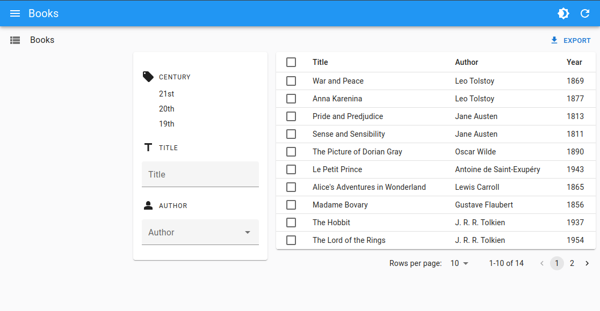

# `<FilterLiveSearch>`

<video controls autoplay playsinline muted loop>
  <source src="./img/filter-live-search.webm" type="video/webm"/>
  <source src="./img/filter-live-search.mp4" type="video/mp4"/>
  Your browser does not support the video tag.
</video>


The filter sidebar is not a form. Therefore, if your users need to enter complex filters, you'll have to recreate a filter form. This can be done thanks to the [`<FilterLiveForm>`](./FilterLiveForm.md) component. However, if you only need one text input with a filter-as-you-type behavior, you'll find the `<FilterLiveSearch>` component even more convenient.

It outputs a form containing a single `<TextInput>`, which modifies the page filter on change. That's usually what users expect for a full-text filter.

## Usage

To add a full-text search filter on customers, include `<FilterLiveSearch>` in a sidebar component, then use that component in the `<List>` component's `aside` prop:


```tsx
import { List, FilterLiveSearch } from 'react-admin';
import { Card, CardContent } from '@mui/material';
import { LastVisitedFilter, HasOrderedFilter, HasNewsletterFilter, SegmentFilter } from './filters';

const FilterSidebar = () => (
    <Card sx={{ order: -1, mr: 2, mt: 9, width: 200 }}>
        <CardContent>
            <FilterLiveSearch source="q" label="Search" />
            <LastVisitedFilter />
            <HasOrderedFilter />
            <HasNewsletterFilter />
            <SegmentFilter />
        </CardContent>
    </Card>
);

export const CustomerList = () => (
    <List aside={<FilterSidebar />}>
        ...
    </List>
);
```


## Props

| Prop | Required | Type | Default | Description |
|------|----------|------|---------|-------------|
| `hiddenLabel` | Optional | `boolean` | `false` | If true, use the label as a placeholder. |
| `label` | Optional | `string` | 'ra.action.search' | The label of the search input. |
| `source` | Optional | `string` | 'q' | The field to filter on. |
| `variant` | Optional | `string` | 'standard' | The variant of the search input. Can be one of 'standard', 'outlined', or 'filled'. |

Additional props are passed down to [the Material UI `<TextField>` component](https://mui.com/material-ui/api/text-field/).

## Using Your Own Input

If the text input provided by `<FilterLiveSearch>` is not enough, and you'd like to use your own input component, you can use the `<FilterLiveForm>` component to create a form that automatically updates the filters when the user changes the input value.


```tsx
import * as React from 'react';
import CategoryIcon from '@mui/icons-material/LocalOffer';
import Person2Icon from '@mui/icons-material/Person2';
import TitleIcon from '@mui/icons-material/Title';
import { Card, CardContent } from '@mui/material';
import {
    AutocompleteInput,
    FilterLiveForm,
    Datagrid,
    FilterList,
    FilterListItem,
    FilterListSection,
    List,
    ReferenceField,
    ReferenceInput,
    TextField,
    TextInput,
} from 'react-admin';

const BookListAside = () => (
    <Card sx={{ order: -1, mr: 2, mt: 6, width: 250, height: 'fit-content' }}>
        <CardContent>
            <FilterList label="Century" icon={<CategoryIcon />}>
                <FilterListItem
                    label="21st"
                    value={{ year_gte: 2000, year_lte: undefined }}
                />
                <FilterListItem
                    label="20th"
                    value={{ year_gte: 1900, year_lte: 1999 }}
                />
                <FilterListItem
                    label="19th"
                    value={{ year_gte: 1800, year_lte: 1899 }}
                />
            </FilterList>
            <FilterListSection label="Title" icon={<TitleIcon />}>
                <FilterLiveForm>
                    <TextInput source="title" resettable helperText={false} />
                </FilterLiveForm>
            </FilterListSection>
            <FilterListSection label="Author" icon={<Person2Icon />}>
                <FilterLiveForm>
                    <ReferenceInput source="authorId" reference="authors">
                        <AutocompleteInput helperText={false} />
                    </ReferenceInput>
                </FilterLiveForm>
            </FilterListSection>
        </CardContent>
    </Card>
);

export const BookList = () => (
    <List aside={<BookListAside />}>
        <Datagrid>
            {/* ... */}
        </Datagrid>
    </List>
);
```




Check out the [`<FilterLiveForm>` documentation](./FilterLiveForm.md) for more information.