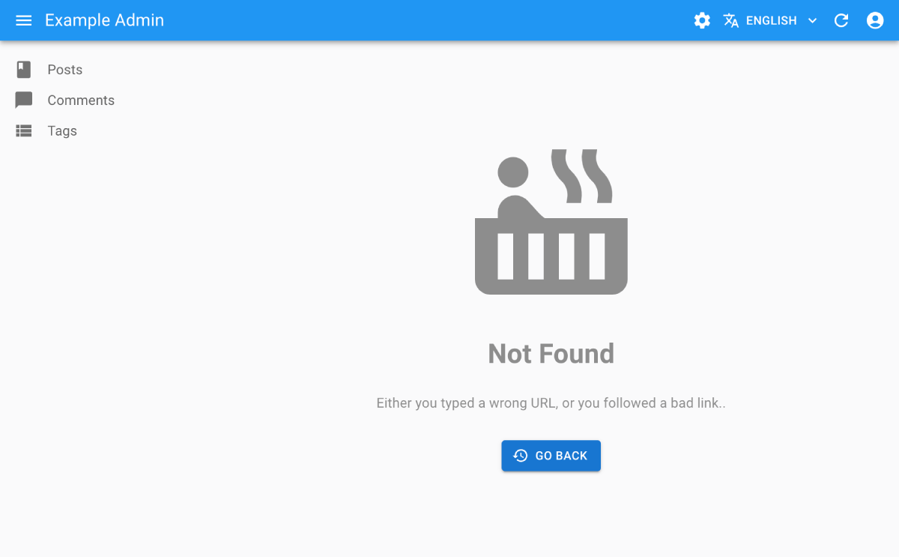

# The `<Admin>` Component

The `<Admin>` component creates an application with its own state, routing, and controller logic. `<Admin>` requires only a `dataProvider` prop, and at least one child `<Resource>` to work:

```jsx
// in src/App.js
import React from 'react';

import { Admin, Resource } from 'react-admin';
import simpleRestProvider from 'ra-data-simple-rest';

import { PostList } from './posts';

const App = () => (
    <Admin dataProvider={simpleRestProvider('http://path.to.my.api')}>
        <Resource name="posts" list={PostList} />
    </Admin>
);

export default App;
```

Here are all the props accepted by the component:

- [The `<Admin>` Component](#the-admin-component)
    - [`dataProvider`](#dataprovider)
    - [`title`](#title)
    - [`dashboard`](#dashboard)
    - [`catchAll`](#catchall)
    - [`menu`](#menu)
    - [`theme`](#theme)
    - [`appLayout`](#applayout)
    - [`customReducers`](#customreducers)
    - [`customSagas`](#customsagas)
    - [`customRoutes`](#customroutes)
    - [`authProvider`](#authprovider)
    - [`loginPage`](#loginpage)
    - [`logoutButton`](#logoutbutton)
    - [`initialState`](#initialstate)
    - [`history`](#history)
    - [Internationalization](#internationalization)
    - [Declaring resources at runtime](#declaring-resources-at-runtime)
    - [Using react-admin without `<Admin>` and `<Resource>`](#using-react-admin-without-admin-and-resource)

## `dataProvider`

The only required prop, it must be a function returning a promise, with the following signature:

```jsx
/**
 * Query a data provider and return a promise for a response
 *
 * @example
 * dataProvider(GET_ONE, 'posts', { id: 123 })
 *  => new Promise(resolve => resolve({ id: 123, title: "hello, world" }))
 *
 * @param {string} type Request type, e.g GET_LIST
 * @param {string} resource Resource name, e.g. "posts"
 * @param {Object} payload Request parameters. Depends on the action type
 * @returns {Promise} the Promise for a response
 */
const dataProvider = (type, resource, params) => new Promise();
```

The `dataProvider` is also the ideal place to add custom HTTP headers, authentication, etc. The [Data Providers Chapter](./DataProviders.md) of the documentation lists available data providers, and explains how to build your own.

## `title`

On error pages, the header of an admin app uses 'React Admin' as the main app title. Use the `title` to customize it.

```jsx
const App = () => (
    <Admin title="My Custom Admin" dataProvider={simpleRestProvider('http://path.to.my.api')}>
        // ...
    </Admin>
);
```

## `dashboard`

By default, the homepage of an admin app is the `list` of the first child `<Resource>`. But you can also specify a custom component instead. To fit in the general design, use Material UI's `<Card>` component, and react-admin's `<Title>` component to set the title in the AppBar:

```jsx
// in src/Dashboard.js
import React from 'react';
import Card from '@material-ui/core/Card';
import CardContent from '@material-ui/core/CardContent';
import { Title } from 'react-admin';
export default () => (
    <Card>
        <Title title="Welcome to the administration" />
        <CardContent>Lorem ipsum sic dolor amet...</CardContent>
    </Card>
);
```

```jsx
// in src/App.js
import Dashboard from './Dashboard';

const App = () => (
    <Admin dashboard={Dashboard} dataProvider={simpleRestProvider('http://path.to.my.api')}>
        // ...
    </Admin>
);
```


## `catchAll`

When users type URLs that don't match any of the children `<Resource>` components, they see a default "Not Found" page.



You can customize this page to use the component of your choice by passing it as the `catchAll` prop. To fit in the general design, use Material UI's `<Card>` component, and react-admin's `<Title>` component:

```jsx
// in src/NotFound.js
import React from 'react';
import Card from '@material-ui/core/Card';
import CardContent from '@material-ui/core/CardContent';
import { Title } from 'react-admin';

export default () => (
    <Card>
        <Title title="Not Found" />
        <CardContent>
            <h1>404: Page not found</h1>
        </CardContent>
    </Card>
);
```

```jsx
// in src/App.js
import NotFound from './NotFound';

const App = () => (
    <Admin catchAll={NotFound} dataProvider={simpleRestProvider('http://path.to.my.api')}>
        // ...
    </Admin>
);
```

**Tip**: If your custom `catchAll` component contains react-router `<Route>` components, this allows you to register new routes displayed within the react-admin layout easily. Note that these routes will match *after* all the react-admin resource routes have been tested. To add custom routes *before* the react-admin ones, and therefore override the default resource routes, use the [`customRoutes` prop](#customroutes) instead.

## `menu`

**Tip**: This prop is deprecated. To override the menu component, use a [custom layout](#applayout) instead.

React-admin uses the list of `<Resource>` components passed as children of `<Admin>` to build a menu to each resource with a `list` component.

If you want to add or remove menu items, for instance to link to non-resources pages, you can create your own menu component:

```jsx
// in src/Menu.js
import React, { createElement } from 'react';
import { connect } from 'react-redux';
import { MenuItemLink, getResources } from 'react-admin';
import { withRouter } from 'react-router-dom';
import LabelIcon from '@material-ui/icons/Label';

import Responsive from '../layout/Responsive';

const Menu = ({ resources, onMenuClick, logout }) => (
    <div>
        {resources.map(resource => (
            <MenuItemLink
                to={`/${resource.name}`}
                primaryText={resource.name}
                leftIcon={createElement(resource.icon)}
                onClick={onMenuClick}
            />
        ))}
        <MenuItemLink
            to="/custom-route"
            primaryText="Miscellaneous"
            leftIcon={<LabelIcon />}
            onClick={onMenuClick} />
        <Responsive
            small={logout}
            medium={null} // Pass null to render nothing on larger devices
        />
    </div>
);

const mapStateToProps = state => ({
    resources: getResources(state),
});

export default withRouter(connect(mapStateToProps)(Menu));
```

**Tip**: Note the `MenuItemLink` component. It must be used to avoid unwanted side effects in mobile views. It supports a custom text and icon (which must be a material-ui `<SvgIcon>`).

**Tip**: Note that we include the `logout` item only on small devices. Indeed, the `logout` button is already displayed in the AppBar on larger devices.

**Tip**: Note that we use React Router [`withRouter`](https://reacttraining.com/react-router/web/api/withRouter) Higher Order Component and that it is used **before** Redux [`connect](https://github.com/reactjs/react-redux/blob/master/docs/api.html#connectmapstatetoprops-mapdispatchtoprops-mergeprops-options). This is required if you want the active menu item to be highlighted.

Then, pass it to the `<Admin>` component as the `menu` prop:

```jsx
// in src/App.js
import Menu from './Menu';

const App = () => (
    <Admin menu={Menu} dataProvider={simpleRestProvider('http://path.to.my.api')}>
        // ...
    </Admin>
);
```

See the [Theming documentation](./Theming.md#using-a-custom-menu) for more details.

## `theme`

Material UI supports [theming](http://www.material-ui.com/#/customization/themes). This lets you customize the look and feel of an admin by overriding fonts, colors, and spacing. You can provide a custom material ui theme by using the `theme` prop:

```jsx
import { createMuiTheme } from '@material-ui/core/styles';

const theme = createMuiTheme({
  palette: {
    type: 'dark', // Switching the dark mode on is a single property value change.
  },
});

const App = () => (
    <Admin theme={theme} dataProvider={simpleRestProvider('http://path.to.my.api')}>
        // ...
    </Admin>
);
```


For more details on predefined themes and custom themes, refer to the [Material UI Customization documentation](https://material-ui.com/customization/themes/).

## `appLayout`

If you want to deeply customize the app header, the menu, or the notifications, the best way is to provide a custom layout component. It must contain a `{children}` placeholder, where react-admin will render the resources. If you use material UI fields and inputs, it should contain a `<MuiThemeProvider>` element. And finally, if you want to show the spinner in the app header when the app fetches data in the background, the Layout should connect to the redux store.

Use the [default layout](https://github.com/marmelab/react-admin/blob/master/packages/ra-ui-materialui/src/layout/Layout.js) as a starting point, and check [the Theming documentation](./Theming.md#using-a-custom-layout) for examples.

```jsx
// in src/App.js
import MyLayout from './MyLayout';

const App = () => (
    <Admin appLayout={MyLayout} dataProvider={simpleRestProvider('http://path.to.my.api')}>
        // ...
    </Admin>
);
```

Your custom layout can simply extend the default `<Layout>` component if you only want to override the appBar, the menu, the notification component, or the error page. For instance:

```jsx
// in src/MyLayout.js
import { Layout } from 'react-admin';
import MyAppBar from './MyAppBar';
import MyMenu from './MyMenu';
import MyNotification from './MyNotification';

const MyLayout = (props) => <Layout
    {...props}
    appBar={MyAppBar}
    menu={MyMenu}
    notification={MyNotification}
/>;

export default MyLayout;
```

For more details on custom layouts, check [the Theming documentation](./Theming.md#using-a-custom-layout).

## `customReducers`

The `<Admin>` app uses [Redux](http://redux.js.org/) to manage state. The state has the following keys:

```jsx
{
    admin: { /*...*/ }, // used by react-admin
    form: { /*...*/ }, // used by redux-form
    routing: { /*...*/ }, // used by react-router-redux
}
```

If your components dispatch custom actions, you probably need to register your own reducers to update the state with these actions. Let's imagine that you want to keep the bitcoin exchange rate inside the `bitcoinRate` key in the state. You probably have a reducer looking like the following:

```jsx
// in src/bitcoinRateReducer.js
export default (previousState = 0, { type, payload }) => {
    if (type === 'BITCOIN_RATE_RECEIVED') {
        return payload.rate;
    }
    return previousState;
}
```

To register this reducer in the `<Admin>` app, simply pass it in the `customReducers` prop:


```jsx
// in src/App.js
import React from 'react';
import { Admin } from 'react-admin';

import bitcoinRateReducer from './bitcoinRateReducer';

const App = () => (
    <Admin customReducers={{ bitcoinRate: bitcoinRateReducer }} dataProvider={simpleRestProvider('http://path.to.my.api')}>
        ...
    </Admin>
);

export default App;
```


Now the state will look like:

```jsx
{
    admin: { /*...*/ }, // used by react-admin
    form: { /*...*/ }, // used by redux-form
    routing: { /*...*/ }, // used by react-router-redux
    bitcoinRate: 123, // managed by rateReducer
}
```

## `customSagas`

The `<Admin>` app uses [redux-saga](https://github.com/redux-saga/redux-saga) to handle side effects (AJAX calls, notifications, redirections, etc).

If your components dispatch custom actions, you probably need to register your own side effects as sagas. Let's imagine that you want to show a notification whenever the `BITCOIN_RATE_RECEIVED` action is dispatched. You probably have a saga looking like the following:

```jsx
// in src/bitcoinSaga.js
import { put, takeEvery } from 'redux-saga/effects';
import { showNotification } from 'react-admin';

export default function* bitcoinSaga() {
    yield takeEvery('BITCOIN_RATE_RECEIVED', function* () {
        yield put(showNotification('Bitcoin rate updated'));
    })
}
```

To register this saga in the `<Admin>` app, simply pass it in the `customSagas` prop:

```jsx
// in src/App.js
import React from 'react';
import { Admin } from 'react-admin';

import bitcoinSaga from './bitcoinSaga';

const App = () => (
    <Admin customSagas={[ bitcoinSaga ]} dataProvider={simpleRestProvider('http://path.to.my.api')}>
        ...
    </Admin>
);

export default App;
```

## `customRoutes`

To register your own routes, create a module returning a list of [react-router](https://github.com/ReactTraining/react-router) `<Route>` component:

```jsx
// in src/customRoutes.js
import React from 'react';
import { Route } from 'react-router-dom';
import Foo from './Foo';
import Bar from './Bar';
import Baz from './Baz';

export default [
    <Route exact path="/foo" component={Foo} />,
    <Route exact path="/bar" component={Bar} />,
    <Route exact path="/baz" component={Baz} noLayout />,
];
```

Then, pass this array as `customRoutes` prop in the `<Admin>` component:

```jsx
// in src/App.js
import React from 'react';
import { Admin } from 'react-admin';

import customRoutes from './customRoutes';

const App = () => (
    <Admin customRoutes={customRoutes} dataProvider={simpleRestProvider('http://path.to.my.api')}>
        ...
    </Admin>
);

export default App;
```

Now, when a user browses to `/foo` or `/bar`, the components you defined will appear in the main part of the screen.
When a user browses to `/baz`, the component will appear outside of the defined Layout, leaving you the freedom
to design the screen the way you want.

**Tip**: It's up to you to create a [custom menu](#menu) entry, or custom buttons, to lead to your custom pages.

**Tip**: Your custom pages take precedence over react-admin's own routes. That means that `customRoutes` lets you override any route you want! If you want to add routes *after* all the react-admin routes, use the [`catchAll` prop](#catchall) instead.

**Tip**: To look like other react-admin pages, your custom pages should have the following structure:

```jsx
// in src/Foo.js
import React from 'react';
import Card from '@material-ui/core/Card';
import CardContent from '@material-ui/core/CardContent';
import { Title } from 'react-admin';

const Foo = () => (
    <Card>
        <Title title="My Page" />
        <CardContent>
            ...
        </CardContent>
    </Card>
));

export default Foo;
```

## `authProvider`

The `authProvider` prop expect a function returning a Promise, to control the application authentication strategy:

```jsx
import { AUTH_LOGIN, AUTH_LOGOUT, AUTH_ERROR, AUTH_CHECK } from 'react-admin';

const authProvider(type, params) {
    // type can be any of AUTH_LOGIN, AUTH_LOGOUT, AUTH_ERROR, and AUTH_CHECK
    // ...
    return Promise.resolve();
};

const App = () => (
    <Admin authProvider={authProvider} dataProvider={simpleRestProvider('http://path.to.my.api')}>
        ...
    </Admin>
);
```

The [Authentication documentation](./Authentication.md) explains how to implement these functions in detail.

## `loginPage`

If you want to customize the Login page, or switch to another authentication strategy than a username/password form, pass a component of your own as the `loginPage` prop. React-admin will display this component whenever the `/login` route is called.

```jsx
import MyLoginPage from './MyLoginPage';

const App = () => (
    <Admin loginPage={MyLoginPage}>
        ...
    </Admin>
);
```

You can also disable it completely along with the `/login` route by passing `false` to this prop.

See The [Authentication documentation](./Authentication.md#customizing-the-login-and-logout-components) for more details.

**Tip**: Before considering to write your own login page component, please take a look at how to change the default [background image](./Theming.md#using-a-custom-login-page) or the [Material UI theme](#theme). See the [Authentication documentation](./Authentication.md#customizing-the-login-and-logout-components) for more details.

## `logoutButton`

If you customize the `loginPage`, you probably need to override the `logoutButton`, too - because they share the authentication strategy.

```jsx
import MyLoginPage from './MyLoginPage';
import MyLogoutButton from './MyLogoutButton';

const App = () => (
    <Admin loginPage={MyLoginPage} logoutButton={MyLogoutButton}>
        ...
    </Admin>
);
```

## `initialState`

The `initialState` prop lets you pass preloaded state to Redux. See the [Redux Documentation](http://redux.js.org/docs/api/createStore.html#createstorereducer-preloadedstate-enhancer) for more details.

## `history`

By default, react-admin creates URLs using a hash sign (e.g. "myadmin.acme.com/#/posts/123"). The hash portion of the URL (i.e. `#/posts/123` in the example) contains the main application route. This strategy has the benefit of working without a server, and with legacy web browsers. But you may want to use another routing strategy, e.g. to allow server-side rendering.

You can create your own `history` function (compatible with [the `history` npm package](https://github.com/reacttraining/history)), and pass it to the `<Admin>` component to override the default history strategy. For instance, to use `browserHistory`:

```js
import createHistory from 'history/createBrowserHistory';

const history = createHistory();

const App = () => (
    <Admin history={history}>
        ...
    </Admin>
);
```

## Internationalization

The `locale` and `messages` props let you translate the GUI. The [Translation Documentation](./Translation.md) details this process.

## Declaring resources at runtime

You might want to dynamically define the resources when the app starts. The `<Admin>` component accepts a function as its child and this function can return a Promise. If you also defined an `authProvider`, the function will receive the result of a call to `authProvider` with the `AUTH_GET_PERMISSIONS` type (you can read more about this in the [Authorization](./Authorization.md) chapter).

For instance, getting the resource from an API might look like:

```js
import React from 'react';

import { Admin, Resource } from 'react-admin';
import simpleRestProvider from 'ra-data-simple-rest';

import { PostList } from './posts';
import { CommentList } from './comments';

const knownResources = [
    <Resource name="posts" list={PostList} />,
    <Resource name="comments" list={CommentList} />,
];

const fetchResources = permissions =>
    fetch('https://myapi/resources', {
        method: 'POST',
        headers: {
            'Content-Type': 'application/json'
        },
        body: JSON.stringify(permissions),
    })
    .then(response => response.json())
    .then(json => knownResources.filter(resource => json.resources.includes(resource.props.name)));

const App = () => (
    <Admin dataProvider={simpleRestProvider('http://path.to.my.api')}>
        {fetchResources}
    </Admin>
);
```

## Using react-admin without `<Admin>` and `<Resource>`

Using `<Admin>` and `<Resource>` is completely optional. If you feel like bootstrapping a redux app yourself, it's totally possible. Head to [Including in another app](./CustomApp.md) for a detailed how-to.
