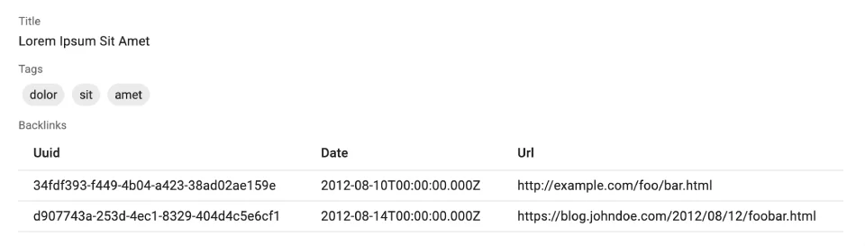

# `<ArrayField>`

`<ArrayField>` renders an embedded array of objects. 



`<ArrayField>` creates a [`ListContext`](./useListContext.md) with the field value, and renders its children components - usually iterator components like [`<Datagrid>`](./Datagrid.md) or [`<SingleFieldList>`](./SingleFieldList.md).

## Usage

`<ArrayField>` is ideal for collections of objects, e.g. `tags` and `backlinks` in the following `post` object:

```js
{
    id: 123,
    title: 'Lorem Ipsum Sit Amet',
    tags: [{ name: 'dolor' }, { name: 'sit' }, { name: 'amet' }],
    backlinks: [
        {
            uuid: '34fdf393-f449-4b04-a423-38ad02ae159e',
            date: '2012-08-10T00:00:00.000Z',
            url: 'https://example.com/foo/bar.html',
        },
        {
            uuid: 'd907743a-253d-4ec1-8329-404d4c5e6cf1',
            date: '2012-08-14T00:00:00.000Z',
            url: 'https://blog.johndoe.com/2012/08/12/foobar.html',
        }
    ]
}
```

Leverage `<ArrayField>` e.g. in a Show view, to display the `tags` as a `<SingleFieldList>` and the `backlinks` as a `<Datagrid>`:

```jsx
import { 
    ArrayField,
    ChipField,
    Datagrid,
    Show,
    SimpleShowLayout,
    SingleFieldList,
    TextField
} from 'react-admin';

const PostShow = () => (
    <Show>
        <SimpleShowLayout>
            <TextField source="title" />
            <ArrayField source="tags">
                <SingleFieldList linkType={false}>
                    <ChipField source="name" size="small" />
                </SingleFieldList>
            </ArrayField>
            <ArrayField source="backlinks">
                <Datagrid bulkActionButtons={false}>
                    <TextField source="uuid" />
                    <TextField source="date" />
                    <TextField source="url" />
                </Datagrid>
            </ArrayField>
        </SimpleShowLayout>
    </Show>
)
```

## Props

| Prop       | Required | Type              | Default | Description                              |
|------------|----------|-------------------|---------|------------------------------------------|
| `children` | Required | `ReactNode`       |         | The component to render the list.        |
| `filter`   | Optional | `object`          |         | The filter to apply to the list.         |
| `perPage`  | Optional | `number`          | 1000    | The number of items to display per page. |
| `sort`     | Optional | `{ field, order}` |         | The sort to apply to the list.           |

`<ArrayField>` accepts the [common field props](./Fields.md#common-field-props), except `emptyText` (use the child `empty` prop instead).

`<ArrayField>` relies on [`useList`](./useList.md) to filter, paginate, and sort the data, so it accepts the same props.

## `children`

`<ArrayField>` renders its `children` component wrapped in a [`<ListContextProvider>`](./useListContext.md). Commonly used child components are [`<Datagrid>`](./Datagrid.md), [`<SingleFieldList>`](./SingleFieldList.md), and [`<SimpleList>`](./SimpleList.md).

```jsx
{/* using SingleFieldList as child */}
<ArrayField source="tags">
    <SingleFieldList linkType={false}>
        <ChipField source="name" />
    </SingleFieldList>
</ArrayField>

{/* using Datagrid as child */}
<ArrayField source="backlinks">
    <Datagrid>
        <TextField source="uuid" />
        <TextField source="date" />
        <TextField source="url" />
    </Datagrid>
</ArrayField>

{/* using SimpleList as child */}
<ArrayField source="backlinks">
    <SimpleList
        primaryText={record => record.url}
        secondaryText={record => record.date}
    />
</ArrayField>
```

You can also render custom JSX, leveraging [the `<WithListContext>` component](./WithListContext.md):

```jsx
<ArrayField source="backlinks">
    <WithListContext render={({ data }) => (
        <ul>
            {data.map(backlink => (
                <li key={backlink.id}>{backlink.url}</li>
            ))}
        </ul>
    )} />
</ArrayField>
```

Or a custom component, leveraging [the `useListContext` hook](./useListContext.md):

```jsx
const Backlinks = () => {
    const { data } = useListContext();
    return (
        <ul>
            {data.map(backlink => (
                <li key={backlink.id}>{backlink.url}</li>
            ))}
        </ul>
    );
};

const PostShow = () => (
    <Show>
        <SimpleShowLayout>
            <TextField source="title" />
            <ArrayField source="backlinks">
                <Backlinks />
            </ArrayField>
        </SimpleShowLayout>
    </Show>
)
```

## `filter`

You can use the `filter` prop to display only a subset of the items in the array. For instance, to display only the backlinks for a particular day:


```jsx
<ArrayField source="backlinks" filter={{ date: '2012-08-10T00:00:00.000Z' }}>
    <Datagrid>
        <TextField source="uuid" />
        <TextField source="date" />
        <TextField source="url" />
    </Datagrid>
</ArrayField>
```


The filtering capabilities are very limited. For instance, there is no "greater than" or "less than" operator. You can only filter on the equality of a field.

## `perPage`

If the value is a large array, and you don't need to display all the items, you can use the `perPage` prop to limit the number of items displayed. 

As `<ArrayField>` creates a [`ListContext`](./useListContext.md), you can use the `<Pagination>` component to navigate through the items.

```jsx
import { 
    ArrayField,
    Datagrid,
    Pagination,
    Show,
    SimpleShowLayout,
    TextField
} from 'react-admin';

const PostShow = () => (
    <Show>
        <SimpleShowLayout>
            <TextField source="title" />
            <ArrayField source="backlinks" perPage={5}>
                <Datagrid>
                    <TextField source="uuid" />
                    <TextField source="date" />
                    <TextField source="url" />
                </Datagrid>
                <Pagination />
            </ArrayField>
        </SimpleShowLayout>
    </Show>
);
```

## `sort`

By default, `<ArrayField>` displays the items in the order they are stored in the field. You can use the `sort` prop to change the sort order.


```jsx
<ArrayField source="tags" sort={{ field: 'name', order: 'ASC' }}>
    <SingleFieldList linkType={false}>
        <ChipField source="name" />
    </SingleFieldList>
</ArrayField>
```


## Using The List Context

`<ArrayField>` creates a [`ListContext`](./useListContext.md) with the field value, so you can use any of the list context values in its children. This includes callbacks to sort, filter, and select items.

For instance, you can make the chips selectable as follows:

```jsx
const SelectedChip = () => {
    const { selectedIds, onToggleItem } = useListContext();
    const record = useRecordContext();
    return (
        <ChipField
            source="title"
            clickable
            onClick={() => {
                onToggleItem(record.id);
            }}
            color={selectedIds.includes(record.id) ? 'primary' : 'default'}
        />
    );
};

const PostShow = () => (
    <Show>
        <SimpleShowLayout>
            <TextField source="title" />
            <ArrayField source="tags">
                <SingleFieldList linkType={false}>
                    <SelectedChip />
                </SingleFieldList>
            </ArrayField>
        </SimpleShowLayout>
    </Show>
)
```

**Tip**: The selection logic uses the `id` field for each collection element, so the above example assumes that the `tags` field contains objects like `{ id: 123, name: 'bar' }`.

Check [the `useListContext` documentation](./useListContext.md) for more information on the list context values.

## Rendering An Array Of Strings

If you need to render a custom collection (e.g. an array of tags `['dolor', 'sit', 'amet']`), it's often simpler to write your own component:

```jsx
import { useRecordContext } from 'react-admin';

const TagsField = () => {
    const record = useRecordContext();
    return (
        <ul>
            {record.tags.map(item => (
                <li key={item.name}>{item.name}</li>
            ))}
        </ul>
    )
};
```
