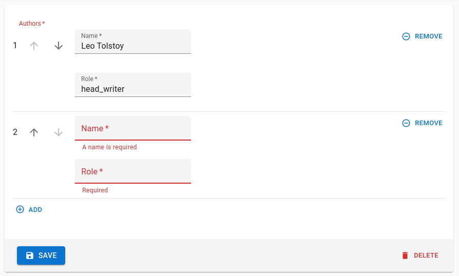

# `<ArrayInput>`

To edit arrays of data embedded inside a record, `<ArrayInput>` creates a list of sub-forms.

<iframe src="https://www.youtube-nocookie.com/embed/-8OFsP7CiVc" title="YouTube video player" frameborder="0" allow="accelerometer; autoplay; clipboard-write; encrypted-media; gyroscope; picture-in-picture; web-share" allowfullscreen style="aspect-ratio: 16 / 9;width:100%;margin-bottom:1em;" referrerpolicy="strict-origin-when-cross-origin"></iframe>

## Usage

`<ArrayInput>` allows editing of embedded arrays, like the `items` field in the following `order` record:

```js
{
    "id": 1,
    "date": "2022-08-30",
    "customer": "John Doe",
    "items": [
        {
            "name": "Office Jeans",
            "price": 45.99,
            "quantity": 1,
        },
        {
            "name": "Black Elegance Jeans",
            "price": 69.99,
            "quantity": 2,
        },
        {
            "name": "Slim Fit Jeans",
            "price": 55.99,
            "quantity": 1,
        },
    ],
}
```

**Tip**: If you need to edit an array of *strings*, like a list of email addresses or a list of tags, you should use a [`<TextArrayInput>`](./TextArrayInput.md) instead.

`<ArrayInput>` expects a single child, which must be a *form iterator* component. A form iterator is a component rendering a field array (the object returned by react-hook-form's [`useFieldArray`](https://react-hook-form.com/docs/usefieldarray)). For instance, [the `<SimpleFormIterator>` component](./SimpleFormIterator.md) displays an array of react-admin Inputs in an unordered list (`<ul>`), one sub-form by list item (`<li>`). It also provides controls for adding and removing a sub-record.

```jsx
import { 
    Edit,
    SimpleForm,
    TextInput,
    DateInput,
    ArrayInput,
    NumberInput,
    SimpleFormIterator
} from 'react-admin';

const OrderEdit = () => (
    <Edit>
        <SimpleForm>
            <TextInput source="customer" />
            <DateInput source="date" />
            <ArrayInput source="items">
                <SimpleFormIterator inline>
                    <TextInput source="name" helperText={false} />
                    <NumberInput source="price" helperText={false} />
                    <NumberInput source="quantity" helperText={false} />
                </SimpleFormIterator>
            </ArrayInput>
        </SimpleForm>
    </Edit>
);
```

<video controls autoplay playsinline muted loop>
  <source src="./img/array-input.webm" type="video/webm"/>
  <source src="./img/array-input.mp4" type="video/mp4"/>
  Your browser does not support the video tag.
</video>

Check [the `<SimpleFormIterator>` documentation](./SimpleFormIterator.md) for details about how to customize the sub form layout.

**Tip**: If you need to edit an array of *related* records, i.e. if the `items` above actually come from another resource, you should use a [`<ReferenceManyInput>`](./ReferenceManyInput.md) instead.

**Note**: Using [`shouldUnregister`](https://react-hook-form.com/docs/useform#shouldUnregister) should be avoided when using `<ArrayInput>` (which internally uses `useFieldArray`) as the unregister function gets called after input unmount/remount and reorder. This limitation is mentioned in the react-hook-form [documentation](https://react-hook-form.com/docs/usecontroller#props). If you are in such a situation, you can use the [`transform`](https://marmelab.com/react-admin/Edit.html#transform) prop to manually clean the submitted values.

## Props

`<ArrayInput>` accepts the [common input props](./Inputs.md#common-input-props) (except `disabled`, `readOnly`, `format` and `parse`).

## Global validation

If you are using an `<ArrayInput>` inside a form with global validation, you need to shape the errors object returned by the `validate` function like an array too.

For instance, to display the following errors:



You need to return an errors object shaped like this:

```js
        {
            authors: [
                {},
                {
                    name: 'A name is required', 
                    role: 'ra.validation.required' // translation keys are supported too
                },
            ],
        }
```

**Tip:** You can find a sample `validate` function that handles arrays in the [Form Validation documentation](./Validation.md#global-validation).

## Disabling The Input

`<ArrayInput>` does not support the `disabled` and `readOnly` props.

If you need to disable the input, set the `<SimpleFormIterator disabled>` prop, and make the child inputs `readOnly`:

```jsx
const OrderEdit = () => (
    <Edit>
        <SimpleForm>
            <TextInput source="customer" />
            <DateInput source="date" />
            <ArrayInput source="items">
                <SimpleFormIterator inline disabled>
                    <TextInput source="name" readOnly/>
                    <NumberInput source="price" readOnly />
                    <NumberInput source="quantity" readOnly />
                </SimpleFormIterator>
            </ArrayInput>
        </SimpleForm>
    </Edit>
);
```

## Changing An Item's Value Programmatically

You can leverage `react-hook-form`'s [`setValue`](https://react-hook-form.com/docs/useform/setvalue) method to change an item's value programmatically.

However you need to know the `name` under which the input was registered in the form, and this name is dynamically generated depending on the index of the item in the array.

To get the name of the input for a given index, you can leverage the `SourceContext` created by react-admin, which can be accessed using the `useSourceContext` hook.

This context provides a `getSource` function that returns the effective `source` for an input in the current context, which you can use as input name for `setValue`.

Here is an example where we leverage `getSource` and `setValue` to change the role of an user to 'admin' when the 'Make Admin' button is clicked:



```tsx
import { ArrayInput, SimpleFormIterator, TextInput, useSourceContext } from 'react-admin';
import { useFormContext } from 'react-hook-form';
import { Button } from '@mui/material';

const MakeAdminButton = () => {
    const sourceContext = useSourceContext();
    const { setValue } = useFormContext();

    const onClick = () => {
        // sourceContext.getSource('role') will for instance return
        // 'users.0.role'
        setValue(sourceContext.getSource('role'), 'admin');
    };

    return (
        <Button onClick={onClick} size="small" sx={{ minWidth: 120 }}>
            Make admin
        </Button>
    );
};

const UserArray = () => (
    <ArrayInput source="users">
        <SimpleFormIterator inline>
            <TextInput source="name" helperText={false} />
            <TextInput source="role" helperText={false} />
            <MakeAdminButton />
        </SimpleFormIterator>
    </ArrayInput>
);
```



**Tip:** If you only need the item's index, you can leverage the [`useSimpleFormIteratorItem` hook](./SimpleFormIterator.md#getting-the-element-index) instead.
