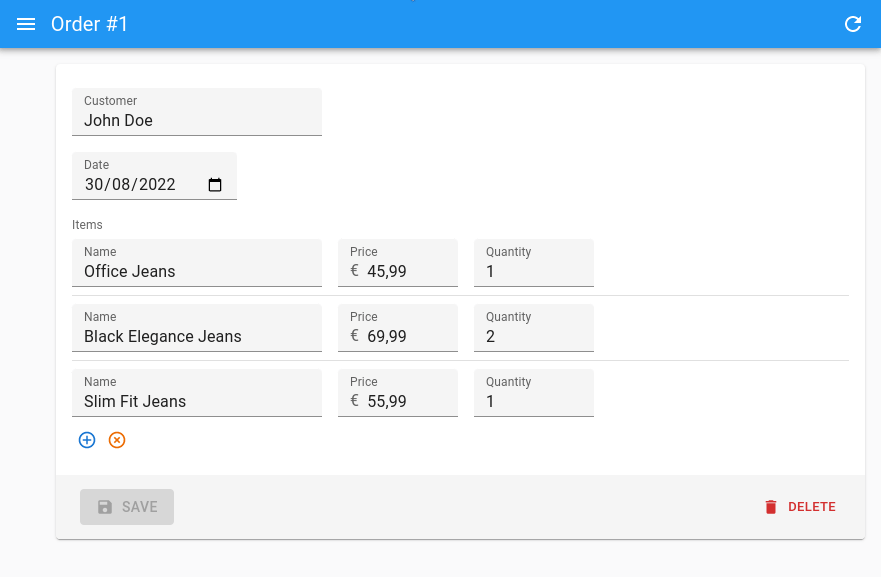

# `<ArrayInput>`

To edit arrays of data embedded inside a record, `<ArrayInput>` creates a list of sub-forms.



`<ArrayInput>` allows editing of embedded arrays, like the `items` field in the following `order` record:

```js
{
    "id": 1,
    "date": "2022-08-30",
    "customer": "John Doe",
    "items": [
        {
            "name": "Office Jeans",
            "price": 45.99,
            "quantity": 1,
        },
        {
            "name": "Black Elegance Jeans",
            "price": 69.99,
            "quantity": 2,
        },
        {
            "name": "Slim Fit Jeans",
            "price": 55.99,
            "quantity": 1,
        },
    ],
}
```

## Usage

`<ArrayInput>` expects a single child, which must be a *form iterator* component. A form iterator is a component rendering a field array (the object returned by react-hook-form's [`useFieldArray`](https://react-hook-form.com/api/usefieldarray). For instance, [the `<SimpleFormIterator>` component](./SimpleFormIterator.md) displays an array of react-admin Inputs in an unordered list (`<ul>`), one sub-form by list item (`<li>`). It also provides controls for adding and removing a sub-record.

```jsx
import { 
    Edit,
    SimpleForm,
    TextInput,
    DateInput,
    ArrayInput,
    NumberInput,
    SimpleFormIterator
} from 'react-admin';

const OrderEdit = () => (
    <Edit>
        <SimpleForm>
            <TextInput source="customer" />
            <DateInput source="date" />
            <ArrayInput source="items">
                <SimpleFormIterator>
                    <TextInput source="name" />
                    <NumberInput source="price" />
                    <NumberInput source="quantity" />
                </SimpleFormIterator>
            </ArrayInput>
        </SimpleForm>
    </Edit>
);
```

Check [the `<SimpleFormIterator>` documentation](./SimpleFormIterator.md) for details about how to customize the sub form layout.

`<ArrayInput>` also accepts the [common input props](./Inputs.md#common-input-props) (except `format` and `parse`).

