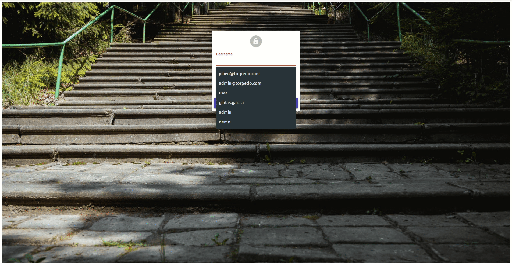
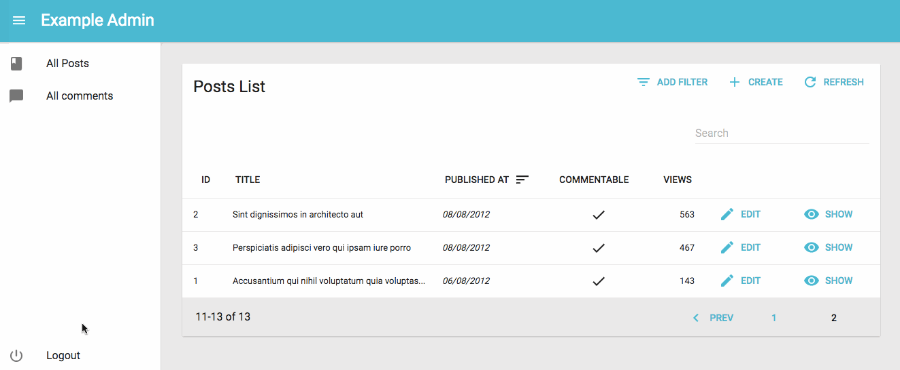

# Authentication



React-admin lets you secure your admin app with the authentication strategy of your choice. Since there are many different possible strategies (Basic Auth, JWT, OAuth, etc.), react-admin simply provides hooks to execute your own authentication code.

By default, an react-admin app doesn't require authentication. But if the REST API ever returns a 401 (Unauthorized) or a 403 (Forbidden) response, then the user is redirected to the `/login` route. You have nothing to do - it's already built in.

## Configuring the Auth Provider

By default, the `/login` route renders a special component called `Login`, which displays a login form asking for username and password.


What this form does upon submission depends on the `authProvider` prop of the `<Admin>` component. This function receives authentication requests `(type, params)`, and should return a Promise. `Login` calls `authProvider` with the `AUTH_LOGIN` type, and `{ login, password }` as parameters. It's the ideal place to authenticate the user, and store their credentials.

For instance, to query an authentication route via HTTPS and store the credentials (a token) in local storage, configure `authProvider` as follows:

```jsx
// in src/authProvider.js
import { AUTH_LOGIN } from 'react-admin';

export default (type, params) => {
    if (type === AUTH_LOGIN) {
        const { username, password } = params;
        const request = new Request('https://mydomain.com/authenticate', {
            method: 'POST',
            body: JSON.stringify({ username, password }),
            headers: new Headers({ 'Content-Type': 'application/json' }),
        })
        return fetch(request)
            .then(response => {
                if (response.status < 200 || response.status >= 300) {
                    throw new Error(response.statusText);
                }
                return response.json();
            })
            .then(({ token }) => {
                localStorage.setItem('token', token);
            });
    }
    return Promise.resolve();
}
```

**Tip**: It's a good idea to store credentials in `localStorage`, to avoid reconnection when opening a new browser tab. But this makes your application [open to XSS attacks](http://www.redotheweb.com/2015/11/09/api-security.html), so you'd better double down on security, and add an `httpOnly` cookie on the server side, too.

Then, pass this client to the `<Admin>` component:

```jsx
// in src/App.js
import authProvider from './authProvider';

const App = () => (
    <Admin authProvider={authProvider}>
        ...
    </Admin>
);
```

Upon receiving a 403 response, the admin app shows the Login page. `authProvider` is now called when the user submits the login form. Once the promise resolves, the login form redirects to the previous page, or to the admin index if the user just arrived.

## Sending Credentials to the API

To use the credentials when calling a data provider, you have to tweak, this time, the `dataProvider` function. As explained in the [Data providers documentation](DataProviders.md#adding-custom-headers), `simpleRestProvider` and `jsonServerProvider` take an `httpClient` as second parameter. That's the place where you can change request headers, cookies, etc.

For instance, to pass the token obtained during login as an `Authorization` header, configure the Data Provider as follows:

```jsx
import { fetchUtils, Admin, Resource } from 'react-admin';
import simpleRestProvider from 'ra-data-simple-rest';

const httpClient = (url, options = {}) => {
    if (!options.headers) {
        options.headers = new Headers({ Accept: 'application/json' });
    }
    const token = localStorage.getItem('token');
    options.headers.set('Authorization', `Bearer ${token}`);
    return fetchUtils.fetchJson(url, options);
}
const dataProvider = simpleRestProvider('http://localhost:3000', httpClient);

const App = () => (
    <Admin dataProvider={dataProvider} authProvider={authProvider}>
        ...
    </Admin>
);
```

If you have a custom REST client, don't forget to add credentials yourself.

## Adding a Logout Button

If you provide an `authProvider` prop to `<Admin>`, react-admin displays a logout button in the top bar (or in the menu on mobile). When the user clicks on the logout button, this calls the `authProvider` with the `AUTH_LOGOUT` type and removes potentially sensitive data from the redux store. When resolved, the user gets redirected to the login page.

For instance, to remove the token from local storage upon logout:

```jsx
// in src/authProvider.js
import { AUTH_LOGIN, AUTH_LOGOUT } from 'react-admin';

export default (type, params) => {
    if (type === AUTH_LOGIN) {
        // ...
    }
    if (type === AUTH_LOGOUT) {
        localStorage.removeItem('token');
        return Promise.resolve();
    }
    return Promise.resolve();
};
```



The `authProvider` is also a good place to notify the authentication API that the user credentials are no longer valid after logout.

## Catching Authentication Errors On The API

Even though a user may be authenticated on the client-side, their credentials may no longer be valid server-side (e.g. if the token is only valid for a couple weeks). In that case, the API usually answers to all REST requests with an error code 401 or 403 - but what about *your* API?

Fortunately, each time the API returns an error, the `authProvider` is called with the `AUTH_ERROR` type. Once again, it's up to you to decide which HTTP status codes should let the user continue (by returning a resolved promise) or log them out (by returning a rejected promise).

For instance, to redirect the user to the login page for both 401 and 403 codes:

```jsx
// in src/authProvider.js
import { AUTH_LOGIN, AUTH_LOGOUT, AUTH_ERROR } from 'react-admin';

export default (type, params) => {
    if (type === AUTH_LOGIN) {
        // ...
    }
    if (type === AUTH_LOGOUT) {
        // ...
    }
    if (type === AUTH_ERROR) {
        const status  = params.status;
        if (status === 401 || status === 403) {
            localStorage.removeItem('token');
            return Promise.reject();
        }
        return Promise.resolve();
    }
    return Promise.resolve();
};
```

## Checking Credentials During Navigation

Redirecting to the login page whenever a REST response uses a 401 status code is usually not enough, because react-admin keeps data on the client side, and could display stale data while contacting the server - even after the credentials are no longer valid.

Fortunately, each time the user navigates, react-admin calls the `authProvider` with the `AUTH_CHECK` type, so it's the ideal place to check for credentials.

For instance, to check for the existence of the token in local storage:

```jsx
// in src/authProvider.js
import { AUTH_LOGIN, AUTH_LOGOUT, AUTH_ERROR, AUTH_CHECK } from 'react-admin';

export default (type, params) => {
    if (type === AUTH_LOGIN) {
        // ...
    }
    if (type === AUTH_LOGOUT) {
        // ...
    }
    if (type === AUTH_ERROR) {
        // ...
    }
    if (type === AUTH_CHECK) {
        return localStorage.getItem('token') ? Promise.resolve() : Promise.reject();
    }
    return Promise.reject('Unkown method');
};
```

If the promise is rejected, react-admin redirects by default to the `/login` page. You can override where to redirect the user by passing an argument with a `redirectTo` property to the rejected promise:

```jsx
// in src/authProvider.js
import { AUTH_LOGIN, AUTH_LOGOUT, AUTH_ERROR, AUTH_CHECK } from 'react-admin';

export default (type, params) => {
    if (type === AUTH_LOGIN) {
        // ...
    }
    if (type === AUTH_LOGOUT) {
        // ...
    }
    if (type === AUTH_ERROR) {
        // ...
    }
    if (type === AUTH_CHECK) {
        return localStorage.getItem('token') ? Promise.resolve() : Promise.reject({ redirectTo: '/no-access' });
    }
    return Promise.reject('Unkown method');
};
```

**Tip**: For the `AUTH_CHECK` call, the `params` argument contains the `resource` name, so you can implement different checks for different resources:

```jsx
// in src/authProvider.js
import { AUTH_LOGIN, AUTH_LOGOUT, AUTH_ERROR, AUTH_CHECK } from 'react-admin';

export default (type, params) => {
    if (type === AUTH_LOGIN) {
        // ...
    }
    if (type === AUTH_LOGOUT) {
        // ...
    }
    if (type === AUTH_ERROR) {
        // ...
    }
    if (type === AUTH_CHECK) {
        const { resource } = params;
        if (resource === 'posts') {
            // check credentials for the posts resource
        }
        if (resource === 'comments') {
            // check credentials for the comments resource
        }
    }
    return Promise.reject('Unkown method');
};
```

**Tip**: The `authProvider` can only be called with `AUTH_LOGIN`, `AUTH_LOGOUT`, `AUTH_ERROR`, or `AUTH_CHECK`; that's why the final return is a rejected promise.

## Customizing The Login and Logout Components

Using `authProvider` and `checkCredentials` is enough to implement a full-featured authorization system if the authentication relies on a username and password.

But what if you want to use an email instead of a username? What if you want to use a Single-Sign-On (SSO) with a third-party authentication service? What if you want to use two-factor authentication?

For all these cases, it's up to you to implement your own `LoginPage` component, which will be displayed under the `/login` route instead of the default username/password form, and your own `LogoutButton` component, which will be displayed in the sidebar. Pass both these components to the `<Admin>` component:

**Tip**: Use the `userLogin` and `userLogout` actions in your custom `Login` and `Logout` components.

```jsx
// in src/MyLoginPage.js
import React, { Component } from 'react';
import { connect } from 'react-redux';
import { userLogin } from 'react-admin';

class MyLoginPage extends Component {
    submit = (e) => {
        e.preventDefault();
        // gather your data/credentials here
        const credentials = { };

        // Dispatch the userLogin action (injected by connect)
        this.props.userLogin(credentials);
    }

    render() {
        return (
            <form onSubmit={this.submit}>
            ...
            </form>
        );
    }
};

export default connect(undefined, { userLogin })(MyLoginPage);

// in src/MyLogoutButton.js
import React from 'react';
import { connect } from 'react-redux';
import { Responsive, userLogout } from 'react-admin';
import { MenuItem } from 'material-ui/Menu';
import Button from 'material-ui/Button';
import ExitIcon from '@material-ui/icons/PowerSettingsNew';

const MyLogoutButton = ({ userLogout, ...rest }) => (
    <Responsive
        xsmall={
            <MenuItem
                onClick={userLogout}
                {...sanitizeRestProps(rest)}
            >
                <ExitIcon /> Logout
            </MenuItem>
        }
        medium={
            <Button
                onClick={userLogout}
                size="small"
                {...sanitizeRestProps(rest)}
            >
                <ExitIcon /> Logout
            </Button>
        }
    />
);
export default connect(undefined, { userLogout: userLogout() })(MyLogoutButton);

// in src/App.js
import MyLoginPage from './MyLoginPage';
import MyLogoutButton from './MyLogoutButton';

const App = () => (
    <Admin loginPage={MyLoginPage} logoutButton={MyLogoutButton} authProvider={authProvider}>
    ...
    </Admin>
);
```

## Restricting Access To A Custom Page

If you add [custom pages](./Actions.md), of if you [create an admin app from scratch](./CustomApp.md), you may need to secure access to pages manually. That's the purpose of the `<Authenticated>` component, that you can use as a decorator for your own components.


```jsx
// in src/MyPage.js
import { withRouter } from 'react-router-dom';
import { Authenticated } from 'react-admin';

const MyPage = ({ location }) => (
    <Authenticated authParams={{ foo: 'bar' }} location={location}>
        <div>
            ...
        </div>
    </Authenticated>
);

export default withRouter(MyPage);
```


The `<Authenticated>` component calls the `authProvider` function with `AUTH_CHECK` and `authParams`. If the response is a fulfilled promise, the child component is rendered. If the response is a rejected promise, `<Authenticated>` redirects to the login form. Upon successful login, the user is redirected to the initial location (that's why it's necessary to get the location from the router).


## Redirect After Logout

By default, react-admin redirects the user to '/login' after they log out. This can be changed by passing the url to redirect to as parameter to the `userLogout()` action creator when you `connect` the `MyLogoutButton` component:

```diff
// in src/MyLogoutButton.js
// ...
- export default connect(undefined, { userLogout: userLogout() })(MyLogoutButton);
+ export default connect(undefined, { userLogout: userLogout('/') })(MyLogoutButton);
```
