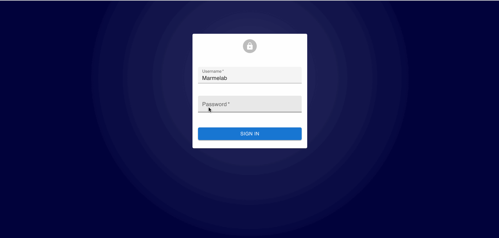

# Auth Providers



React-admin lets you secure your admin app with the authentication strategy of your choice. Since there are many possible strategies (Basic Auth, JWT, OAuth, etc.), react-admin delegates authentication logic to an `authProvider`.

## Enabling Auth Features

By default, react-admin apps don't require authentication. To restrict access to the admin, pass an `authProvider` to the `<Admin>` component.

```jsx
// in src/App.js
import authProvider from './authProvider';

const App = () => (
    <Admin authProvider={authProvider}>
        ...
    </Admin>
);
```

Once an admin has an `authProvider`, react-admin enables a new page on the `/login` route, which displays a login form asking for a username and password.

## Anatomy Of An `authProvider`

What's an `authProvider`? Just like a `dataProvider`, an `authProvider` is an object that handles authentication and authorization logic. It exposes methods that react-admin calls when needed, and that you can call manually through specialized hooks. The `authProvider` methods must return a Promise. The simplest `authProvider` is:

```js
const authProvider = {
    // send username and password to the auth server and get back credentials
    login: params => Promise.resolve(),
    // when the dataProvider returns an error, check if this is an authentication error
    checkError: error => Promise.resolve(),
    // chen the user navigates, make sure that their credentials are still valid
    checkAuth: params => Promise.resolve(),
    // remove local credentials and notify the auth server that the user logged out
    logout: () => Promise.resolve(),
    // get the user's profile
    getIdentity: () => Promise.resolve(),
    // get the user permissions (optional)
    getPermissions: () => Promise.resolve(),
    // get the user roles (optional - only for Role-Based Access Control)
    getRoles: () => Promise.resolve(),
};
```

Find an existing Auth Provider in the [List of Available Auth Providers](./AuthProviderList.md), or write your own by following the [Building Your Own Auth Provider](./AuthProviderWriting.md) instructions.

## Sending Credentials To The API

The `authProvider` handles the authentication logic, but it's the `dataProvider`'s responsibility to use the credentials when communicating with the API. 

As explained in the [Data providers documentation](./DataProviders.md#adding-custom-headers), `simpleRestProvider` and `jsonServerProvider` take an `httpClient` as second parameter. That's the place where you can change request headers, cookies, etc.

For instance, if the `authProvider` stores an authorization token in localStorage, here is how you can tweak the `dataProvider` to pass this token as an `Authorization` header:

```jsx
import { fetchUtils, Admin, Resource } from 'react-admin';
import simpleRestProvider from 'ra-data-simple-rest';

const httpClient = (url, options = {}) => {
    if (!options.headers) {
        options.headers = new Headers({ Accept: 'application/json' });
    }
    const { token } = JSON.parse(localStorage.getItem('auth'));
    options.headers.set('Authorization', `Bearer ${token}`);
    return fetchUtils.fetchJson(url, options);
};
const dataProvider = simpleRestProvider('http://localhost:3000', httpClient);

const App = () => (
    <Admin dataProvider={dataProvider} authProvider={authProvider}>
        ...
    </Admin>
);
```

Now the admin is secured: The user can be authenticated and use their credentials to communicate with a secure API. 

If you have a custom REST client, don't forget to add credentials yourself.

## Allowing Anonymous Access

As long as you add an `authProvider`, react-admin restricts access to all the pages declared in the `<Resource>` components. If you want to allow anonymous access, you can set the `disableAuthentication` prop in the page components. 

For instance, to let anonymous users access the post list view:

```jsx
const PostList = () => (
    <List disableAuthentication>
        // ...
    </List>
);

const App = () => (
    <Admin dataProvider={dataProvider} authProvider={authProvider}>
        <Resource name="posts" list={PostList} />
    </Admin>
);
```

`disableAuthentication` is available on the following components and hooks:

- `<Create>`, `<CreateBase>`, `<CreateController>` and `useCreateController`
- `<Edit>`, `<EditBase>`, `<EditController>` and `useEditController`
- `<List>`, `<ListBase>`, `<ListController>` and `useListController`
- `<Show>`, `<ShowBase>`, `<ShowController>` and `useShowController`

## Restricting Access To Custom Pages

When you add custom pages, they are accessible to anonymous users by default. To make them only accessible to authenticated users, call [the `useAuthenticated` hook](./useAuthenticated.md) in the custom page:

```jsx
import { Admin, CustomRoutes, useAuthenticated } from 'react-admin';

const MyPage = () => {
    useAuthenticated(); // redirects to login if not authenticated
    return (
        <div>
            ...
        </div>
    )
};

const App = () => (
    <Admin authProvider={authProvider}>
        <CustomRoutes>
            <Route path="/foo" element={<MyPage />} />
            <Route path="/anoonymous" element={<Baz />} />
        </CustomRoutes>
    </Admin>
);
```

Alternatively, you can use [the `<Authenticated>` component](./Authenticated.md), e.g. if you can't modify the page component, or if you want to add authentication in the `<Route element>` prop:

```jsx
import { Admin, CustomRoutes, Authenticated } from 'react-admin';

const MyPage = () => {
    return (
        <div>
            ...
        </div>
    )
};

const App = () => (
    <Admin authProvider={authProvider}>
        <CustomRoutes>
            <Route path="/foo" element={<Authenticated><MyPage /></Authenticated>} />
            <Route path="/anoonymous" element={<Baz />} />
        </CustomRoutes>
    </Admin>
);
```

## Customizing The Login Component

Using `authProvider` is enough to implement a full-featured authorization system if the authentication relies on a username and password.

But what if you want to use an email instead of a username? What if you want to use a Single-Sign-On (SSO) with a third-party authentication service? What if you want to use two-factor authentication?

For all these cases, it's up to you to implement your own `LoginPage` component, which will be displayed under the `/login` route instead of the default username/password form. Pass this component to the `<Admin>` component:

```jsx
// in src/App.js
import * as React from "react";
import { Admin } from 'react-admin';

import MyLoginPage from './MyLoginPage';

const App = () => (
    <Admin loginPage={MyLoginPage} authProvider={authProvider}>
    ...
    </Admin>
);
```

Use the `useLogin` hook in your custom `LoginPage` component.

```jsx
// in src/MyLoginPage.js
import * as React from 'react';
import { useState } from 'react';
import { useLogin, useNotify, Notification } from 'react-admin';

const MyLoginPage = ({ theme }) => {
    const [email, setEmail] = useState('');
    const [password, setPassword] = useState('');
    const login = useLogin();
    const notify = useNotify();

    const handleSubmit = e => {
        e.preventDefault();
        login({ email, password }).catch(() =>
            notify('Invalid email or password')
        );
    };

    return (
        <form onSubmit={handleSubmit}>
            <input
                name="email"
                type="email"
                value={email}
                onChange={e => setEmail(e.target.value)}
            />
            <input
                name="password"
                type="password"
                value={password}
                onChange={e => setPassword(e.target.value)}
            />
        </form>
    );
};

export default MyLoginPage;
```

## Customizing The Logout Component

```jsx
// in src/MyLogoutButton.js
import * as React from 'react';
import { forwardRef } from 'react';
import { useLogout } from 'react-admin';
import MenuItem from '@mui/material/MenuItem';
import ExitIcon from '@mui/icons-material/PowerSettingsNew';

const MyLogoutButton = forwardRef((props, ref) => {
    const logout = useLogout();
    const handleClick = () => logout();
    return (
        <MenuItem
            onClick={handleClick}
            ref={ref}
        >
            <ExitIcon /> Logout
        </MenuItem>
    );
});

export default MyLogoutButton;
```

**Tip**: By default, react-admin redirects the user to '/login' after they log out. This can be changed by passing the url to redirect to as parameter to the `logout()` function:

```diff
// in src/MyLogoutButton.js
// ...
-   const handleClick = () => logout();
+   const handleClick = () => logout('/custom-login');
```

To use it, you must provide a custom `UserMenu`:

```jsx
import MyLogoutButton from './MyLogoutButton';

const MyUserMenu = () => <UserMenu><MyLogoutButton /></UserMenu>;

const MyAppBar = () => <AppBar userMenu={<MyUserMenu />} />;

const MyLayout = () => <Layout appBar={MyAppBar} />;

const App = () => (
    <Admin layout={MyLayout}>
        // ...
    </Admin>
);
```

