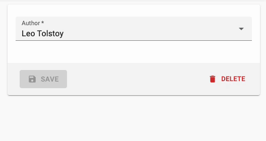

# `<AutocompleteInput>`

To let users choose a value in a list using a dropdown with autocompletion, use `<AutocompleteInput>`.
It renders using Material UI [Autocomplete](https://mui.com/components/autocomplete/).



Set the `choices` attribute to determine the options list (with `id`, `name` tuples).

```jsx
import { AutocompleteInput } from 'react-admin';

<AutocompleteInput source="category" choices={[
    { id: 'programming', name: 'Programming' },
    { id: 'lifestyle', name: 'Lifestyle' },
    { id: 'photography', name: 'Photography' },
]} />
```

## Properties

| Prop                      | Required | Type                                          | Default                 | Description                                                                                                                                                                                                                                                                                                 |
|---------------------------|----------|-----------------------------------------------|-------------------------|-------------------------------------------------------------------------------------------------------------------------------------------------------------------------------------------------------------------------------------------------------------------------------------------------------------|
| `allowEmpty`              | Optional | `boolean`                                     | `false`                 | If `false` and the `searchText` typed did not match any suggestion, the `searchText` will revert to the current value when the field is blurred. If `true` and the `searchText` is set to `''` then the field will set the input value to `null`.                                                           |
| `choices`                 | Required | `Object[]`                                    | `-`                     | List of items to autosuggest                                                                                                                                                                                                                                                                                |
| `create`                  | Optional | `Element`                                     | `-`                     | A React Element to render when users want to create a new choice                                                                                                                                                                                                                                            |
| `createLabel`             | Optional | `string`                                      | `ra.action.create`      | The label for the menu item allowing users to create a new choice. Used when the filter is empty                                                                                                                                                                                                            |
| `createItemLabel`         | Optional | `string`                                      | `ra.action.create_item` | The label for the menu item allowing users to create a new choice. Used when the filter is not empty                                                                                                                                                                                                        |
| `emptyValue`              | Optional | `any`                                         | `''`                    | The value to use for the empty element                                                                                                                                                                                                                                                                      |
| `emptyText`               | Optional | `string`                                      | `''`                    | The text to use for the empty element                                                                                                                                                                                                                                                                       |
| `matchSuggestion`         | Optional | `Function`                                    | `-`                     | Required if `optionText` is a React element. Function returning a boolean indicating whether a choice matches the filter. `(filter, choice) => boolean`                                                                                                                                                     |
| `onCreate`                | Optional | `Function`                                    | `-`                     | A function called with the current filter value when users choose to create a new choice.                                                                                                                                                                                                                   |
| `optionText`              | Optional | `string` &#124; `Function` &#124; `Component` | `name`                  | Field name of record to display in the suggestion item or function which accepts the correct record as argument (`(record)=> {string}`)                                                                                                                                                                     |
| `optionValue`             | Optional | `string`                                      | `id`                    | Field name of record containing the value to use as input value                                                                                                                                                                                                                                             |
| `inputText`               | Optional | `Function`                                    | `-`                     | Required if `optionText` is a custom Component, this function must return the text displayed for the current selection.                                                                                                                                                                                     |
| `setFilter`               | Optional | `Function`                                    | `null`                  | A callback to inform the `searchText` has changed and new `choices` can be retrieved based on this `searchText`. Signature `searchText => void`. This function is automatically setup when using `ReferenceInput`.                                                                                          |
| `shouldRenderSuggestions` | Optional | `Function`                                    | `() => true`            | A function that returns a `boolean` to determine whether or not suggestions are rendered. Use this when working with large collections of data to improve performance and user experience. This function is passed into the underlying react-autosuggest component. Ex.`(value) => value.trim().length > 2` |
| `suggestionLimit`         | Optional | `number`                                      | `null`                  | Limits the numbers of suggestions that are shown in the dropdown list                                                                                                                                                                                                                                       |

`<AutocompleteInput>` also accepts the [common input props](./Inputs.md#common-input-props).

## Usage

You can customize the properties to use for the option name and value, thanks to the `optionText` and `optionValue` attributes:

```jsx
const choices = [
    { _id: 123, full_name: 'Leo Tolstoi', sex: 'M' },
    { _id: 456, full_name: 'Jane Austen', sex: 'F' },
];
<AutocompleteInput source="author_id" choices={choices} optionText="full_name" optionValue="_id" />
```

`optionText` also accepts a function, so you can shape the option text at will:

```jsx
const choices = [
   { id: 123, first_name: 'Leo', last_name: 'Tolstoi' },
   { id: 456, first_name: 'Jane', last_name: 'Austen' },
];
const optionRenderer = choice => `${choice.first_name} ${choice.last_name}`;
<AutocompleteInput source="author_id" choices={choices} optionText={optionRenderer} />
```

`optionText` also accepts a custom Component. However, as the underlying Autocomplete component requires that the current selection is a string, if you opt for a Component, you must pass a function as the `inputText` prop. This function should return text representation of the current selection:

```jsx
const choices = [
   { id: 123, first_name: 'Leo', last_name: 'Tolstoi', avatar:'/pengouin' },
   { id: 456, first_name: 'Jane', last_name: 'Austen', avatar:'/panda' },
];
const OptionRenderer = choice => (
    <span>
        
        {choice.first_name} {choice.last_name}
    </span>
);
const inputText = choice => `${choice.first_name} ${choice.last_name}`;
const matchSuggestion = (filter, choice) => {
    return (
        choice.first_name.toLowerCase().includes(filter.toLowerCase())
        || choice.last_name.toLowerCase().includes(filter.toLowerCase())
};

<AutocompleteInput
    source="author_id"
    choices={choices}
    optionText={<OptionRenderer />}
    inputText={inputText}
    matchSuggestion={matchSuggestion}
/>
```

The choices are translated by default, so you can use translation identifiers as choices:

```jsx
const choices = [
   { id: 'M', name: 'myroot.gender.male' },
   { id: 'F', name: 'myroot.gender.female' },
];
```

However, in some cases (e.g. inside a `<ReferenceInput>`), you may not want the choice to be translated.
In that case, set the `translateChoice` prop to `false`.

```jsx
<AutocompleteInput source="gender" choices={choices} translateChoice={false}/>
```

When dealing with a large amount of `choices` you may need to limit the number of suggestions that are rendered in order to maintain usable performance. The `shouldRenderSuggestions` is an optional prop that allows you to set conditions on when to render suggestions. An easy way to improve performance would be to skip rendering until the user has entered 2 or 3 characters in the search box. This lowers the result set significantly, and might be all you need (depending on your data set).
Ex. `<AutocompleteInput shouldRenderSuggestions={(val) => { return val.trim().length > 2 }} />` would not render any suggestions until the 3rd character has been entered. This prop is passed to the underlying `react-autosuggest` component and is documented [here](https://github.com/moroshko/react-autosuggest#should-render-suggestions-prop).

`<AutocompleteInput>` renders a [material-ui `<Autocomplete>` component](https://mui.com/components/autocomplete/) and it accepts the `<Autocomplete>` props:


```jsx
<AutocompleteInput source="category" size="large" />
```


**Tip**: If you want to populate the `choices` attribute with a list of related records, you should decorate `<AutocompleteInput>` with [`<ReferenceInput>`](./ReferenceInput.md), and leave the `choices` empty:

```jsx
import { AutocompleteInput, ReferenceInput } from 'react-admin';

<ReferenceInput label="Post" source="post_id" reference="posts">
    <AutocompleteInput optionText="title" />
</ReferenceInput>
```

**Tip**: `<AutocompleteInput>` is a stateless component, so it only allows to *filter* the list of choices, not to *extend* it. If you need to populate the list of choices based on the result from a `fetch` call (and if [`<ReferenceInput>`](./ReferenceInput.md) doesn't cover your need), you'll have to [write your own Input component](./Inputs.md#writing-your-own-input-component) based on material-ui `<AutoComplete>` component.

## Creating New Choices

The `<AutocompleteInput>` can allow users to create a new choice if either the `create` or `onCreate` prop is provided.

Use the `onCreate` prop when you only require users to provide a simple string and a `prompt` is enough. You can return either the new choice directly or a Promise resolving to the new choice.


```js
import { AutocompleteInput, Create, SimpleForm, TextInput } from 'react-admin';

const PostCreate = () => {
    const categories = [
        { name: 'Tech', id: 'tech' },
        { name: 'Lifestyle', id: 'lifestyle' },
    ];
    return (
        <Create>
            <SimpleForm>
                <TextInput source="title" />
                <AutocompleteInput
                    onCreate={() => {
                        const newCategoryName = prompt('Enter a new category');
                        const newCategory = { id: newCategoryName.toLowerCase(), name: newCategoryName };
                        categories.push(newCategory);
                        return newCategory;
                    }}
                    source="category"
                    choices={categories}
                />
            </SimpleForm>
        </Create>
    );
}
```


Use the `create` prop when you want a more polished or complex UI. For example a Material UI `<Dialog>` asking for multiple fields because the choices are from a referenced resource.


```js
import {
    AutocompleteInput,
    Create,
    ReferenceInput,
    SimpleForm,
    TextInput,
    useCreateSuggestionContext
} from 'react-admin';

import {
    Box,
    BoxProps,
    Button,
    Dialog,
    DialogActions,
    DialogContent,
    TextField,
} from '@material-ui/core';

const PostCreate = () => {
    return (
        <Create>
            <SimpleForm>
                <TextInput source="title" />
                <ReferenceInput source="category_id" reference="categories">
                    <AutocompleteInput create={<CreateCategory />} />
                </ReferenceInput>
            </SimpleForm>
        </Create>
    );
}

const CreateCategory = () => {
    const { filter, onCancel, onCreate } = useCreateSuggestionContext();
    const [value, setValue] = React.useState(filter || '');
    const [create] = useCreate('categories');

    const handleSubmit = (event) => {
        event.preventDefault();
        create(
            {
                payload: {
                    data: {
                        title: value,
                    },
                },
            },
            {
                onSuccess: ({ data }) => {
                    setValue('');
                    onCreate(data);
                },
            }
        );
    };

    return (
        <Dialog open onClose={onCancel}>
            <form onSubmit={handleSubmit}>
                <DialogContent>
                    <TextField
                        label="New category name"
                        value={value}
                        onChange={event => setValue(event.target.value)}
                        autoFocus
                    />
                </DialogContent>
                <DialogActions>
                    <Button type="submit">Save</Button>
                    <Button onClick={onCancel}>Cancel</Button>
                </DialogActions>
            </form>
        </Dialog>
    );
};
```


## CSS API

This component doesn't apply any custom styles on top of [material-ui `<Autocomplete>` component](https://mui.com/components/autocomplete/). Refer to their documentation to know its CSS API.
