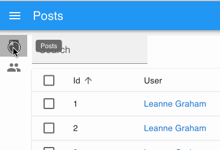

# Buttons

React-Admin provides button components for all the common uses.

## Navigation Buttons

These buttons allow users to navigate between the various react-admin views.

### `<EditButton>`

Opens the Edit view of a given record:

```js
import { EditButton } from 'react-admin';

const CommentEditButton = ({ record }) => (
    <EditButton basePath="/comments" label="Edit comment" record={record} />
);
```


`<EditButton>` is based on react-admin's base `<Button>`, so it's responsive, accessible, and the label is translatable.

| Prop          | Required | Type            | Default          | Description                                      |
| ------------- | -------- | --------------- | ---------------- | ------------------------------------------------ |
| `basePath`    | Required | `string`        | -                | Base path to resource, e.g. '/posts'             |
| `record`      | Required | `Object`        | -                | Record to link to, e.g. `{ id: 12, foo: 'bar' }` |
| `label`       | Optional | `string`        | 'ra.action.edit' | Label or translation message to use              |
| `icon`        | Optional | `ReactElement`  | -                | Icon element, e.g. `<CommentIcon />`             |
| `scrollToTop` | Optional | `boolean`       | `true`           | Scroll to top after link                         |

It also supports [all the other `<Button>` props](#button).

**Tip**: You can use it as `<Datagrid>` child with no props, since `<Datagrid>` injects `record` and `basePath` to its children. However, you should use the `<Datagrid rowClick="edit">` prop instead to avoid using one column for the Edit button.

**Tip**: If you want to link to the Edit view manually, use the `/{resource}/{record.id}` location.

### `<ShowButton>`

Opens the Show view of a given record:

```js
import { ShowButton } from 'react-admin';

const CommentShowButton = ({ record }) => (
    <ShowButton basePath="/comments" label="Show comment" record={record} />
);
```


`<ShowButton>` is based on react-admin's base `<Button>`, so it's responsive, accessible, and the label is translatable.

| Prop          | Required | Type            | Default          | Description                                      |
| ------------- | -------- | --------------- | ---------------- | ------------------------------------------------ |
| `basePath`    | Required | `string`        | -                | Base path to resource, e.g. '/posts'             |
| `record`      | Required | `Object`        | -                | Record to link to, e.g. `{ id: 12, foo: 'bar' }` |
| `component`   | Optional | `ReactElement`  | -                | Base path to resource, e.g. '/posts'             |
| `label`       | Optional | `string`        | 'ra.action.show' | Label or translation message to use              |
| `icon`        | Optional | `ReactElement`  | -                | Icon element, e.g. `<CommentIcon />`             |
| `scrollToTop` | Optional | `boolean`       | `true`           | Scroll to top after link                         |

It also supports [all the other `<Button>` props](#button).

**Tip**: You can use it as `<Datagrid>` child with no props, since `<Datagrid>` injects `record` and `basePath` to its children. However, you should use the `<Datagrid rowClick="show">` prop instead to avoid using one column for the Edit button.

**Tip**: If you want to link to the Show view manually, use the `/{resource}/{record.id}/show` location.

### `<CreateButton>`

Opens the Create view of a given resource:

```js
import { CreateButton } from 'react-admin';

const CommentCreateButton = () => (
    <CreateButton basePath="/comments" label="Create comment" />
);
```


`<CreateButton>` is based on react-admin's base `<Button>`, so it's responsive, accessible, and the label is translatable. On mobile, it turns into a "Floating Action Button".


| Prop          | Required | Type            | Default            | Description                                  |
| ------------- | -------- | --------------- | ------------------ | -------------------------------------------- |
| `basePath`    | Required | `string`        | -                  | base path to resource, e.g. '/posts'         |
| `label`       | Optional | `string`        | 'ra.action.create' | label or translation message to use          |
| `icon`        | Optional | `ReactElement`  | -                  | iconElement, e.g. `<CommentIcon />`          |
| `scrollToTop` | Optional | `boolean`       | `true`             | Scroll to top after link                     |

It also supports [all the other `<Button>` props](#button).

**Tip**: If you want to link to the Create view manually, use the `/{resource}/create` location.

#### CSS API

| Rule name      | Description                                                        |
| -------------- | ------------------------------------------------------------------ |
| `floating`     | Applied to the underlying `MuiFab` component used in small screens |

To override the style of all instances of `<CreateButton>` using the [material-ui style overrides](https://material-ui.com/customization/globals/#css), use the `RaCreateButton` key.

### `<ListButton>`

Opens the List view of a given resource:

```js
import { ListButton } from 'react-admin';

const CommentListButton = () => (
    <ListButton basePath="/comments" label="Comments" />
);
```


`<ListButton>` is based on react-admin's base `<Button>`, so it's responsive, accessible, and the label is translatable.

By default, react-admin doesn't display a `<ListButton>` in Edit and Show views action toolbar. This saves visual clutter, and users can always use the back button. You can add it by specifying your own `actions`:

```jsx
// linking back to the list from the Edit view
import { TopToolbar, ListButton, ShowButton, Edit } from 'react-admin';

const PostEditActions = ({ basePath, record, resource }) => (
    <TopToolbar>
        <ListButton basePath={basePath} />
        <ShowButton basePath={basePath} record={record} />
    </TopToolbar>
);

export const PostEdit = (props) => (
    <Edit actions={<PostEditActions />} {...props}>
        ...
    </Edit>
);
```

| Prop       | Required | Type            | Default          | Description                                  |
| ---------- | -------- | --------------- | ---------------- | -------------------------------------------- |
| `basePath` | Required | `string`        | -                | base path to resource, e.g. '/posts'         |
| `label`    | Optional | `string`        | 'ra.action.list' | label or translation message to use          |
| `icon`     | Optional | `ReactElement`  | -                | iconElement, e.g. `<CommentIcon />`          |

It also supports [all the other `<Button>` props](#button).

**Tip**: If you want to link to the List view manually, use the `/{resource}` location.

## List Buttons

The following buttons are designed to be used in List views.

### `<ExportButton>`

Exports the current list, with filters applied, but without pagination. It relies on [the `exporter` function](./List.md#exporter) passed to the `<List>` component, via the `ListContext`. It's disabled for empty lists.

By default, the `<ExportButton>` is included in the List actions.

```jsx
import { CreateButton, ExportButton, TopToolbar } from 'react-admin';

const PostListActions = ({ basePath }) => (
    <TopToolbar>
        <PostFilter context="button" />
        <CreateButton basePath={basePath} />
        <ExportButton />
    </TopToolbar>
);

export const PostList = (props) => (
    <List actions={<PostListActions />} {...props}>
        ...
    </List>
);
```


| Prop         | Required | Type            | Default            | Description                         |
| ------------ | -------- | --------------- | ------------------ | ----------------------------------- |
| `maxResults` | Optional | `number`        | 1000               | Maximum number of records to export |
| `label`      | Optional | `string`        | 'ra.action.export' | label or translation message to use |
| `icon`       | Optional | `ReactElement`  | `<DownloadIcon>`   | iconElement, e.g. `<CommentIcon />` |
| `exporter`   | Optional | `Function`      | -                  | Override the List exporter function |

### `<BulkExportButton>`

Same as `<ExportButton>`, except it only exports the selected rows instead of the entire list. To be used inside [the `<List bulkActionButtons>` prop](./List.md#bulkactionbuttons).

```jsx
import * as React from 'react';
import { Fragment } from 'react';
import { BulkDeleteButton, BulkExportButton } from 'react-admin';

const PostBulkActionButtons = ({ basePath }) => (
    <Fragment>
        <BulkExportButton />
        <BulkDeleteButton basePath={basePath} />
    </Fragment>
);

export const PostList = (props) => (
    <List {...props} bulkActionButtons={<PostBulkActionButtons />}>
        ...
    </List>
);
```


| Prop         | Required | Type            | Default            | Description                         |
| ------------ | -------- | --------------- | ------------------ | ----------------------------------- |
| `label`      | Optional | `string`        | 'ra.action.export' | label or translation message to use |
| `icon`       | Optional | `ReactElement`  | `<DownloadIcon>`   | iconElement, e.g. `<CommentIcon />` |
| `exporter`   | Optional | `Function`      | -                  | Override the List exporter function |

### `<BulkDeleteButton>`

Deletes the selected rows. To be used inside [the `<List bulkActionButtons>` prop](./List.md#bulkactionbuttons) (where it's enabled by default).

```jsx
import * as React from 'react';
import { Fragment } from 'react';
import { BulkDeleteButton, BulkExportButton } from 'react-admin';

const PostBulkActionButtons = ({ basePath }) => (
    <Fragment>
        <BulkExportButton />
        <BulkDeleteButton basePath={basePath} />
    </Fragment>
);

export const PostList = (props) => (
    <List {...props} bulkActionButtons={<PostBulkActionButtons />}>
        ...
    </List>
);
```


| Prop         | Required | Type            | Default            | Description                         |
| ------------ | -------- | --------------- | ------------------ | ----------------------------------- |
| `label`      | Optional | `string`        | 'ra.action.delete' | label or translation message to use |
| `icon`       | Optional | `ReactElement`  | `<DeleteIcon>`     | iconElement, e.g. `<CommentIcon />` |
| `exporter`   | Optional | `Function`      | -                  | Override the List exporter function |
| `undoable`   | Optional | `boolean`       | `true`             | Allow users to cancel the deletion  |

### `<FilterButton>`

This button is an internal component used by react-admin in [the Filter button/form combo](./List.md#the-filter-buttonform-combo).


#### CSS API

| Rule name  | Description                                                   |
| ---------- | ------------------------------------------------------------- |
| `root`     | Alternative to using `className`. Applied to the root element |

To override the style of all instances of `<FilterButton>` using the [material-ui style overrides](https://material-ui.com/customization/globals/#css), use the `RaFilterButton` key.

### `<SortButton>`

Some List views don't have a natural UI for sorting - e.g. the `<SimpleList>`, or a list of images, don't have column headers like the `<Datagrid>`. For these cases, react-admin offers the `<SortButton>`, which displays a dropdown list of fields that the user can choose to sort on.


`<SortButton>` expects one prop: `fields`, the list of fields it should allow to sort on. For instance, here is how to offer a button to sort on the `reference`, `sales`, and `stock` fields:

```jsx
import * as React from 'react';
import { TopToolbar, SortButton, CreateButton, ExportButton } from 'react-admin';

const ListActions = () => (
    <TopToolbar>
        <SortButton fields={['reference', 'sales', 'stock']} />
        <CreateButton basePath="/products" />
        <ExportButton />
    </TopToolbar>
);
```

| Prop         | Required | Type            | Default            | Description                         |
| ------------ | -------- | --------------- | ------------------ | ----------------------------------- |
| `fields`     | Required | `string[]`      | -                  | List of fields to offer sort on     |
| `icon`       | Optional | `ReactElement`  | `<DeleteIcon>`     | iconElement, e.g. `<CommentIcon />` |
| `label`      | Optional | `string`        | 'ra.action.delete' | label or translation message to use |

## Record Buttons

### `<DeleteButton>`
### `<CloneButton>`
### `<SaveButton>`

## Miscellaneous

### `<Button>`

Base component for most react-admin buttons. Responsive (displays only the icon with a tooltip on mobile) and accessible.

| Prop         | Required | Type                           | Default | Description                              |
| ------------ | -------- | ------------------------------ | ------- | ---------------------------------------- |
| `alignIcon`  | Optional | `'left' | 'right`              | `'left'` | Icon position relative to the label     |
| `children`   | Optional | `ReactElement`                 | -        | icon to use                             |
| `className`  | Optional | `string`                       | -        | path to link to, e.g. '/posts'          |
| `color`      | Optional | `'default' | 'inherit'| 'primary' | 'secondary'` | `'primary'` | Label and icon color |
| `disabled`   | Optional | `boolean`                      | `false`   | If `true`, the button will be disabled |
| `size`       | Optional | `'large' | 'medium' | 'small'` | `'small'` | Button size                            |

Other props are passed down to [the underlying material-ui `<Button>`](https://material-ui.com/api/button/).

#### CSS API

| Rule name        | Description                                                                                     |
| ---------------- | ----------------------------------------------------------------------------------------------- |
| `button`         | Applied to the underlying `MuiButton` component                                                 |
| `label`          | Applied to the Button's label when `alignIcon` prop is 'left'                                   |
| `labelRightIcon` | Applied to the Button's label when `alignIcon` prop is 'left'                                   |
| `smallIcon`      | Applied to the Button's `children` when `size` prop is `small` and `alignIcon` prop is 'right'  |
| `mediumIcon`     | Applied to the Button's `children` when `size` prop is `medium` and `alignIcon` prop is 'right' |
| `largeIcon`      | Applied to the Button's `children` when `size` prop is `large` and `alignIcon` prop is 'right'  |

To override the style of all instances of `<Button>` using the [material-ui style overrides](https://material-ui.com/customization/globals/#css), use the `RaButton` key.

### `<RefreshButton>`
### `<SkipNavigationButton>`

#### CSS API

| Rule name             | Description                                     |
| --------------------- | ----------------------------------------------- |
| `skipToContentButton` | Applied to the underlying `MuiButton` component |

To override the style of all instances of `<SkipNavigationButton>` using the [material-ui style overrides](https://material-ui.com/customization/globals/#css), use the `RaSkipNavigationButton` key.

### `<MenuItemLink>`

The `<MenuItemLink>` component displays a menu item with a label and an icon - or only the icon with a tooltip when the sidebar is minimized. It also handles the automatic closing of the menu on tap on mobile.



| Prop          | Required | Type                 | Default | Description                              |
| ------------- | -------- | -------------------- | ------- | ---------------------------------------- |
| `to`          | Required | `string | location`  | -       | The menu item's target. It is passed to a React Router [NavLink](https://reacttraining.com/react-router/web/api/NavLink) component. |
| `primaryText` | Required | `string | ReactNode` | -       | The menu content, displayed when the menu isn't minimized. |
| `leftIcon`    | Optional | `ReactNode`          | -       | The menu icon |

Additional props are passed down to [the underling material-ui `<MenuItem>` component](https://material-ui.com/api/menu-item/#menuitem-api).

You can create a custom menu component using the `<DashboardMenuItem>` and `<MenuItemLink>` components:

```jsx
// in src/Menu.js
import * as React from 'react';
import { DashboardMenuItem, MenuItemLink } from 'react-admin';
import BookIcon from '@material-ui/icons/Book';
import ChatBubbleIcon from '@material-ui/icons/ChatBubble';
import PeopleIcon from '@material-ui/icons/People';
import LabelIcon from '@material-ui/icons/Label';

export const Menu = () => (
    <div>
        <DashboardMenuItem />
        <MenuItemLink to="/posts" primaryText="Posts" leftIcon={<BookIcon />}/>
        <MenuItemLink to="/comments" primaryText="Comments" leftIcon={<ChatBubbleIcon />}/>
        <MenuItemLink to="/users" primaryText="Users" leftIcon={<PeopleIcon />}/>
        <MenuItemLink to="/custom-route" primaryText="Miscellaneous" leftIcon={<LabelIcon />}/>
    </div>
);
```

To use this custom menu component, pass it to a custom Layout:

```jsx
// in src/Layout.js
import { Layout } from 'react-admin';
import { Menu } from './Menu';

export const Layout = (props) => <Layout {...props} menu={Menu} />;
```

Then, use this layout in the `<Admin>` `layout` prop:

```jsx
// in src/App.js
import { Layout }  from './Layout';

const App = () => (
    <Admin layout={Layout} dataProvider={simpleRestProvider('http://path.to.my.api')}>
        // ...
    </Admin>
);
```

See [The theming documentation](./Theming.md#menuitemlink) for more details.

**Tip**: If you need a multi-level menu, or a Mega Menu opening panels with custom content, check out [the `ra-navigation` module](https://marmelab.com/ra-enterprise/modules/ra-navigation) (part of the [Enterprise Edition](https://marmelab.com/ra-enterprise))


#### CSS API

| Rule name | Description                                                         |
| --------- | ------------------------------------------------------------------- |
| `root`    | Alternative to using `className`. Applied to the root element       |
| `active`  | Applied to the underlying `MuiMenuItem`'s `activeClassName` prop    |
| `icon`    | Applied to the `ListItemIcon` component when `leftIcon` prop is set |

To override the style of all instances of `<MenuItemLink>` using the [material-ui style overrides](https://material-ui.com/customization/globals/#css), use the `RaMenuItemLink` key.

### `<UserMenu>`

| Prop         | Required | Type            | Default             | Description                         |
| ------------ | -------- | --------------- | ------------------- | ----------------------------------- |
| `children`   | Optional | `ReactElement`  | -                   | elements to use as menu items       |
| `label`      | Required | `string`        | 'ra.auth.user_menu' | label or translation message to use |
| `logout`     | Optional | `ReactElement`  | -                   | logout component                    |
| `icon`       | Optional | `ReactElement`  | `<AccountCircle>`   | iconElement, e.g. `<CommentIcon />` |

#### CSS API

| Rule name    | Description                                                                                                                              |
| ------------ | ---------------------------------------------------------------------------------------------------------------------------------------- |
| `user`       | Alternative to using `className`. Applied to the root element                                                                            |
| `userButton` | Applied to the underlying `MuiButton` component when `useGetIdentity().loaded` is `true` and `useGetIdentity().identity.fullName` is set |
| `avatar`     | Applied to the underlying `MuiAvatar` component when `useGetIdentity().avatar` is `true`                                                 |

To override the style of all instances of `<UserMenu>` using the [material-ui style overrides](https://material-ui.com/customization/globals/#css), use the `RaUserMenu` key.
