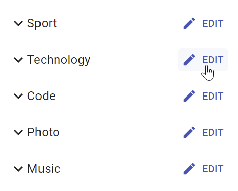

# Buttons

React-Admin provides button components for all the common uses.

## Navigation Buttons

These buttons allow users to navigate between the various react-admin views.

### `<EditButton>`

Opens the Edit view of the current record:

```js
import { EditButton } from 'react-admin';

const CommentEditButton = () => <EditButton label="Edit comment" />;
```



`<EditButton>` is based on react-admin's base `<Button>`, so it's responsive, accessible, and the label is translatable.

| Prop          | Required | Type            | Default          | Description                                      |
| ------------- | -------- | --------------- | ---------------- | ------------------------------------------------ |
| `resource`    | Optional | `string`        | -                | Resource to link to, e.g. 'posts'                |
| `record`      | Optional | `Object`        | -                | Record to link to, e.g. `{ id: 12, foo: 'bar' }` |
| `label`       | Optional | `string`        | 'ra.action.edit' | Label or translation message to use              |
| `icon`        | Optional | `ReactElement`  | -                | Icon element, e.g. `<CommentIcon />`             |
| `scrollToTop` | Optional | `boolean`       | `true`           | Scroll to top after link                         |

It also supports [all the other `<Button>` props](#button).

**Tip**: You can use it as `<Datagrid>` child, too. However, you should use the `<Datagrid rowClick="edit">` prop instead to avoid using one column for the Edit button.

**Tip**: If you want to link to the Edit view manually, use the `/{resource}/{record.id}` location.

### `<ShowButton>`

Opens the Show view of the current record:

```js
import { ShowButton } from 'react-admin';

const CommentShowButton = () => <ShowButton label="Show comment" />;
```


`<ShowButton>` is based on react-admin's base `<Button>`, so it's responsive, accessible, and the label is translatable.

| Prop          | Required | Type            | Default          | Description                                      |
| ------------- | -------- | --------------- | ---------------- | ------------------------------------------------ |
| `resource`    | Optional | `string`        | -                | The target resource, e.g. 'posts'                |
| `record`      | Optional | `Object`        | -                | Record to link to, e.g. `{ id: 12, foo: 'bar' }` |
| `component`   | Optional | `ReactElement`  | -                | Base path to resource, e.g. '/posts'             |
| `label`       | Optional | `string`        | 'ra.action.show' | Label or translation message to use              |
| `icon`        | Optional | `ReactElement`  | -                | Icon element, e.g. `<CommentIcon />`             |
| `scrollToTop` | Optional | `boolean`       | `true`           | Scroll to top after link                         |

It also supports [all the other `<Button>` props](#button).

**Tip**: You can use it as `<Datagrid>` child with no props too. However, you should use the `<Datagrid rowClick="show">` prop instead to avoid using one column for the Edit button.

**Tip**: If you want to link to the Show view manually, use the `/{resource}/{record.id}/show` location.

### `<CreateButton>`

Opens the Create view of the current resource:

```js
import { CreateButton } from 'react-admin';

const CommentCreateButton = () => <CreateButton label="Create comment" />;
```


`<CreateButton>` is based on react-admin's base `<Button>`, so it's responsive, accessible, and the label is translatable. On mobile, it turns into a "Floating Action Button".


| Prop          | Required | Type            | Default            | Description                                  |
| ------------- | -------- | --------------- | ------------------ | -------------------------------------------- |
| `resource`    | Optional | `string`        | -                  | Target resource, e.g. 'posts'                |
| `label`       | Optional | `string`        | 'ra.action.create' | label or translation message to use          |
| `icon`        | Optional | `ReactElement`  | -                  | iconElement, e.g. `<CommentIcon />`          |
| `scrollToTop` | Optional | `boolean`       | `true`             | Scroll to top after link                     |

It also supports [all the other `<Button>` props](#button).

**Tip**: If you want to link to the Create view manually, use the `/{resource}/create` location.

#### `sx`: CSS API

| Rule name                   | Description                                                        |
|-----------------------------|--------------------------------------------------------------------|
| `&.RaCreateButton-floating` | Applied to the underlying `MuiFab` component used in small screens |

To override the style of all instances of `<CreateButton>` using the [Material UI style overrides](https://mui.com/material-ui/customization/theme-components/#theme-style-overrides), use the `RaCreateButton` key.

### `<ListButton>`

Opens the List view of a given resource:

```js
import { ListButton } from 'react-admin';

const CommentListButton = () => <ListButton label="Comments" />;
```


`<ListButton>` is based on react-admin's base `<Button>`, so it's responsive, accessible, and the label is translatable.

By default, react-admin doesn't display a `<ListButton>` in Edit and Show views action toolbar. This saves visual clutter, and users can always use the back button. You can add it by specifying your own `actions`:

```jsx
// linking back to the list from the Edit view
import { TopToolbar, ListButton, ShowButton, Edit } from 'react-admin';

const PostEditActions = () => (
    <TopToolbar>
        <ListButton />
        <ShowButton />
    </TopToolbar>
);

export const PostEdit = () => (
    <Edit actions={<PostEditActions />}>
        ...
    </Edit>
);
```

| Prop       | Required | Type            | Default          | Description                                  |
| ---------- | -------- | --------------- | ---------------- | -------------------------------------------- |
| `resource` | Optional | `string`        | -                | target resource, e.g. 'posts'                |
| `label`    | Optional | `string`        | 'ra.action.list' | label or translation message to use          |
| `icon`     | Optional | `ReactElement`  | -                | iconElement, e.g. `<CommentIcon />`          |

It also supports [all the other `<Button>` props](#button).

**Tip**: If you want to link to the List view manually, use the `/{resource}` location.

## List Buttons

The following buttons are designed to be used in List views.

### `<ExportButton>`

Exports the current list, with filters applied, but without pagination. It relies on [the `exporter` function](./List.md#exporter) passed to the `<List>` component, via the `ListContext`. It's disabled for empty lists.

By default, the `<ExportButton>` is included in the List actions.

```jsx
import { CreateButton, ExportButton, TopToolbar } from 'react-admin';

const PostListActions = () => (
    <TopToolbar>
        <PostFilter context="button" />
        <CreateButton />
        <ExportButton />
    </TopToolbar>
);

export const PostList = () => (
    <List actions={<PostListActions />}>
        ...
    </List>
);
```


| Prop         | Required | Type            | Default            | Description                         |
| ------------ | -------- | --------------- | ------------------ | ----------------------------------- |
| `maxResults` | Optional | `number`        | 1000               | Maximum number of records to export |
| `label`      | Optional | `string`        | 'ra.action.export' | label or translation message to use |
| `icon`       | Optional | `ReactElement`  | `<DownloadIcon>`   | iconElement, e.g. `<CommentIcon />` |
| `exporter`   | Optional | `Function`      | -                  | Override the List exporter function |
| `meta`       | Optional | `any`           | undefined          | Metadata passed to the dataProvider |

### `<BulkExportButton>`

Same as `<ExportButton>`, except it only exports the selected rows instead of the entire list. To be used inside [the `<Datagrid bulkActionButtons>` prop](./Datagrid.md#bulkactionbuttons).

```jsx
import * as React from 'react';
import { Fragment } from 'react';
import { BulkDeleteButton, BulkExportButton } from 'react-admin';

const PostBulkActionButtons = () => (
    <Fragment>
        <BulkExportButton />
        <BulkDeleteButton />
    </Fragment>
);

export const PostList = () => (
    <List>
        <Datagrid bulkActionButtons={<PostBulkActionButtons />}>
            ...
        </Datagrid>
    </List>
);
```


| Prop         | Required | Type            | Default            | Description                         |
| ------------ | -------- | --------------- | ------------------ | ----------------------------------- |
| `label`      | Optional | `string`        | 'ra.action.export' | label or translation message to use |
| `icon`       | Optional | `ReactElement`  | `<DownloadIcon>`   | iconElement, e.g. `<CommentIcon />` |
| `exporter`   | Optional | `Function`      | -                  | Override the List exporter function |
| `meta`       | Optional | `any`           | undefined          | Metadata passed to the dataProvider |

### `<BulkDeleteButton>`

Deletes the selected rows. To be used inside [the `<Datagrid bulkActionButtons>` prop](./Datagrid.md#bulkactionbuttons) (where it's enabled by default).

```jsx
import * as React from 'react';
import { Fragment } from 'react';
import { BulkDeleteButton, BulkExportButton } from 'react-admin';

const PostBulkActionButtons = () => (
    <Fragment>
        <BulkExportButton />
        <BulkDeleteButton />
    </Fragment>
);

export const PostList = () => (
    <List>
        <Datagrid bulkActionButtons={<PostBulkActionButtons />}>
            ...
        </Datagrid>
    </List>
);
```


| Prop              | Required | Type           | Default            | Description                                                                                                         |
|-------------------|----------|----------------|--------------------|---------------------------------------------------------------------------------------------------------------------|
| `confirmContent`  | Optional | React node     | -                  | Lets you customize the content of the confirm dialog. Only used in `'pessimistic'` or `'optimistic'` mutation modes |
| `confirmTitle`    | Optional | `string`       | -                  | Lets you customize the title of the confirm dialog. Only used in `'pessimistic'` or `'optimistic'` mutation modes   |
| `label`           | Optional | `string`       | 'ra.action.delete' | label or translation message to use                                                                                 |
| `icon`            | Optional | `ReactElement` | `<DeleteIcon>`     | iconElement, e.g. `<CommentIcon />`                                                                                 |
| `mutationMode`    | Optional | `string`       | `'undoable'`       | Mutation mode (`'undoable'`, `'pessimistic'` or `'optimistic'`)                                                     |
| `mutationOptions` | Optional | `object`       | null               | options for react-query `useMutation` hook                                                                          |

**Tip:** If you choose the `'pessimistic'` or `'optimistic'` mutation mode, a confirm dialog will be displayed to the user before the mutation is executed.

### `<BulkUpdateButton>`

Partially updates the selected rows. To be used inside [the `<Datagrid bulkActionButtons>` prop](./Datagrid.md#bulkactionbuttons).


#### Usage


```jsx
import * as React from 'react';
import { Fragment } from 'react';
import { BulkDeleteButton, BulkExportButton, BulkUpdateButton } from 'react-admin';

const PostBulkActionButtons = () => (
    <Fragment>
        <BulkExportButton />
        <BulkUpdateButton data={{ published_at: new Date() }} />
        <BulkDeleteButton />
    </Fragment>
);

export const PostList = () => (
    <List>
        <Datagrid bulkActionButtons={<PostBulkActionButtons />}>
            ...
        </Datagrid>
    </List>
);
```


#### Props

| Prop              | Required | Type           | Default            | Description                                                                                                         |
|-------------------|----------|----------------|--------------------|---------------------------------------------------------------------------------------------------------------------|
| `data`            | Required | `object`       | -                  | An object with the fields that need to be updated on the selected records                                           |
| `confirmContent`  | Optional | React node     | -                  | Lets you customize the content of the confirm dialog. Only used in `'pessimistic'` or `'optimistic'` mutation modes |
| `confirmTitle`    | Optional | `string`       | -                  | Lets you customize the title of the confirm dialog. Only used in `'pessimistic'` or `'optimistic'` mutation modes   |
| `icon`            | Optional | `ReactElement` | `<ActionUpdate>`   | An icon element                                                                                                     |
| `label`           | Optional | `string`       | 'ra.action.update' | Label or translation message to use                                                                                 |
| `mutationMode`    | Optional | `string`       | `'undoable'`       | Mutation mode (`'undoable'`, `'pessimistic'` or `'optimistic'`)                                                     |
| `mutationOptions` | Optional | `object`       | null               | Options for react-query `useMutation` hook                                                                          |

**Tip:** If you choose the `'pessimistic'` or `'optimistic'` mutation mode, a confirm dialog will be displayed to the user before the mutation is executed.

### `<BulkUpdateFormButton>`

This component, part of the [enterprise edition](https://marmelab.com/ra-enterprise/modules/ra-form-layout), lets users edit multiple records at once. To be used inside [the `<Datagrid bulkActionButtons>` prop](./Datagrid.md#bulkactionbuttons).

The button opens a dialog containing the form passed as children. When the form is submitted, it will call the dataProvider's `updateMany` method with the ids of the selected records.

<video controls autoplay playsinline muted loop>
  <source src="./img/BulkUpdateButton-SimpleForm.webm" type="video/webm"/>
  <source src="./img/BulkUpdateButton-SimpleForm.mp4" type="video/mp4"/>
  Your browser does not support the video tag.
</video>

#### Usage

`<BulkUpdateFormButton>` can be used inside `<Datagrid>`'s `bulkActionButtons`.

```tsx
import * as React from 'react';
import {
    Admin,
    BooleanField,
    BooleanInput,
    Datagrid,
    DateField,
    DateInput,
    List,
    Resource,
    SimpleForm,
    TextField,
} from 'react-admin';
import { BulkUpdateFormButton } from '@react-admin/ra-form-layout';

import { dataProvider } from './dataProvider';
import { i18nProvider } from './i18nProvider';

export const App = () => (
    <Admin dataProvider={dataProvider} i18nProvider={i18nProvider}>
        <Resource name="posts" list={PostList} />
    </Admin>
);

const PostBulkUpdateButton = () => (
    <BulkUpdateFormButton>
        <SimpleForm>
            <DateInput source="published_at" />
            <BooleanInput source="is_public" />
        </SimpleForm>
    </BulkUpdateFormButton>
);

const PostList = () => (
    <List>
        <Datagrid bulkActionButtons={<PostBulkUpdateButton />}>
            <TextField source="id" />
            <TextField source="title" />
            <DateField source="published_at" />
            <BooleanField source="is_public" />
        </Datagrid>
    </List>
);
```

**Tip:** You are not limited to using a `<SimpleForm>` as children. You can for instance use an `<InputSelectorForm>`, which allows to select the fields to update. Check out the [`<InputSelectorForm>`](#usage-with-inputselectorform) below for more information.

#### Props

| Prop              | Required     | Type     | Default         | Description                                                                                                                        |
|-------------------|--------------|----------|-----------------|------------------------------------------------------------------------------------------------------------------------------------|
| `children`        | Required (*) | Element  | -               | A form component to render inside the Dialog                                                                                       |
| `DialogProps`     | -            | Object   | -               | Additional props to pass to the [MUI Dialog](https://mui.com/material-ui/react-dialog/)                                            |
| `mutationMode`    | -            | `string` | `'pessimistic'` | The mutation mode (`'undoable'`, `'pessimistic'` or `'optimistic'`)                                                                |
| `mutationOptions` | -            | Object   | -               | Mutation options passed to [react-query](https://tanstack.com/query/v3/docs/react/reference/useMutation) when calling `updateMany` |


#### `children`

`<BulkUpdateFormButton>` expects a form component as children, such as `<SimpleForm>` or `<InputSelectorForm>`.

```tsx
import { BulkUpdateFormButton } from '@react-admin/ra-form-layout';
import * as React from 'react';
import { BooleanInput, DateInput, SimpleForm } from 'react-admin';

const PostBulkUpdateButton = () => (
    <BulkUpdateFormButton>
        <SimpleForm>
            <DateInput source="published_at" />
            <BooleanInput source="is_public" />
        </SimpleForm>
    </BulkUpdateFormButton>
);
```

#### `DialogProps`

The `DialogProps` prop can be used to pass additional props to the [MUI Dialog](https://mui.com/material-ui/react-dialog/).

```tsx
import { Slide } from '@mui/material';
import { TransitionProps } from '@mui/material/transitions';
import { BulkUpdateFormButton } from '@react-admin/ra-form-layout';
import * as React from 'react';
import { BooleanInput, DateInput, SimpleForm } from 'react-admin';

const Transition = React.forwardRef(function Transition(
    props: TransitionProps & {
        children: React.ReactElement<any, any>;
    },
    ref: React.Ref<unknown>
) {
    return <Slide direction="left" ref={ref} {...props} />;
});

const PostBulkUpdateButtonWithTransition = () => (
    <BulkUpdateFormButton DialogProps={{ TransitionComponent: Transition }}>
        <SimpleForm>
            <DateInput source="published_at" />
            <BooleanInput source="is_public" />
        </SimpleForm>
    </BulkUpdateFormButton>
);
```


#### `mutationMode`

Use the `mutationMode` prop to specify the [mutation mode](https://marmelab.com/react-admin/Edit.html#mutationmode).

```tsx
import { BulkUpdateFormButton } from '@react-admin/ra-form-layout';
import * as React from 'react';
import { BooleanInput, DateInput, SimpleForm } from 'react-admin';

const PostBulkUpdateButton = () => (
    <BulkUpdateFormButton mutationMode="undoable">
        <SimpleForm>
            <DateInput source="published_at" />
            <BooleanInput source="is_public" />
        </SimpleForm>
    </BulkUpdateFormButton>
);
```

#### `mutationOptions` and `meta`

The `mutationOptions` prop can be used to pass options to the [react-query mutation](https://react-query.tanstack.com/reference/useMutation#options) used to call the dataProvider's `updateMany` method.


```tsx
import { BulkUpdateFormButton } from '@react-admin/ra-form-layout';
import * as React from 'react';
import { BooleanInput, DateInput, SimpleForm } from 'react-admin';

const PostBulkUpdateButton = () => (
    <BulkUpdateFormButton mutationOptions={{ retry: false }}>
        <SimpleForm>
            <DateInput source="published_at" />
            <BooleanInput source="is_public" />
        </SimpleForm>
    </BulkUpdateFormButton>
);
```


You can also use this prop to pass a `meta` object, that will be passed to the dataProvider when calling `updateMany`.

```tsx
import { BulkUpdateFormButton } from '@react-admin/ra-form-layout';
import * as React from 'react';
import { BooleanInput, DateInput, SimpleForm } from 'react-admin';

const PostBulkUpdateButton = () => (
    <BulkUpdateFormButton mutationOptions={{ meta: { foo: 'bar' } }}>
        <SimpleForm>
            <DateInput source="published_at" />
            <BooleanInput source="is_public" />
        </SimpleForm>
    </BulkUpdateFormButton>
);
```


#### Usage with `<TabbedForm>` or other location based form layouts

`<BulkUpdateFormButton>` can be used with any form layout. However, for form layouts that are based on location by default, such as [`<TabbedForm>`](https://marmelab.com/react-admin/TabbedForm.html), you will need to disable the location syncing feature, as it may conflict with the Edit route declared by React Admin (`/<resource>/<id>`).

For instance, with `<TabbedForm>`, you can use the `syncWithLocation` prop to disable it:

```tsx
import { BulkUpdateFormButton } from '@react-admin/ra-form-layout';
import * as React from 'react';
import { BooleanInput, DateInput, TabbedForm } from 'react-admin';

const PostBulkUpdateButton = () => (
    <BulkUpdateFormButton>
        <TabbedForm syncWithLocation={false}>
            <TabbedForm.Tab label="Publication">
                <DateInput source="published_at" />
            </TabbedForm.Tab>
            <TabbedForm.Tab label="Visibility">
                <BooleanInput source="is_public" />
            </TabbedForm.Tab>
        </TabbedForm>
    </BulkUpdateFormButton>
);
```

#### Usage With `<InputSelectorForm>`

`<BulkUpdateFormButton>` works best with `<InputSelectorForm>`, which component renders a form allowing to select the fields to update in a record.

<video controls autoplay playsinline muted loop>
  <source src="./img/BulkUpdateButton-InputSelectorForm.webm" type="video/webm"/>
  <source src="./img/BulkUpdateButton-InputSelectorForm.mp4" type="video/mp4"/>
  Your browser does not support the video tag.
</video>

`<InputSelectorForm>` expects a list of inputs passed in the `inputs` prop. Each input must have a `label` and an `element`.

```tsx
import {
    BulkUpdateFormButton,
    InputSelectorForm,
} from '@react-admin/ra-form-layout';
import * as React from 'react';
import { BooleanInput, DateInput } from 'react-admin';

const PostBulkUpdateButton = () => (
    <BulkUpdateFormButton>
        <InputSelectorForm
            inputs={[
                {
                    label: 'Published at',
                    element: <DateInput source="published_at" />,
                },
                {
                    label: 'Is public',
                    element: <BooleanInput source="is_public" />,
                },
            ]}
        />
    </BulkUpdateFormButton>
);
```

Use the `inputs` prop to specify the list of inputs from which the user can pick. Each input must have a `label` and an `element`.

```tsx
import { InputSelectorForm } from '@react-admin/ra-form-layout';
import * as React from 'react';
import {
    BooleanInput,
    DateInput,
    SelectArrayInput,
    TextInput,
} from 'react-admin';

const PostEdit = () => (
    <InputSelectorForm
        inputs={[
            {
                label: 'Title',
                element: <TextInput source="title" />,
            },
            {
                label: 'Body',
                element: <TextInput source="body" multiline />,
            },
            {
                label: 'Published at',
                element: <DateInput source="published_at" />,
            },
            {
                label: 'Is public',
                element: <BooleanInput source="is_public" />,
            },
            {
                label: 'Tags',
                element: (
                    <SelectArrayInput
                        source="tags"
                        choices={[
                            { id: 'react', name: 'React' },
                            { id: 'vue', name: 'Vue' },
                            { id: 'solid', name: 'Solid' },
                            { id: 'programming', name: 'Programming' },
                        ]}
                    />
                ),
            },
        ]}
    />
);
```

#### Limitations

If you look under the hood, you will see that `<BulkUpdateFormButton>` provides a `<SaveContext>` to its children, which allows them to call `updateMany` with the ids of the selected records.

However since we are in the context of a list, there is no `<RecordContext>` available. Hence, the following inputs cannot work inside a `<BulkUpdateFormButton>`:

- `<ReferenceOneInput>`
- `<ReferenceManyInput>`
- `<ReferenceManyToManyInput>`

### `<FilterButton>`

This button is an internal component used by react-admin in [the Filter button/form combo](./FilteringTutorial.md#the-filter-buttonform-combo).

<video controls autoplay playsinline muted loop>
  <source src="./img/list_filter.webm" type="video/webm"/>
  <source src="./img/list_filter.mp4" type="video/mp4"/>
  Your browser does not support the video tag.
</video>


#### `sx`: CSS API

To override the style of all instances of `<FilterButton>` using the [Material UI style overrides](https://mui.com/material-ui/customization/theme-components/#theme-style-overrides), use the `RaFilterButton` key.

## Record Buttons

### `<UpdateButton>`

This component allows to create a button that updates a record by calling the [`useUpdate hook`](./useUpdate.md).


```jsx
import { Edit, SimpleForm, TextInput, TopToolbar, UpdateButton } from 'react-admin';

const PostEditActions = () => (
    <TopToolbar>
        <UpdateButton label="Reset views" data={{ views: 0 }} />
    </TopToolbar>
);

export const PostEdit = () => (
    <Edit actions={<PostEditActions>}>
        <SimpleForm>
            <TextInput source="title" />
            <TextInput source="body" />
        </SimpleForm>
    </Edit>
);
```


See [its documentation](./UpdateButton.md) for more details.

### `<DeleteButton>`

### `<DeleteWithConfirmButton>`

Delete the current record after a confirm dialog has been accepted. To be used inside a `<Toolbar/>` component.

| Prop                                                       | Required | Type                             | Default                     | Description                                                             |
|------------------------------------------------------------|----------|----------------------------------|-----------------------------|-------------------------------------------------------------------------|
| `className`                                                | Optional | `string`                         | -                           | Class name to customize the look and feel of the button element itself  |
| `label`                                                    | Optional | `string`                         | 'ra.action.delete'          | label or translation message to use                                     |
| `icon`                                                     | Optional | `ReactElement`                   | `<DeleteIcon>`              | iconElement, e.g. `<CommentIcon />`                                     |
| `confirmTitle`                                             | Optional | `ReactNode`                      | 'ra.message.delete_title'   | Title of the confirm dialog                                             |
| `confirmContent`                                           | Optional | `ReactNode`                      | 'ra.message.delete_content' | Message or React component to be used as the body of the confirm dialog |
| `redirect`                                                 | Optional | `string | false | Function`      | 'list'                      | Custom redirection after success side effect                            |
| `translateOptions`                                         | Optional | `{ id?: string, name?: string }` | {}                          | Custom id and name to be used in the confirm dialog's title             |
| `mutationOptions`                                          | Optional |                                  | null                        | options for react-query `useMutation` hook                              |


```jsx
import * as React from 'react';
import { DeleteWithConfirmButton, Toolbar, Edit, SaveButton,useRecordContext } from 'react-admin';

const EditToolbar = props => {
    const record = useRecordContext();

    <Toolbar {...props}>
        <SaveButton/>
        <DeleteWithConfirmButton
            confirmContent="You will not be able to recover this record. Are you sure?"
            translateOptions={{ name: record.name }}
        />
    </Toolbar>
};

const MyEdit = () => (
    <Edit>
        <SimpleForm toolbar={<EditToolbar />}>
            ...
        </SimpleForm>        
    </Edit>    
);
```


### `<CloneButton>`

## Performance

### `disableRipple`

The ripple effect can cause [performance issues](https://github.com/marmelab/react-admin/issues/5587) for large datagrids. It's possible to remove the ripple effect from within your Material UI theme. The [Material UI docs](https://mui.com/material-ui/getting-started/faq/#how-can-i-disable-the-ripple-effect-globally) provide instructions on how to do this.

It's worth noting that removing the ripple will cause accessibility issues, including a lack of focus states during tab navigating for components like `BooleanInput` and `CheckboxGroupInput`. 

Note: The `disableRipple` was set to `true` in React Admin for a time, but was reimplemented due to accessibility concerns. If you'd like to reimplement the static ripple colour effect, you can use the [React Admin's previous implementation](https://github.com/marmelab/react-admin/blob/994079cbca810a2e74d85329e684811645b04ae2/packages/ra-ui-materialui/src/defaultTheme.ts#L31) as a starting point. [The Material UI docs](https://mui.com/material-ui/api/button-base/#props) also gives details on how to reimplement focus styles using the `Mui-focusVisible` class.

## Miscellaneous

### `<Button>`

Base component for most react-admin buttons. Responsive (displays only the icon with a tooltip on mobile) and accessible.

| Prop         | Required | Type                           | Default | Description                              |
| ------------ | -------- | ------------------------------ | ------- | ---------------------------------------- |
| `alignIcon`  | Optional | `'left' | 'right`              | `'left'` | Icon position relative to the label     |
| `children`   | Optional | `ReactElement`                 | -        | icon to use                             |
| `className`  | Optional | `string`                       | -        | Class name to customize the look and feel of the button element itself          |
| `color`      | Optional | `'default' | 'inherit'| 'primary' | 'secondary'` | `'primary'` | Label and icon color |
| `disabled`   | Optional | `boolean`                      | `false`   | If `true`, the button will be disabled |
| `size`       | Optional | `'large' | 'medium' | 'small'` | `'small'` | Button size                            |

Other props are passed down to [the underlying Material UI `<Button>`](https://mui.com/material-ui/api/button/).

#### `sx`: CSS API

| Rule name                    | Description                                                                                     |
|------------------------------|-------------------------------------------------------------------------------------------------|
| `& .RaButton-button`         | Applied to the underlying `MuiButton` component                                                 |
| `& .RaButton-label`          | Applied to the Button's label when `alignIcon` prop is 'left'                                   |
| `& .RaButton-labelRightIcon` | Applied to the Button's label when `alignIcon` prop is 'left'                                   |
| `& .RaButton-smallIcon`      | Applied to the Button's `children` when `size` prop is `small` and `alignIcon` prop is 'right'  |
| `& .RaButton-mediumIcon`     | Applied to the Button's `children` when `size` prop is `medium` and `alignIcon` prop is 'right' |
| `& .RaButton-largeIcon`      | Applied to the Button's `children` when `size` prop is `large` and `alignIcon` prop is 'right'  |

To override the style of all instances of `<Button>` using the [Material UI style overrides](https://mui.com/material-ui/customization/theme-components/#theme-style-overrides), use the `RaButton` key.

### `<RefreshButton>`
### `<SkipNavigationButton>`

#### `sx`: CSS API

| Rule name                                     | Description                                     |
|-----------------------------------------------|-------------------------------------------------|
| `&.RaSkipNavigationButton-skipToContentButton` | Applied to the underlying `MuiButton` component |

To override the style of all instances of `<SkipNavigationButton>` using the [Material UI style overrides](https://mui.com/material-ui/customization/theme-components/#theme-style-overrides), use the `RaSkipNavigationButton` key.

### `<MenuItemLink>`

The `<MenuItemLink>` component displays a menu item with a label and an icon - or only the icon with a tooltip when the sidebar is minimized. It also handles the automatic closing of the menu on tap on mobile.

<video controls autoplay playsinline muted loop>
  <source src="./img/custom-menu.webm" type="video/webm"/>
  <source src="./img/custom-menu.mp4" type="video/mp4"/>
  Your browser does not support the video tag.
</video>


| Prop          | Required | Type                 | Default | Description                              |
| ------------- | -------- | -------------------- | ------- | ---------------------------------------- |
| `to`          | Required | `string | location`  | -       | The menu item's target. It is passed to a React Router [NavLink](https://reacttraining.com/react-router/web/api/NavLink) component. |
| `primaryText` | Required | `ReactNode`          | -       | The menu content, displayed when the menu isn't minimized. |
| `leftIcon`    | Optional | `ReactNode`          | -       | The menu icon |

Additional props are passed down to [the underling Material UI `<MenuItem>` component](https://mui.com/material-ui/api/menu-item/).

You can create a custom menu component using the `<DashboardMenuItem>` and `<MenuItemLink>` components:

```jsx
// in src/Menu.js
import * as React from 'react';
import { DashboardMenuItem, Menu, MenuItemLink } from 'react-admin';
import BookIcon from '@mui/icons-material/Book';
import ChatBubbleIcon from '@mui/icons-material/ChatBubble';
import PeopleIcon from '@mui/icons-material/People';
import LabelIcon from '@mui/icons-material/Label';

export const Menu = (props) => (
    <Menu {...props}>
        <DashboardMenuItem />
        <MenuItemLink to="/posts" primaryText="Posts" leftIcon={<BookIcon />}/>
        <MenuItemLink to="/comments" primaryText="Comments" leftIcon={<ChatBubbleIcon />}/>
        <MenuItemLink to="/users" primaryText="Users" leftIcon={<PeopleIcon />}/>
        <MenuItemLink to="/custom-route" primaryText="Miscellaneous" leftIcon={<LabelIcon />}/>
    </Menu>
);
```

To use this custom menu component, pass it to a custom Layout:

```jsx
// in src/Layout.js
import { Layout } from 'react-admin';
import { Menu } from './Menu';

export const Layout = (props) => <Layout {...props} menu={Menu} />;
```

Then, use this layout in the `<Admin>` `layout` prop:

```jsx
// in src/App.js
import { Layout }  from './Layout';

const App = () => (
    <Admin layout={Layout} dataProvider={simpleRestProvider('http://path.to.my.api')}>
        // ...
    </Admin>
);
```

See [The theming documentation](./Theming.md#menuitemlink) for more details.

**Tip**: If you need a multi-level menu, or a Mega Menu opening panels with custom content, check out [the `ra-navigation` module](https://marmelab.com/ra-enterprise/modules/ra-navigation) (part of the [Enterprise Edition](https://marmelab.com/ra-enterprise))

<video controls autoplay playsinline muted loop>
  <source src="https://marmelab.com/ra-enterprise/modules/assets/ra-multilevelmenu-item.webm" type="video/webm" />
  <source src="https://marmelab.com/ra-enterprise/modules/assets/ra-multilevelmenu-item.mp4" type="video/mp4" />
  Your browser does not support the video tag.
</video>

<video controls autoplay playsinline muted loop>
  <source src="https://marmelab.com/ra-enterprise/modules/assets/ra-multilevelmenu-categories.webm" type="video/webm" />
  <source src="https://marmelab.com/ra-enterprise/modules/assets/ra-multilevelmenu-categories.mp4" type="video/mp4" />
  Your browser does not support the video tag.
</video>

#### `sx`: CSS API

| Rule name                   | Description                                                         |
|-----------------------------|---------------------------------------------------------------------|
| `&.RaMenuItemLink-active`  | Applied to the underlying `MuiMenuItem`'s `activeClassName` prop    |
| `& .RaMenuItemLink-icon`    | Applied to the `ListItemIcon` component when `leftIcon` prop is set |

To override the style of all instances of `<MenuItemLink>` using the [Material UI style overrides](https://mui.com/material-ui/customization/theme-components/#theme-style-overrides), use the `RaMenuItemLink` key.

### `<UserMenu>`

| Prop         | Required | Type            | Default             | Description                         |
| ------------ | -------- | --------------- | ------------------- | ----------------------------------- |
| `children`   | Optional | `ReactElement`  | -                   | elements to use as menu items       |
| `label`      | Required | `string`        | 'ra.auth.user_menu' | label or translation message to use |
| `icon`       | Optional | `ReactElement`  | `<AccountCircle>`   | iconElement, e.g. `<CommentIcon />` |

#### `sx`: CSS API

| Rule name                  | Description                                                                                                                              |
|----------------------------|------------------------------------------------------------------------------------------------------------------------------------------|
| `& .RaUserMenu-userButton` | Applied to the underlying `MuiButton` component when `useGetIdentity().loaded` is `true` and `useGetIdentity().identity.fullName` is set |
| `& .RaUserMenu-avatar`     | Applied to the underlying `MuiAvatar` component when `useGetIdentity().avatar` is `true`                                                 |

To override the style of all instances of `<UserMenu>` using the [Material UI style overrides](https://mui.com/material-ui/customization/theme-components/#theme-style-overrides), use the `RaUserMenu` key.

See [The theming documentation](./Theming.md#usermenu-customization) for more details.
