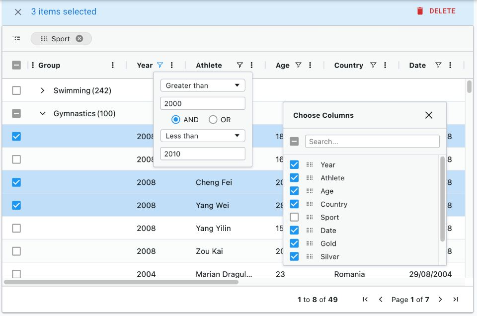

# CRUD pages

Most admin and B2B apps start with a few basic screens to manipulate records:

- A list page, including the ability to filter, paginate and sort the records
- A read-only page, displaying the record details
- An edition page, allowing to update the record via a form
- A creation page

We call this type of interface a "CRUD" interface because it allows us to Create, Read, Update and Delete records.

React-admin started as an engine to generate such CRUD interfaces, and it still does it very well. **Building CRUD interfaces with react-admin requires little to no effort**, and it's very easy to customize them.

<video controls autoplay playsinline muted loop width="100%">
  <source src="./img/CRUD.webm" type="video/webm" />
  <source src="./img/CRUD.mp4" type="video/mp4" />
  Your browser does not support the video tag.
</video>

## Page Components

React-admin provides page components for CRUD operations:

- [`<List>`](./ListTutorial.md) displays a list of records
- [`<Show>`](./Show.md) displays a record in read-only mode
- [`<Edit>`](./EditTutorial.md) displays a form to edit a record
- [`<Create>`](./Create.md) displays a form to create a record

Each of these components reads the parameters from the URL, fetches the data from the data provider, stores the data in a context, and renders its child component.

For example, to display a list of posts, you would use the `<List>` component:

```jsx
import { List, Datagrid, TextField } from 'react-admin';

const PostList = () => (
    <List resource="posts">
        <Datagrid>
            <TextField source="id" />
            <TextField source="title" />
            <TextField source="body" />
        </Datagrid>
    </List>
);
```

Here, the `<List>` component will call `dataProvider.getList('posts')` to fetch the list of posts, and create a `ListContext` to store the data. The `<Datagrid>` component will read the data from that `ListContext` and render a row for each post. That's why there is no need to explicitly pass the data to the `<Datagrid>` component.

## Page Context

`<List>` and other page component don't just fetch data: they provide the way to update the page settings:

- Sort field and order
- Current page & page size
- Filters
- Record selection

The [`ListContext`](./useListContext.md) exposes callbacks to update these settings, and `<List>`'s children components like `<Datagrid>` use these callbacks to update the data.

```jsx
const listContext = useListContext();
const {
    // Data
    data, // Array of the list records, e.g. [{ id: 123, title: 'hello world' }, { ... }
    total, // Total number of results for the current filters, excluding pagination. Useful to build the pagination controls, e.g. 23      
    meta, // Additional information about the list, like facets & statistics
    isPending, // Boolean, true until the data is available
    isFetching, // Boolean, true while the data is being fetched, false once the data is fetched
    isLoading, // Boolean, true until the data is fetched for the first time
    // Pagination
    page, // Current page. Starts at 1
    perPage, // Number of results per page. Defaults to 25
    setPage, // Callback to change the page, e.g. setPage(3)
    setPerPage, // Callback to change the number of results per page, e.g. setPerPage(25)
    hasPreviousPage, // Boolean, true if the current page is not the first one
    hasNextPage, // Boolean, true if the current page is not the last one
    // Sorting
    sort, // Sort object { field, order }, e.g. { field: 'date', order: 'DESC' }
    setSort, // Callback to change the sort, e.g. setSort({ field: 'name', order: 'ASC' })
    // Filtering
    filterValues, // Dictionary of filter values, e.g. { title: 'lorem', nationality: 'fr' }
    displayedFilters, // Dictionary of displayed filters, e.g. { title: true, nationality: true }
    setFilters, // Callback to update the filters, e.g. setFilters(filters, displayedFilters)
    showFilter, // Callback to show one of the filters, e.g. showFilter('title', defaultValue)
    hideFilter, // Callback to hide one of the filters, e.g. hideFilter('title')
    // Record selection
    selectedIds, // Array listing the ids of the selected records, e.g. [123, 456]
    onSelect, // Callback to change the list of selected records, e.g. onSelect([456, 789])
    onToggleItem, // Callback to toggle the record selection for a given id, e.g. onToggleItem(456)
    onUnselectItems, // Callback to clear the record selection, e.g. onUnselectItems();
    // Misc
    defaultTitle, // Translated title based on the resource, e.g. 'Posts'
    resource, // Resource name, deduced from the location. e.g. 'posts'
    refetch, // Callback for fetching the list data again
} = listContext;
```

## The List Page

Children of the  `<List>` component display a list of records, and let users change the list parameters. You can learn more in the [List Tutorial](./ListTutorial.md).

You can use any of the following components to build the list page:

### List iterators

<table><tbody>
<tr style="border:none">
    <td style="width:50%;border:none;text-align:center">
        <a title="<Datagrid>" href="./Datagrid.html">
            
        </a>
        <a href="./Datagrid.html" style="display: block;transform: translateY(-10px);"><code>&lt;Datagrid&gt;</code></a>
    </td>
    <td style="width:50%;border:none;text-align:center">
         <a title="<DatagridAG>" href="./DatagridAG.html">
            
        </a>
        <a href="./DatagridAG.html" style="display: block;transform: translateY(-10px);"><code>&lt;DatagridAG&gt;</code></a>
    </td>
</tr>
<tr style="border:none;background-color:#fff;">
    <td style="width:50%;border:none;text-align:center">
        <a title="SimpleList" href="./SimpleList.html">
            
        </a>
        <a href="./SimpleList.html" style="display: block;transform: translateY(-10px);"><code>&lt;SimpleList&gt;</code></a>
    </td>
    <td style="width:50%;border:none;text-align:center">
        <a title="Calendar" href="./Calendar.html">
            
        </a>
        <a href="./Calendar.html" style="display: block;transform: translateY(-10px);"><code>&lt;Calendar&gt;</code></a>
    </td>
</tr>
</tbody></table>

### Filter components

<table><tbody>
<tr style="border:none">
    <td style="width:50%;border:none;text-align:center">
        <a title="Filter Button/Form Combo" href="./FilteringTutorial.html#the-filter-buttonform-combo">
            
        </a>
        <a href="./FilteringTutorial.html#the-filter-buttonform-combo" style="display: block;transform: translateY(-10px);">Filter Button/Form Combo</a>
    </td>
    <td style="width:50%;border:none;text-align:center">
        <a title="FilterList sidebar" href="./FilteringTutorial.html#the-filterlist-sidebar">
            
        </a>
        <a href="./FilteringTutorial.html#the-filterlist-sidebar" style="display: block;transform: translateY(-10px);"><code>&lt;FilterList&gt;</code> Sidebar</a>
    </td>
</tr>
<tr style="border:none;background-color:#fff;">
    <td style="width:50%;border:none;text-align:center">
        <a title="Stacked Filters" href="./FilteringTutorial.html#the-stackedfilters-component">
            
        </a>
        <a href="./FilteringTutorial.html#the-stackedfilters-component" style="display: block;transform: translateY(-10px);"><code>&lt;StackedFilters&gt;</code> Dialog</a>
    </td>
    <td style="width:50%;border:none;text-align:center;vertical-align:top;">
            <a title="<Search> input" href="./FilteringTutorial.html#global-search">
            
        </a>
        <a href="./FilteringTutorial.html#global-search" style="display: block;transform: translateY(-10px);">Global <code>&lt;Search&gt;</code></a>
    </td>
</tr>
</tbody></table>

### Buttons

- [`<EditButton>`](./Buttons.md#editbutton): Go to the edit page for a record
- [`<EditInDialogButton>`](./EditInDialogButton.md): Edit a record in a dialog
- [`<ExportButton>`](./Buttons.md#exportbutton): A button to export the list data
- [`<CreateButton>`](./Buttons.md#createbutton): A button to create a new record
- [`<SortButton>`](./SortButton.md): A button to sort the list
- [`<SelectColumnsButton>`](./SelectColumnsButton.md): A button to select the columns to display in a Datagrid
- [`<BulkUpdateButton>`](./Buttons.md#bulkupdatebutton): A button to update selected records
- [`<BulkDeleteButton>`](./Buttons.md#bulkdeletebutton): A button to delete selected records
- [`<ListActions>`](./ListActions.md): A toolbar with a create and an export button

### Misc

- [`<Pagination>`](./Pagination.md): Renders the page count, and buttons to navigate to the previous and next pages
- [`<SavedQueriesList>`](./SavedQueriesList.md): Lets user save a combination of filters

### Alternatives to List

You can also use specialized alternatives to the `<List>` component, which offer type-specific features:

- [`<TreeWithDetails>`](./TreeWithDetails.md): A tree view with a detail view for each node
- [`<CompleteCalendar>`](./CompleteCalendar.md): A calendar view for events
- [`<InfiniteList>`](./InfiniteList.md): A list with infinite scrolling

## The Show Page

Children of the `<Show>` component display a record in read-only mode. You can learn more in the [Show Tutorial](./ShowTutorial.md).

You can use any of the following components to build the show page:

### Show Layouts

<table><tbody>
<tr style="border:none">
    <td style="width:50%;border:none;text-align:center">
        <a title="<SimpleShowLayout>" href="./SimpleShowLayout.html">
            
        </a>
        <a href="./SimpleShowLayout.html" style="display: block;transform: translateY(-10px);"><code>&lt;SimpleShowLayout&gt;</code></a>
    </td>
    <td style="width:50%;border:none;text-align:center">
         <a title="<TabbedShowLayout>" href="./TabbedShowLayout.html">
            
        </a>
        <a href="./TabbedShowLayout.html" style="display: block;transform: translateY(-10px);"><code>&lt;TabbedShowLayout&gt;</code></a>
    </td>
</tr>
</tbody></table>

Inside these show layouts, you can use any of react-admin's [Field components](./Fields.md) to display the record data.

### Buttons

- [`<EditButton>`](./Buttons.md#editbutton): Go to the edit page for a record
- [`<CreateButton>`](./Buttons.md#createbutton): A button to create a new record
- [`<ListButton>`](./Buttons.md#listbutton): Go to the list page for a record
- [`<CloneButton>`](./Buttons.md#clonevutton): Clone a record

### Misc

- [`<Labeled>`](./Labeled.md): A component to display a field with a label

## The Edit & Create Pages

Children of the `<Edit>` and `<Create>` components display a form to edit or create a record. You can learn more in the [Edit Tutorial](./EditTutorial.md).

You can use any of the following components to build the edit and create pages:

### Form Layouts

React-admin provides several form components to help you build forms with different layouts:

<figure>
    <svg xmlns="http://www.w3.org/2000/svg" viewBox="0 0 1179 620" preserveAspectRatio="xMinYMin meet">
        <image width="1179" height="620" xlink:href="./img/form-layouts.png" />
        <g opacity="0">
            <a href="./Form.html" aria-label="Form">
                <rect x="0" y="0" width="348" height="290"/>
            </a>
        </g>
        <g opacity="0">
            <a href="./SimpleForm.html" aria-label="SimpleForm">
                <rect x="373" y="0" width="408" height="290"/>
            </a>
        </g>
        <g opacity="0">
            <a href="./TabbedForm.html" aria-label="TabbedForm">
                <rect x="801" y="0" width="376" height="290"/>
            </a>
        </g>
        <g opacity="0">
            <a href="./AccordionForm.html" aria-label="AccordionForm">
                <rect x="0" y="330" width="348" height="290"/>
            </a>
        </g>
        <g opacity="0">
            <a href="./WizardForm.html" aria-label="WizardForm">
                <rect x="373" y="330" width="408" height="290"/>
            </a>
        </g>
        <g opacity="0">
            <a href="./LongForm.html" aria-label="LongForm">
                <rect x="801" y="330" width="376" height="290"/>
            </a>
        </g>
    </svg>
</figure>

Inside these form layouts, you can use any of react-admin's [Input components](./Inputs.md) to edit the record data.

### Buttons

- [`<ShowButton>`](./Buttons.md#showbutton): Go to the show page for a record
- [`<SaveButton>`](./SaveButton.md): The submit button for the form
- [`<CloneButton>`](./Buttons.md#clonevutton): Clone a record

### Misc

- [`<Toolbar>`](./Toolbar.md): Customize the form toolbar
- [`<JsonSchemaForm>`](./JsonSchemaForm.md): A form based on a JSON schema
- [`<AutoSave>`](./AutoSave.md): Automatically save the form

## CRUD Routing

You could declare the CRUD routes manually using react-router's `<Route>` component. But it's such a common pattern that react-admin provides a shortcut: the [`<Resource>`](./Resource.md) component.

```jsx
<Resource
    name="posts"
    list={PostList}     // maps PostList to /posts
    show={PostShow}     // maps PostShow to /posts/:id/show
    edit={PostEdit}     // maps PostEdit to /posts/:id
    create={PostCreate} // maps PostCreate to /posts/create
/>
```

This is the equivalent to the following react-router configuration:

```jsx
<ResourceContextProvider value="posts">
    <Route path="/posts" element={<PostList />} />
    <Route path="/posts/:id/show" element={<PostShow />} />
    <Route path="/posts/:id" element={<PostEdit />} />
    <Route path="/posts/create" element={<PostCreate />} />
</ResourceContextProvider>
```

`<Resource>` defines a `ResourceContext` storing the current resource `name`. This context is used by the `<List>`, `<Edit>`, `<Create>`, and `<Show>` components to determine the resource they should fetch. So when declaring page components with `<Resource>`, you don't need to pass the `resource` prop to them.

```diff
import { List, Datagrid, TextField } from 'react-admin';

const PostList = () => (
-   <List resource="posts">
+   <List>
        <Datagrid>
            <TextField source="id" />
            <TextField source="title" />
            <TextField source="body" />
        </Datagrid>
    </List>
);
```

Check [the `<Resource>` documentation](./Resource.md) to learn more about routing and resource context.

## Guessers & Scaffolding

When mapping a new API route to a CRUD view, adding fields one by one can be tedious. React-admin provides a set of guessers that can automatically **generate a complete CRUD UI based on an API response**.

For instance, the following code will generate a complete CRUD UI for the `users` resource:

```jsx
import { Admin, Resource, ListGuesser, EditGuesser, ShowGuesser } from 'react-admin';

const App = () => (
    <Admin dataProvider={dataProvider}>
        <Resource name="users" list={ListGuesser} edit={EditGuesser} show={ShowGuesser} />
    </Admin>
);
```

Guesser components start by fetching data from the API, analyzing the shape of the response, then picking up Field and Input components that match the data type. They also dump the generated code in the console, to let you start customizing the UI.


Check the following components to learn more about guessers:

- [`<ListGuesser>`](./ListGuesser.md)
- [`<EditGuesser>`](./EditGuesser.md)
- [`<ShowGuesser>`](./ShowGuesser.md)

## Headless Variants

`<List>` and other page components render their children (e.g., `<Datagrid>`) in a page layout. This layout contains a page title (e.g., "Posts"), toolbars for action buttons & filters, a footer for pagination, and a side column.

But sometimes you want to use the list data in a different layout, without the page title and toolbar, or with a different UI kit. For these use cases, you can use the headless variants of the page components, which come in two flavors:

- **Hook**: `useListController`, `useEditController`, `useCreateController`, `useShowController`
- **Component**: `<ListBase>`, `<ShowBase>`, `<EditBase>`, `<CreateBase>`

For instance, to use the list data in a custom layout, you can use the `useListController` hook:

```jsx
import { useListController } from 'react-admin';

const MyList = () => {
    const { data, ids, total } = useListController({ resource: 'posts' });
    return (
        <div>
            <h1>Posts</h1>
            <ul>
                {ids.map(id => (
                    <li key={id}>{data[id].title}</li>
                ))}
            </ul>
            <p>Total: {total}</p>
        </div>
    );
};
```

If you want to use react-admin components, prefer the Base components, which call the hooks internally and store the values in a context:

```jsx
import { ListBase, Datagrid, TextField } from 'react-admin';

const MyList = () => (
    <ListBase resource="posts">
        <Datagrid>
            <TextField source="id" />
            <TextField source="title" />
            <TextField source="body" />
        </Datagrid>
    </ListBase>
);
```
