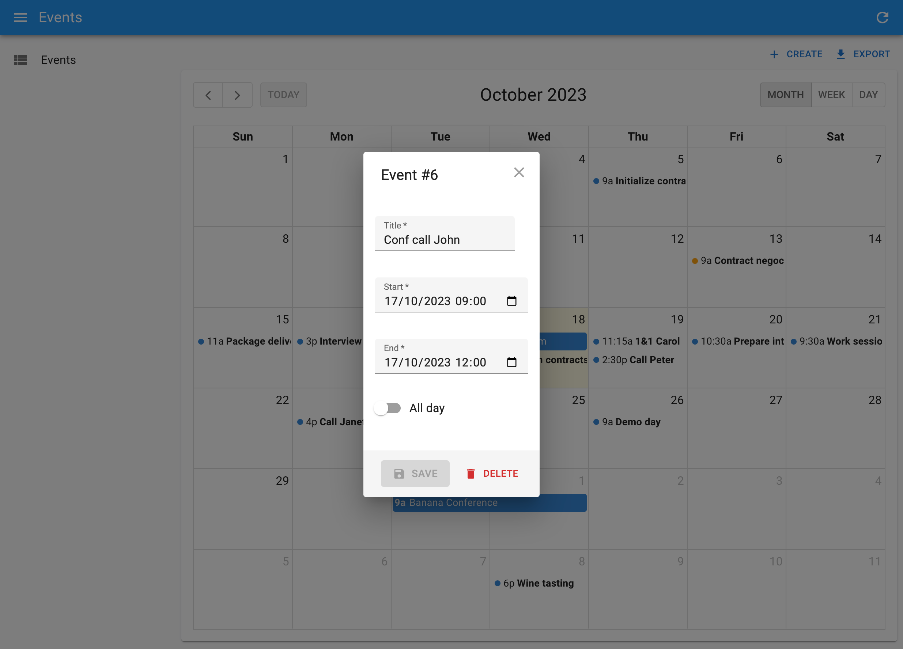

# `<Calendar>`

This [Enterprise Edition](https://marmelab.com/ra-enterprise) component, part of [the `ra-calendar` module](https://marmelab.com/ra-enterprise/modules/ra-calendar), renders a list of events as a calendar. 

<video controls autoplay playsinline muted loop>
  <source src="https://marmelab.com/ra-enterprise/modules/assets/ra-calendar.webm" type="video/webm" />
  <source src="https://marmelab.com/ra-enterprise/modules/assets/ra-calendar.mp4" type="video/mp4" />
  Your browser does not support the video tag.
</video>

The user interface offers everything you expect:

- month, week, day views
- list view
- drag and resize events
- whole-day events
- creating an event by clicking in the calendar
- edition of event title, and metadata
- events spanning on multiple days
- recurring events
- background events
- theming
- locales and timezones
- resource time grid (e.g. rooms) (requires additional licence from Full Calendar)

## Usage

React-admin provides 2 components for viewing and editing events in a calendar: `<CompleteCalendar>` and `<Calendar>`.

`<CompleteCalendar>` is an all-in one component that renders a calendar, as well as a dialog with an event form when users want to edit or create an event. 



`<CompleteCalendar>` is a full replacement for the `<List>` component, expecting an event form as child:

```jsx
// in src/events/EventList.tsx
import { CompleteCalendar } from '@react-admin/ra-calendar';
import { SimpleForm, TextInput, DateTimeInput } from 'react-admin';

export const EventList = () => (
    <CompleteCalendar>
        <SimpleForm>
            <TextInput source="title" autoFocus />
            <DateTimeInput source="start" />
            <DateTimeInput source="end" />
        </SimpleForm>
    </CompleteCalendar>
);
```

Use it as the `list` prop of a `<Resource>`. No need to specify an `edit` or `create` prop for this resource, as `<CompleteCalendar>` will the edit and create forms in a dialog. 

```jsx
import { Admin, Resource } from 'react-admin';

import dataProvider from './dataProvider';
import { EventList } from './events/EventList.tsx';

export const App = () => (
    <Admin dataProvider={dataProvider}>
        <Resource name="events" list={EventList} />
    </Admin>
);
```

`<Calendar>`, on the other hand, doesn't render the event form in a dialog. Instead, it redirects to the Edition or Creation pages when users click on an event or the Create button.

<video controls autoplay playsinline muted loop>
  <source src="./img/calendar.mp4" type="video/mp4" />
  Your browser does not support the video tag.
</video>

`<Calendar>` must be used as a child of react-admin's `<List>` component:

```jsx
// in src/events/EventList.tsx
import { Calendar, getFilterValuesFromInterval } from '@react-admin/ra-calendar';
import { List } from 'react-admin';

export const EventList = () => (
    <List
        filterDefaultValues={getFilterValuesFromInterval()}
        perPage={1000}
        pagination={false}
    >
        <Calendar />
    </List>
);
```

To allow creation and edition of events with `<Calendar>`, you must provide `edit` and `create` components to the event resource:

```jsx
import { Admin, Resource } from 'react-admin';

import dataProvider from './dataProvider';
import { EventList, EventEdit, EventCreate } from './events';

export const App = () => (
    <Admin dataProvider={dataProvider}>
        <Resource 
            name="events"
            list={EventList}
            edit={EventEdit}
            create={EventCreate}
        />
    </Admin>
);
```

Both `<CompleteCalendar>` and `<Calendar>` expect the dataProvider to return events in a predefined format (see [Event format](#events-format) below). 

## Events Format

The calendar can display a list of _Events_. Events must be resources with at least a string `id`, a `title`, and a `start` date. Here is a typical event:

```js
{
    id: '432646',
    title: 'Package delivery',
    start: '2020-10-20T08:00:00.000Z',
    end: '2020-10-20T09:30:00.000Z',
},
```

That means that in order to be able to use `ra-calendar`, your `dataProvider` must return event-like objects for at least one resource. In case your event records don't exactly match this format, ra-calendar allows to specify [a function to convert records to Events](#converttoevent).

Events can have many more fields, e.g. for recurrent events, groups, colors, etc. Check the [Event format on the Full Calendar documentation](https://fullcalendar.io/docs/event-parsing).

In addition, the calendar queries a list of events in a time interval. Your dataProvider must support `getList()` queries with an interval filter. By default, the interval filter looks like the following:

```js
{
    // lower time boundary (gte stands for 'greater than or equal')
    start_gte: '2020-10-01T00:00:00.000Z',
    // upper time boundary (lte stands for 'less than or equal')
    start_lte: '2020-12-31T23:59:59.000Z'
}
```

The `ra-calendar` provides [a function to transform the display interval into a dataProvider filter](#getfiltervaluesfrominterval).

## `<CompleteCalendar>`

This all-in one component renders a calendar, as well as a form to edit or create new events that opens in a dialog. It is deeply integrated with react-admin, and benefits from the same speed optimizations.

Use it as the `list` prop of a `<Resource>`. No need to specify an `edit` or `create` prop for this resource, but you'll have to pass a form component (like `<SimpleForm>`) as child of `<CompleteCalendar>` to define the event edition form.

Here is an example:

```tsx
import React from 'react';
import {
    Admin,
    Resource,
    List,
    SimpleForm,
    TextInput,
    DateTimeInput,
} from 'react-admin';
import { CompleteCalendar } from '@react-admin/ra-calendar';

import dataProvider from './dataProvider';

const EventList = () => (
    <CompleteCalendar>
        <SimpleForm>
            <TextInput source="title" autoFocus />
            <DateTimeInput source="start" />
            <DateTimeInput source="end" />
        </SimpleForm>
    </CompleteCalendar>
);

export const Basic = () => (
    <Admin dataProvider={dataProvider}>
        <Resource name="events" list={EventList} />
    </Admin>
);
```

### `ListProps`

`<CompleteCalendar>` renders a react-admin `<List>` element, that you can customize by specifying a `ListProps` prop.

For instance, to limit the number of events fetched from the server to 100 (instead of the default 1000), you can override the `<List perPage>` prop as follows:


```tsx
import React from 'react';
import { DateTimeInput, SimpleForm, TextInput } from 'react-admin';
import { CompleteCalendar } from '@react-admin/ra-calendar';

const EventList = () => (
    <CompleteCalendar
        ListProps={{
            perPage: 100,
        }}
    >
        <SimpleForm>
            <TextInput source="title" />
            <DateTimeInput source="start" />
            <DateTimeInput source="end" />
        </SimpleForm>
    </CompleteCalendar>
);
```


Check the possible values for `ListProps` in [the `<List>` component documentation](./List.md).

### `CalendarProps`

Under the hood, `<CompleteCalendar>` renders a `<Calendar>` element, which is a react-admin wrapper for Full Calendar. You can customize all the [`<Calendar>`](#calendar) and [`FullCalendar`](https://fullcalendar.io/docs#toc) props by passing a `CalendarProps` prop.

For instance, to set a French locale, map non-standard event records to the expected Event type, and define boundaries to the possible events:


```tsx
import React from 'react';
import { DateTimeInput, SimpleForm, TextInput } from 'react-admin';
import { CompleteCalendar } from '@react-admin/ra-calendar';
import frLocale from '@fullcalendar/core/locales/fr';
import { EventInput } from '@fullcalendar/core';

const EventList = () => (
    <CompleteCalendar
        CalendarProps={{
            locale: frLocale,
            convertToEvent: (event: any): EventInput => ({
                id: String(event.id),
                title: event.name,
                start: event.begin,
                end: event.finish,
                backgroundColor: colorForCategory(event.category),
                borderColor: colorForCategory(event.category),
                editable: event.can_edit,
                url: `https://meet.jit.si/${event.jitsi_meet_id}`,
            }),
            validRange: {
                start: '2017-05-01',
                end: '2017-06-01',
            },
        }}
    >
        <SimpleForm>
            <TextInput source="title" />
            <DateTimeInput source="start" />
            <DateTimeInput source="end" />
        </SimpleForm>
    </CompleteCalendar>
);
```


Check the possible values for `CalendarProps` in the [`<Calendar>`](#calendar) and [`<FullCalendar>`](https://fullcalendar.io/docs#toc) documentation.

### `EditDialogProps`

For content edition, `<CompleteCalendar>` relies on [ra-form-layout's `<EditDialog>`](https://marmelab.com/ra-enterprise/modules/ra-form-layout#createdialog--editdialog) to display its child form in a dialog.

You can customize `<EditDialog>` props like `title`, `redirect`, `onSuccess` and `onFailure` by passing a custom `EditDialogProps` prop.

For instance, to customize the title of the Edit dialog:


```tsx
import React from 'react';
import { DateTimeInput, SimpleForm, TextInput, useRecordContext } from 'react-admin';
import { CompleteCalendar } from '@react-admin/ra-calendar';

const EventEditTitle = () => {
    const record = useRecordContext();
    return <span>Edit {record ? `"${record.title}"` : ''}</span>;
}

const EventList = () => (
    <CompleteCalendar
        EditDialogProps={{
            title: <EventEditTitle />,
        }}
    >
        <SimpleForm>
            <TextInput source="title" />
            <DateTimeInput source="start" />
            <DateTimeInput source="end" />
        </SimpleForm>
    </CompleteCalendar>
);
```


Check the possible values for `EditDialogProps` in [the `<EditDialog>` component documentation](https://marmelab.com/ra-enterprise/modules/ra-form-layout#createdialog--editdialog).

### `CreateDialogProps`

For content addition, `<CompleteCalendar>` relies on [ra-form-layout's `<CreateDialog>`](https://marmelab.com/ra-enterprise/modules/ra-form-layout#createdialog--editdialog) to display its child form in a dialog.

You can customize `<CreateDialog>` props like `title`, `redirect`, `onSuccess` and `onFailure` by passing a custom `CreateDialogProps` prop.

For instance, to customize the title of the Creation dialog:


```tsx
import React from 'react';
import { DateTimeInput, SimpleForm, TextInput } from 'react-admin';
import { CompleteCalendar } from '@react-admin/ra-calendar';

const EventList = () => (
    <CompleteCalendar
        CreateDialogProps={{
            title: () => <span>Create new appointment</span>,
        }}
    >
        <SimpleForm>
            <TextInput source="title" />
            <DateTimeInput source="start" />
            <DateTimeInput source="end" />
        </SimpleForm>
    </CompleteCalendar>
);
```


Check the possible values for `CreateDialogProps` in [the `<CreateDialog>` component documentation](https://marmelab.com/ra-enterprise/modules/ra-form-layout#createdialog--editdialog).

### `mutationOptions`

An options object used for the event mutation when it's updated or created by the underlying `<Calendar>`, `<EditDialog>`, and `<CreateDialog>` components. Use it to set custom side effects for all the mutations performed by the calendar.

The `mutationOptions` prop provided directly through `CalendarProps`, `EditDialogProps` or `CreateDialogProps` will take precedence.



```tsx
import React, { ComponentProps } from 'react';
import { List, useNotify } from 'react-admin';
import { CompleteCalendar } from '@react-admin/ra-calendar';

const EventList = () => {
    const notify = useNotify();

    const handleError = err => {
        notify(err.message, 'error');
    };

    return (
        <CompleteCalendar mutationOptions={{ onError: handleError }}>
            <SimpleForm>
                <TextInput source="title" autoFocus />
                <DateTimeInput source="start" />
                <DateTimeInput source="end" />
            </SimpleForm>
        </CompleteCalendar>
    );
};
```



### `transform`

A function that receives the event from `full-calendar` and returns the data that should be sent to the `dataProvider` method. It affects the create and edit dialogs, and the `Calendar` itself.

The `transform` prop provided directly through `CalendarProps`, `EditDialogProps` or `CreateDialogProps` will take precedence.

```tsx
import React, { ComponentProps } from 'react';
import { List } from 'react-admin';
import { Calendar } from '@react-admin/ra-calendar';

const EventList = () => {
    const handleTransform = eventData => {
        return { ...eventData, customParameter: true };
    };

    return (
        <CompleteCalendar transform={handleTransform}>
            <SimpleForm>
                <TextInput source="title" autoFocus />
                <DateTimeInput source="start" />
                <DateTimeInput source="end" />
            </SimpleForm>
        </CompleteCalendar>
    );
};
```

## `<Calendar>`

A wrapper around full-calendar's `<FullCalendar>` component, using react-admin's `useListContext` hook to read data, and linking to the edit and create views of the current resource. Must be used inside a `<ListContext>`.

Use this component as a child of `<List>`, as follows:

```tsx
import {
    Admin,
    Resource,
    List,
    Edit,
    EditProps,
    Create,
    CreateProps,
    SimpleForm,
    TextInput,
    DateTimeInput,
} from 'react-admin';
import {
    Calendar,
    getFilterValuesFromInterval,
} from '@react-admin/ra-calendar';

const EventList = () => (
    <List
        filterDefaultValues={getFilterValuesFromInterval()}
        perPage={1000}
        pagination={false}
    >
        <Calendar />
    </List>
);

const EventEdit = () => (
    <Edit>
        <SimpleForm>
            <TextInput source="title" />
            <DateTimeInput source="start" />
            <DateTimeInput source="end" />
        </SimpleForm>
    </Edit>
);

const EventCreate = () => (
    <Create>
        <SimpleForm>
            <TextInput source="title" />
            <DateTimeInput source="start" />
            <DateTimeInput source="end" />
        </SimpleForm>
    </Create>
);

export const App = () => (
    <Admin dataProvider={dataProvider}>
        <Resource
            name="events"
            list={EventList}
            edit={EventEdit}
            create={EventCreate}
        />
    </Admin>
);
```

In this example, the `<List>` is initialized to load at most 1000 events, in a 3-months interval around the current date.

Props passed to the `<Calendar>` element are passed down to an underlying `<FullCalendar>` element, so you can set every [Full Calendar options](https://fullcalendar.io/docs#toc) via the `<Calendar>` props. For instance, to customize the content rendered for each event, use [the `eventContent` prop](https://fullcalendar.io/docs/event-render-hooks):

```tsx
<Calendar
    eventContent={(eventContent: EventContentArg): JSX.Element => (
        <>
            <b>{eventContent.timeText}</b> <i>{eventContent.event.title}</i>
        </>
    )}
/>
```

In addition to Full Calendar props, `ra-calendar`'s `<Calendar>` supports a few more additional props, documented below.

### `locale`

The `locale` and `locales` options allow you to localize certain aspects of the calendar:

- the text in buttons, as defined by headerToolbar
- text that contains month or day-of-week strings
- date formatting, such as eventTimeFormat
- weekNumberCalculation
- firstDay

If your admin uses only one locale, import the localization from `@fullcalendar/core/locales`, and pass it as `locale`:

```tsx
import { List } from 'react-admin';
import {
    Calendar,
    getFilterValuesFromInterval,
} from '@react-admin/ra-calendar';
import frLocale from '@fullcalendar/core/locales/fr';

const EventList = () => (
    <List
        filterDefaultValues={getFilterValuesFromInterval()}
        perPage={1000}
        pagination={false}
    >
        <Calendar locale={frLocale} />
    </List>
);
```

If your admin can have a finite number of locales, load them all in the `locales` prop, and set the initial locale via the `locale` prop:

```tsx
import { List } from 'react-admin';
import {
    Calendar,
    getFilterValuesFromInterval,
} from '@react-admin/ra-calendar';
import esLocale from '@fullcalendar/core/locales/es';
import frLocale from '@fullcalendar/core/locales/fr';

const EventList = () => (
    <List
        filterDefaultValues={getFilterValuesFromInterval()}
        perPage={1000}
        pagination={false}
    >
        <Calendar locales={[esLocale, frLocale]} locale="fr" />
    </List>
);
```

**Tip:** You don't need to load the `'en'` locale as it is already loaded by default.

If you'd like the calendar to use the same locale as the rest of your admin, simply use the locale provided by [`useLocaleState`](./useLocaleState.md):

```tsx
import { List, useLocaleState } from 'react-admin';
import {
    Calendar,
    getFilterValuesFromInterval,
} from '@react-admin/ra-calendar';
import esLocale from '@fullcalendar/core/locales/es';
import frLocale from '@fullcalendar/core/locales/fr';

const EventList = () => {
    const [locale] = useLocaleState();
    return (
        <List
            filterDefaultValues={getFilterValuesFromInterval()}
            perPage={1000}
            pagination={false}
        >
            <Calendar locales={[esLocale, frLocale]} locale={locale} />
        </List>
    )
};
```

And if you want to support all locales and initialize the calendar based on the user navigator preferences, use ra-calendar's `getNavigatorLanguage()` helper:

```tsx
import { List } from 'react-admin';
import {
    Calendar,
    getFilterValuesFromInterval,
    getNavigatorLanguage,
} from '@react-admin/ra-calendar';
import allLocales from '@fullcalendar/core/locales-all';

const EventList = () => (
    <List
        filterDefaultValues={getFilterValuesFromInterval()}
        perPage={1000}
        pagination={false}
    >
        <Calendar locales={allLocales} locale={getNavigatorLanguage()} />
    </List>
);
```

Note that using `allLocales` make the JS bundle significantly larger - avoid it if you only need to support a few locales.

### `getFilterValuesFromInterval`

The `getFilterValuesFromInterval()` function returns filter values based on the interval displayed on the screen (e.g. the current mont, the current week, etc.). `ra-calendar` does its best to minimize queries to the `dataProvider` by requesting a 3 months interval by default (1 month before the current day, and 2 months after). You can change that behavior, and transform the `filter` object sent to the `dataProvider.getList()` method, by passing your own `getFilterValueFromInterval` prop:

```tsx
import { List } from 'react-admin';
import { Calendar } from '@react-admin/ra-calendar';
import { DatesSetArg } from '@fullcalendar/core';
import { add, sub, set } from 'date-fns';

/**
 * By default, return an interval of 3 months around now (1 month before, 2 months after)
 * unless the user requires a larger interval.
 *
 * This minimizes queries while navigating.
 */
const customGetFilterValues = (
    dateInfo?: DatesSetArg,
    filterValues: any = {}
): any => {
    const now = set(new Date(), {
        hours: 0,
        minutes: 0,
        seconds: 0,
        milliseconds: 0,
    });
    const nowMinus1Month = sub(now, { months: 1 });
    const nowPlus2Months = add(now, { months: 2 });
    return !dateInfo ||
        (dateInfo.start > nowMinus1Month && dateInfo.end < nowPlus2Months)
        ? {
              ...filterValues,
              start_gte: nowMinus1Month.toISOString(),
              start_lte: nowPlus2Months.toISOString(),
          }
        : {
              ...filterValues,
              start_gte: dateInfo.startStr,
              start_lte: dateInfo.endStr,
          };
};

const EventList = () => (
    <List
        filterDefaultValues={customGetFilterValues()}
        perPage={1000}
        pagination={false}
    >
        <Calendar getFilterValueFromInterval={customGetFilterValues} />
    </List>
);
```

**Note:** You have to pass `customGetFilterValues` both to the `<List>` and the `<Calendar>` component. Indeed, the first is called without parameters, and is only used to initialize a default filter in the List context, in order to limit the number of events fetched. The latter is the actual filter that will be updated according to the `<Calendar>`'s current view.

### `convertToEvent`

Full Calendar accepts [many properties](https://fullcalendar.io/docs/event-parsing) for events, like `allDay`, `backgroundColor`, `url`, `editable`, etc. If you build an admin for an existing API, your events structure will probably not match that shape. In that case, use the `convertToEvent` prop to convert records of arbitrary shape to the Full Calendar event format.

For instance, let's say your `dataProvider` returns records like the following:

```json
{
    "id": 8,
    "name": "Interview Helen",
    "begin": "2020-04-23 11:30:00",
    "finish": "2020-04-23 12:00:00",
    "category": "job_interview",
    "can_edit": false,
    "jitsi_meet_id": "CynicalOxygensContainOut"
}
```

Full Calendar won't work unless you convert these rcords to events looking like the following:

```json
{
    "id": 8,
    "name": "Interview Helen",
    "begin": "2020-04-23 11:30:00",
    "finish": "2020-04-23 12:00:00",
    "backgroundColor": "orange",
    "borderColor": "orange",
    "editable": false,
    "url": "https://meet.jit.si/CynicalOxygensContainOut"
}
```

Pass a convertion function as the `convertToEvent` prop of the `<Calendar>` element:

```tsx
import { List } from 'react-admin';
import { Calendar } from '@react-admin/ra-calendar';
import { EventInput, DatesSetArg } from '@fullcalendar/core';

const converter = (event: any): EventInput => ({
    id: String(event.id),
    title: event.name,
    start: event.begin,
    end: event.finish,
    backgroundColor: colorForCategory(event.category),
    borderColor: colorForCategory(event.category),
    editable: event.can_edit,
    url: `https://meet.jit.si/${event.jitsi_meet_id}`,
});

const customGetFilterValues = (dateInfo?: DatesSetArg): any =>
    dateInfo
        ? {
              begin_gte: dateInfo.startStr,
              begin_lte: dateInfo.endStr,
          }
        : {
              begin_gte: new Date('2020-10-01'),
              begin_lte: new Date('2020-10-31'),
          };

const EventList = () => (
    <List
        filterDefaultValues={customGetFilterValues()}
        perPage={1000}
        pagination={false}
    >
        <Calendar
            convertToEvent={converter}
            getFilterValueFromInterval={customGetFilterValues}
        />
    </List>
);
```

### `mutationOptions`

An options object used for the event mutation when it has been resized or moved. Use it e.g. to override success or error side effects.



```tsx
import { List, useNotify } from 'react-admin';
import { Calendar } from '@react-admin/ra-calendar';

const EventList = () => {
    const notify = useNotify();

    const handleError = err => {
        notify(err.message, 'error');
    };

    return (
        <List perPage={1000} pagination={false}>
            <Calendar mutationOptions={{ onError: handleError }} />
        </List>
    );
};
```



### `transform`

A function that receives the event from `full-calendar` and return the data that should be sent to the `dataProvider` method:

```tsx
import { List } from 'react-admin';
import { Calendar } from '@react-admin/ra-calendar';

const EventList = () => {
    const handleTransform = eventData => {
        return { ...eventData, customParameter: true };
    };

    return (
        <List perPage={1000} pagination={false}>
            <Calendar transform={handleTransform} />
        </List>
    );
};
```

### `plugins`

FullCalendar offers a variety of [plugins](https://fullcalendar.io/docs/plugin-index), allowing to add more features to the calendar.

For instance, let's add the [`rrule` plugin](https://fullcalendar.io/docs/rrule-plugin), which will add support for recurring events.

To add a new plugin, you must first install it.

```sh
npm install --save @fullcalendar/rrule
# or
yarn add @fullcalendar/rrule
```

Then, import it in your app, and pass it to the `<Calendar>` component via the `plugins` prop.

**Tip:** `ra-calendar` already comes with pre-enabled plugins: `dayGridPlugin`, `timeGridPlugin` and `interactionPlugin`. You will probably want to include them too.

```tsx
import { List } from 'react-admin';
import { Calendar } from '@react-admin/ra-calendar';
import dayGridPlugin from '@fullcalendar/daygrid';
import timeGridPlugin from '@fullcalendar/timegrid';
import interactionPlugin from '@fullcalendar/interaction';
import rrulePlugin from '@fullcalendar/rrule';

const EventList = () => (
    <List perPage={1000} pagination={false}>
        <Calendar plugins={[ dayGridPlugin, timeGridPlugin, interactionPlugin, rrulePlugin ]} />
    </List>
);
```

That's it! You can now use the `rrule` plugin's features in your calendar.
