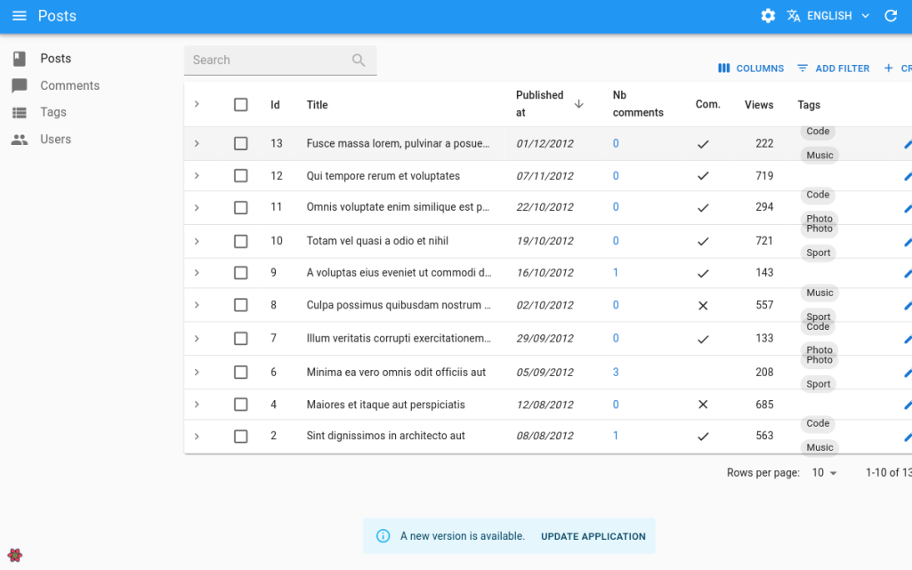

# `CheckForApplicationUpdate`

When your admin application is a Single Page Application, users who keep a browser tab open at all times might not use the most recent version of the application unless you tell them to refresh the page.

This component regularly checks whether the application source code has changed and prompts users to reload the page when an update is available. To detect updates, it fetches the current URL at regular intervals and compares the hash of the response content (usually the HTML source). This should be enough in most cases as bundlers usually update the links to the application bundles after an update.



## Usage

Include this component in a custom layout:

```tsx
// in src/MyLayout.tsx
import { CheckForApplicationUpdate, Layout, LayoutProps } from 'react-admin';

export const MyLayout = ({ children, ...props }: LayoutProps) => (
    <Layout {...props}>
        {children}
        <CheckForApplicationUpdate />
    </Layout>
);

// in src/App.tsx
import { Admin, ListGuesser, Resource } from 'react-admin';
import { MyLayout } from './MyLayout';

export const App = () => (
    <Admin layout={MyLayout}>
        <Resource name="posts" list={ListGuesser} />
    </Admin>
);
```

## Props

`<CheckForApplicationUpdate>` accepts the following props:

| Prop            | Required | Type     | Default            | Description                                                         |
| --------------- | -------- | -------- | ------------------ |-------------------------------------------------------------------- |
| `interval` | Optional | number   | `3600000` (1 hour) | The interval in milliseconds between two checks                     |
| `disabled`      | Optional | boolean  | `false` in `production` mode | Whether the automatic check is disabled                              |
| `notification`  | Optional | ReactElement |                    | The notification to display to the user when an update is available |
| `url`           | Optional | string   | current URL        | The URL to download to check for code update                        |

## `interval`

You can customize the interval between each check by providing the `interval` prop. It accepts a number of milliseconds and is set to `3600000` (1 hour) by default.

```tsx
// in src/MyLayout.tsx
import { CheckForApplicationUpdate, Layout, LayoutProps } from 'react-admin';

const HALF_HOUR = 30 * 60 * 1000;

export const MyLayout = ({ children, ...props }: LayoutProps) => (
    <Layout {...props}>
        {children}
        <CheckForApplicationUpdate interval={HALF_HOUR} />
    </Layout>
);
```

## `disabled`

You can dynamically disable the automatic application update detection by providing the `disabled` prop. By default, it's only enabled in `production` mode.

```tsx
// in src/MyLayout.tsx
import { CheckForApplicationUpdate, Layout, LayoutProps } from 'react-admin';

export const MyLayout = ({ children, ...props }: LayoutProps) => (
    <Layout {...props}>
        {children}
        <CheckForApplicationUpdate disabled={process.env.NODE_ENV !== 'production'} />
    </Layout>
);
```

## `notification`

You can customize the notification shown to users when an update is available by passing your own element to the `notification` prop.
Note that you must wrap your component with `forwardRef`.

```tsx
// in src/MyLayout.tsx
import { forwardRef } from 'react';
import { Layout, CheckForApplicationUpdate } from 'react-admin';

const CustomAppUpdatedNotification = forwardRef((props, ref) => (
    <Alert
        ref={ref}
        severity="info"
        action={
            <Button
                color="inherit"
                size="small"
                onClick={() => window.location.reload()}
            >
                Update
            </Button>
        }
    >
        A new version of the application is available. Please update.
    </Alert>
));

const MyLayout = ({ children, ...props }) => (
    <Layout {...props}>
        {children}
        <CheckForApplicationUpdate notification={<CustomAppUpdatedNotification />}/>
    </Layout>
);
```

If you just want to customize the notification texts, including the button, check out the [Internationalization section](#internationalization).

## `url`

You can customize the URL fetched to detect updates by providing the `url` prop. By default it's the current URL.

```tsx
// in src/MyLayout.tsx
import { CheckForApplicationUpdate, Layout, LayoutProps } from 'react-admin';

const MY_APP_ROOT_URL = 'http://admin.mycompany.com';

export const MyLayout = ({ children, ...props }: LayoutProps) => (
    <Layout {...props}>
        {children}
        <CheckForApplicationUpdate url={MY_APP_ROOT_URL} />
    </Layout>
);
```

## Internationalization

You can customize the texts of the default notification by overriding the following keys:

* `ra.notification.application_update_available`: the notification text
* `ra.action.update_application`: the reload button text