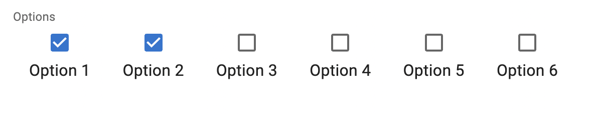

# `<CheckboxGroupInput>`

If you want to let the user choose multiple values among a list of possible values by showing them all, `<CheckboxGroupInput>` is the right component.

<video controls autoplay playsinline muted loop>
  <source src="./img/checkbox-group-input.webm" type="video/webm"/>
  <source src="./img/checkbox-group-input.mp4" type="video/mp4"/>
  Your browser does not support the video tag.
</video>


This input allows editing values that are arrays of scalar values, e.g. `[123, 456]`. 

**Tip**: React-admin includes other components allowing the edition of such values:

- [`<SelectArrayInput>`](./SelectArrayInput.md) renders a dropdown list of choices
- [`<AutocompleteArrayInput>`](./AutocompleteArrayInput.md) renders an autocomplete input of choices
- [`<DualListInput>`](./DualListInput.md) renders a list of choices that can be moved from one list to another

And if you are looking for a way to edit a list of embedded objects (e.g. `[{ id: 123, title: 'Hello' }, { id: 456, title: 'World' }]`), check the [`<ArrayInput>`](./ArrayInput.md) component.

## Usage

In addition to the `source`, `<CheckboxGroupInput>` requires one prop: the `choices` listing the possible values.

```jsx
import { CheckboxGroupInput } from 'react-admin';

<CheckboxGroupInput source="roles" choices={[
    { id: 'admin', name: 'Admin' },
    { id: 'u001', name: 'Editor' },
    { id: 'u002', name: 'Moderator' },
    { id: 'u003', name: 'Reviewer' },
]} />
```

By default, the possible choices are built from the `choices` prop, using:
  - the `id` field as the option value,
  - the `name` field as the option text

The form value for the source must be an array of the selected values, e.g.

```js
{
    id: 123,
    name: 'John Doe',
    roles: ['u001', 'u003'],
}
```

## Props

| Prop              | Required | Type                       | Default | Description                                                       |
| ----------------- | -------- | -------------------------- | ------- | ----------------------------------------------------------------- |
| `choices`         | Required | `Object[]`                 | -       | List of choices                                                   |
| `labelPlacement`  | Optional | `"bottom" `&#124;`"end"`&#124;`"start"`&#124;`"top" ` | `"end"` | The position of the checkbox label.    |
| `options`         | Optional | `Object`                   | -       | Props to pass to the Material UI `<CheckboxGroup>` component.             |
| `optionText`      | Optional | `string` &#124; `Function` | `name`  | Field name of record to display in the suggestion item or function which accepts the correct record as argument (`record => {string}`) |
| `optionValue`     | Optional | `string`                   | `id`    | Field name of record containing the value to use as input value   |
| `row`             | Optional | `boolean`                  | `true`  | Display group of elements in a compact row.                       |
| `translateChoice` | Optional | `boolean`                  | `true`  | Whether the choices should be translated                          |

`<CheckboxGroupInput>` also accepts the [common input props](./Inputs.md#common-input-props).

## `choices`

The list of choices must be an array of objects - one object for each possible choice. In each object, `id` is the value, and the `name` is the label displayed to the user.

```jsx
<CheckboxGroupInput source="roles" choices={[
    { id: 'admin', name: 'Admin' },
    { id: 'u001', name: 'Editor' },
    { id: 'u002', name: 'Moderator' },
    { id: 'u003', name: 'Reviewer' },
]} />
```

You can also use an array of objects with different properties for the label and value, given you specify the `optionText` and `optionValue` props:

```jsx
<CheckboxGroupInput source="roles" choices={[
    { _id: 'admin', label: 'Admin' },
    { _id: 'u001', label: 'Editor' },
    { _id: 'u002', label: 'Moderator' },
    { _id: 'u003', label: 'Reviewer' },
]} optionValue="_id" optionText="label" />
```

The choices are translated by default, so you can use translation identifiers as choices:

```jsx
const choices = [
    { id: 'admin', label: 'myroot.roles.admin' },
    { id: 'u001', label: 'myroot.roles.u001' },
    { id: 'u002', label: 'myroot.roles.u002' },
    { id: 'u003', label: 'myroot.roles.u003' },
];
```

You can opt-out of this translation by setting [the `translateChoice` prop](#translatechoice) to `false`.

If you need to *fetch* the options from another resource, you're actually editing a one-to-many or a many-to-many relationship. In this case, wrap the `<CheckboxGroupInput>` in a [`<ReferenceArrayInput>`](./ReferenceArrayInput.md) or a [`<ReferenceManyToManyInput>`](./ReferenceManyToManyInput.md) component. You don't need to specify the `choices` prop - the parent component injects it based on the possible values of the related resource.

```jsx
<ReferenceArrayInput source="tag_ids" reference="tags">
    <CheckboxGroupInput />
</ReferenceArrayInput>
```

You can also pass an *array of strings* for the choices:

```jsx
const roles = ['Admin', 'Editor', 'Moderator', 'Reviewer'];
<CheckboxGroupInput source="roles" choices={roles} />
// is equivalent to
const choices = roles.map(value => ({ id: value, name: value }));
<CheckboxGroupInput source="roles" choices={choices} />
```

## `labelPlacement`

By default, this inputs renders a checkbox and a label for each choice, with the label on the right of the checkbox. You can change this behavior with the `labelPlacement` prop:

```jsx
<CheckboxGroupInput source="options" choices={choices} labelPlacement="bottom" />
```



## `options`

Use the `options` attribute if you want to override any of Material UI's [Material UI Checkbox documentation](https://mui.com/material-ui/api/checkbox/) attributes:


```jsx
import { FavoriteBorder, Favorite } from '@mui/icons-material';

<CheckboxGroupInput source="options" options={{
    icon: <FavoriteBorder />,
    checkedIcon: <Favorite />
}} />
```



## `optionText`

You can customize the properties to use for the option name (instead of the default `name`) thanks to the `optionText` prop:

```jsx
const choices = [
    { id: 'admin', label: 'Admin' },
    { id: 'u001', label: 'Editor' },
    { id: 'u002', label: 'Moderator' },
    { id: 'u003', label: 'Reviewer' },
];
<CheckboxGroupInput source="roles" choices={choices} optionText="label" />
```

`optionText` is especially useful when the choices are records coming from a `<ReferenceArrayInput>` or a `<ReferenceManyToManyInput>`. By default, react-admin uses the [`recordRepresentation`](./Resource.md#recordrepresentation) function to display the record label. But if you set the `optionText` prop, react-admin will use it instead.

```jsx
<ReferenceArrayInput source="tag_ids" reference="tags">
    <CheckboxGroupInput optionText="tag" />
</ReferenceArrayInput>
```

`optionText` also accepts a function, so you can shape the option text based on the entire choice object:

```jsx
const choices = [
   { id: 123, first_name: 'Leo', last_name: 'Tolstoi' },
   { id: 456, first_name: 'Jane', last_name: 'Austen' },
];
const optionRenderer = choice => `${choice.first_name} ${choice.last_name}`;

<CheckboxGroupInput source="authors" choices={choices} optionText={optionRenderer} />
```

`optionText` also accepts a React Element, that will be rendered inside a [`<RecordContext>`](./useRecordContext.md) using the related choice as the `record` prop. You can use Field components there.

```jsx
const choices = [
   { id: 123, first_name: 'Leo', last_name: 'Tolstoi' },
   { id: 456, first_name: 'Jane', last_name: 'Austen' },
];

const FullNameField = () => {
    const record = useRecordContext();
    return <span>{record.first_name} {record.last_name}</span>;
}

<CheckboxGroupInput source="authors" choices={choices} optionText={<FullNameField />}/>
```

## `optionValue`

You can customize the properties to use for the option value (instead of the default `id`) thanks to the `optionValue` prop:

```jsx
const choices = [
    { _id: 'admin', name: 'Admin' },
    { _id: 'u001', name: 'Editor' },
    { _id: 'u002', name: 'Moderator' },
    { _id: 'u003', name: 'Reviewer' },
];
<CheckboxGroupInput source="roles" choices={choices} optionValue="_id" />
```

## `row`

By default, the checkboxes are displayed in a row. You can change that and let react-admin render one choice per row by setting the `row` prop to `false`:

```jsx
<CheckboxGroupInput source="options" choices={choices} row={false} />
```


## `sx`: CSS API

The `<CheckboxGroupInput>` component accepts the usual `className` prop. You can also override many styles of the inner components thanks to the `sx` property (see [the `sx` documentation](./SX.md) for syntax and examples). This property accepts the following subclasses:

| Rule name                       | Description                                              |
|---------------------------------|----------------------------------------------------------|
| `& .RaCheckboxGroupInput-label` | Applied to the underlying Material UI's `FormLabel` component    |

To override the style of all instances of `<CheckboxGroupInput>` using the [application-wide style overrides](./AppTheme.md#theming-individual-components), use the `RaCheckboxGroupInput` key.

## `translateChoice`

The choices are translated by default, so you can use translation identifiers as choices:

```jsx
const choices = [
    { id: 'admin', name: 'myroot.roles.admin' },
    { id: 'u001', name: 'myroot.roles.u001' },
    { id: 'u002', name: 'myroot.roles.u002' },
    { id: 'u003', name: 'myroot.roles.u003' },
];
```

However, in some cases (e.g. inside a `<ReferenceArrayInput>`), you may not want the choice to be translated. In that case, set the `translateChoice` prop to `false`.

```jsx
<CheckboxGroupInput source="roles" choices={choices} translateChoice={false}/>
```

## Fetching Choices

If you want to populate the `choices` attribute with a list of related records, you should decorate `<CheckboxGroupInput>` with [`<ReferenceArrayInput>`](./ReferenceArrayInput.md), and leave the `choices` empty:

```jsx
import { AutocompleteArrayInput, ReferenceArrayInput } from 'react-admin';

<ReferenceArrayInput label="Tags" reference="tags" source="tags">
    <CheckboxGroupInput />
</ReferenceArrayInput>
```

Check [the `<ReferenceArrayInput>` documentation](./ReferenceArrayInput.md) for more details.
