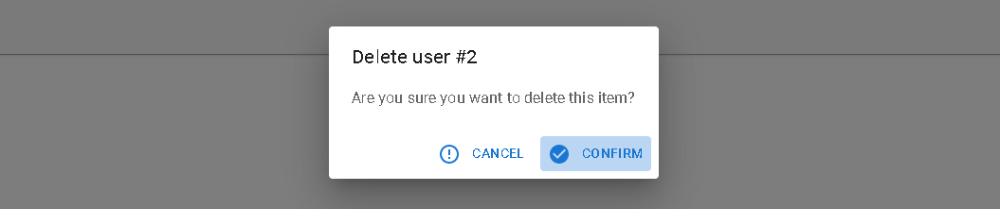

# `<Confirm>`

`<Confirm>` leverages MUI's [`<Dialog>` component](https://mui.com/components/dialogs) to implement a confirmation popup.



```jsx
import { useState } from 'react';
import {
    Button,
    Confirm,
    useListContext,
    useUpdateMany,
} from 'react-admin';

const CustomUpdatePostsButton = () => {
    const { selectedIds } = useListContext();
    const [open, setOpen] = useState(false);

    const [updateMany, { isLoading }] = useUpdateMany(
        'posts',
        { ids: selectedIds, data: { views: 0 } }
    );

    const handleClick = () => setOpen(true);
    const handleDialogClose = () => setOpen(false);
    const handleConfirm = () => {
        updateMany();
        setOpen(false);
    };

    return (
        <>
            <Button label="Update Posts" onClick={handleClick} />
            <Confirm
                isOpen={open}
                loading={isLoading}
                title="Update View Count"
                content="Are you sure you want to update these posts?"
                onConfirm={handleConfirm}
                onClose={handleDialogClose}
            />
        </>
    );
};
```

| Prop               | Required | Type                             | Default               | Description                                                        |
|--------------------|----------|----------------------------------|-----------------------|--------------------------------------------------------------------|
| `className`        | Optional | `string`                         | -                     | Class name to customize the look and feel of the dialog itself     |
| `isOpen`           | Optional | `boolean`                        | `false`               | `true` to show the dialog, `false` to hide it                      |
| `loading`          | Optional | `boolean`                        | `false`               | Boolean to be applied to the `disabled` prop of the action buttons |
| `content`          | Required | `ReactNode`                      | -                     | Body of the dialog                                                 |
| `cancel`           | Optional | `string`                         | 'ra.action.cancel'    | Label of the cancel button                                          |
| `confirm`          | Optional | `string`                         | 'ra.action.confirm'   | Label of the confirm button                                        |
| `confirmColor`     | Optional | `string`                         | 'primary'             | Color of the confirm button                                        |
| `ConfirmIcon`      | Optional | `ReactElement`                   | `<CheckCircle/>`      | Icon elemnt of the confirm button                                  |
| `CancelIcon`       | Optional | `ReactElement`                   | `<ErrorOutlineIcon/>` | Icon elemnt of the cancel button                                    |
| `onClose`          | Required | `MouseEventHandler`              | -                     | onClick event handler of the cancel button                         |
| `onConfirm`        | Required | `MouseEventHandler`              | -                     | onClick event handler of the confirm button                        |
| `title`            | Required | `string`                         | -                     | Title of the dialog                                                |
| `translateOptions` | Optional | `{ id?: string, name?: string }` | {}                    | Custom id and name to be used in the dialog title                  |

Text props such as `title`, `content`, `cancel`, `confirm` and `translateOptions` are translatable. You can pass translation keys in these props. Note: `content` is only translatable when value is `string`, otherwise it renders the content as a `ReactNode`.

## `sx`: CSS API

The `<Confirm>` component accepts the usual `className` prop. You can also override many styles of the inner components thanks to the `sx` property (as most MUI components, see their [documentation about it](https://mui.com/customization/how-to-customize/#overriding-nested-component-styles)). This property accepts the following subclasses:

| Rule name                       | Description                                                    |
|---------------------------------|----------------------------------------------------------------|
| `& .RaConfirm-confirmPrimary`   | Applied to the confirm button when `confirmColor` is `primary` |
| `& .RaConfirm-confirmWarning`   | Applied to the confirm button when `confirmColor` is `warning` |
| `& .RaConfirm-iconPaddingStyle` | Applied to the confirm and cancel icon elements                |

To override the style of all instances of `<Confirm>` using the [MUI style overrides](https://mui.com/customization/globals/#css), use the `RaConfirm` key.
