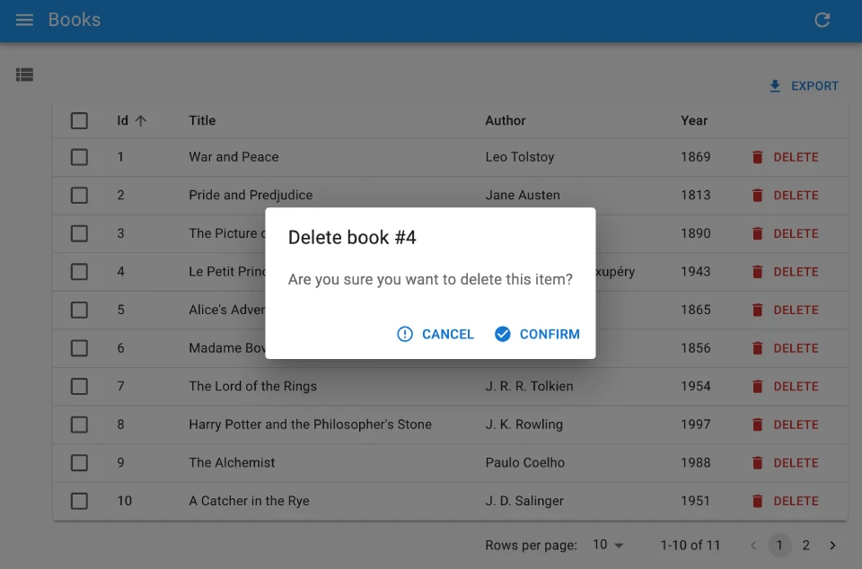

# `<Confirm>`

`<Confirm>` leverages Material UI's [`<Dialog>` component](https://mui.com/material-ui/react-dialog/) to implement a confirmation popup.



## Usage

To ask a confirmation to the user before performing an action, have the action button open a `<Confirm>`.

For instance, here is how to build a delete button that removes the record after asking for confirmation:

```jsx
import { useState } from 'react';
import {
    Button,
    Confirm,
    useRecordContext,
    useDelete,
} from 'react-admin';

const BulkResetViewsButton = () => {
    const record = useRecordContext();
    const [open, setOpen] = useState(false);

    const [remove, { isLoading }] = useDelete(
        'posts',
        { id: record && record.id }
    );

    const handleClick = () => setOpen(true);
    const handleDialogClose = () => setOpen(false);
    const handleConfirm = () => {
        remove();
        setOpen(false);
    };

    return (
        <>
            <Button label="Delete" onClick={handleClick} />
            <Confirm
                isOpen={open}
                loading={isLoading}
                title={`Delete post #${record && record.id}`}
                content="Are you sure you want to delete this item?"
                onConfirm={handleConfirm}
                onClose={handleDialogClose}
            />
        </>
    );
};
```

## Props

| Prop               | Required | Type                             | Default               | Description                                                        |
|--------------------|----------|----------------------------------|-----------------------|--------------------------------------------------------------------|
| `title`            | Required | `string`                         | -                     | Title of the dialog                                                |
| `content`          | Required | `ReactNode`                      | -                     | Body of the dialog                                                 |
| `onClose`          | Required | `Mouse EventHandler`              | -                     | onClick event handler of the cancel button                         |
| `onConfirm`        | Required | `Mouse EventHandler`              | -                     | onClick event handler of the confirm button                        |
| `isOpen`           | Optional | `boolean`                        | `false`               | `true` to show the dialog, `false` to hide it                      |
| `loading`          | Optional | `boolean`                        | `false`               | Boolean to be applied to the `disabled` prop of the action buttons |
| `cancel`           | Optional | `string`                         | 'ra.action. cancel'    | Label of the cancel button                                         |
| `confirm`          | Optional | `string`                         | 'ra.action. confirm'   | Label of the confirm button                                        |
| `confirmColor`     | Optional | `string`                         | 'primary'             | Color of the confirm button                                        |
| `ConfirmIcon`      | Optional | `Component`                      | `CheckCircleIcon`      | Icon component of the confirm button                                 |
| `CancelIcon`       | Optional | `Component`                      | `ErrorOutlineIcon`     | Icon component of the cancel button                                  |
| `translate Options` | Optional | `{ id?: string, name?: string }` | {}                    | Custom id and name to be used in the dialog title                  |
| `sx`               | Optional | `SxProps`                        | ''                    | Material UI shortcut for defining custom styles with access to the theme   |

Text props such as `title`, `content`, `cancel`, `confirm` and `translateOptions` are translatable. You can pass translation keys in these props. Note: `content` is only translatable when value is `string`, otherwise it renders the content as a `ReactNode`.

## `sx`: CSS API

The `<Confirm>` component accepts the usual `className` prop. You can also override many styles of the inner components thanks to the `sx` property (see [the `sx` documentation](./SX.md) for syntax and examples). This property accepts the following subclasses:

| Rule name                       | Description                                                    |
|---------------------------------|----------------------------------------------------------------|
| `& .RaConfirm-confirmPrimary`   | Applied to the confirm button when `confirmColor` is `primary` |
| `& .RaConfirm-confirmWarning`   | Applied to the confirm button when `confirmColor` is `warning` |

To override the style of all instances of `<Confirm>` using the [application-wide style overrides](./AppTheme.md#theming-individual-components), use the `RaConfirm` key.

## Delete With Confirmation

React-admin's `<DeleteButton>` lets user delete the current record [in an optimistic way](./Features.md#undo): after clicking the button, users see a notification for the deletion with an "undo" link to cancel the deletion. 

Alternately, you can force the user to confirm the deletion by using `<DeleteButton mutationMode="pessimistic">`. Under the hood, this leverages the `<Confirm>` component to ask for confirmation before deleting the record.

```jsx
import { List, Datagrid, TextField, DeleteButton } from 'react-admin';

const PostList = () => (
    <List>
        <Datagrid>
            <TextField source="id" />
            <TextField source="title" />
            <DeleteButton mutationMode="pessimistic" />
        </Datagrid>
    </List>
);
```

The same goes for deleting multiple records in a [bulk action](./Datagrid.md#bulkactionbuttons): use `<BulkDeleteButton mutationMode="pessimistic">` to ask a confirmation before the deletion.

```jsx
import { List, Datagrid, TextField, BulkDeleteButton } from 'react-admin';

const PostList = () => (
    <List>
        <Datagrid bulkActionButtons={<BulkDeleteButton mutationMode="pessimistic" />}>
            <TextField source="id" />
            <TextField source="title" />
        </Datagrid>
    </List>
);
```
