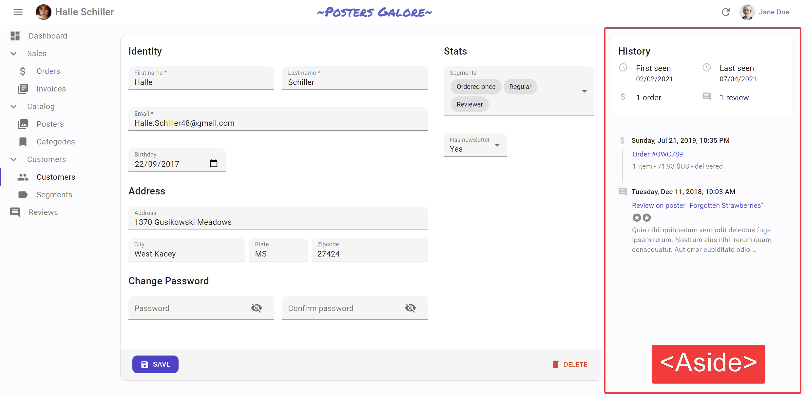
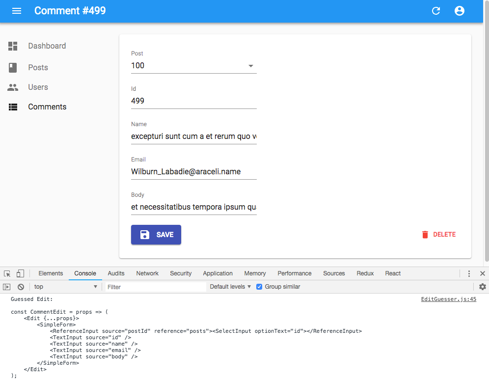

# The Create and Edit Views

`<Resource>` maps URLs to components - it takes care of *routing*. When you set a component as the `create` prop for a Resource, react-admin renders that component when users go to the `/[resource]/create` URL. When you set a component as the `edit` prop for a resource, react-admin renders that component when users go to the `/[resource]/:id` URL. 

```
<Resource name="posts" create={PostCreate} edit={PostEdit} />
                               ----------        --------
                                    |               |
    displayed when browsing to /posts/create        |
                                                    |
                    displayed when browsing to /posts/123
```

You can pass any component you want as `create` of `edit` props of a `<Resource>`. But you'll probably want to fetch a record based on the URL, and display a form to edit that record. That's what the `<Create>` and `<Edit>` components do. So in most cases, the component passed as `create` view uses the react-admin `<Create>` component, and the component passed as `edit` view uses the react-admin `<Edit>` component. Here is an example:


```jsx
// in src/App.js
import * as React from "react";
import { Admin, Resource } from 'react-admin';
import jsonServerProvider from 'ra-data-json-server';

import { PostCreate, PostEdit } from './posts';

const App = () => (
    <Admin dataProvider={jsonServerProvider('https://jsonplaceholder.typicode.com')}>
        <Resource name="posts" create={PostCreate} edit={PostEdit} />
    </Admin>
);

export default App;

// in src/posts.js
import * as React from "react";
import { Create, Edit, SimpleForm, TextInput, DateInput, ReferenceManyField, Datagrid, TextField, DateField, EditButton, required } from 'react-admin';
import RichTextInput from 'ra-input-rich-text';

export const PostCreate = (props) => (
    <Create {...props}>
        <SimpleForm>
            <TextInput source="title" />
            <TextInput source="teaser" options={{ multiLine: true }} />
            <RichTextInput source="body" />
            <DateInput label="Publication date" source="published_at" defaultValue={new Date()} />
        </SimpleForm>
    </Create>
);

export const PostEdit = (props) => (
    <Edit {...props}>
        <SimpleForm>
            <TextInput disabled label="Id" source="id" />
            <TextInput source="title" validate={required()} />
            <TextInput multiline source="teaser" validate={required()} />
            <RichTextInput source="body" validate={required()} />
            <DateInput label="Publication date" source="published_at" />
            <ReferenceManyField label="Comments" reference="comments" target="post_id">
                <Datagrid>
                    <TextField source="body" />
                    <DateField source="created_at" />
                    <EditButton />
                </Datagrid>
            </ReferenceManyField>
        </SimpleForm>
    </Edit>
);
```


That's enough to display the post edit form:


**Tip**: You might find it cumbersome to repeat the same input components for both the `<Create>` and the `<Edit>` view. In practice, these two views almost never have exactly the same form inputs. For instance, in the previous snippet, the `<Edit>` view shows related comments to the current post, which makes no sense for a new post. Having two separate sets of input components for the two views is, therefore, a deliberate choice. However, if you have the same set of input components, export them as a custom Form component to avoid repetition.

React-admin injects a few props to the `create` and `edit` views: the `resource` name, the `basePath` (the root URL), the `permissions`, and, in the case of the `edit` view, the record `id`. That's why you need to pass the `props` to the `<Create>` and `<Edit>` components.

## The `<Create>` and `<Edit>` components

The `<Create>` and `<Edit>` components call the `dataProvider`, prepare the form submit handler, and render the page title and actions. They are not responsible for rendering the actual form - that's the job of their child component (usually `<SimpleForm>`). This form component uses its children ([`<Input>`](./Inputs.md) components) to render each form input.


The `<Create>` component clones its child, and passes it an empty object `{}` as `record` prop. It also passes a callback as `save` prop, which calls `dataProvider.create()`.


The `<Edit>` component calls `dataProvider.getOne()`, using the id from the URL. It also clones its child, and passes it the fetched record as `record` prop. It also passes a callback as `save` prop, which calls `dataProvider.update()`.

You can customize the `<Create>` and `<Edit>` components using the following props:

* [`title`](#page-title)
* [`actions`](#actions)
* [`aside`](#aside-component)
* [`component`](#component)
* [`undoable`](#undoable) (`<Edit>` only) (deprecated)
* [`mutationMode`](#mutationmode) (`<Edit>` only) 
* [`onSuccess`](#onsuccess)
* [`onFailure`](#onfailure)
* [`transform`](#transform)
* [`successMessage`](#success-message) (deprecated - use `onSuccess` instead)

`<Create>` also accepts a `record` prop, to initialize the form based on a value object.

### CSS API

The `<Create>` and `<Edit>` components accepts the usual `className` prop, but you can override many class names injected to the inner components by React-admin thanks to the `classes` property (as most Material UI components, see their [documentation about it](https://v4.mui.com/customization/components/#overriding-styles-with-classes)). This property accepts the following keys:

| Rule name   | Description                                                                                |
| ----------- | ------------------------------------------------------------------------------------------ |
| `root`      | Alternative to using `className`. Applied to the root element                              |
| `main`      | Applied to the main container                                                              |
| `noActions` | Applied to the main container when `actions` prop is `false`                               |
| `card`      | Applied to the child component inside the main container (Material UI's `Card` by default) |

To override the style of all instances of `<Create>` and `<Edit>` components using the [material-ui style overrides](https://v4.mui.com/customization/globals/#css), use the `RaCreate` and `RaEdit` keys respectively.

### Page Title

By default, the title for the `Create` view is "Create [resource_name]", and the title for the `Edit` view is "Edit [resource_name] #[record_id]".

You can customize this title by specifying a custom `title` prop:

```jsx
export const PostEdit = (props) => (
    <Edit title="Post edition" {...props}>
        ...
    </Edit>
);
```

More interestingly, you can pass an element as `title`. React-admin clones this element and, in the `<EditView>`, injects the current `record`. This allows to customize the title according to the current record:

```jsx
const PostTitle = ({ record }) => {
    return <span>Post {record ? `"${record.title}"` : ''}</span>;
};
export const PostEdit = (props) => (
    <Edit title={<PostTitle />} {...props}>
        ...
    </Edit>
);
```

### Actions

You can replace the list of default actions by your own element using the `actions` prop:

```jsx
import * as React from "react";
import Button from '@material-ui/core/Button';
import { TopToolbar, ShowButton } from 'react-admin';

const PostEditActions = ({ basePath, data, resource }) => (
    <TopToolbar>
        <ShowButton basePath={basePath} record={data} />
        {/* Add your custom actions */}
        <Button color="primary" onClick={customAction}>Custom Action</Button>
    </TopToolbar>
);

export const PostEdit = (props) => (
    <Edit actions={<PostEditActions />} {...props}>
        ...
    </Edit>
);
```

### The `<ListButton>` component

A common customization is to add a button to go back to the List. Use the `<ListButton>` for that:

```jsx
import { TopToolbar, ListButton, ShowButton } from 'react-admin';

const PostEditActions = ({ basePath, data }) => (
    <TopToolbar>
        <ListButton basePath={basePath} />
        <ShowButton basePath={basePath} record={data} />
    </TopToolbar>
);
```

If you want this button to look like a Back button, you can pass a custom label and icon to the `ListButton`:

```jsx
import ChevronLeft from '@material-ui/icons/ChevronLeft';

const PostEditActions = ({ basePath, data }) => (
    <TopToolbar>
        <ListButton basePath={basePath} label="Back" icon={<ChevronLeft />} />
        <ShowButton basePath={basePath} record={data} />
    </TopToolbar>
);
```

### Aside component



You may want to display additional information on the side of the form. Use the `aside` prop for that, passing the component of your choice:


```jsx
const Aside = () => (
    <div style={{ width: 200, margin: '1em' }}>
        <Typography variant="h6">Post details</Typography>
        <Typography variant="body2">
            Posts will only be published once an editor approves them
        </Typography>
    </div>
);

const PostEdit = props => (
    <Edit aside={<Aside />} {...props}>
       // ...
    </Edit>
);
```


The `aside` component receives the same props as the `Edit` or `Create` child component: `basePath`, `record`, `resource`, and `version`. That means you can display non-editable details of the current record in the aside component:


```jsx
const Aside = ({ record }) => (
    <div style={{ width: 200, margin: '1em' }}>
        <Typography variant="h6">Post details</Typography>
        {record && (
            <Typography variant="body2">
                Creation date: {record.createdAt}
            </Typography>
        )}
    </div>
);
```


**Tip**: Always test the `record` is defined before using it, as react-admin starts rendering the UI before the API call is over.

### Component

By default, the `Create` and `Edit` views render the main form inside a material-ui `<Card>` element. The actual layout of the form depends on the `Form` component you're using (`<SimpleForm>`, `<TabbedForm>`, or a custom form component).

Some form layouts also use `Card`, in which case the user ends up seeing a card inside a card, which is bad UI. To avoid that, you can override the main page container by passing a `component` prop :

```jsx
// use a div as root component
const PostEdit = props => (
    <Edit component="div" {...props}>
        ...
    </Edit>
);

// use a custom component as root component 
const PostEdit = props => (
    <Edit component={MyComponent} {...props}>
        ...
    </Edit>
);
```

The default value for the `component` prop is `Card`.

### Undoable

**Note**: This prop is deprecated, use `mutationMode="undoable"` instead.

By default, the Save and Delete actions are undoable, i.e. react-admin only sends the related request to the data provider after a short delay, during which the user can cancel the action. This is part of the "optimistic rendering" strategy of react-admin ; it makes the user interactions more reactive.

You can disable this behavior by setting `undoable={false}`. With that setting, clicking on the Delete button displays a confirmation dialog. Both the `Save` and `Delete` actions become blocking and delay the refresh of the screen until the data provider responds.

```jsx
const PostEdit = props => (
    <Edit undoable={false} {...props}>
        // ...
    </Edit>
);
```

**Tip**: If you want a confirmation dialog for the Delete button but don't mind undoable Edits, then pass a [custom toolbar](#toolbar) to the form, as follows:

```jsx
import * as React from "react";
import {
    Toolbar,
    SaveButton,
    DeleteButton,
    Edit,
    SimpleForm,
} from 'react-admin';
import { makeStyles } from '@material-ui/core/styles';

const useStyles = makeStyles({
    toolbar: {
        display: 'flex',
        justifyContent: 'space-between',
    },
});

const CustomToolbar = props => (
    <Toolbar {...props} classes={useStyles()}>
        <SaveButton />
        <DeleteButton undoable={false} />
    </Toolbar>
);

const PostEdit = props => (
    <Edit {...props}>
        <SimpleForm toolbar={<CustomToolbar />}>
            ...
        </SimpleForm>
    </Edit>
);
```

### `mutationMode`

The `<Edit>` view exposes two buttons, Save and Delete, which perform "mutations" (i.e. they alter the data). React-admin offers three modes for mutations. The mode determines when the side effects (redirection, notifications, etc.) are executed:

- `pessimistic`: The mutation is passed to the dataProvider first. When the dataProvider returns successfully, the mutation is applied locally, and the side effects are executed. 
- `optimistic`: The mutation is applied locally and the side effects are executed immediately. Then the mutation is passed to the dataProvider. If the dataProvider returns successfully, nothing happens (as the mutation was already applied locally). If the dataProvider returns in error, the page is refreshed and an error notification is shown. 
- `undoable` (default): The mutation is applied locally and the side effects are executed immediately. Then a notification is shown with an undo button. If the user clicks on undo, the mutation is never sent to the dataProvider, and the page is refreshed. Otherwise, after a 5 seconds delay, the mutation is passed to the dataProvider. If the dataProvider returns successfully, nothing happens (as the mutation was already applied locally). If the dataProvider returns in error, the page is refreshed and an error notification is shown.

By default, pages using `<Edit>` use the `undoable` mutation mode. This is part of the "optimistic rendering" strategy of react-admin ; it makes user interactions more reactive. 

You can change this default by setting the `mutationMode` prop - and this affects both the Save and Delete buttons. For instance, to remove the ability to undo the changes, use the `optimistic` mode:

```jsx
const PostEdit = props => (
    <Edit mutationMode="optimistic" {...props}>
        // ...
    </Edit>
);
```

And to make both the Save and Delete actions blocking, and wait for the dataProvider response to continue, use the `pessimistic` mode:

```jsx
const PostEdit = props => (
    <Edit mutationMode="pessimistic" {...props}>
        // ...
    </Edit>
);
```

**Tip**: When using any other mode than `undoable`, the `<DeleteButton>` displays a confirmation dialog before calling the dataProvider. 

**Tip**: If you want a confirmation dialog for the Delete button but don't mind undoable Edits, then pass a [custom toolbar](#toolbar) to the form, as follows:

```jsx
import * as React from "react";
import {
    Toolbar,
    SaveButton,
    DeleteButton,
    Edit,
    SimpleForm,
} from 'react-admin';
import { makeStyles } from '@material-ui/core/styles';

const useStyles = makeStyles({
    toolbar: {
        display: 'flex',
        justifyContent: 'space-between',
    },
});

const CustomToolbar = props => (
    <Toolbar {...props} classes={useStyles()}>
        <SaveButton />
        <DeleteButton mutationMode="pessimistic" />
    </Toolbar>
);

const PostEdit = props => (
    <Edit {...props}>
        <SimpleForm toolbar={<CustomToolbar />}>
            ...
        </SimpleForm>
    </Edit>
);
```

### `onSuccess`

By default, when the save action succeeds, react-admin shows a notification, and redirects to another page. You can override this behavior and pass custom side effects by providing a function as `onSuccess` prop:

```jsx
import * as React from 'react';
import { useNotify, useRefresh, useRedirect, Edit, SimpleForm } from 'react-admin';

const PostEdit = props => {
    const notify = useNotify();
    const refresh = useRefresh();
    const redirect = useRedirect();

    const onSuccess = () => {
        notify(`Changes saved`);
        redirect('/posts');
        refresh();
    };

    return (
        <Edit onSuccess={onSuccess} {...props}>
            <SimpleForm>
                ...
            </SimpleForm>
        </Edit>
    );
}
```

By default, the `<Edit>` view runs updates in `mutationMode="undoable"`, which means that it calls the `onSuccess` side effects immediately, even before the `dataProvider` is called.

The default `onSuccess` function is:

```jsx
// for the <Create> component:
() => {
    notify('ra.notification.created', { messageArgs: { smart_count: 1 } });
    redirect('edit', basePath, data.id, data);
}

// for the <Edit> component: 
() => {
    notify('ra.notification.created', {
        messageArgs: { smart_count: 1 },
        undoable: mutationMode === 'undoable'
    });
    redirect('list', basePath, data.id, data);
}
```

To learn more about built-in side effect hooks like `useNotify`, `useRedirect` and `useRefresh`, check the [Querying the API documentation](./Actions.md#handling-side-effects-in-usedataprovider).

**Tip**: When you use `mutationMode="pessimistic"`, the `onSuccess` function receives the response from the dataProvider call (`dataProvider.create()` or `dataProvider.update()`), which is the created/edited record (see [the dataProvider documentation for details](./DataProviders.md#response-format)). You can use that response in the success side effects: 

```jsx
import * as React from 'react';
import { useNotify, useRefresh, useRedirect, Edit, SimpleForm } from 'react-admin';

const PostEdit = props => {
    const notify = useNotify();
    const refresh = useRefresh();
    const redirect = useRedirect();

  const onSuccess = ({ data }) => {
        notify(`Changes to post "${data.title}" saved`);
        redirect('/posts');
        refresh();
    };

    return (
        <Edit onSuccess={onSuccess} mutationMode="pessimistic" {...props}>
            <SimpleForm>
                ...
            </SimpleForm>
        </Edit>
    );
}
```

**Tip**: When you set the `onSuccess` prop, the `successMessage` prop is ignored.

**Tip**: If you want to have different success side effects based on the button clicked by the user (e.g. if the creation form displays two submit buttons, one to "save and redirect to the list", and another to "save and display an empty form"), you can set the `onSuccess` prop on the `<SaveButton>` component, too.

### `onFailure`

By default, when the save action fails at the dataProvider level, react-admin shows an error notification. On an Edit page with `mutationMode` set to `undoable` or `optimistic`, it refreshes the page, too.

You can override this behavior and pass custom side effects by providing a function as `onFailure` prop:

```jsx
import * as React from 'react';
import { useNotify, useRefresh, useRedirect, Edit, SimpleForm } from 'react-admin';

const PostEdit = props => {
    const notify = useNotify();
    const refresh = useRefresh();
    const redirect = useRedirect();

    const onFailure = (error) => {
        notify(`Could not edit post: ${error.message}`);
        redirect('/posts');
        refresh();
    };

    return (
        <Edit onFailure={onFailure} {...props}>
            <SimpleForm>
                ...
            </SimpleForm>
        </Edit>
    );
}
```

The `onFailure` function receives the error from the dataProvider call (`dataProvider.create()` or `dataProvider.update()`), which is a JavaScript Error object (see [the dataProvider documentation for details](./DataProviders.md#error-format)).

The default `onFailure` function is:

```jsx
// for the <Create> component:
(error) => {
    notify(typeof error === 'string' ? error : error.message || 'ra.notification.http_error', { type: 'warning' });
}

// for the <Edit> component: 
(error) => {
    notify(typeof error === 'string' ? error : error.message || 'ra.notification.http_error', { type: 'warning' });
    if (mutationMode === 'undoable' || mutationMode === 'pessimistic') {
        refresh();
    }
}
```

**Tip**: If you want to have different failure side effects based on the button clicked by the user, you can set the `onFailure` prop on the `<SaveButton>` component, too.

### `transform`

To transform a record after the user has submitted the form but before the record is passed to the `dataProvider`, use the `transform` prop. It expects a function taking a record as argument, and returning a modified record. For instance, to add a computed field upon creation:

```jsx
export const UserCreate = (props) => {
    const transform = data => ({
        ...data,
        fullName: `${data.firstName} ${data.lastName}`
    });
    return (
        <Create {...props} transform={transform}>
            ...
        </Create>
    );
}
```

The `transform` function can also return a `Promise`, which allows you to do all sorts of asynchronous calls (e.g. to the `dataProvider`) during the transformation.

**Tip**: If you want to have different transformations based on the button clicked by the user (e.g. if the creation form displays two submit buttons, one to "save", and another to "save and notify other admins"), you can set the `transform` prop on the `<SaveButton>` component, too. See [Altering the Form Values Before Submitting](#altering-the-form-values-before-submitting) for an example.

### Success message

**Deprecated**: use the `onSuccess` prop instead. See [Changing The Success or Failure Notification Message](#changing-the-success-or-failure-notification-message) for the new syntax. 

Once the `dataProvider` returns successfully after save, users see a generic notification ("Element created" / "Element updated"). You can customize this message by passing a `successMessage` prop:

```jsx
const PostEdit = props => (
    <Edit successMessage="messages.post_saved" {...props}>
        // ...
    </Edit>
);
```

**Tip**: The message will be translated.

## Prefilling a `<Create>` Record

Users may need to create a copy of an existing record. For that use case, use the `<CloneButton>` component. It expects a `record` and a `basePath` (usually injected to children of `<Datagrid>`, `<SimpleForm>`, `<SimpleShowLayout>`, etc.), so it's as simple to use as a regular field or input.

For instance, to allow cloning all the posts from the list:

```jsx
import * as React from "react";
import { List, Datagrid, TextField, CloneButton } from 'react-admin';

const PostList = props => (
    <List {...props}>
        <Datagrid>
            <TextField source="title" />
            <CloneButton />
        </Datagrid>
    </List>
);
```

**Note**: `<CloneButton>` is designed to be used in a `<Datagrid>` and in an edit view `<Actions>` component, not inside the form `<Toolbar>`. The `Toolbar` is basically for submitting the form, not for going to another resource.

Alternately, users need to prepopulate a record based on a *related* record. For instance, to create a comment related to an existing post. 

By default, the `<Create>` view starts with an empty `record`. However, if the `location` object (injected by [react-router-dom](https://reacttraining.com/react-router/web/api/location)) contains a `record` in its `state`, the `<Create>` view uses that `record` instead of the empty object. That's how the `<CloneButton>` works under the hood.

That means that if you want to create a link to a creation form, presetting *some* values, all you have to do is to set the location `state`. `react-router-dom` provides the `<Link>` component for that:


```jsx
import * as React from "react";
import { Datagrid } from 'react-admin';
import Button from '@material-ui/core/Button';
import { Link } from 'react-router-dom';

const CreateRelatedCommentButton = ({ record }) => (
    <Button
        component={Link}
        to={{
            pathname: '/comments/create',
            state: { record: { post_id: record.id } },
        }}
    >
        Write a comment for that post
    </Button>
);

export default PostList = props => (
    <List {...props}>
        <Datagrid>
            ...
            <CreateRelatedCommentButton />
        </Datagrid>
    </List>
)
```


**Tip**: To style the button with the main color from the material-ui theme, use the `Link` component from the `react-admin` package rather than the one from `react-router-dom`.

**Tip**: The `<Create>` component also watches the "source" parameter of `location.search` (the query string in the URL) in addition to `location.state` (a cross-page message hidden in the router memory). So the `CreateRelatedCommentButton` could also be written as:


```jsx
import * as React from "react";
import Button from '@material-ui/core/Button';
import { Link } from 'react-router-dom';

const CreateRelatedCommentButton = ({ record }) => (
    <Button
        component={Link}
        to={{
            pathname: '/comments/create',
            search: `?source=${JSON.stringify({ post_id: record.id })}`,
        }}
    >
        Write a comment for that post
    </Button>
);
```


Should you use the location `state` or the location `search`? The latter modifies the URL, so it's only necessary if you want to build cross-application links (e.g. from one admin to the other). In general, using the location `state` is a safe bet.

## The `<EditGuesser>` component

Instead of a custom `Edit`, you can use the `EditGuesser` to determine which inputs to use based on the data returned by the API.

```jsx
// in src/App.js
import * as React from "react";
import { Admin, Resource, EditGuesser } from 'react-admin';
import jsonServerProvider from 'ra-data-json-server';

const App = () => (
    <Admin dataProvider={jsonServerProvider('https://jsonplaceholder.typicode.com')}>
        <Resource name="posts" edit={EditGuesser} />
    </Admin>
);
```

Just like `Edit`, `EditGuesser` fetches the data. It then analyzes the response and guesses the inputs it should use to display a basic form with the data. It also dumps the components it has guessed in the console, where you can copy it into your own code. Use this feature to quickly bootstrap an `Edit` on top of an existing API, without adding the inputs one by one.



React-admin provides guessers for the `List` view (`ListGuesser`), the `Edit` view (`EditGuesser`), and the `Show` view (`ShowGuesser`).

**Tip**: Do not use the guessers in production. They are slower than manually-defined components because they have to infer types based on the content. Besides, the guesses are not always perfect.

## `useCreateController` and `useEditController`

The `<Create>` and `<Edit>` components both take care of two things:

1. (the "controller") Fetching data based on the URL and transforming it
2. (the "view") Rendering the page title, the actions, the content and aside areas 

In some cases, you may want to customize the view entirely (i.e. keep the code for step 1, and provide your own code for step 2). For these cases, react-admin provides two hooks, `useCreateController()` and `useEditController()`. These hooks contain just the controller part of the `<Create>` and `<Edit>` components.

**Tip**: You should not use these hooks to hide or show form inputs based on the data. For that need, check [`<FormDataConsumer>`](./Inputs.md#linking-two-inputs).

### `useCreateController`

This hook takes one object as input (the props passed to a `<Create>` component) and returns the save callback for the `Create` view, as well as some pre-computed values. You can use it to create your own custom `Create` view, like this one:

```jsx
import { useCreateController, CreateContextProvider, SimpleForm } from 'react-admin';

const MyCreate = props => {
    const createControllerProps = useCreateController(props);
    const {
        basePath, // deduced from the location, useful for action buttons
        defaultTitle, // the translated title based on the resource, e.g. 'Create Post'
        record, // empty object, unless some values were passed in the location state to prefill the form
        redirect, // the default redirection route. Defaults to 'edit', unless the resource has no edit view, in which case it's 'list'
        resource, // the resource name, deduced from the location. e.g. 'posts'
        save, // the create callback, to be passed to the underlying form as submit handler
        saving, // boolean that becomes true when the dataProvider is called to create the record
        version, // integer used by the refresh feature
    } = createControllerProps;
    return (
        <CreateContextProvider value={createControllerProps}>
            <div>
                <h1>{defaultTitle}</h1>
                {cloneElement(props.children, {
                    basePath,
                    record,
                    redirect,
                    resource,
                    save,
                    saving,
                    version,
                })}
            </div>
        </CreateContextProvider>
    );
}

const PostCreate = props => (
    <MyCreate {...props}>
        <SimpleForm>
            ...
        </SimpleForm>
    </MyCreate>
)
```

This custom Create view has no action buttons or aside component - it's up to you to add them in pure React.

**Tip**: You don't have to clone the child element. If you can't reuse an existing form component like `<SimpleForm>` or `<TabbedForm>`, feel free to write the form code inside your custom `MyCreate` component. 

### `useEditController`

This hook takes one object as input (the props passed to an `<Edit>` component) and returns the fetched data and callbacks for the Edit view. You can use it to create your own custom Edit view, like this one:

```jsx
import { useEditController, EditContextProvider, SimpleForm } from 'react-admin';

const MyEdit = props => {
    const controllerProps = useEditController(props);
    const {
        basePath, // deduced from the location, useful for action buttons
        defaultTitle, // the translated title based on the resource, e.g. 'Post #123'
        error,  // error returned by dataProvider when it failed to fetch the record. Useful if you want to adapt the view instead of just showing a notification using the `onFailure` side effect.
        loaded, // boolean that is false until the record is available
        loading, // boolean that is true on mount, and false once the record was fetched
        record, // record fetched via dataProvider.getOne() based on the id from the location
        redirect, // the default redirection route. Defaults to 'list'
        resource, // the resource name, deduced from the location. e.g. 'posts'
        save, // the update callback, to be passed to the underlying form as submit handler
        saving, // boolean that becomes true when the dataProvider is called to update the record
        version, // integer used by the refresh feature
    } = controllerProps;
    return (
        <EditContextProvider value={controllerProps}>
            <div>
                <h1>{defaultTitle}</h1>
                {cloneElement(props.children, {
                    basePath,
                    record,
                    redirect,
                    resource,
                    save,
                    saving,
                    version,
                })}
            </div>
        </EditContextProvider>
    );
}

const PostEdit = props => (
    <MyEdit {...props}>
        <SimpleForm>
            ...
        </SimpleForm>
    </MyEdit>
)
```

This custom Edit view has no action buttons or aside component - it's up to you to add them in pure React.

**Tip**: You don't have to clone the child element. If you can't reuse an existing form component like `<SimpleForm>` or `<TabbedForm>`, feel free to write the form code inside your custom `MyEdit` component. 

## The `<SimpleForm>` component

The `<SimpleForm>` component receives the `record` as prop from its parent component. It is responsible for rendering the actual form. It is also responsible for validating the form data. Finally, it receives a `handleSubmit` function as prop, to be called with the updated record as an argument when the user submits the form.

The `<SimpleForm>` renders its child components line by line (within `<div>` components). It accepts Input and Field components as children. It relies on [react-final-form](https://github.com/final-form/react-final-form) for form handling.


By default, the `<SimpleForm>` submits the form when the user presses `ENTER`. If you want
to change this behaviour you can pass `false` for the `submitOnEnter` property, and the user will only be able to submit by pressing the save button. This can be useful e.g. if you have an input widget using `ENTER` for a special function.

Here are all the props you can set on the `<SimpleForm>` component:

* [`initialValues`](#default-values)
* [`validate`](#validation)
* [`submitOnEnter`](#submit-on-enter)
* [`redirect`](#redirection-after-submission)
* [`toolbar`](#toolbar)
* [`variant`](#variant)
* [`margin`](#margin)
* [`component`](#simpleform-component)
* [`warnWhenUnsavedChanges`](#warning-about-unsaved-changes)
* [`sanitizeEmptyValues`](#setting-empty-values-to-null)

```jsx
export const PostCreate = (props) => (
    <Create {...props}>
        <SimpleForm>
            <TextInput source="title" />
            <RichTextInput source="body" />
            <NumberInput source="nb_views" />
        </SimpleForm>
    </Create>
);
```

**Tip**: `Create` and `Edit` inject more props to their child. So `SimpleForm` also expects these props to be set (you should set them yourself only in particular cases like the [submission validation](#submission-validation)):

* `save`: The function invoked when the form is submitted.
* `saving`: A boolean indicating whether a save operation is ongoing.

### Label Decoration

`<SimpleForm>` scans its children for the `addLabel` prop, and automatically wraps a child in a `<Labeled>` component when found. This displays a label on top of the child, based on the `label` prop. This is not necessary for `<Input>` components, as they already contain their label. Also, all the react-admin `<Field>` components have a default prop `addLabel: true`, which explains why react-admin shows a label on top of Fields when they are used as children of `<SimpleForm>`. 

For your own components that don't include a label by default, set the `addLabel` prop if you want to use them as `<SimpleForm>` children.

```jsx
const IdentifierField = ({ record }) => (
    <Typography>{record.id}</Typography>
);

const BodyField = ({ record }) => (
    <Identifier label="body">
        <Typography>
            {record.body}
        </Typography>
    </Identifier>
);

const PostEdit = (props) => (
    <Create {...props}>
        <SimpleForm>
            <IdentifierField addLabel label="Identifier" /> {/* SimpleForm will add a label */}
            <TextField source="title" /> {/* SimpleForm will add a label, too (TextField has addLabel:true in defaultProps) */}
            <BodyField /> {/* SimpleForm will NOT add a label */}
            <NumberInput source="nb_views" /> {/* SimpleForm will NOT add a label */}
        </SimpleForm>
    </Create>
);
```


## The `<TabbedForm>` component

Just like `<SimpleForm>`, `<TabbedForm>` receives the `record` prop, renders the actual form, and handles form validation on submit. However, the `<TabbedForm>` component renders inputs grouped by tab. The tabs are set by using `<FormTab>` components, which expect a `label` and an `icon` prop.


By default, the `<TabbedForm>` submits the form when the user presses `ENTER`, if you want
to change this behaviour you can pass `false` for the `submitOnEnter` property.

Here are all the props accepted by the `<TabbedForm>` component:

* [`initialValues`](#default-values)
* [`validate`](#validation)
* [`submitOnEnter`](#submit-on-enter)
* [`redirect`](#redirection-after-submission)
* [`tabs`](#tabbedformtabs)
* [`toolbar`](#toolbar)
* [`variant`](#variant)
* [`margin`](#margin)
* `save`: The function invoked when the form is submitted. This is passed automatically by `react-admin` when the form component is used inside `Create` and `Edit` components.
* `saving`: A boolean indicating whether a save operation is ongoing. This is passed automatically by `react-admin` when the form component is used inside `Create` and `Edit` components.
* [`warnWhenUnsavedChanges`](#warning-about-unsaved-changes)
* [`sanitizeEmptyValues`](#setting-empty-values-to-null)
* [`syncWithLocation`](#sync-with-location)


```jsx
import * as React from "react";
import {
    TabbedForm,
    FormTab,
    Edit,
    Datagrid,
    TextField,
    DateField,
    TextInput,
    ReferenceManyField,
    NumberInput,    
    DateInput,
    BooleanInput,
    EditButton
} from 'react-admin';

export const PostEdit = (props) => (
    <Edit {...props}>
        <TabbedForm>
            <FormTab label="summary">
                <TextInput disabled label="Id" source="id" />
                <TextInput source="title" validate={required()} />
                <TextInput multiline source="teaser" validate={required()} />
            </FormTab>
            <FormTab label="body">
                <RichTextInput source="body" validate={required()} addLabel={false} />
            </FormTab>
            <FormTab label="Miscellaneous">
                <TextInput label="Password (if protected post)" source="password" type="password" />
                <DateInput label="Publication date" source="published_at" />
                <NumberInput source="average_note" validate={[ number(), minValue(0) ]} />
                <BooleanInput label="Allow comments?" source="commentable" defaultValue />
                <TextInput disabled label="Nb views" source="views" />
            </FormTab>
            <FormTab label="comments">
                <ReferenceManyField reference="comments" target="post_id" addLabel={false}>
                    <Datagrid>
                        <TextField source="body" />
                        <DateField source="created_at" />
                        <EditButton />
                    </Datagrid>
                </ReferenceManyField>
            </FormTab>
        </TabbedForm>
    </Edit>
);
```


To style the tabs, the `<FormTab>` component accepts two props:

- `className` is passed to the tab *header*
- `contentClassName` is passed to the tab *content*

### Sync With Location

You can also opt out the location synchronization by passing `false` to the `syncWithLocation` prop of the `<TabbedForm>` component. This allows e.g. to have several `<TabbedForm>` components in a page.


```jsx
export const PostEdit = (props) => (
    <Edit {...props}>
        <TabbedForm syncWithLocation={false}>
            <FormTab label="summary">
                <TextInput disabled label="Id" source="id" />
                <TextInput source="title" validate={required()} />
                <TextInput multiline source="teaser" validate={required()} />
            </FormTab>
            <FormTab label="body">
                <RichTextInput source="body" validate={required()} addLabel={false} />
            </FormTab>
            <FormTab label="Miscellaneous">
                <TextInput label="Password (if protected post)" source="password" type="password" />
                <DateInput label="Publication date" source="published_at" />
                <NumberInput source="average_note" validate={[ number(), minValue(0) ]} />
                <BooleanInput label="Allow comments?" source="commentable" defaultValue />
                <TextInput disabled label="Nb views" source="views" />
            </FormTab>
            <FormTab label="comments">
                <ReferenceManyField reference="comments" target="post_id" addLabel={false}>
                    <Datagrid>
                        <TextField source="body" />
                        <DateField source="created_at" />
                        <EditButton />
                    </Datagrid>
                </ReferenceManyField>
            </FormTab>
        </TabbedForm>
    </Edit>
);
```

**Tip**: When `syncWithLocation` is `false`, the `path` prop of the `<FormTab>` components is ignored.

### Label Decoration

`<FormTab>` scans its children for the `addLabel` prop, and automatically wraps a child in a `<Labeled>` component when found. This displays a label on top of the child, based on the `label` prop. This is not necessary for `<Input>` components, as they already contain their label. Also, all the react-admin `<Field>` components have a default prop `addLabel: true`, which explains why react-admin shows a label on top of Fields when they are used as children of `<FormTab>`. 

For your own components that don't include a label by default, set the `addLabel` prop if you want to use them as `<FormTab>` children.

```jsx
const IdentifierField = ({ record }) => (
    <Typography>{record.id}</Typography>
);

const BodyField = ({ record }) => (
    <Identifier label="body">
        <Typography>
            {record.body}
        </Typography>
    </Identifier>
);

const PostEdit = props => (
    <Create {...props}>
        <TabbedForm>
            <FormTab label="main">
                <IdentifierField addLabel label="Identifier" /> {/* FormTab will add a label */}
                <TextField source="title" /> {/* FormTab will add a label, too (TextField has addLabel:true) in defaultProps */}
                <BodyField /> {/* FormTab will NOT add a label */}
                <NumberInput source="nb_views" /> {/* FormTab will NOT add a label */}
            </FormTab>
        </TabbedForm>
    </Create>
);
```

### TabbedFormTabs

By default `<TabbedForm>` uses `<TabbedFormTabs>`, an internal react-admin component, to renders tabs. You can pass a custom component as the `tabs` prop to override the default component. Besides, props from `<TabbedFormTabs>` are passed to material-ui's `<Tabs>` component inside `<TabbedFormTabs>`.

The following example shows how to make use of scrollable `<Tabs>`. Pass `variant="scrollable"` and `scrollButtons="auto"` props to `<TabbedFormTabs>` and use it in the `tabs` prop from `<TabbedForm>`.

```jsx
import * as React from "react";
import {
    Edit,
    TabbedForm,
    TabbedFormTabs,
} from 'react-admin';

export const PostEdit = (props) => (
    <Edit {...props}>
        <TabbedForm tabs={<TabbedFormTabs variant="scrollable" scrollButtons="auto" />}>
            ...
        </TabbedForm>
    </Edit>
);
```

## The `<AccordionForm>` Component

This [Enterprise Edition](https://marmelab.com/ra-enterprise) component offers an alternative layout for Edit and Create forms, where Inputs are grouped into expandable panels.


```jsx
import {
    Edit,
    TextField,
    TextInput,
    DateInput,
    SelectInput,
    ArrayInput,
    SimpleFormIterator,
    BooleanInput,
} from 'react-admin';

import { AccordionForm, AccordionFormPanel } from '@react-admin/ra-form-layout';

// don't forget the component="div" prop on the main component to disable the main Card
const CustomerEdit = props => (
    <Edit {...props} component="div">
        <AccordionForm autoClose>
            <AccordionFormPanel label="Identity">
                <TextField source="id" />
                <TextInput source="first_name" validate={required()} />
                <TextInput source="last_name" validate={required()} />
                <DateInput source="dob" label="born" validate={required()} />
                <SelectInput source="sex" choices={sexChoices} />
            </AccordionFormPanel>
            <AccordionFormPanel label="Occupations">
                <ArrayInput source="occupations" label="">
                    <SimpleFormIterator>
                        <TextInput source="name" validate={required()} />
                        <DateInput source="from" validate={required()} />
                        <DateInput source="to" />
                    </SimpleFormIterator>
                </ArrayInput>
            </AccordionFormPanel>
            <AccordionFormPanel label="Preferences">
                <SelectInput
                    source="language"
                    choices={languageChoices}
                    defaultValue="en"
                />
                <BooleanInput source="dark_theme" />
                <BooleanInput source="accepts_emails_from_partners" />
            </AccordionFormPanel>
        </AccordionForm>
    </Edit>
);
```

You can also use the `<AccordionSection>` component as a child of `<SimpleForm>` for secondary inputs:


Check [the `ra-form-layout` documentation](https://marmelab.com/ra-enterprise/modules/ra-form-layout) for more details.

## The `<WizardForm>` Component

This [Enterprise Edition](https://marmelab.com/ra-enterprise) component offers an alternative layout for large Create forms, allowing users to enter data step-by-step.


```jsx
import * as React from 'react';
import { Create, TextInput, required } from 'react-admin';
import { WizardForm, WizardFormStep } from '@react-admin/ra-form-layout';

const PostCreate = props => (
    <Create {...props}>
        <WizardForm>
            <WizardFormStep label="First step">
                <TextInput source="title" validate={required()} />
            </WizardFormStep>
            <WizardFormStep label="Second step">
                <TextInput source="description" />
            </WizardFormStep>
            <WizardFormStep label="Third step">
                <TextInput source="fullDescription" validate={required()} />
            </WizardFormStep>
        </WizardForm>
    </Create>
);
```

Check [the `ra-form-layout` documentation](https://marmelab.com/ra-enterprise/modules/ra-form-layout) for more details.

## The `<CreateDialog>` and `<EditDialog>` Components

These [Enterprise Edition](https://marmelab.com/ra-enterprise) components offer an alternative layout for adding or updating a record without leaving the context of the list page.


```jsx
import * as React from 'react';
import { List, Datagrid, SimpleForm, TextField, TextInput, DateInput, required } from 'react-admin';
import { EditDialog, CreateDialog } from '@react-admin/ra-form-layout';

const CustomerList = props => (
    <>
        <List {...props}>
            <Datagrid>
                ...
            </Datagrid>
        </List>
        <EditDialog {...props}>
            <SimpleForm>
                <TextField source="id" />
                <TextInput source="first_name" validate={required()} />
                <TextInput source="last_name" validate={required()} />
                <DateInput source="date_of_birth" label="born" validate={required()} />
            </SimpleForm>
        </EditDialog>
        <CreateDialog {...props}>
            <SimpleForm>
                <TextField source="id" />
                <TextInput source="first_name" validate={required()} />
                <TextInput source="last_name" validate={required()} />
                <DateInput source="date_of_birth" label="born" validate={required()} />
            </SimpleForm>
        </CreateDialog>
    </>
);
```

Check [the `ra-form-layout` documentation](https://marmelab.com/ra-enterprise/modules/ra-form-layout) for more details.

## Default Values

To define default values, you can add a `initialValues` prop to form components (`<SimpleForm>`, `<TabbedForm>`, etc.), or add a `defaultValue` to individual input components. Let's see each of these options.

**Note**: on RA v2 the `initialValues` used to be named `defaultValue`

### Global Default Value

The value of the form `initialValues` prop is an object, or a function returning an object, specifying default values for the created record. For instance:

```jsx
const postDefaultValue = () => ({ id: uuid(), created_at: new Date(), nb_views: 0 });
export const PostCreate = (props) => (
    <Create {...props}>
        <SimpleForm initialValues={postDefaultValue}>
            <TextInput source="title" />
            <RichTextInput source="body" />
            <NumberInput source="nb_views" />
        </SimpleForm>
    </Create>
);
```

**Tip**: You can include properties in the form `initialValues` that are not listed as input components, like the `created_at` property in the previous example.

### Per Input Default Value

Alternatively, you can specify a `defaultValue` prop directly in `<Input>` components. React-admin will merge the input default values with the form default value (input > form):

```jsx
export const PostCreate = (props) => (
    <Create {...props}>
        <SimpleForm>
            <TextInput source="title" />
            <RichTextInput source="body" />
            <NumberInput source="nb_views" defaultValue={0} />
        </SimpleForm>
    </Create>
);
```

**Tip**: Per-input default values cannot be functions. For default values computed at render time, set the `initialValues` at the form level, as explained in the previous section. 

## Validation

React-admin relies on [react-final-form](https://github.com/final-form/react-final-form) for the validation.

To validate values submitted by a form, you can add a `validate` prop to the form component, to individual inputs, or even mix both approaches.

### Global Validation

The value of the form `validate` prop must be a function taking the record as input, and returning an object with error messages indexed by field. For instance:

```jsx
const validateUserCreation = (values) => {
    const errors = {};
    if (!values.firstName) {
        errors.firstName = 'The firstName is required';
    }
    if (!values.age) {
        // You can return translation keys
        errors.age = 'ra.validation.required';
    } else if (values.age < 18) {
        // Or an object if the translation messages need parameters
        errors.age = {
            message: 'ra.validation.minValue',
            args: { min: 18 }
        };
    }
    return errors
};

export const UserCreate = (props) => (
    <Create {...props}>
        <SimpleForm validate={validateUserCreation}>
            <TextInput label="First Name" source="firstName" />
            <TextInput label="Age" source="age" />
        </SimpleForm>
    </Create>
);
```

**Tip**: The props you pass to `<SimpleForm>` and `<TabbedForm>` are passed to the [`<Form>`](https://final-form.org/docs/react-final-form/api/Form) of `react-final-form`.

**Tip**: The `validate` function can return a promise for asynchronous validation. See [the Server-Side Validation section](#server-side-validation) below.

### Per Input Validation: Built-in Field Validators

Alternatively, you can specify a `validate` prop directly in `<Input>` components, taking either a function or an array of functions. React-admin already bundles a few validator functions, that you can just require, and use as input-level validators:

* `required(message)` if the field is mandatory,
* `minValue(min, message)` to specify a minimum value for integers,
* `maxValue(max, message)` to specify a maximum value for integers,
* `minLength(min, message)` to specify a minimum length for strings,
* `maxLength(max, message)` to specify a maximum length for strings,
* `number(message)` to check that the input is a valid number,
* `email(message)` to check that the input is a valid email address,
* `regex(pattern, message)` to validate that the input matches a regex,
* `choices(list, message)` to validate that the input is within a given list,

Example usage:

```jsx
import {
    required,
    minLength,
    maxLength,
    minValue,
    maxValue,
    number,
    regex,
    email,
    choices
} from 'react-admin';

const validateFirstName = [required(), minLength(2), maxLength(15)];
const validateEmail = email();
const validateAge = [number(), minValue(18)];
const validateZipCode = regex(/^\d{5}$/, 'Must be a valid Zip Code');
const validateGender = choices(['m', 'f', 'nc'], 'Please choose one of the values');

export const UserCreate = (props) => (
    <Create {...props}>
        <SimpleForm>
            <TextInput label="First Name" source="firstName" validate={validateFirstName} />
            <TextInput label="Email" source="email" validate={validateEmail} />
            <TextInput label="Age" source="age" validate={validateAge}/>
            <TextInput label="Zip Code" source="zip" validate={validateZipCode}/>
            <SelectInput label="Gender" source="gender" choices={[
                { id: 'm', name: 'Male' },
                { id: 'f', name: 'Female' },
                { id: 'nc', name: 'Prefer not say' },
            ]} validate={validateGender}/>
        </SimpleForm>
    </Create>
);
```

**Tip**: If you pass a function as a message, react-admin calls this function with `{ args, value, values,translate, ...props }` as argument. For instance:

```jsx
const message = ({ translate }) => translate('myroot.validation.email_invalid');
const validateEmail = email(message);
```

### Per Input Validation: Custom Function Validator

You can also define your own validator functions. These functions should return `undefined` when there is no error, or an error string.


```jsx
const required = (message = 'Required') =>
    value => value ? undefined : message;
const maxLength = (max, message = 'Too short') =>
    value => value && value.length > max ? message : undefined;
const number = (message = 'Must be a number') =>
    value => value && isNaN(Number(value)) ? message : undefined;
const minValue = (min, message = 'Too small') =>
    value => value && value < min ? message : undefined;

const ageValidation = (value, allValues) => {
    if (!value) {
        return 'The age is required';
    }
    if (value < 18) {
        return 'Must be over 18';
    }
    return undefined;
};

const validateFirstName = [required(), maxLength(15)];
const validateAge = [required(), number(), ageValidation];

export const UserCreate = (props) => (
    <Create {...props}>
        <SimpleForm>
            <TextInput label="First Name" source="firstName" validate={validateFirstName} />
            <TextInput label="Age" source="age" validate={validateAge}/>
        </SimpleForm>
    </Create>
);
```

React-admin will combine all the input-level functions into a single function looking just like the previous one.

Input validation functions receive the current field value and the values of all fields of the current record. This allows for complex validation scenarios (e.g. validate that two passwords are the same).

**Tip**: If your admin has multi-language support, validator functions should return message *identifiers* rather than messages themselves. React-admin automatically passes these identifiers to the translation function: 

```jsx
// in validators/required.js
const required = () => (value, allValues, props) =>
    value
        ? undefined
        : 'myroot.validation.required';

// in i18n/en.json
export default {
    myroot: {
        validation: {
            required: 'Required field',
        }
    }
}
```

If the translation depends on a variable, the validator can return an object rather than a translation identifier:

```jsx
// in validators/minLength.js
const minLength = (min) => (value, allValues, props) => 
    value.length >= min
        ? undefined
        : { message: 'myroot.validation.minLength', args: { min } };

// in i18n/en.js
export default {
    myroot: {
        validation: {
            minLength: 'Must be %{min} characters at least',
        }
    }
}
```

See the [Translation documentation](Translation.md#translation-messages) for details.

**Tip**: Make sure to define validation functions or array of functions in a variable outside your component, instead of defining them directly in JSX. This can result in a new function or array at every render, and trigger infinite rerender.


```jsx
const validateStock = [required(), number(), minValue(0)];

export const ProductEdit = ({ ...props }) => (
    <Edit {...props}>
        <SimpleForm initialValues={{ stock: 0 }}>
            ...
            {/* do this */}
            <NumberInput source="stock" validate={validateStock} />
            {/* don't do that */}
            <NumberInput source="stock" validate={[required(), number(), minValue(0)]} />
            ...
        </SimpleForm>
    </Edit>
);
```


**Tip**: The props of your Input components are passed to a `react-final-form` [Field](https://final-form.org/docs/react-final-form/api/Field) component.

**Tip**: You can use *both* Form validation and input validation.

**Tip**: The custom validator function can return a promise, e.g. to use server-side validation. See next section for details.

### Server-Side Validation

You can validate the entire form data server-side by returning a Promise in the form `validate` function. For instance:

```jsx
const validateUserCreation = async (values) => {
    const errors = {};
    if (!values.firstName) {
        errors.firstName = 'The firstName is required';
    }
    if (!values.age) {
        errors.age = 'The age is required';
    } else if (values.age < 18) {
        errors.age = 'Must be over 18';
    }

    const isEmailUnique = await checkEmailIsUnique(values.email);
    if (!isEmailUnique) {
        // Return a message directly
        errors.email = 'Email already used';
        // Or a translation key
        errors.email = 'myapp.validation.email_not_unique';
        // Or an object if the translation needs parameters
        errors.email = {
            message: 'myapp.validation.email_not_unique',
            args: { email: values.email }
        };
    }
    return errors
};

export const UserCreate = (props) => (
    <Create {...props}>
        <SimpleForm validate={validateUserCreation}>
            <TextInput label="First Name" source="firstName" />
            <TextInput label="Email" source="email" />
            <TextInput label="Age" source="age" />
        </SimpleForm>
    </Create>
);
```

Per Input validators can also return a Promise to call the server for validation. For instance:

```jsx
const validateEmailUnicity = async (value) => {
    const isEmailUnique = await checkEmailIsUnique(value);
    if (!isEmailUnique) {
        return 'Email already used';

        // You can return a translation key as well
        return 'myroot.validation.email_already_used';

        // Or even an object just like the other validators
        return { message: 'myroot.validation.email_already_used', args: { email: value } }

    }

    return undefined;
};

const emailValidators = [required(), validateEmailUnicity];

export const UserCreate = (props) => (
    <Create {...props}>
        <SimpleForm validate={validateUserCreation}>
            ...
            <TextInput label="Email" source="email" validate={emailValidators} />
            ...
        </SimpleForm>
    </Create>
);
```

**Important**: Note that asynchronous validators are not supported on the `<ArrayInput>` component due to a limitation of [react-final-form-arrays](https://github.com/final-form/react-final-form-arrays).

## Submission Validation

The form can be validated by the server after its submission. In order to display the validation errors, a custom `save` function needs to be used:


```jsx
import * as React from 'react';
import { useCallback } from 'react';
import { Create, SimpleForm, TextInput, useMutation } from 'react-admin';

export const UserCreate = (props) => {
    const [mutate] = useMutation();
    const save = useCallback(
        async (values) => {
            try {
                await mutate({
                    type: 'create',
                    resource: 'users',
                    payload: { data: values },
                }, { returnPromise: true });
            } catch (error) {
                if (error.body.errors) {
                    return error.body.errors;
                }
            }
        },
        [mutate],
    );

    return (
        <Create {...props}>
            <SimpleForm save={save}>
                <TextInput label="First Name" source="firstName" />
                <TextInput label="Age" source="age" />
            </SimpleForm>
        </Create>
    );
};
```


**Tip**: The shape of the returned validation errors must correspond to the form: a key needs to match a `source` prop.

**Tip**: The returned validation errors might have any validation format we support (simple strings or object with message and args) for each key.

## Submit On Enter

By default, pressing `ENTER` in any of the form fields submits the form - this is the expected behavior in most cases. However, some of your custom input components (e.g. Google Maps widget) may have special handlers for the `ENTER` key. In that case, to disable the automated form submission on enter, set the `submitOnEnter` prop of the form component to `false`:

```jsx
export const PostEdit = (props) => (
    <Edit {...props}>
        <SimpleForm submitOnEnter={false}>
            ...
        </SimpleForm>
    </Edit>
);
```

## Redirection After Submission

By default:

- Submitting the form in the `<Create>` view redirects to the `<Edit>` view
- Submitting the form in the `<Edit>` view redirects to the `<List>` view

You can customize the redirection by setting the `redirect` prop of the form component. Possible values are "edit", "show", "list", and `false` to disable redirection. You may also specify a custom path such as `/my-custom-route`. For instance, to redirect to the `<Show>` view after edition:

```jsx
export const PostEdit = (props) => (
    <Edit {...props}>
        <SimpleForm redirect="show">
            ...
        </SimpleForm>
    </Edit>
);
```

You can also pass a custom route (e.g. "/home") or a function as `redirect` prop value. For example, if you want to redirect to a page related to the current object:

```jsx
// redirect to the related Author show page
const redirect = (basePath, id, data) => `/author/${data.author_id}/show`;

export const PostEdit = (props) => (
    <Edit {...props}>
        <SimpleForm redirect={redirect}>
            // ...
        </SimpleForm>
    </Edit>
);
```

This affects both the submit button, and the form submission when the user presses `ENTER` in one of the form fields.

**Tip**: The `redirect` prop is ignored if you've set the `onSuccess` prop in the `<Edit>`/`<Create>` component, or in the `<SaveButton>` component.

**Tip**: You may wonder why the `redirect` prop does the same thing as `onSuccess`: that's for historical reasons. The recommended way is to change redirection using `onSuccess` rather than `redirect`. 

## Toolbar

At the bottom of the form, the toolbar displays the submit button. You can override this component by setting the `toolbar` prop, to display the buttons of your choice.

The most common use case is to display two submit buttons in the `<Create>` view:

- One that creates and redirects to the `<Show>` view of the new resource, and
- One that redirects to a blank `<Create>` view after creation (allowing bulk creation)


For that use case, use the `<SaveButton>` component with a custom `redirect` prop:

```jsx
import * as React from "react";
import { Create, SimpleForm, SaveButton, Toolbar } from 'react-admin';

const PostCreateToolbar = props => (
    <Toolbar {...props} >
        <SaveButton
            label="post.action.save_and_show"
            redirect="show"
            submitOnEnter={true}
        />
        <SaveButton
            label="post.action.save_and_add"
            redirect={false}
            submitOnEnter={false}
            variant="text"
        />
    </Toolbar>
);

export const PostCreate = (props) => (
    <Create {...props}>
        <SimpleForm toolbar={<PostCreateToolbar />} redirect="show">
            ...
        </SimpleForm>
    </Create>
);
```

Another use case is to remove the `<DeleteButton>` from the toolbar in an edit view. In that case, create a custom toolbar containing only the `<SaveButton>` as a child:

```jsx
import * as React from "react";
import { Edit, SimpleForm, SaveButton, Toolbar } from 'react-admin';

const PostEditToolbar = props => (
    <Toolbar {...props} >
        <SaveButton />
    </Toolbar>
);

export const PostEdit = (props) => (
    <Edit {...props}>
        <SimpleForm toolbar={<PostEditToolbar />}>
            // ...
        </SimpleForm>
    </Edit>
);
```

In the default `<Toolbar>`, the `<SaveButton>` is disabled when the form is `pristine`. You can bypass this behavior and always enable it without customizing the `<Toolbar>` thanks to the prop `alwaysEnableSaveButton`:

```jsx
import * as React from 'react';
import { Edit, SimpleForm, Toolbar } from 'react-admin';

export const PostEdit = (props) => (
    <Edit {...props}>
        <SimpleForm toolbar={<Toolbar alwaysEnableSaveButton />}>
            ...
        </SimpleForm>
    </Edit>
);
```

But if you want to customize the `<Toolbar>` (to remove the `<DeleteButton>` for example), you have to manage the _disabled_ behaviour of the `<SaveButton>` by yourself:

```jsx
import * as React from "react";
import { Edit, SimpleForm, SaveButton, Toolbar } from 'react-admin';

const PostEditToolbar = props => (
    <Toolbar {...props} >
        <SaveButton disabled={props.pristine} />
    </Toolbar>
);

export const PostEdit = (props) => (
    <Edit {...props}>
        <SimpleForm toolbar={<PostEditToolbar />}>
            // ...
        </SimpleForm>
    </Edit>
);
```

Here are the props received by the `Toolbar` component when passed as the `toolbar` prop of the `SimpleForm` or `TabbedForm` components:

* `alwaysEnableSaveButton`: Force enabling the `<SaveButton>`. If it's not defined or is `false`, the `<SaveButton>` will be enabled using the `pristine` prop (disabled if pristine, enabled otherwise).
* `handleSubmitWithRedirect`: The function to call in order to submit the form. It accepts a single parameter overriding the form's default redirect.
* `handleSubmit` which is the same prop as in [react-final-form](https://final-form.org/docs/react-final-form/types/FormRenderProps#handlesubmit)
* `invalid`: A boolean indicating whether the form is invalid
* `pristine`: A boolean indicating whether the form is pristine (eg: no inputs have been changed yet)
* `redirect`: The default form's redirect
* `saving`: A boolean indicating whether a save operation is ongoing.
* `submitOnEnter`: A boolean indicating whether the form should be submitted when pressing `enter`
* `width`: A string apply to the mobile or desktop classes depending on its value. Pass `xs` to display the mobile version.

### CSS API

The `<Toolbar>` accepts the usual `className` prop, but you can override many class names injected to the inner components by React-admin thanks to the `classes` property (as most Material UI components, see their [documentation about it](https://v4.mui.com/customization/components/#overriding-styles-with-classes)). This property accepts the following keys:

| Rule name        | Description                                                                     |
| ---------------- | ------------------------------------------------------------------------------- |
| `toolbar`        | Applied to the underlying `MuiToolbar` component                                |
| `defaultToolbar` | Applied to the container of the `<Toolbar>` buttons when no children are passed |
| `desktopToolbar` | Applied to the underlying `MuiToolbar` component when `width` prop is not `xs`  |
| `mobileToolbar`  | Applied to the underlying `MuiToolbar` component when `width` prop is `xs`      |
| `spacer`         | Applied to the div below the underlying `MuiToolbar` used as spacer             |

To override the style of all instances of `<Toolbar>` components using the [material-ui style overrides](https://v4.mui.com/customization/globals/#css), use the `RaToolbar` key.

**Tip**: Use react-admin's `<Toolbar>` component instead of material-ui's `<Toolbar>` component. The former builds upon the latter and adds support for an alternative mobile layout (and is therefore responsive).

**Tip**: Don't forget to also set the `redirect` prop of the Form component to handle submission by the `ENTER` key.

**Tip**: To alter the form values before submitting, you should use the `handleSubmit` prop. See [Altering the Form Values before Submitting](#altering-the-form-values-before-submitting) for more information and examples.

**Tip**: If you want to include a custom `Button` in a `<Toolbar>` that doesn't render a react-admin `<Button>`, the props injected by `<Toolbar>` to its children (`handleSubmit`, `handleSubmitWithRedirect`, `onSave`, `invalid`, `pristine`, `saving`, and `submitOnEnter`) will cause React warnings. You'll need to wrap your custom `Button` in another component and ignore the injected props, as follows:

```jsx
import * as React from "react";
import Button from '@material-ui/core/Button';

const CustomButton = props => <Button label="My Custom Button" {...props} />

const ToolbarCustomButton = ({
  handleSubmit,
  handleSubmitWithRedirect,
  onSave,
  invalid,
  pristine,
  saving,
  submitOnEnter,
  ...rest
}) => <CustomButton {...rest} />;

const PostEditToolbar = props => (
    <Toolbar {...props} >
        <ToolbarCustomButton />
    </Toolbar>
);
```

## Customizing The Form Layout

You can customize each row in a `<SimpleForm>` or in a `<TabbedForm>` by passing props to the Input components:

* `className`
* [`variant`](#variant)
* [`margin`](#margin)
* [`formClassName`](#formclassname)
* [`fullWidth`](#fullwidth)

You can find more about these props in [the Input documentation](./Inputs.md#common-input-props).

You can also [wrap inputs inside containers](#custom-row-container), or [create a custom Form component](#custom-form-component), alternative to `<SimpleForm>` or `<TabbedForm>`.

### Variant

By default, react-admin input components use the Material Design "filled" variant. If you want to use the "standard" or "outlined" variants, you can either set the `variant` prop on each Input component individually, or set the `variant` prop directly on the Form component. In that case, the Form component will transmit the `variant` to each Input.

```jsx
export const PostEdit = (props) => (
    <Edit {...props}>
        <SimpleForm variant="standard">
            ...
        </SimpleForm>
    </Edit>
);
```

**Tip**: If your form contains not only Inputs but also Fields, the injection of the `variant` property to the form children will cause a React warning. You'll need to wrap every Field component in another component to ignore the injected `variant` prop, as follows:

```diff
+const TextFieldInForm = ({ variant, ...props }) => <TextField {...props} />;
+TextFieldInForm.defaultProps = TextField.defaultProps;

```jsx
export const PostEdit = (props) => (
    <Edit {...props}>
        <SimpleForm variant="standard">
-           <TextField source="title" />
+           <TextFieldInForm source="title" />
        </SimpleForm>
    </Edit>
);
```

### Margin

By default, react-admin input components use the Material Design "dense" margin. If you want to use the "normal" or "none" margins, you can either set the `margin` prop on each Input component individually, or set the `margin` prop directly on the Form component. In that case, the Form component will transmit the `margin` to each Input.

```jsx
export const PostEdit = (props) => (
    <Edit {...props}>
        <SimpleForm margin="normal">
            ...
        </SimpleForm>
    </Edit>
);
```

### SimpleForm component

By default, the `SimpleForm` view renders the main form's children inside a `CardContentInner`, an internal `react-admin` component which returns a material-ui `<CardContent>` element.

To customize that, you can override the main container by passing a `component` prop :

```jsx
const MyChildrenContainerComponent = props => (
    <div>{props.children}</div>
);

// Use a custom component as root container of the form's children 
const PostEdit = props => (
    <Edit {...props}>
        <SimpleForm component={MyChildrenContainerComponent}>
            ...
        </SimpleForm>
    </Edit>
);
```

### `formClassName`

The input components are wrapped inside a `div` to ensure a good-looking form by default. You can pass a `formClassName` prop to the input components to customize the style of this `div`. For example, here is how to display two inputs on the same line:

```jsx
import * as React from "react";
import {
    Edit,
    SimpleForm,
    TextInput,
} from 'react-admin';
import { makeStyles } from '@material-ui/core/styles';

const useStyles = makeStyles({
    inlineBlock: { display: 'inline-flex', marginRight: '1rem' },
});

export const UserEdit = props => {
    const classes = useStyles();
    return (
        <Edit {...props}>
            <SimpleForm>
                <TextInput source="first_name" formClassName={classes.inlineBlock} />
                <TextInput source="last_name" formClassName={classes.inlineBlock} />
                {/* This input will be display below the two first ones */}
                <TextInput source="email" type="email" />
            </SimpleForm>
        </Edit>
    )
}
```

### `fullWidth`

If you just need a form row to take the entire form width, use the `fullWidth` prop instead:

```jsx
export const UserEdit = props => (
    <Edit {...props}>
        <SimpleForm>
            <TextInput source="first_name" fullWidth />
            <TextInput source="last_name" fullWidth />
            <TextInput source="email" type="email" fullWidth />
        </SimpleForm>
    </Edit>
);
```

### Custom Row Container

You may want to customize the styles of Input components by wrapping them inside a container with a custom style. Unfortunately, this doesn't work:

```jsx
export const PostCreate = props => (
    <Create {...props}>
        <SimpleForm>
            {/* this does not work */}
            <div className="special-input">
                <TextInput source="title" />
            </div>
            <RichTextInput source="body" />
            <NumberInput source="nb_views" />
        </SimpleForm>
    </Create>
);
```

That's because `<SimpleForm>` clones its children and injects props to them (like `record` or `resource`). Input and Field components expect these props, but DOM elements don't. That means that if you wrap an Input or a Field element in a `<div>`, you'll get a React warning about unrecognized DOM attributes, and an error about missing props in the child.

You can try passing `className` to the Input element directly - all form inputs accept a `className` prop.

Alternatively, you can create a custom Input component:

```jsx
const MyTextInput = props => (
    <div className="special-input">
        <TextInput {...props} />
    </div>
)
export const PostCreate = (props) => (
    <Create {...props}>
        <SimpleForm>
            {/* this works */}
            <MyTextInput source="title" />
            <RichTextInput source="body" />
            <NumberInput source="nb_views" />
        </SimpleForm>
    </Create>
);
```

### Custom Form Component

The `<SimpleForm>` and `<TabbedForm>` layouts are quite simple. In order to better use the screen real estate, you may want to arrange inputs differently, e.g. putting them in groups, adding separators, etc. For that purpose, you need to write a custom form layout, and use it instead of `<SimpleForm>`. 


 
Here is an example of such custom form, taken from the Posters Galore demo. It uses [material-ui's `<Box>` component](https://v4.mui.com/components/box/), and it's a good starting point for your custom form layouts.

```jsx
import * as React from "react";
import {
    FormWithRedirect,
    DateInput,
    SelectArrayInput,
    TextInput,
    SaveButton,
    DeleteButton,
    NullableBooleanInput,
} from 'react-admin';
import { Typography, Box, Toolbar } from '@material-ui/core';

const segments = [
    { id: 'compulsive', name: 'Compulsive' },
    { id: 'collector', name: 'Collector' },
    { id: 'ordered_once', name: 'Ordered Once' },
    { id: 'regular', name: 'Regular' },
    { id: 'returns', name: 'Returns' },
    { id: 'reviewer', name: 'Reviewer' },
];

const VisitorForm = props => (
    <FormWithRedirect
        {...props}
        render={formProps => (
            // here starts the custom form layout
            <form>
                <Box p="1em">
                    <Box display="flex">
                        <Box flex={2} mr="1em">

                            <Typography variant="h6" gutterBottom>Identity</Typography>

                            <Box display="flex">
                                <Box flex={1} mr="0.5em">
                                    <TextInput source="first_name" resource="customers" fullWidth />
                                </Box>
                                <Box flex={1} ml="0.5em">
                                    <TextInput source="last_name" resource="customers" fullWidth />
                                </Box>
                            </Box>
                            <TextInput source="email" resource="customers" type="email" fullWidth />
                            <DateInput source="birthday" resource="customers" />
                            <Box mt="1em" />

                            <Typography variant="h6" gutterBottom>Address</Typography>

                            <TextInput resource="customers" source="address" multiline fullWidth />
                            <Box display="flex">
                                <Box flex={1} mr="0.5em">
                                    <TextInput source="zipcode" resource="customers" fullWidth />
                                </Box>
                                <Box flex={2} ml="0.5em">
                                    <TextInput source="city" resource="customers" fullWidth />
                                </Box>
                            </Box>
                        </Box>

                        <Box flex={1} ml="1em">
                            
                            <Typography variant="h6" gutterBottom>Stats</Typography>

                            <SelectArrayInput source="groups" resource="customers" choices={segments} fullWidth />
                            <NullableBooleanInput source="has_newsletter" resource="customers" />
                        </Box>

                    </Box>
                </Box>
                <Toolbar>
                    <Box display="flex" justifyContent="space-between" width="100%">
                        <SaveButton
                            saving={formProps.saving}
                            handleSubmitWithRedirect={formProps.handleSubmitWithRedirect}
                        />
                        <DeleteButton record={formProps.record} />
                    </Box>
                </Toolbar>
            </form>
        )}
    />
);
```

This custom form layout component uses the `FormWithRedirect` component, which wraps react-final-form's `Form` component to handle redirection logic. It also uses react-admin's `<SaveButton>` and a `<DeleteButton>`.

**Tip**: When `Input` components have a `resource` prop, they use it to determine the input label. `<SimpleForm>` and `<TabbedForm>` inject this `resource` prop to `Input` components automatically. When you use a custom form layout, pass the `resource` prop manually - unless the `Input` has a `label` prop.

To use this form layout, simply pass it as child to an `Edit` component:

```jsx
const VisitorEdit = props => (
    <Edit {...props}>
        <VisitorForm />
    </Edit>
);
```

**Tip**: `FormWithRedirect` contains some logic that you may not want. In fact, nothing forbids you from using a react-final-form [Form](https://final-form.org/docs/react-final-form/api/Form) component as root component for a custom form layout. You'll have to set initial values based the injected `record` prop manually, as follows:


```jsx
import { sanitizeEmptyValues } from 'react-admin';
import { Form } from 'react-final-form';
import arrayMutators from 'final-form-arrays';
import { CardContent, Typography, Box } from '@material-ui/core';

// the parent component (Edit or Create) injects these props to their child
const VisitorForm = ({ basePath, record, save, saving, version }) => {
    const submit = values => {
        // React-final-form removes empty values from the form state.
        // To allow users to *delete* values, this must be taken into account 
        save(sanitizeEmptyValues(record, values));
    };
    return (
        <Form
            initialValues={record}
            onSubmit={submit}
            mutators={{ ...arrayMutators }} // necessary for ArrayInput
            subscription={defaultSubscription} // don't redraw entire form each time one field changes
            key={version} // support for refresh button
            keepDirtyOnReinitialize
            render={formProps => (
                {/* render your custom form here */}
            )}
        />
    );
};
const defaultSubscription = {
    submitting: true,
    pristine: true,
    valid: true,
    invalid: true,
    validating: true,
};
```


## Warning About Unsaved Changes

React-admin keeps track of the form state, so it can detect when the user leaves an `Edit` or `Create` page with unsaved changes. To avoid data loss, you can use this ability to ask the user to confirm before leaving a page with unsaved changes. 


Warning about unsaved changes is an opt-in feature: you must set the `warnWhenUnsavedChanges` prop in the form component to enable it:

```jsx
export const TagEdit = props => (
    <Edit {...props}>
        <SimpleForm warnWhenUnsavedChanges>
            <TextField source="id" />
            <TextInput source="name" />
            ...
        </SimpleForm>
    </Edit>
);
```

And that's all. `warnWhenUnsavedChanges` works for both `<SimpleForm>` and `<TabbedForm>`. In fact, this feature is provided by a custom hook called `useWarnWhenUnsavedChanges()`, which you can use in your own react-final-form forms.

```jsx
import { Form, Field } from 'react-final-form';
import { useWarnWhenUnsavedChanges } from 'react-admin';

const MyForm = () => (
    <Form onSubmit={() => { /*...*/}} component={FormBody} />
);

const FormBody = ({ handleSubmit }) => {
    // enable the warn when unsaved changes feature
    useWarnWhenUnsavedChanges(true);
    return (
        <form onSubmit={handleSubmit}>
            <label id="firstname-label">First Name</label>
            <Field name="firstName" aria-labelledby="firstname-label" component="input" />
            <button type="submit">Submit</button>
        </form>
    );
};
```

**Tip**: You can customize the message displayed in the confirm dialog by setting the `ra.message.unsaved_changes` message in your i18nProvider.

## Setting Empty Values To Null

`<SimpleForm>` and `<TabbedForm>` recreate deleted or missing attributes based on its `initialValues` in order to send them to the data provider with a `null` value, as most APIs requires all attributes for a given record, even if they are nullable.

It is possible to opt-out this default behavior by passing the `sanitizeEmptyValues` prop:

```jsx
export const PostEdit = (props) => (
    <Edit {...props}>
        <SimpleForm sanitizeEmptyValues={false}>
            <TextInput source="title" />
            <JsonInput source="body" />
        </SimpleForm>
    </Edit>
);
```

## Recipes

### Displaying Fields or Inputs Depending on the User Permissions

You might want to display some fields, inputs or filters only to users with specific permissions. 

Before rendering the `Create` and `Edit` components, react-admin calls the `authProvider.getPermissions()` method, and passes the result to the component as the `permissions` prop. It's up to your `authProvider` to return whatever you need to check roles and permissions inside your component.

Here is an example inside a `Create` view with a `SimpleForm` and a custom `Toolbar`:


```jsx
const UserCreateToolbar = ({ permissions, ...props }) =>
    <Toolbar {...props}>
        <SaveButton
            label="user.action.save_and_show"
            redirect="show"
            submitOnEnter={true}
        />
        {permissions === 'admin' &&
            <SaveButton
                label="user.action.save_and_add"
                redirect={false}
                submitOnEnter={false}
                variant="text"
            />}
    </Toolbar>;

export const UserCreate = ({ permissions, ...props }) =>
    <Create {...props}>
        <SimpleForm
            toolbar={<UserCreateToolbar permissions={permissions} />}
            initialValues={{ role: 'user' }}
        >
            <TextInput source="name" validate={[required()]} />
            {permissions === 'admin' &&
                <TextInput source="role" validate={[required()]} />}
        </SimpleForm>
    </Create>;
```


**Tip**: Note how the `permissions` prop is passed down to the custom `toolbar` component.

This also works inside an `Edition` view with a `TabbedForm`, and you can hide a `FormTab` completely:


```jsx
export const UserEdit = ({ permissions, ...props }) =>
    <Edit title={<UserTitle />} {...props}>
        <TabbedForm initialValues={{ role: 'user' }}>
            <FormTab label="user.form.summary">
                {permissions === 'admin' && <TextInput disabled source="id" />}
                <TextInput source="name" validate={required()} />
            </FormTab>
            {permissions === 'admin' &&
                <FormTab label="user.form.security">
                    <TextInput source="role" validate={required()} />
                </FormTab>}
        </TabbedForm>
    </Edit>;
```


### Changing The Success or Failure Notification Message

Once the `dataProvider` returns successfully after save, users see a generic notification ("Element created" / "Element updated"). You can customize this message by passing a custom success side effect function as [the `<Edit onSuccess>` prop](#onsuccess):

```jsx
import { Edit, useNotify, useRedirect } from 'react-admin';

const PostEdit = props => {
    const notify = useNotify();
    const redirect = useRedirect();
    const onSuccess = () => {
        notify('Post saved successfully'); // default message is 'ra.notification.updated'
        redirect('list', props.basePath);
    }
    return (
        <Edit {...props} onSuccess={onSuccess}>
            ...
        </Edit>
    );
}
```

**Tip**: In `optimistic` and `undoable` mutation modes, react-admin calls the the `onSuccess` callback method with no argument. In `pessimistic` mode, it calls it with the response returned by the dataProvider as argument.

You can do the same for error notifications, e.g. to display a different message depending on the error returned by the `dataProvider`:

```jsx
import * as React from 'react';
import { Edit, useNotify, useRedirect } from 'react-admin';

const PostEdit = props => {
    const notify = useNotify();
    const redirect = useRedirect();
    const onFailure = (error) => {
        if (error.code == 123) {
            notify('Could not save changes: concurrent edition in progress', { type: 'warning' });
        } else {
            notify('ra.notification.http_error', { type: 'warning' });
        }
        redirect('list', props.basePath);
    }
    return (
        <Edit {...props} onFailure={onFailure}>
            ...
        </Edit>
    );
}
```

If the form has several save buttons, you can also pass a custom `onSuccess` or `onFailure` function to the `<SaveButton>` components, to have a different message and/or redirection depending on the submit button clicked.

**Tip**: The notify message will be translated.

### Altering the Form Values Before Submitting

Sometimes, you may want to alter the form values before sending them to the `dataProvider`. For those cases, use [the `transform` prop](#transform) either on the view component (`<Create>` or `<Edit>`) or on the `<SaveButton>` component. 

In the following example, a create view for a Post displays a form with two submit buttons. Both buttons create a new record, but the 'save and notify' button should trigger an email to other admins on the server side. The `POST /posts` API route only sends the email when the request contains a special HTTP header.

So the save button with 'save and notify' will *transform* the record before react-admin calls the `dataProvier.create()` method, adding a `notify` field:

```jsx
const PostCreateToolbar = props => (
    <Toolbar {...props}>
        <SaveButton submitOnEnter={true} />
        <SaveButton
            label="post.action.save_and_notify"
            transform={data => ({ ...data, notify: true })}
            submitOnEnter={false}
        />
    </Toolbar>
);

const PostCreate = (props) => (
    <Create {...props}>
        <SimpleForm toolbar={<PostCreateToolbar />}>
            // ...
        </SimpleForm>
    </Create>
);
```

Then, in the `dataProvider.create()` code, detect the presence of the `notify` field in the data, and add the HTTP header if necessary. Something like:

```js
const dataProvider = {
    // ...
    create: (resource, params) => {
        const { notify, ...record } = params.data;
        const headers = new Headers({
            'Content-Type': 'application/json',
        });
        if (notify) {
            headers.set('X-Notify', 'true');
        }
        return httpClient(`${apiUrl}/${resource}`, {
            method: 'POST',
            body: JSON.stringify(record),
            headers,
        }).then(({ json }) => ({
            data: { ...record, id: json.id },
        }));
    },
}
```

### Using `onSave` To Alter the Form Submission Behavior

**Deprecated**: use the `<SaveButton onSuccess>` prop instead.

React-admin provides a way to override the data provider call executed upon submission, and its side effects, in the `<SaveButton>`. It's called `onSave`, and here is how you would use it:

```jsx
import * as React from 'react';
import { useCallback } from 'react';
import {
    SaveButton,
    Toolbar,
    useCreate,
    useRedirect,
    useNotify,
} from 'react-admin';

const SaveWithNoteButton = props => {
    const [create] = useCreate('posts');
    const redirectTo = useRedirect();
    const notify = useNotify();
    const { basePath } = props;
    const handleSave = useCallback(
        (values, redirect) => {
            create(
                {
                    payload: { data: { ...values, average_note: 10 } },
                },
                {
                    onSuccess: ({ data: newRecord }) => {
                        notify('ra.notification.created', { messageArgs: { smart_count: 1 } });
                        redirectTo(redirect, basePath, newRecord.id, newRecord);
                    },
                }
            );
        },
        [create, notify, redirectTo, basePath]
    );
    // set onSave props instead of handleSubmitWithRedirect
    return <SaveButton {...props} onSave={handleSave} />;
};
```

The `onSave` value should be a function expecting 2 arguments: the form values to save, and the redirection to perform.

### Grouping Inputs

Sometimes, you may want to group inputs in order to make a form more approachable. You may use a [`<TabbedForm>`](#the-tabbedform-component), an [`<AccordionForm>`](#the-accordionform-component) or you may want to roll your own layout. In this case, you might need to know the state of a group of inputs: whether it's valid or if the user has changed them (dirty/pristine state).

For this, you can use the `<FormGroupContextProvider>`, which accepts a group name. All inputs rendered inside this context will register to it (thanks to the `useInput` hook). You may then call the `useFormGroup` hook to retrieve the status of the group. For example:

```jsx
import { Edit, SimpleForm, TextInput, FormGroupContextProvider, useFormGroup } from 'react-admin';
import { Accordion, AccordionDetails, AccordionSummary, Typography } from '@material-ui/core';

const PostEdit = (props) => (
    <Edit {...props}>
        <SimpleForm>
            <TextInput source="title" />
            <FormGroupContextProvider name="options">
                <Accordion>
                    <AccordionSummary
                        expandIcon={<ExpandMoreIcon />}
                        aria-controls="options-content"
                        id="options-header"
                    >
                        <AccordionSectionTitle name="options">Options</AccordionSectionTitle>
                    </AccordionSummary>
                    <AccordionDetails id="options-content" aria-labelledby="options-header">
                        <TextInput source="teaser" validate={minLength(20)} />
                    </AccordionDetails>
                </Accordion>
            </FormGroupContextProvider>
        </SimpleForm>
    </Edit>
);

const AccordionSectionTitle = ({ children, name }) => {
    const formGroupState = useFormGroup(name);

    return (
        <Typography color={formGroupState.invalid && formGroupState.dirty ? 'error' : 'inherit'}>
            {children}
        </Typography>
    );
}
```
