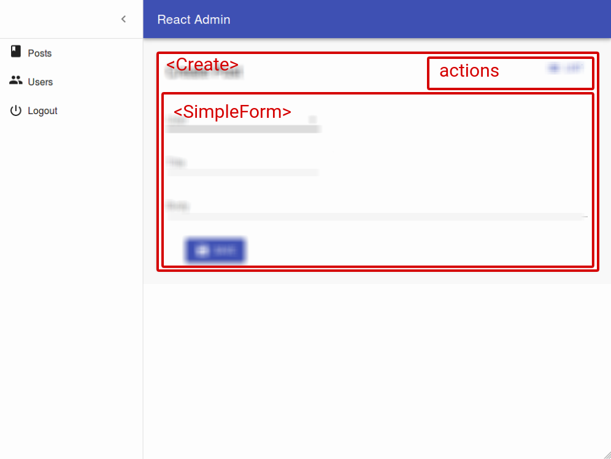

# The Create and Edit Views

The Create and Edit views both display a form, initialized with an empty record (for the Create view) or with a record fetched from the API (for the Edit view). The `<Create>` and `<Edit>` components then delegate the actual rendering of the form to a form component - usually `<SimpleForm>`. This form component uses its children ([`<Input>`](./Inputs.html) components) to render each form input.




## The `<Create>` and `<Edit>` components

The `<Create>` and `<Edit>` components render the page title and actions, and fetch the record from the REST API. They are not responsible for rendering the actual form - that's the job of their child component (usually `<SimpleForm>`), to which they pass the `record` as prop.

Here are all the props accepted by the `<Create>` and `<Edit>` components:

* [`title`](#page-title)
* [`actions`](#actions)

Here is the minimal code necessary to display a form to create and edit comments:

```js
// in src/App.js
import React from 'react';
import { jsonServerRestClient, Admin, Resource } from 'admin-on-rest';

import { PostCreate, PostEdit } from './posts';

const App = () => (
    <Admin restClient={jsonServerRestClient('http://jsonplaceholder.typicode.com')}>
        <Resource name="posts" create={PostCreate} edit={PostEdit} />
    </Admin>
);

export default App;

// in src/posts.js
import React from 'react';
import { Create, Edit, SimpleForm, DisabledInput, TextInput, DateInput, LongTextInput, ReferenceManyField, Datagrid, TextField, DateField, EditButton } from 'admin-on-rest/lib/mui';
import RichTextInput from 'aor-rich-text-input';

export const PostCreate = (props) => (
    <Create {...props}>
        <SimpleForm>
            <TextInput source="title" />
            <TextInput source="teaser" options={{ multiLine: true }} />
            <RichTextInput source="body" />
            <DateInput label="Publication date" source="published_at" defaultValue={new Date()} />
        </SimpleForm>
    </Create>
);

export const PostEdit = (props) => (
    <Edit title={<PostTitle />} {...props}>
        <SimpleForm>
            <DisabledInput label="Id" source="id" />
            <TextInput source="title" validation={{ required: true }} />
            <LongTextInput source="teaser" validation={{ required: true }} />
            <RichTextInput source="body" validation={{ required: true }} />
            <DateInput label="Publication date" source="published_at" />
            <ReferenceManyField label="Comments" reference="comments" target="post_id">
                <Datagrid>
                    <TextField source="body" />
                    <DateField source="created_at" />
                    <EditButton />
                </Datagrid>
            </ReferenceManyField>
        </SimpleForm>
    </Edit>
);
```

That's enough to display the post edit form:


**Tip**: You might find it cumbersome to repeat the same input components for both the `<Create>` and the `<Edit>` view. In practice, these two views almost never have exactly the same form inputs. For instance, in the previous snippet, the `<Edit>` views shows related comments to the current post, which makes no sense for a new post. Having two separate sets of input components for the two view is therefore a deliberate choice. However, if you have the same set of input components, export them as a custom from component to avoid repetition.

### Page Title

By default, the title for the Create view is "Create [resource_name]", and the title for the Edit view is "Edit [resource_name] #[record_id]".

You can customize this title by specifying a custom `title` prop:

```js
export const PostEdit = (props) => (
    <Edit title="Post edition" {...props}>
        ...
    </Edit>
);
```

More interestingly, you can pass a component as `title`. Admin-on-rest clones this component and, in the `<EditView>`, injects the current `record`. This allows to customize the title according to the current record:

```js
const PostTitle = ({ record }) => {
    return <span>Post {record ? `"${record.title}"` : ''}</span>;
};
export const PostEdit = (props) => (
    <Edit title={<PostTitle />} {...props}>
        ...
    </Edit>
);
```

### Actions

You can replace the list of default actions by your own element using the `actions` prop:

```js
import { CardActions } from 'material-ui/Card';
import FlatButton from 'material-ui/FlatButton';
import NavigationRefresh from 'material-ui/svg-icons/navigation/refresh';
import { ListButton, ShowButton, DeleteButton } from 'admin-on-rest/lib/mui';

const cardActionStyle = {
    zIndex: 2,
    display: 'inline-block',
    float: 'right',
};

const PostEditActions = ({ basePath, data, refresh }) => (
    <CardActions style={cardActionStyle}>
        <ShowButton basePath={basePath} record={data} />
        <ListButton basePath={basePath} />
        <DeleteButton basePath={basePath} record={data} />
        <FlatButton primary label="Refresh" onClick={refresh} icon={<NavigationRefresh />} />
        {/* Add your custom actions */}
        <FlatButton primary label="Custom Action" onClick={customAction} />
    </CardActions>
);

export const PostEdit = (props) => (
    <Edit actions={<PostEditActions />} {...props}>
        ...
    </Edit>
);
```

## The `<SimpleForm>` component

The `<SimpleForm>` component receives the `record` as prop from its parent component. It is responsible for rendering the actual form. It is also responsible for validating the form data. Finally, it receives a `handleSubmit` function as prop, to be called with the updated record as argument when the user submits the form.

The `<SimpleForm>` renders its child components line by line (within `<div>` components). It uses `redux-form`.


Here are all the props accepted by the `<SimpleForm>` component:

* [`defautValue`](#default-values)
* [`validation`](#validation)

```js
export const PostCreate = (props) => (
    <Create {...props}>
        <SimpleForm>
            <TextInput source="title" />
            <RichTextInput source="body" />
            <NumberInput source="nb_views" />
        </SimpleForm>
    </Create>
);
```

## The `<TabbedForm>` component

Just like `<SimpleForm>`, `<TabbedForm>` the `record` prop, renders the actual form, and handles form validation on submit. However, the `<TabbedForm>` component renders inputs grouped by tab. The tabs are set by using `<FormTab>` components, which expect a `label` and an `icon` prop.


Here are all the props accepted by the `<TabbedForm>` component:

* [`defautValue`](#default-values)
* [`validation`](#validation)

```js
import { TabbedForm, FormTab } from 'admin-on-rest/lib/mui'

export const PostEdit = (props) => (
    <Edit {...props}>
        <TabbedForm>
            <FormTab label="summary">
                <DisabledInput label="Id" source="id" />
                <TextInput source="title" validation={{ required: true }} />
                <LongTextInput source="teaser" validation={{ required: true }} />
            </FormTab>
            <FormTab label="body">
                <RichTextInput source="body" validation={{ required: true }} addLabel={false} />
            </FormTab>
            <FormTab label="Miscellaneous">
                <TextInput label="Password (if protected post)" source="password" type="password" />
                <DateInput label="Publication date" source="published_at" />
                <NumberInput source="average_note" validation={{ min: 0 }} />
                <BooleanInput label="Allow comments?" source="commentable" defaultValue />
                <DisabledInput label="Nb views" source="views" />
            </FormTab>
            <FormTab label="comments">
                <ReferenceManyField reference="comments" target="post_id" addLabel={false}>
                    <Datagrid>
                        <TextField source="body" />
                        <DateField source="created_at" />
                        <EditButton />
                    </Datagrid>
                </ReferenceManyField>
            </FormTab>
        </TabbedForm>
    </Edit>
);
```

## Default Values

To define default values, you can add a `defaultValue` prop to both view components (`<Edit>` and `<Create>`), or add a `defaultValue` to individual input components.

### Global Default Value

The value of the form `defaultValue` prop must be an object, specifying default value for the created record. For instance:

```js
const postDefaultValue = { created_at: new Date(), nb_views: 0 };
export const PostCreate = (props) => (
    <Create {...props} defaultValue={postDefaultValue}>
        <SimpleForm>
            <TextInput source="title" />
            <RichTextInput source="body" />
            <NumberInput source="nb_views" />
        </SimpleForm>
    </Create>
);
```

**Tip**: You can include properties in the form `defaultValue` that are not listed as input components, like the `created_at` property in the previous example.

### Per Field Default Value

Alternatively, you can specify a `defaultValue` prop directly in `<Input>` components. Admin-on-rest will merge the child default values with the form default value (input > form):

```js
export const PostCreate = (props) => (
    <Create {...props}>
        <SimpleForm>
            <TextInput source="title" />
            <RichTextInput source="body" />
            <NumberInput source="nb_views" defaultValue={0} />
        </SimpleForm>
    </Create>
);
```

## Validation

To validate a form, you can add a `validation` prop to the form component, to individual inputs, or even mix both approaches.

### Global Validation

The value of the form `validation` prop must be a function taking the record as input, and returning an object with error messages indexed by field. For instance:

``` js
const createValidation = (values) => {
    const errors = {};
    if (!values.firstName) {
        errors.firstName = ['The firstName is required'];
    }
    if (!values.age) {
        errors.age = ['The age is required'];
    } else if (values.age < 18) {
        errors.age = ['Must be over 18'];
    }
    return errors
};

export const UserCreate = (props) => (
    <Create {...props}>
        <SimpleForm validation={createValidation}>
            <TextInput label="First Name" source="firstName" />
            <TextInput label="Age" source="age" />
        </SimpleForm>
    </Create>
);
```

### Per Field Validation: Function Validator

Alternatively, you can specify a `validation` prop directly in `<Input>` components. Admin-on-rest will mash all the individual functions up to a single function looking just like the previous one:

```js
const firstNameValidation = (value, values) => {
    if (!value) {
        return ['The firstName is required'];
    }
    return [];
};

const ageValidation = (value, values) => {
    if (!value) {
        return ['The age is required'];
    }
    if (age < 18) {
        return ['Must be over 18'];
    }
    return [];
}

export const UserCreate = (props) => (
    <Create {...props}>
        <SimpleForm>
            <TextInput label="First Name" source="firstName" validation={firstNameValidation} />
            <TextInput label="Age" source="age" validation={ageValidation}/>
        </SimpleForm>
    </Create>
);
```

Input validation functions receive the current field value, and the values of all fields of the current record. This allows for complex validation scenarios (e.g. validate that two passwords are the same).

**Tip**: You can use *both* Form validation and input validation.

### Per Field Validation: Constraints Object

Validation constraints often look the same: asserting presence, size, format, etc. Instead of passing a function as validation, you can pass a constraints object:


```js
export const UserCreate = (props) => (
    <Create {...props}>
        <SimpleForm>
            <TextInput label="First Name" source="firstName" validation={{ required: true }} />
            <TextInput label="Age" source="age" validation={{ required: true, min: 18 }}/>
        </SimpleForm>
    </Create>
);
```


As Admin-on-rest translates these constraints objects to functions, the result is the same as before.

### Constraints Reference

You can use the following validation constraint names:

* `required` if the field is mandatory,
* `min` to specify a minimum value for integers,
* `max` to specify a maximum value for integers,
* `minLength` to specify a minimum length for strings,
* `maxLength` to specify a maximum length for strings,
* `email` to check that the input is a valid email address,
* `regex` to validate that the input matches a regex (must be an object with `pattern` and `message` keys),
* `choices` to validate that the input is within a given list,
* `custom` to use the function of your choice
