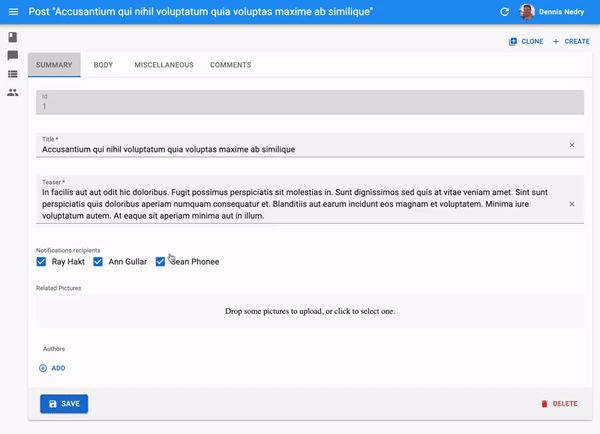

# The Create and Edit Views

The Create and Edit views both display a form, initialized with an empty record (for the Create view) or with a record fetched from the API (for the Edit view). The `<Create>` and `<Edit>` components then delegate the actual rendering of the form to a form component - usually `<SimpleForm>`. This form component uses its children ([`<Input>`](./Inputs.md) components) to render each form input.


## The `<Create>` and `<Edit>` components

The `<Create>` and `<Edit>` components render the page title and actions, and fetch the record from the data provider. They are not responsible for rendering the actual form - that's the job of their child component (usually `<SimpleForm>`), to which they pass the `record` as prop.

Here are all the props accepted by the `<Create>` and `<Edit>` components:

* [`title`](#page-title)
* [`actions`](#actions)

Here is the minimal code necessary to display a form to create and edit comments:


```jsx
// in src/App.js
import React from 'react';
import { Admin, Resource } from 'react-admin';
import jsonServerProvider from 'ra-data-json-server';

import { PostCreate, PostEdit } from './posts';

const App = () => (
    <Admin dataProvider={jsonServerProvider('http://jsonplaceholder.typicode.com')}>
        <Resource name="posts" create={PostCreate} edit={PostEdit} />
    </Admin>
);

export default App;

// in src/posts.js
import React from 'react';
import { Create, Edit, SimpleForm, DisabledInput, TextInput, DateInput, LongTextInput, ReferenceManyField, Datagrid, TextField, DateField, EditButton } from 'react-admin';
import RichTextInput from 'ra-input-rich-text';

export const PostCreate = (props) => (
    <Create {...props}>
        <SimpleForm>
            <TextInput source="title" />
            <TextInput source="teaser" options={{ multiLine: true }} />
            <RichTextInput source="body" />
            <DateInput label="Publication date" source="published_at" defaultValue={new Date()} />
        </SimpleForm>
    </Create>
);

export const PostEdit = (props) => (
    <Edit title={<PostTitle />} {...props}>
        <SimpleForm>
            <DisabledInput label="Id" source="id" />
            <TextInput source="title" validate={required} />
            <LongTextInput source="teaser" validate={required} />
            <RichTextInput source="body" validate={required} />
            <DateInput label="Publication date" source="published_at" />
            <ReferenceManyField label="Comments" reference="comments" target="post_id">
                <Datagrid>
                    <TextField source="body" />
                    <DateField source="created_at" />
                    <EditButton />
                </Datagrid>
            </ReferenceManyField>
        </SimpleForm>
    </Edit>
);
```


That's enough to display the post edit form:


**Tip**: You might find it cumbersome to repeat the same input components for both the `<Create>` and the `<Edit>` view. In practice, these two views almost never have exactly the same form inputs. For instance, in the previous snippet, the `<Edit>` views shows related comments to the current post, which makes no sense for a new post. Having two separate sets of input components for the two view is therefore a deliberate choice. However, if you have the same set of input components, export them as a custom Form component to avoid repetition.

 `<Create>` accepts a `record` prop, to initialize the form based on an value object.

### Page Title

By default, the title for the Create view is "Create [resource_name]", and the title for the Edit view is "Edit [resource_name] #[record_id]".

You can customize this title by specifying a custom `title` prop:

```jsx
export const PostEdit = (props) => (
    <Edit title="Post edition" {...props}>
        ...
    </Edit>
);
```

More interestingly, you can pass a component as `title`. React-admin clones this component and, in the `<EditView>`, injects the current `record`. This allows to customize the title according to the current record:

```jsx
const PostTitle = ({ record }) => {
    return <span>Post {record ? `"${record.title}"` : ''}</span>;
};
export const PostEdit = (props) => (
    <Edit title={<PostTitle />} {...props}>
        ...
    </Edit>
);
```

### Actions

You can replace the list of default actions by your own element using the `actions` prop:

```jsx
import Button from 'material-ui/Button';
import {
    CardActions,
    ListButton,
    ShowButton,
    DeleteButton,
    RefreshButton,
} from 'react-admin';

const PostEditActions = ({ basePath, data, resource }) => (
    <CardActions>
        <ShowButton basePath={basePath} record={data} />
        <ListButton basePath={basePath} />
        <DeleteButton basePath={basePath} record={data} resource={resource} />
        <RefreshButton />
        {/* Add your custom actions */}
        <Button color="primary" onClick={customAction}>Custom Action</Button>
    </CardActions>
);

export const PostEdit = (props) => (
    <Edit actions={<PostEditActions />} {...props}>
        ...
    </Edit>
);
```

Using a custom `EditActions` component also allow to remove the `<DeleteButton>` if you want to prevent deletions from the admin.

## The `<SimpleForm>` component

The `<SimpleForm>` component receives the `record` as prop from its parent component. It is responsible for rendering the actual form. It is also responsible for validating the form data. Finally, it receives a `handleSubmit` function as prop, to be called with the updated record as argument when the user submits the form.

By default the `<SimpleForm>` submits the form when the user presses `ENTER`, if you want
to change this behaviour you can pass `false` for the `submitOnEnter` property.

The `<SimpleForm>` renders its child components line by line (within `<div>` components). It uses `redux-form`.


Here are all the props accepted by the `<SimpleForm>` component:

* [`defautValue`](#default-values)
* [`validate`](#validation)
* [`submitOnEnter`](#submit-on-enter)
* [`redirect`](#redirection-after-submission)
* [`toolbar`](#toolbar)

```jsx
export const PostCreate = (props) => (
    <Create {...props}>
        <SimpleForm>
            <TextInput source="title" />
            <RichTextInput source="body" />
            <NumberInput source="nb_views" />
        </SimpleForm>
    </Create>
);
```

## The `<TabbedForm>` component

Just like `<SimpleForm>`, `<TabbedForm>` receives the `record` prop, renders the actual form, and handles form validation on submit. However, the `<TabbedForm>` component renders inputs grouped by tab. The tabs are set by using `<FormTab>` components, which expect a `label` and an `icon` prop.

By default the `<TabbedForm>` submits the form when the user presses `ENTER`, if you want
to change this behaviour you can pass `false` for the `submitOnEnter` property.



Here are all the props accepted by the `<TabbedForm>` component:

* [`defautValue`](#default-values)
* [`validate`](#validation)
* [`submitOnEnter`](#submit-on-enter)
* [`redirect`](#redirection-after-submission)
* [`toolbar`](#toolbar)


```jsx
import { TabbedForm, FormTab } from 'react-admin'

export const PostEdit = (props) => (
    <Edit {...props}>
        <TabbedForm>
            <FormTab label="summary">
                <DisabledInput label="Id" source="id" />
                <TextInput source="title" validate={required} />
                <LongTextInput source="teaser" validate={required} />
            </FormTab>
            <FormTab label="body">
                <RichTextInput source="body" validate={required} addLabel={false} />
            </FormTab>
            <FormTab label="Miscellaneous">
                <TextInput label="Password (if protected post)" source="password" type="password" />
                <DateInput label="Publication date" source="published_at" />
                <NumberInput source="average_note" validate={[ number, minValue(0) ]} />
                <BooleanInput label="Allow comments?" source="commentable" defaultValue />
                <DisabledInput label="Nb views" source="views" />
            </FormTab>
            <FormTab label="comments">
                <ReferenceManyField reference="comments" target="post_id" addLabel={false}>
                    <Datagrid>
                        <TextField source="body" />
                        <DateField source="created_at" />
                        <EditButton />
                    </Datagrid>
                </ReferenceManyField>
            </FormTab>
        </TabbedForm>
    </Edit>
);
```


## Default Values

To define default values, you can add a `defaultValue` prop to form components (`<SimpleForm>`, `<Tabbedform>`, etc.), or add a `defaultValue` to individual input components.

### Global Default Value

The value of the form `defaultValue` prop can be an object or a function returning an object, specifying default value for the created record. For instance:

```jsx
const postDefaultValue = { created_at: new Date(), nb_views: 0 };
export const PostCreate = (props) => (
    <Create {...props}>
        <SimpleForm defaultValue={postDefaultValue}>
            <TextInput source="title" />
            <RichTextInput source="body" />
            <NumberInput source="nb_views" />
        </SimpleForm>
    </Create>
);
```

**Tip**: You can include properties in the form `defaultValue` that are not listed as input components, like the `created_at` property in the previous example.

### Per Field Default Value

Alternatively, you can specify a `defaultValue` prop directly in `<Input>` components. React-admin will merge the child default values with the form default value (input > form):

```jsx
export const PostCreate = (props) => (
    <Create {...props}>
        <SimpleForm>
            <DisabledInput source="id" defaultValue={() => uuid()}/>
            <TextInput source="title" />
            <RichTextInput source="body" />
            <NumberInput source="nb_views" defaultValue={0} />
        </SimpleForm>
    </Create>
);
```

## Validation

React-admin relies on [redux-form](http://redux-form.com/) for the validation.

To validate values submitted by a form, you can add a `validate` prop to the form component, to individual inputs, or even mix both approaches.

### Global Validation

The value of the form `validate` prop must be a function taking the record as input, and returning an object with error messages indexed by field. For instance:

```jsx
const validateUserCreation = (values) => {
    const errors = {};
    if (!values.firstName) {
        errors.firstName = ['The firstName is required'];
    }
    if (!values.age) {
        errors.age = ['The age is required'];
    } else if (values.age < 18) {
        errors.age = ['Must be over 18'];
    }
    return errors
};

export const UserCreate = (props) => (
    <Create {...props}>
        <SimpleForm validate={validateUserCreation}>
            <TextInput label="First Name" source="firstName" />
            <TextInput label="Age" source="age" />
        </SimpleForm>
    </Create>
);
```

**Tip**: The props you pass to `<SimpleForm>` and `<TabbedForm>` end up as `reduxForm()` parameters. This means that, in addition to `validate`, you can also pass `warn` or `asyncValidate` functions. Read the [`reduxForm()` documentation](http://redux-form.com/6.5.0/docs/api/ReduxForm.md/) for details.

### Per Field Validation: Function Validator

Alternatively, you can specify a `validate` prop directly in `<Input>` components, taking either a function, or an array of functions. These functions should return `undefined` when there is no error, or an error string.

React-admin will mash all the individual functions up to a single function looking just like the previous one:

```jsx
const required = value => value ? undefined : 'Required';
const maxLength = max => value =>
  value && value.length > max ? `Must be ${max} characters or less` : undefined;
const number = value => value && isNaN(Number(value)) ? 'Must be a number' : undefined;
const minValue = min => value =>
  value && value < min ? `Must be at least ${min}` : undefined;

const ageValidation = (value, allValues) => {
    if (!value) {
        return 'The age is required';
    }
    if (value < 18) {
        return 'Must be over 18';
    }
    return [];
}

const validateFirstName = [required, maxLength(15)];
const validateAge = [required, number, ageValidation];

export const UserCreate = (props) => (
    <Create {...props}>
        <SimpleForm>
            <TextInput label="First Name" source="firstName" validate={validateFirstName} />
            <TextInput label="Age" source="age" validate={validateAge}/>
        </SimpleForm>
    </Create>
);
```

Input validation functions receive the current field value, and the values of all fields of the current record. This allows for complex validation scenarios (e.g. validate that two passwords are the same).

**Tip**: Validator functions receive the form `props` as third parameter, including the `translate` function. This lets you build internationalized validators:

```jsx
const required = (value, allValues, props) => value ? undefined : props.translate('myroot.validation.required');
```

**Tip**: Make sure you store your validation functions or array of functions in a variable that you pass to the input component as it can results in a new function or array at every render and trigger infinite rerender.

```jsx
import { Edit, SimpleForm, NumberInput, required, minValue, number } from 'react-admin';

const validateStock = [required, number, minValue(0)];

export const ProductEdit = ({ ...props }) => (
    <Edit {...props}>
        <SimpleForm defaultValue={{ stock: 0 }}>
            ...
            <NumberInput
                source="stock"
                validate={validateStock}
            />
            ...
        </SimpleForm>
    </Edit>
);
```

**Tip**: The props of your Input components are passed to a redux-form `<Field>` component. So in addition to `validate`, you can also use `warn`.

**Tip**: You can use *both* Form validation and input validation.

### Built-in Field Validators

React-admin already bundles a few validator functions, that you can just require and use as field validators:

* `required` if the field is mandatory,
* `minValue(min, message)` to specify a minimum value for integers,
* `maxValue(max, message)` to specify a maximum value for integers,
* `minLength(min, message)` to specify a minimum length for strings,
* `maxLength(max, message)` to specify a maximum length for strings,
* `number` to check that the input is a valid number,
* `email` to check that the input is a valid email address,
* `regex(pattern, message)` to validate that the input matches a regex,
* `choices(list, message)` to validate that the input is within a given list,

Example usage:

```jsx
import { required, minLength, maxLength, minValue, maxValue, number, regex, email, choices } from 'react-admin';

const validateFirstName = [required, minLength(2), maxLength(15)];
const validateAge = [number, minValue(18)];
const validateZipCode = regex(/^\d{5}$/, 'Must be a valid Zip Code');
const validateSex = choices(['m', 'f'], 'Must be Male or Female');

export const UserCreate = (props) => (
    <Create {...props}>
        <SimpleForm>
            <TextInput label="First Name" source="firstName" validate={validateFirstName} />
            <TextInput label="Email" source="email" validate={email} />
            <TextInput label="Age" source="age" validate={validateAge}/>
            <TextInput label="Zip Code" source="zip" validate={validateZipCode}/>
            <SelectInput label="Sex" source="sex" choices={[
                { id: 'm', name: 'Male' },
                { id: 'f', name: 'Female' },
            ]} validate={validateSex}/>
        </SimpleForm>
    </Create>
);
```

## Submit On Enter

By default, pressing `ENTER` in any of the form fields submits the form - this is the expected behavior in most cases. However, some of your custom input components (e.g. Google Maps widget) may have special handlers for the `ENTER` key. In that case, to disable the automated form submission on enter, set the `submitOnEnter` prop of the form component to `false`:

```jsx
export const PostEdit = (props) => (
    <Edit {...props}>
        <SimpleForm submitOnEnter={false}>
            ...
        </SimpleForm>
    </Edit>
);
```

## Redirection After Submission

By default:

- Submitting the form in the `<Create>` view redirects to the `<Edit>` view
- Submitting the form in the `<Edit>` view redirects to the `<List>` view

You can customize the redirection by setting the `redirect` prop of the form component. Possible values are "edit", "show", "list", and `false` to disable redirection. For instance, to redirect to the `<Show>` view after edition:

```jsx
export const PostEdit = (props) => (
    <Edit {...props}>
        <SimpleForm redirect="show">
            ...
        </SimpleForm>
    </Edit>
);
```

This affects both the submit button, and the form submission when the user presses `ENTER` in one of the form fields.

## Toolbar

At the bottom of the form, the toolbar displays the submit button. You can override this component by setting the `toolbar` prop, to display the buttons of your choice.

The most common use case is to display two submit buttons in the `<Create>` view:

- one that creates and redirects to the `<Show>` view of the new resource, and
- one that redirects to a blank `<Create>` view after creation (allowing bulk creation)


For that use case, use the `<SaveButton>` component with a custom `redirect` prop:

```jsx
import { Edit, SimpleForm, SaveButton, Toolbar } from 'react-admin';

const PostCreateToolbar = props => <Toolbar {...props} >
    <SaveButton label="post.action.save_and_show" redirect="show" submitOnEnter={true} />
    <SaveButton label="post.action.save_and_add" redirect={false} submitOnEnter={false} variant="flat" />
</Toolbar>;

export const PostEdit = (props) => (
    <Edit {...props}>
        <SimpleForm toolbar={<PostCreateToolbar />} redirect="show">
            ...
        </SimpleForm>
    </Edit>
);
```

**Tip**: Use react-admin's `<Toolbar>` component instead of material-ui's `<Toolbar>` component. The former builds up on the latter, and adds support for an alternative mobile layout (and is therefore responsive).

**Tip**: Don't forget to also set the `redirect` prop of the Form component to handle submission by the `ENTER` key.

## Customize Input Containers Styles

The input components are wrapped inside a `div` to ensure a good looking form by default. You can pass a `formClassName` prop to the input components to customize the style of this `div`. For example, here is how to display two inputs on the same line:


```js
const styles = {
    inlineBlock: { display: 'inline-flex', marginRight: '1rem' },
};
export const UserEdit = withStyles(editStyles)(({ classes, ...props }) => (
    <Edit {...props}>
        <SimpleForm>
            <TextInput
                formClassName={classes.inlineBlock}
                source="first_name"
            />
            <TextInput
                formClassName={classes.inlineBlock}
                source="last_name"
            />
            {/* This input will be display below the two first one */}
            <TextInput
                type="email"
                source="email"
                validation={{ email: true }}
            />
        </SimpleForm>
    </Edit>
```


## Displaying Fields or Inputs depending on the user permissions

You might want to display some fields, inputs or filters only to users with specific permissions. Those permissions are retrieved for each route and will provided to your component as a `permissions` prop.

Each route will call the `authProvider` with the `AUTH_GET_PERMISSIONS` type and some parameters including the current location and route parameters. It's up to you to return whatever you need to check inside your component such as the user's role, etc.

Here's an example inside a `Create` view with a `SimpleForm` and a custom `Toolbar`:


```jsx
const UserCreateToolbar = ({ permissions, ...props }) =>
    <Toolbar {...props}>
        <SaveButton
            label="user.action.save_and_show"
            redirect="show"
            submitOnEnter={true}
        />
        {permissions === 'admin' &&
            <SaveButton
                label="user.action.save_and_add"
                redirect={false}
                submitOnEnter={false}
                variant="flat"
            />}
    </Toolbar>;

export const UserCreate = ({ permissions, ...props }) =>
    <Create {...props}>
        <SimpleForm
            toolbar={<UserCreateToolbar permissions={permissions} />}
            defaultValue={{ role: 'user' }}
        >
            <TextInput source="name" validate={[required]} />
            {permissions === 'admin' &&
                <TextInput source="role" validate={[required]} />}
        </SimpleForm>
    </Create>;
```


**Tip** Note how the `permissions` prop is passed down to the custom `toolbar` component.

This also works inside an `Edition` view with a `TabbedForm`, and you can hide a `FormTab` completely:


```jsx
export const UserEdit = ({ permissions, ...props }) =>
    <Edit title={<UserTitle />} {...props}>
        <TabbedForm defaultValue={{ role: 'user' }}>
            <FormTab label="user.form.summary">
                {permissions === 'admin' && <DisabledInput source="id" />}
                <TextInput source="name" validate={required} />
            </FormTab>
            {permissions === 'admin' &&
                <FormTab label="user.form.security">
                    <TextInput source="role" validate={required} />
                </FormTab>}
        </TabbedForm>
    </Edit>;
```

