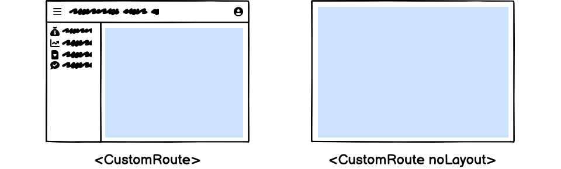

# `<CustomRoutes>`

Lets you define custom pages in your react-admin application, using [react-router-dom](https://reactrouter.com/en/6/start/concepts#defining-routes) `<Routes>` elements.

<iframe src="https://www.youtube-nocookie.com/embed/aanhV-3SLtI" title="YouTube video player" frameborder="0" allow="accelerometer; autoplay; clipboard-write; encrypted-media; gyroscope; picture-in-picture; web-share" allowfullscreen style="aspect-ratio: 16 / 9;width:100%;margin-bottom:1em;"></iframe>


## Usage

To register your own routes, pass one or several `<CustomRoutes>` elements as children of `<Admin>`. Declare as many [react-router-dom](https://reactrouter.com/en/6/start/concepts#defining-routes) `<Route>` as you want inside them.
Alternatively, you can add your custom routes to resources. They will be available under the resource prefix.

```jsx
// in src/App.js
import { Admin, Resource, CustomRoutes } from 'react-admin';
import { Route } from "react-router-dom";

import { dataProvider } from './dataProvider';
import posts from './posts';
import comments from './comments';
import { Settings } from './Settings';
import { Profile } from './Profile';

const App = () => (
    <Admin dataProvider={dataProvider}>
        <Resource name="posts" {...posts} />
        <Resource name="comments" {...comments} />
        <CustomRoutes>
            <Route path="/settings" element={<Settings />} />
            <Route path="/profile" element={<Profile />} />
        </CustomRoutes>
    </Admin>
);

export default App;
```

Now, when a user browses to `/settings` or `/profile`, the components you defined will appear in the main part of the screen.

**Tip**: Custom routes don't automatically appear in the menu. You have to manually [customize the menu](#adding-custom-routes-to-the-menu) if you want custom routes to be accessible from the menu.

## `children`

`children` of the `<CustomRoutes>` component must be `<Route>` elements from [react-router-dom](https://reactrouter.com/en/6/start/concepts#defining-routes), mapping a `path` with a custom `element`.

```jsx
// in src/App.js
import { Admin, Resource, CustomRoutes } from 'react-admin';
import { Route } from "react-router-dom";

import { dataProvider } from './dataProvider';
import { Settings } from './Settings';
import { Profile } from './Profile';

const App = () => (
    <Admin dataProvider={dataProvider}>
        <CustomRoutes>
            <Route path="/settings" element={<Settings />} />
            <Route path="/profile" element={<Profile />} />
        </CustomRoutes>
    </Admin>
);

export default App;
```

You can learn more about the `<Route>` element in the [react-router-dom documentation](https://reactrouter.com/en/6/start/concepts#defining-routes).

## `noLayout`

By default, custom routes render within the application layout. If you want a custom route to render without the layout, e.g. for registration screens, then provide the `noLayout` prop on the `<CustomRoutes>` element.



Here is an example of application configuration mixing custom routes with and without layout:

```jsx
// in src/App.js
import { Admin, CustomRoutes } from 'react-admin';
import { Route } from "react-router-dom";

import { dataProvider } from './dataProvider';
import { Register } from './Register';
import { Settings } from './Settings';
import { Profile } from './Profile';

const App = () => (
    <Admin dataProvider={dataProvider}>
        <CustomRoutes noLayout>
            <Route path="/register" element={<Register />} />
        </CustomRoutes>
        <CustomRoutes>
            <Route path="/settings" element={<Settings />} />
            <Route path="/profile" element={<Profile />} />
        </CustomRoutes>
    </Admin>
);
```

As illustrated above, there can be more than one `<CustomRoutes>` element inside an `<Admin>` component.

## Securing Custom Routes

By default, custom routes can be accessed even by anomymous users. If you want to restrict access to authenticated users, use the [`<Authenticated>`](./Authenticated.md) component when defining the route.

```jsx
// in src/App.js
import { Admin, CustomRoutes, Authenticated } from 'react-admin';
import { Route } from "react-router-dom";

import { dataProvider } from './dataProvider';
import { Settings } from './Settings';

const App = () => (
    <Admin dataProvider={dataProvider}>
        <CustomRoutes>
            <Route path="/settings" element={<Authenticated><Settings /></Authenticated>} />
        </CustomRoutes>
    </Admin>
);
```

## Customizing The Page Title

To define the page title (displayed in the app bar), custom pages should use [the `<Title>` component](./Title.md).


Here is a simple example:

```jsx
// in src/Settings.js
import * as React from "react";
import { Card, CardContent } from '@mui/material';
import { Title } from 'react-admin';

const Settings = () => (
    <Card>
        <Title title="My Page" />
        <CardContent>
            ...
        </CardContent>
    </Card>
);

export default Settings;
```

`<Title>` uses a [React Portal](https://react.dev/reference/react-dom/createPortal), so it doesn't matter *where* you put it in your component. The title will always be rendered in the app bar.

## Adding Custom Routes to the Menu

To add your custom pages to the navigation menu, you have to replace the default menu by a [custom menu](./Menu.md) with entries for the custom pages.

First, create a custom menu. Make sure to use the same value in the `<Menu.Item to>` prop as in the `<Route path>` prop.

```jsx
// in src/MyMenu.js
import { Menu } from 'react-admin';
import SettingsIcon from '@mui/icons-material/Settings';
import PeopleIcon from '@mui/icons-material/People';

export const MyMenu = () => (
    <Menu>
        <Menu.DashboardItem />
        <Menu.ResourceItems />
        <Menu.Item to="/settings" primaryText="Users" leftIcon={<SettingsIcon />}/>
        <Menu.Item to="/profile" primaryText="Miscellaneous" leftIcon={<PeopleIcon />}/>
    </Menu>
);
```

Next, pass the custom menu to a custom `<Layout>` component:

```jsx
// in src/MyLayout.js
import { Layout } from 'react-admin';
import { MyMenu } from './MyMenu';

export const MyLayout = ({ children }) => (
    <Layout menu={MyMenu}>
        {children}
    </Layout>
);
```

Finally, pass the custom `<Layout>` component to `<Admin>`:

```jsx
// in src/App.js
import { Admin, Resource, CustomRoutes } from 'react-admin';
import { Route } from "react-router-dom";

import { dataProvider } from './dataProvider';
import { MyLayout } from './MyLayout';
import posts from './posts';
import comments from './comments';
import { Settings } from './Settings';
import { Profile } from './Profile';

const App = () => (
    <Admin dataProvider={dataProvider} layout={MyLayout}>
        <Resource name="posts" {...posts} />
        <CustomRoutes>
            <Route path="/settings" element={<Settings />} />
            <Route path="/profile" element={<Profile />} />
        </CustomRoutes>
    </Admin>
);
```

To learn more about custom menus, check [the `<Menu>` documentation](./Menu.md).

## Linking To Custom Routes

You can link to your pages using [react-router's Link component](https://reactrouter.com/en/main/components/link). Make sure to use the same value in the `<Link to>` prop as in the `<Route path>` prop.

```jsx
import { Link as RouterLink } from 'react-router-dom';
import { Link } from '@mui/material';

const SettingsButton = () => (
    <Link component={RouterLink} to="/settings">
        Settings
    </Link>
);
```

## Sub-Routes

Sometimes you want to add more routes to a resource path. For instance, you may want to add a custom page to the `/posts` resource, such as `/posts/analytics`.

To do so, add the `<Route>` elements as [children of the `<Resource>` element](./Resource.md#children):

```jsx
import { Admin, Resource } from 'react-admin';
import { Route } from "react-router-dom";

import { dataProvider } from './dataProvider';
import posts from './posts';

const App = () => (
    <Admin dataProvider={dataProvider}>
        <Resource name="posts" {...posts}>
            <Route path="analytics" element={<PostAnalytics/>} />
        </Resource>
    </Admin>
);

// is equivalent to
const App = () => (
    <Admin dataProvider={dataProvider}>
        <Resource name="posts" {...posts} />
        <CustomRoutes>
            <Route path="/posts/analytics" element={<PostAnalytics />} />
        </CustomRoutes>
    </Admin>
);
```

This is usually useful for nested resources, such as books on authors:


```jsx
// in src/App.jss
import { Admin, Resource, ListGuesser, EditGuesser } from 'react-admin';
import { Route } from "react-router-dom";

const App = () => (
    <Admin dataProvider={dataProvider}>
        <Resource name="authors" list={ListGuesser} edit={EditGuesser}>
            <Route path=":authorId/books" element={<BookList />} />
        </Resource>
    </Admin>
);

// in src/BookList.jss
import { useParams } from 'react-router-dom';
import { List, Datagrid, TextField } from 'react-admin';

const BookList = () => {
    const { authorId } = useParams();
    return (
        <List resource="books" filter={{ authorId }}>
            <Datagrid>
                <TextField source="id" />
                <TextField source="title" />
                <TextField source="year" />
            </Datagrid>
        </List>
    );
};
```


**Tip**: In the above example, the `resource="books"` prop is required in `<List>` because the `ResourceContext` defaults to `authors` inside the `<Resource name="authors">`.

Check [the `<Resource>` element documentation](./Resource.md#children) for more information.