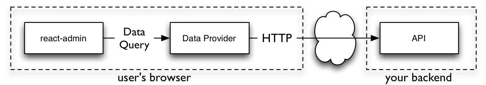

# Data Fetching

You can build a react-admin app on top of any API, whether it uses REST, GraphQL, RPC, or even SOAP, regardless of the dialect it uses. This works because react-admin doesn't use `fetch` directly. Instead, it uses a Data Provider object to interface with your API, and [react-query](https://tanstack.com/query/v3/docs/react/overview) to handle data fetching.

## The Data Provider

Whenever react-admin needs to communicate with your APIs, it does it through an object called the `dataProvider`. The `dataProvider` exposes a predefined interface that allows react-admin to query any API in a normalized way. 



For instance, to query the API for a single record, react-admin calls `dataProvider.getOne()`: 

```js
dataProvider
    .getOne('posts', { id: 123 })
    .then(response => {
        console.log(response.data); // { id: 123, title: "hello, world" }
    });
```

It's the Data Provider's job to turn these method calls into HTTP requests, and transform the HTTP responses to the data format expected by react-admin. In technical terms, a Data Provider is an *adapter* for an API. 

Thanks to this adapter system, react-admin can communicate with any API. Check out the [list of supported backends](./DataProviderList.md) to pick an open-source package for your API.

You can also [Write your own Data Provider](./DataProviderWriting.md) so that it fits the particularities of your backend(s). Data Providers can use `fetch`, `axios`, `apollo-client`, or any other library to communicate with APIs. The Data Provider is also the ideal place to add custom HTTP headers, authentication, etc.

A Data Provider must have the following methods:

```jsx
const dataProvider = {
    getList:    (resource, params) => Promise, // get a list of records based on sort, filter, and pagination
    getOne:     (resource, params) => Promise, // get a single record by id
    getMany:    (resource, params) => Promise, // get a list of records based on an array of ids
    getManyReference: (resource, params) => Promise, // get the records referenced to another record, e.g. comments for a post
    create:     (resource, params) => Promise, // create a record
    update:     (resource, params) => Promise, // update a record based on a patch
    updateMany: (resource, params) => Promise, // update a list of records based on an array of ids and a common patch
    delete:     (resource, params) => Promise, // delete a record by id
    deleteMany: (resource, params) => Promise, // delete a list of records based on an array of ids
}
```

**Tip**: A Data Provider can have [more methods](#adding-custom-methods) than the 9 methods listed above. For instance, you create a dataProvider with custom methods for calling non-REST API endpoints, manipulating tree structures, subscribing to real time updates, etc.

The Data Provider is at the heart of react-admin's architecture. By being very opinionated about the Data Provider interface, react-admin can be very flexible AND provide very sophisticated features, including reference handling, optimistic updates, and automated navigation.

## `<Admin dataProvider>`

The first step to use a Data Provider is to pass it to [the `<Admin>` component](./Admin.md). You can do so by using the `dataProvider` prop.

You can either pick a data provider from the list of [supported API backends](./DataProviderList.md), or [write your own](./DataProviderWriting.md).

As an example, let's focus on [the Simple REST data provider](https://github.com/marmelab/react-admin/tree/master/packages/ra-data-simple-rest). It fits REST APIs using simple GET parameters for filters and sorting.

Install the `ra-data-simple-rest` package to use this provider.

```sh
yarn add ra-data-simple-rest
```

Then, initialize the provider with the REST backend URL, and pass the result to the `dataProvider` prop of the `<Admin>` component:

```jsx
// in src/App.js
import * as React from "react";
import { Admin, Resource } from 'react-admin';
import simpleRestProvider from 'ra-data-simple-rest';

import { PostList } from './posts';

const dataProvider = simpleRestProvider('http://path.to.my.api/');

const App = () => (
    <Admin dataProvider={dataProvider}>
        <Resource name="posts" list={PostList} />
    </Admin>
);

export default App;
```

That's enough to make all react-admin components work. 

Here is how this particular Data Provider maps react-admin calls to API calls:

| Method name        | API call                                                                                |
| ------------------ | --------------------------------------------------------------------------------------- |
| `getList`          | `GET http://my.api.url/posts?sort=["title","ASC"]&range=[0, 24]&filter={"title":"bar"}` |
| `getOne`           | `GET http://my.api.url/posts/123`                                                       |
| `getMany`          | `GET http://my.api.url/posts?filter={"ids":[123,456,789]}`                              |
| `getManyReference` | `GET http://my.api.url/posts?filter={"author_id":345}`                                  |
| `create`           | `POST http://my.api.url/posts`                                                          |
| `update`           | `PUT http://my.api.url/posts/123`                                                       |
| `updateMany`       | Multiple calls to `PUT http://my.api.url/posts/123`                                     |
| `delete`           | `DELETE http://my.api.url/posts/123`                                                    |
| `deleteMany`       | Multiple calls to `DELETE http://my.api.url/posts/123`                                  |

**Note**: The simple REST client expects the API to include a `Content-Range` header in the response to `getList` calls. The value must be the total number of resources in the collection. This allows react-admin to know how many pages of resources there are in total, and build the pagination controls.

```
Content-Range: posts 0-24/319
```

If your API is on another domain as the JS code, you'll need to whitelist this header with an `Access-Control-Expose-Headers` [CORS](https://developer.mozilla.org/en-US/docs/Web/HTTP/Access_control_CORS) header.

```
Access-Control-Expose-Headers: Content-Range
```

## Enabling Query Logs

React-admin uses `react-query` to call the dataProvider. You can see all the calls made by react-query in the browser thanks to [the react-query devtools](https://react-query-v3.tanstack.com/devtools).


To enable these devtools, add the `<ReactQueryDevtools>` component to a custom Layout:

```jsx
import { Layout } from 'react-admin';
import { ReactQueryDevtools } from 'react-query/devtools';

export const MyLayout = props => (
    <>
        <Layout {...props} />
        <ReactQueryDevtools initialIsOpen={false} />
    </>
);
```

Then use this layout in `<Admin>`:

```jsx
import { Admin, Resource } from 'react-admin';

import { dataProvider } from './dataProvider';
import { MyLayout } from './MyLayout';

export const App = () => (
    <Admin dataProvider={dataProvider} layout={MyLayout}>
        <Resource name="posts" list={PostList} />
    </Admin>
);
```

**Tip**: By default, React Query Devtools are only included in bundles when `process.env.NODE_ENV === 'development'`, so you don't need to worry about excluding them during a production build.

**Tip**: Some Data Providers have their own logging system. Refer to their documentation to learn more. For instance, [the `ra-data-fakerest` package](https://github.com/marmelab/react-admin/tree/master/packages/ra-data-fakerest) logs all the calls to the REST API in the browser console when you pass `true` as second argument:

```jsx
// in src/App.js
import * as React from "react";
import { Admin, Resource } from 'react-admin';
import fakeDataProvider from 'ra-data-fakerest';

const dataProvider = fakeDataProvider({ /* data here */ }, true);

const App = () => (
    <Admin dataProvider={dataProvider}>
        // ...
    </Admin>
);
```

## Handling Authentication

In react-admin, the `dataProvider` is responsible for fetching data, and [the `authProvider`](./Authentication.md) is responsible for managing authentication. In order to authenticate API requests, you must use info from the `authProvider` in the queries made by the `dataProvider`. You can use `localStorage` for this purpose.

For instance, here is how to use a token returned during the login process to authenticate all requests to the API via a Bearer token, using the Simple REST data provider:

```js
// in authProvider.js
const authProvider = {
    login: ({ username, password }) =>  {
        const request = new Request('https://mydomain.com/authenticate', {
            method: 'POST',
            body: JSON.stringify({ username, password }),
            headers: new Headers({ 'Content-Type': 'application/json' }),
        });
        return fetch(request)
            .then(response => {
                if (response.status < 200 || response.status >= 300) {
                    throw new Error(response.statusText);
                }
                return response.json();
            })
            .then(({ token }) => {
                // store the token in local storage
                localStorage.setItem('token', token);
            })
            .catch(() => {
                throw new Error('Network error')
            });
    },
    // ...
};

// in dataProvider.js
import { fetchUtils } from 'react-admin';
import simpleRestProvider from 'ra-data-simple-rest';

const fetchJson = (url, options = {}) => {
    options.user = {
        authenticated: true,
        // use the token from local storage
        token: localStorage.getItem('token')
    };
    return fetchUtils.fetchJson(url, options);
};
const dataProvider = simpleRestProvider('http://path.to.my.api/', fetchJson);
```

Now all the requests to the REST API will contain the `Authorization: SRTRDFVESGNJYTUKTYTHRG` header.

In this example, the `simpleRestProvider` accepts a second parameter to set authentication. Each Data Provider has its own way of accepting credentials. Refer to the documentation of your Data Provider for details. 

## Adding Custom Headers

The `dataProvider` doesn't "speak" HTTP, so it doesn't have the notion of HTTP headers. If you need to pass custom headers to the API, the syntax depends on the Data Provider you use. 

For instance, the `simpleRestProvider` function accepts an HTTP client function as its second argument. By default, it uses react-admin's [`fetchUtils.fetchJson()`](./fetchJson.md) function as the HTTP client. It's similar to the HTML5 `fetch()`, except it handles JSON decoding and HTTP error codes automatically.

That means that if you need to add custom headers to your requests, you can just *wrap* the `fetchJson()` call inside your own function:

```jsx
import { fetchUtils, Admin, Resource } from 'react-admin';
import simpleRestProvider from 'ra-data-simple-rest';

const fetchJson = (url, options = {}) => {
    if (!options.headers) {
        options.headers = new Headers({ Accept: 'application/json' });
    }
    // add your own headers here
    options.headers.set('X-Custom-Header', 'foobar');
    return fetchUtils.fetchJson(url, options);
}
const dataProvider = simpleRestProvider('http://path.to.my.api/', fetchJson);

const App = () => (
    <Admin dataProvider={dataProvider}>
        <Resource name="posts" list={PostList} />
    </Admin>
);
```

**Tip**: For TypeScript users, here is a typed version of the `fetchJson` function:

```ts
const fetchJson = (url: string, options: fetchUtils.Options = {}) => {
    const customHeaders = (options.headers ||
        new Headers({
            Accept: 'application/json',
        })) as Headers;
    // add your own headers here
    customHeaders.set('X-Custom-Header', 'foobar');
    options.headers = customHeaders;
    return fetchUtils.fetchJson(url, options);
}
```

Now all the requests to the REST API will contain the `X-Custom-Header: foobar` header.

**Tip:** Have a look at the [`fetchJson` documentation](./fetchJson.md) to learn more about its features.

**Warning**: If your API is on another domain as the JS code, you'll need to whitelist this header with an `Access-Control-Expose-Headers` [CORS](https://developer.mozilla.org/en-US/docs/Web/HTTP/Access_control_CORS) header.

```
Access-Control-Expose-Headers: X-Custom-Header
```

This must be done on the server side.

## Adding Lifecycle Callbacks

It often happens that you need specific data logic to be executed before or after a dataProvider call. For instance, you may want to delete the comments related to a post before deleting the post itself. The general advice is to **put that code on the server-side**. If you can't, the next best place to put this logic is the `dataProvider`. 

You can, of course, use `if` statements in the `dataProvider` methods to execute the logic only for the resources that need it, like so:

```jsx
const dataProvider = {
    // ...
    delete: async (resource, params) => {
        if (resource === 'posts') {
            // delete all comments related to the post
            // first, fetch the comments
            const { data: comments } = await httpClient(`${apiUrl}/comments?post_id=${params.id}`);
            // then, delete them
            await Promise.all(comments.map(comment => httpClient(`${apiUrl}/comments/${comment.id}`, {
                method: 'DELETE',
            })));
        }
        // fallback to the default implementation
        const { data } = await httpClient(`${apiUrl}/${resource}/${params.id}`, {
            method: 'DELETE',
        });

        return { data };
    },
    // ...
}
```

But the `dataProvider` code quickly becomes hard to read and maintain. React-admin provides a helper function to make it easier to add lifecycle callbacks to the dataProvider: `withLifecycleCallbacks`:

```jsx
import { withLifecycleCallbacks } from 'react-admin';

const dataProvider = withLifecycleCallbacks(baseDataProvider, [
    {
        resource: 'posts',
        beforeDelete: async (params, dataProvider) => {
            // delete all comments related to the post
            // first, fetch the comments
            const { data: comments } = await dataProvider.getList('comments', {
                filter: { post_id: params.id },
                pagination: { page: 1, perPage: 1000 },
                sort: { field: 'id', order: 'DESC' },
            });
            // then, delete them
            await dataProvider.deleteMany('comments', { ids: comments.map(comment => comment.id) });

            return params;
        },
    },
]);
```

Check the [withLifecycleCallbacks](./withLifecycleCallbacks.md) documentation for more details.

## Adding Custom Methods

Your API backend may expose non-CRUD endpoints, e.g. for calling RPC endpoints. 

For instance, let's say your API exposes an endpoint to ban a user based on its `id`:

```
POST /api/user/123/ban
```

The react-admin way to expose these endpoints to the app components is to add a custom method in the `dataProvider`:

```jsx
import simpleRestDataProvider from 'ra-data-simple-rest';

const baseDataProvider = simpleRestDataProvider('http://path.to.my.api/');

export const dataProvider = {
    ...baseDataProvider,
    banUser: (userId) => {
        return fetch(`/api/user/${userId}/ban`, { method: 'POST' })
            .then(response => response.json());
    },
}
```

Then you can use react-query's `useMutation` hook to call the `dataProvider.banUser()` method:

```jsx
import { useDataProvider } from 'react-admin';
import { useMutation } from 'react-query';

const BanUserButton = ({ userId }) => {
    const dataProvider = useDataProvider();
    const { mutate, isLoading } = useMutation(
        () => dataProvider.banUser(userId)
    );
    return <Button label="Ban" onClick={() => mutate()} disabled={isLoading} />;
};
```

Check the [Calling Custom Methods](./Actions.md#calling-custom-methods) documentation for more details.

## Async Initialization

Some Data Providers need an asynchronous initialization phase (e.g. to connect to the API). To use such Data Providers, initialize them *before* rendering react-admin resources, leveraging React's `useState` and `useEffect`.

For instance, the `ra-data-hasura` data provider needs to be initialized:

```jsx
import React, { useState, useEffect } from 'react';
import buildHasuraProvider from 'ra-data-hasura';
import { Admin, Resource } from 'react-admin';

import { PostCreate, PostEdit, PostList } from './posts';

const App = () => {
    // start with an empty data provider
    const [dataProvider, setDataProvider] = useState(null);

    // initialize on mount
    useEffect(() => {
        buildHasuraProvider({
            clientOptions: { uri: 'http://localhost:8080/v1/graphql' }
        }).then(() => setDataProvider(() => dataProvider));
    }, []);

    // hide the admin until the data provider is ready
    if (!dataProvider) return <p>Loading...</p>;

    return (
        <Admin dataProvider={dataProvider}>
            <Resource name="Post" list={PostList} edit={PostEdit} create={PostCreate} />
        </Admin>
    );
};

export default App;
```

**Tip**: This example uses the function version of `setState` (`setDataProvider(() => dataProvider))`) instead of the more classic version (`setDataProvider(dataProvider)`). This is because some legacy Data Providers are actually functions, and `setState` would call them immediately on mount.  

## Combining Data Providers

If you need to build an app relying on more than one API, you may face a problem: the `<Admin>` component accepts only one `dataProvider` prop. You can combine multiple data providers into one using the `combineDataProviders` helper. It expects a function as parameter accepting a resource name and returning a data provider for that resource.

For instance, the following app uses `ra-data-simple-rest` for the `posts` and `comments` resources,  and `ra-data-local-storage` for the `user` resource:

```jsx
import buildRestProvider from 'ra-data-simple-rest';
import buildStorageProvider from 'ra-data-local-storage';
import { Admin, Resource, combineDataProviders } from 'react-admin';

const dataProvider1 = buildRestProvider('http://path.to.my.api/');
const dataProvider2 = buildStorageProvider();

const dataProvider = combineDataProviders((resource) => {
    switch (resource) {
        case 'posts':
        case 'comments':
            return dataProvider1;
        case 'users':
            return dataProvider2;
        default:
            throw new Error(`Unknown resource: ${resource}`);
    }
});

export const App = () => (
    <Admin dataProvider={dataProvider}>
        <Resource name="posts" list={PostList} />
        <Resource name="comments" list={CommentList} />
        <Resource name="users" list={UserList} />
    </Admin>
);
```

If the choice of dataProvider doesn't only rely on the resource name, or if you want to manipulate the resource name, combine Data Providers manually using a JavaScript `Proxy` object. 

For instance, you can prefix your resource names to facilitate the API selection:

```jsx
import buildRestProvider from 'ra-data-simple-rest';
import buildStorageProvider from 'ra-data-local-storage';
import { Admin, Resource, defaultDataProvider } from 'react-admin';

const dataProvider1 = buildRestProvider('http://path.to.my.api/');
const dataProvider2 = buildStorageProvider();

const dataProvider = new Proxy(defaultDataProvider, {
    get: (target, name) => {
        return (resource, params) => {
            if (typeof name === 'symbol' || name === 'then') {
                return;
            }
            if (resource.startsWith('api1/')) {
                return dataProvider1[name](resource.substring(5), params);
            }
            if (resource.startsWith('api2/')) {
                return dataProvider2[name](resource.substring(5), params);
            }
        }
    },
});

export const App = () => (
    <Admin dataProvider={dataProvider}>
        <Resource name="api1/posts" list={PostList} />
        <Resource name="api1/comments" list={CommentList} />
        <Resource name="api2/users" list={UserList} />
    </Admin>
);
```

## React-Query Options

React-admin uses [react-query](https://react-query-v3.tanstack.com/) to fetch, cache and update data. Internally, the `<Admin>` component creates a react-query [`QueryClient`](https://tanstack.com/query/v3/docs/react/reference/QueryClient) on mount, using [react-query's "aggressive but sane" defaults](https://react-query-v3.tanstack.com/guides/important-defaults):

* Queries consider cached data as stale
* Stale queries are refetched automatically in the background when:
  * New instances of the query mount
  * The window is refocused
  * The network is reconnected
  * The query is optionally configured with a refetch interval
* Query results that are no longer used in the current page are labeled as "inactive" and remain in the cache in case they are used again at a later time.
* By default, "inactive" queries are garbage collected after 5 minutes.
* Queries that fail are silently retried 3 times, with exponential backoff delay before capturing and displaying an error to the UI.
* Query results by default are structurally shared to detect if data has actually changed and if not, the data reference remains unchanged to better help with value stabilization with regards to `useMemo` and `useCallback`. 

If you want to override the react-query default query and mutation default options, or use a specific client or mutation cache, you can create your own `QueryClient` instance and pass it to the `<Admin queryClient>` prop:

```jsx
import { Admin } from 'react-admin';
import { QueryClient } from 'react-query';

const queryClient = new QueryClient({
    defaultOptions: {
        queries: {
            retry: false,
            structuralSharing: false,
        },
        mutations: {
            retryDelay: 10000,
        },
    },
});

const App = () => (
    <Admin queryClient={queryClient} dataProvider={...}>
        ...
    </Admin>
);
```

To know which options you can pass to the `QueryClient` constructor, check the [react-query documentation](https://tanstack.com/query/v3/docs/react/reference/QueryClient) and the [query options](https://tanstack.com/query/v3/docs/react/reference/useQuery) and [mutation options](https://tanstack.com/query/v3/docs/react/reference/useMutation) sections.

The settings that react-admin developers often overwrite are:

```jsx
import { QueryClient } from 'react-query';

const queryClient = new QueryClient({
    defaultOptions: {
        queries: {
            /**
             * The time in milliseconds after data is considered stale.
             * If set to `Infinity`, the data will never be considered stale.
             */
            staleTime: 10000,
            /**
             * If `false`, failed queries will not retry by default.
             * If `true`, failed queries will retry infinitely., failureCount: num
             * If set to an integer number, e.g. 3, failed queries will retry until the failed query count meets that number.
             * If set to a function `(failureCount, error) => boolean` failed queries will retry until the function returns false.
             */
            retry: false,
            /**
             * If set to `true`, the query will refetch on window focus if the data is stale.
             * If set to `false`, the query will not refetch on window focus.
             * If set to `'always'`, the query will always refetch on window focus.
             * If set to a function, the function will be executed with the latest data and query to compute the value.
             * Defaults to `true`.
             */
            refetchOnWindowFocus: false,
        },
    },
});
```

## Calling The Data Provider

You can call the data provider directly from your own React components, combining it with react-query's `useQuery` and `useMutation` hooks. However, this is such a common use case that react-admin provides a hook for each of the data provider methods.

For instance, to call `dataProvider.getOne()`, use the `useGetOne` hook:

```jsx
import { useGetOne } from 'react-admin';
import { Loading, Error } from './MyComponents';

const UserProfile = ({ userId }) => {
    const { data: user, isLoading, error } = useGetOne('users', { id: userId });

    if (isLoading) return <Loading />;
    if (error) return <Error />;
    if (!user) return null;

    return (
        <ul>
            <li>Name: {user.name}</li>
            <li>Email: {user.email}</li>
        </ul>
    )
};
```

The [Querying the API](./Actions.md) documentation lists all the hooks available for querying the API, as well as the options and return values for each of them.

## Handling File Uploads

When a user submits a form with a file input, the dataProvider method (`create` or `update`) receives [a `File` object](https://developer.mozilla.org/en-US/docs/Web/API/File). You can use that `File` object to send the file in the format your server expects:
- you can [send files as Base64 string](#sending-files-in-base64), using the [`FileReader`](https://developer.mozilla.org/en-US/docs/Web/API/FileReader) API;
- you can [send file using multipart/form-data](#sending-files-in-multipartform-data) (i.e. send the record data and their files in one query);
- or you might want [to send files to a third party service](#sending-files-to-a-third-party-service) such as CDN;
- etc.

### Sending Files In Base64

The following `dataProvider` extends an existing `dataProvider` to convert images passed to `dataProvider.update('posts')` into Base64 strings. The example leverages [`withLifecycleCallbacks`](#adding-lifecycle-callbacks) to modify the `dataProvider.update()` method for the `posts` resource only.

```js
import { withLifecycleCallbacks, DataProvider } from 'react-admin';
import simpleRestProvider from 'ra-data-simple-rest';

const dataProvider = withLifecycleCallbacks(simpleRestProvider('http://path.to.my.api/'), [
    {
        /**
         * For posts update only, convert uploaded images to base 64 and attach them to
         * the `picture` sent property, with `src` and `title` attributes.
         */
        resource: 'posts',
        beforeUpdate: async (params: any, dataProvider: DataProvider) => {
            // Freshly dropped pictures are File objects and must be converted to base64 strings
            const newPictures = params.data.pictures.filter(
                p => p.rawFile instanceof File
            );
            const formerPictures = params.data.pictures.filter(
                p => !(p.rawFile instanceof File)
            );

            const base64Pictures = await Promise.all(
                newPictures.map(convertFileToBase64)
            )
            
            const pictures = [
                ...base64Pictures.map((dataUrl, index) => ({
                    src: dataUrl,
                    title: newPictures[index].name,
                })),
                ...formerPictures,
            ];

            return {
                ...params,
                data: {
                    ...params.data,
                    pictures,
                }
            };
        }
    }
]);

/**
 * Convert a `File` object returned by the upload input into a base 64 string.
 * That's not the most optimized way to store images in production, but it's
 * enough to illustrate the idea of dataprovider decoration.
 */
const convertFileToBase64 = file =>
    new Promise((resolve, reject) => {
        const reader = new FileReader();
        reader.onload = () => resolve(reader.result);
        reader.onerror = reject;
        reader.readAsDataURL(file.rawFile);
    });

export default myDataProvider;
```

**Tip**: Use `beforeSave` instead of `beforeUpdate` to do the same for both create and update calls.

### Sending Files In `multipart/form-data`

In case you need to upload files, as you would with an HTML form but to your API, you can use the [FormData](https://developer.mozilla.org/en-US/docs/Web/API/FormData) API. It uses the same format as a form would use if the encoding type were set to `multipart/form-data`.

The following `dataProvider` extends an existing one and tweaks its `create` and `update` methods for the `posts` resource only. It is the role of your API to negotiate the request and process the image. 

The data provider sends the `post` data with the attached file in one query and works this way:
- it checks if the resource is `posts`;
- if so, it creates a new `FormData` object with the `post` data and the file received from the form;
- it sends this `FormData` to the API with the react-admin [`fetchUtils.fetchJson()`](./fetchJson.md) function; 
- if the resource is other than `posts`, it simply uses the `baseDataProvider` base methods.

Let's have a look:

```ts
import simpleRestDataProvider from "ra-data-simple-rest";
import {
  CreateParams,
  UpdateParams,
  DataProvider,
  fetchUtils,
} from "react-admin";

const endpoint = "http://path.to.my.api";
const baseDataProvider = simpleRestDataProvider(endpoint);

type PostParams = {
  id: string;
  title: string;
  content: string;
  picture: {
    rawFile: File;
    src?: string;
    title?: string;
  };
};

const createPostFormData = (
  params: CreateParams<PostParams> | UpdateParams<PostParams>
) => {
  const formData = new FormData();
  params.data.picture?.rawFile && formData.append("file", params.data.picture.rawFile);
  params.data.title && formData.append("title", params.data.title);
  params.data.content && formData.append("content", params.data.content);

  return formData;
};

export const dataProvider: DataProvider = {
  ...baseDataProvider,
  create: (resource, params) => {
    if (resource === "posts") {
      const formData = createPostFormData(params);
      return fetchUtils
        .fetchJson(`${endpoint}/${resource}`, {
          method: "POST",
          body: formData,
        })
        .then(({ json }) => ({ data: json }));
    }

    return baseDataProvider.create(resource, params);
  },
  update: (resource, params) => {
    if (resource === "posts") {
      const formData = createPostFormData(params);
      formData.append("id", params.id);
      return fetchUtils
        .fetchJson(`${endpoint}/${resource}`, {
          method: "PUT",
          body: formData,
        })
        .then(({ json }) => ({ data: json }));
    }

    return baseDataProvider.update(resource, params);
  },
};
```

### Sending Files To A Third-Party Service

A common way to handle file uploads in single-page-apps is to first upload the file to a CDN such as [Cloudinary](https://cloudinary.com/) or [CloudImage](https://www.cloudimage.io/en/home), then use the file URL generated by the CDN in the record creation / modification payload.

Let's see an example with the [Cloudinary](https://cloudinary.com/) service, by adapting the `dataProvider` according to [their "Authenticated requests" example](hhtps://cloudinary.com/documentation/upload_images#authenticated_requests).

To do that, you need an API that serves a [`signature`](https://cloudinary.com/documentation/upload_images#generating_authentication_signatures) in the format that Cloudinary expect. To make it easier, you can install the [`cloudinary` package](https://cloudinary.com/documentation/node_integration#installation_and_setup).

The following example generates and serves the signature needed to send files to Cloudinary. It uses Remix:

```ts
// handles the "get-cloudinary-signature" route and should be secured
import { LoaderFunctionArgs, json } from "@remix-run/node";
import cloudinary from "cloudinary";

export const loader = ({ request }: LoaderFunctionArgs) => {
  cloudinary.v2.config({
    api_key: process.env.CLOUDINARY_API_KEY,
    api_secret: process.env.CLOUDINARY_API_SECRET,
    cloud_name: process.env.CLOUDINARY_CLOUD_NAME,
    secure: false,
  });

  const timestamp = Math.round(new Date().getTime() / 1000);

  const signature = cloudinary.v2.utils.api_sign_request(
    {
      timestamp: timestamp,
    },
    process.env.CLOUDINARY_API_SECRET as string
  );

  return json({
    timestamp,
    signature,
    cloud_name: process.env.CLOUDINARY_CLOUD_NAME,
    api_key: process.env.CLOUDINARY_API_KEY,
  });
};
```

The following `dataProvider` extends an existing one and leverages [`withLifecycleCallbacks`](#adding-lifecycle-callbacks) to modify the `dataProvider.create()` and `dataProvider.update()` methods for the `posts` resource only with the [`beforeSave`](./withLifecycleCallbacks.md#beforesave) methods. 

It works as follow:
- it grabs the Cloudinary signature to allow the autentication in the request;
- it creates a new `FormData` object with the file received from the form;
- it sends this file to the Cloudinary API; 
- it populates the `params.picture` object with the data sent by Cloudinary;
- it returns the `params` object to allow the parent `dataProvider` to carry out its processes.

An example is worth a thousand words:

```ts
// dataProvider.ts
import { DataProvider, withLifecycleCallbacks } from "react-admin";
import simpleRestProvider from "ra-data-simple-rest";

type CloudinaryFile = {
  asset_id: string;
  secure_url: string;
};

type SignData = {
  api_key: string;
  timestamp: string;
  signature: string;
  cloud_name: string;
};

const endpoint = "http://path.to.my.api";

const dataProvider = withLifecycleCallbacks(
  simpleRestProvider(endpoint),
  [
    {
      resource: "posts",
      beforeSave: async (params: any, dataProvider: DataProvider) => {
        const response = await fetch(
          `${endpoint}/get-cloudinary-signature`,
          { method: "GET" }
          // should send headers with correct authentications
        );

        const signData: SignData = await response.json();

        const url = `https://api.cloudinary.com/v1_1/${signData.cloud_name}/auto/upload`;

        const formData = new FormData();
        formData.append("file", params.picture.rawFile);
        formData.append("api_key", signData.api_key);
        formData.append("timestamp", signData.timestamp);
        formData.append("signature", signData.signature);

        const imageResponse = await fetch(url, {
          method: "POST",
          body: formData,
        });

        const image: CloudinaryFile = await imageResponse.json();

        return {
          ...params,
          picture: {
            src: image.secure_url,
            title: image.asset_id,
          },
        };
      },
    },
  ]
);
```

Feel free to read the [Cloudinary Get Started doc](https://cloudinary.com/documentation/programmable_media_overview) to learn more.
