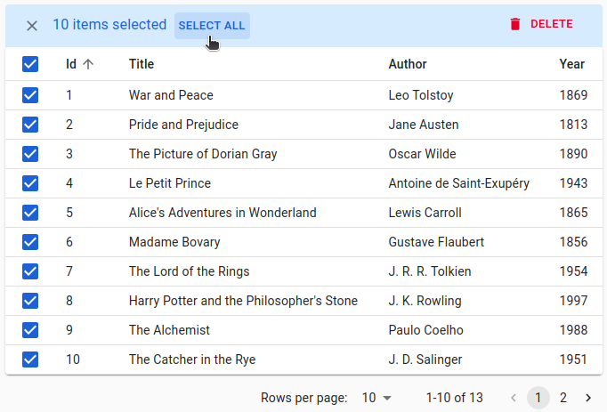

# `<DataTable>`

The `<DataTable>` component renders a list of records as a table. It supports sorting, row selection for bulk actions, a collapsible panel, hiding and reordering columns, dynamic row and cell styles, and more.

<iframe src="https://www.youtube-nocookie.com/embed/IHjBd9WrVcI" title="YouTube video player" frameborder="0" allow="accelerometer; autoplay; clipboard-write; encrypted-media; gyroscope; picture-in-picture; web-share" allowfullscreen style="aspect-ratio: 16 / 9;width:100%;margin-bottom:1em;"></iframe>

## Usage

Use `<DataTable>` inside a `ListContext` (e.g., as a descendent of [`<List>`](./List.md#list) or [`<ReferenceManyField>`](./ReferenceManyField.md)). Define the table columns with its children using `<DataTable.Col>` components:

```tsx
import { List, DataTable, ReferenceField, EditButton } from 'react-admin';

export const PostList = () => (
    <List>
        <DataTable>
            <DataTable.Col source="id" />
            <DataTable.Col label="User">
                <ReferenceField source="user_id" reference="users" />
            </DataTable.Col>
            <DataTable.Col source="title" />
            <DataTable.Col>
                <EditButton />
            </DataTable.Col>
        </DataTable>
    </List>
);
```


Each `<DataTable.Col>` defines one column of the table: its `source` (used for sorting), its header `label` (inferred from the `source` when missing), its style, etc. 

`<DataTable.Col>` also defines how to render the cells of the column. When used without a child, it outputs the `record` `source` using `lodash.get`. When used with a child, it renders this child in a `RecordContext`. This means you can use [any `Field` component](./Fields.md) as child. 

`<DataTable>` is an **iterator** component: it gets an array of records from the `ListContext`, and iterates to display each record in a row. Other examples of iterator components are:

- [`<SimpleList>`](./SimpleList.md) renders each record as a single line in a vertical list
- [`<SingleFieldList>`](./SingleFieldList.md) renders a single field for each record
- [`<DatagridAG>`](./DatagridAG.md) is a more advanced spreadsheet component with support for aggregation, pivoting, row grouping, infinite scroll, etc.

## Props

| Prop                 | Required | Type                    | Default               | Description                                                   |
| -------------------- | -------- | ----------------------- | --------------------- | ------------------------------------------------------------- |
| `children`           | Required | Element                 | n/a                   | The list of columns to render.                                |
| `body`               | Optional | Element                 | `<DataTable Body>`    | The component rendering the table body.           |
| `bulkActionButtons`  | Optional | Element                 | `<BulkDelete Button>` | The buttons to display when records are selected.             |
| `bulkActionToolbar`  | Optional | Element                 | `<BulkDelete Button>` | The component rendering the bulk action toolbar.         |
| `empty`              | Optional | Element                 | `<Empty>`             | The component to render when the list is empty.                 |
| `expand`             | Optional | Element                 |                       | The component rendering the expand panel for each row.   |
| `expandSingle`       | Optional | Boolean                 | `false`               | Whether to allow only one expanded row at a time.             |
| `head`               | Optional | Element                 | `<DataTable Header>`   | The component rendering the table header.                |
| `hiddenColumns`      | Optional | Array                   | `[]`                  | The list of columns to hide by default.                          |
| `foot`               | Optional | Element                 |                       | The component rendering the table footer.                |
| `hover`              | Optional | Boolean                 | `true`                | Whether to highlight the row under the mouse.                 |
| `isRowExpandable`    | Optional | Function                | `() => true`          | A function that returns whether a row is expandable.          |
| `isRowSelectable`    | Optional | Function                | `() => true`          | A function that returns whether a row is selectable.          |
| `rowClick`           | Optional | mixed                   |                       | The action to trigger when the user clicks on a row.          |
| `rowSx`              | Optional | Function                |                       | A function that returns the `sx` prop to apply to a row.        |
| `size`               | Optional | `'small'` or `'medium'` | `'small'`             | The size of the table.                                        |
| `storeKey`           | Optional | String                  |                       | The key to use to store the hidden columns in local storage. |
| `sx`                 | Optional | Object                  |                       | The sx prop passed down to the Material UI `<Table>` element. |

Additional props are passed down to [the Material UI `<Table>` element](https://mui.com/material-ui/api/table/).

## `body`

By default, `<DataTable>` renders its body using `<DataTableBody>`, an internal react-admin component. You can pass a custom component as the `body` prop to override that default. And by the way, `<DataTableBody>` renders each row using `<DataTableRow>`, and you can override this default by passing a custom `row` component. This means you can customize the `<DataTable>` UI without copying several components from the react-admin source.

For instance, the following code creates a striped table, where only odd rows get a background:


```tsx
import {
    DataTable,
    DataTableBody,
    List,
    SelectRowCheckbox,
    useRecordContext,
    type DataTableRowProps,
    type DataTableBodyProps,
    type DataTableProps,
} from "react-admin";
import { TableCell, TableRow } from "@mui/material";

const MyDataTableRow = ({ children }: DataTableRowProps) => {
    const record = useRecordContext();
    return record ? (
        <TableRow
            sx={{
                '&:nth-of-type(odd)': {
                    backgroundColor: theme.palette.action.hover,
                },
            }}
        >
            <TableCell padding="checkbox">
                <SelectRowCheckbox />
            </TableCell>
            {children}
        </TableRow>
    ) : null;
};

const MyDataTableBody = (props: DataTableBodyProps) => (
    <DataTableBody {...props} row={MyDataTableRow} />
);
const MyDataTable = (props: DataTableProps) => (
    <DataTable {...props} body={MyDataTableBody} />
);

const PostList = () => (
    <List>
        <MyDataTable>
            <DataTable.Col source="title" />
            ...
        </MyDataTable>
    </List>
);

export default PostList;
```


**Tip**: `<DataTable>` already sets `RaDataTable-rowEven` and `RaDataTable-rowOdd` classes on the rows, so you don't need to use a custom DataTable body to implement zebra stripes. You can just use [the `sx` prop](#sx-css-api) to set the background color of these classes.


```tsx
const PostList = () => (
    <List>
        <DataTable
            sx={{ '& .RaDataTable-rowOdd': { backgroundColor: '#fee' } }}
        >
            ...
        </DataTable>
    </List>
);
```


**Tip**: `<DataTable>` also lets you customize the table [header](#header) and [footer](#footer) components.

## `bulkActionButtons`

Bulk action buttons appear when users select one or several rows. Clicking on a bulk action button affects all the selected records. This is useful for actions like mass deletion or mass edition.

<iframe src="https://www.youtube-nocookie.com/embed/zbr1xLjAXz4" title="YouTube video player" frameborder="0" allow="accelerometer; autoplay; clipboard-write; encrypted-media; gyroscope; picture-in-picture; web-share" allowfullscreen style="aspect-ratio: 16 / 9;width:100%;margin-bottom:1em;"></iframe>

You can disable this feature by setting the `bulkActionButtons` prop to `false`:

```tsx
import { DataTable, List } from 'react-admin';

export const PostList = () => (
    <List>
        <DataTable bulkActionButtons={false}>
            ...
        </DataTable>
    </List>
);
```

By default, all DataTables have a single bulk action button, the bulk delete button. You can add other bulk action buttons by passing a custom element as the `<DataTable bulkActionButtons>` prop:


```tsx
import { List, DataTable, BulkUpdateButton, BulkDeleteButton, BulkExportButton } from 'react-admin';
import { VisibilityOff } from '@mui/icons-material';

const PostBulkActionButtons = () => (
    <>
        <BulkUpdateButton label="Reset Views" data={{ views: 0 }} icon={<VisibilityOff/>} />
        <BulkDeleteButton />
        <BulkExportButton />
    </>
);

export const PostList = () => (
    <List>
        <DataTable bulkActionButtons={<PostBulkActionButtons />}>
            ...
        </DataTable>
    </List>
);
```


<video controls autoplay playsinline muted loop poster="./img/BulkActionButtons.jpg">
  <source src="./img/bulk-actions-toolbar.mp4" type="video/mp4"/>
  Your browser does not support the video tag.
</video>

React-admin provides four bulk action buttons that you can use in data tables:

- [`<BulkDeleteButton>`](./Buttons.md#bulkdeletebutton) (enabled by default)
- [`<BulkExportButton>`](./Buttons.md#bulkexportbutton) to export only the selection
- [`<BulkUpdateButton>`](./Buttons.md#bulkupdatebutton) to immediately update the selection
- [`<BulkUpdateFormButton>`](./Buttons.md#bulkupdateformbutton) to display a form allowing to update the selection

**Tip**: Users can select a range of rows by pressing the shift key while clicking a row checkbox.

<video controls autoplay playsinline muted loop>
  <source src="./img/datagrid-select-range.mp4" type="video/mp4"/>
  Your browser does not support the video tag.
</video>

**Tip**: When users select all the records of the current page using the "select all" checkbox in the header, the bulk actions toolbar shows a ["Select All" button](./Buttons.md#selectallbutton) to let them select all the records regardless of pagination.



You can write a custom bulk action button components using the [`useListContext`](./useListContext.md) hook to get the following data and callbacks:

* `selectedIds`: the identifiers of the currently selected items.
* `onUnselectItems`: a callback to empty the selection.
* `resource`: the currently displayed resource (e.g., `posts`, `comments`, etc.)
* `filterValues`: the filter values. This can be useful if you want to apply your action on all items matching the filter.

Here is an example leveraging the `useUpdateMany` hook, which sets the `views` property of all posts to `0`:

```tsx
// in ./CustomResetViewsButton.tsx
import {
    useListContext,
    useUpdateMany,
    useRefresh,
    useNotify,
    useUnselectAll,
    Button,
} from 'react-admin';
import { VisibilityOff } from '@mui/icons-material';

const CustomResetViewsButton = () => {
    const { selectedIds } = useListContext();
    const refresh = useRefresh();
    const notify = useNotify();
    const unselectAll = useUnselectAll('posts');
    const [updateMany, { isPending }] = useUpdateMany();
    const handleClick = () => {
        updateMany(
            'posts',
            { ids: selectedIds, data: { views: 0 } },
            {
                onSuccess: () => {
                    notify('Posts updated');
                    unselectAll();
                },
                onError: () => {
                    notify('Error: posts not updated', { type: 'error' });
                    refresh();
                },
            }
        );
    }

    return (
        <Button label="Reset views" onClick={handleClick} disabled={isPending}>
            <VisibilityOff />
        </Button>
    );
};
```

But most of the time, bulk actions are mini-applications with a standalone user interface (in a Dialog). Here is the same `<CustomResetViewsAction>` implemented behind a confirmation dialog:

```tsx
// in ./CustomResetViewsButton.tsx
import { useState } from 'react';
import {
    Button,
    Confirm,
    useListContext,
    useUpdateMany,
    useNotify,
    useRefresh,
    useUnselectAll,
} from 'react-admin';

const CustomResetViewsButton = () => {
    const { selectedIds } = useListContext();
    const [open, setOpen] = useState(false);
    const refresh = useRefresh();
    const notify = useNotify();
    const unselectAll = useUnselectAll('posts');
    const [updateMany, { isPending }] = useUpdateMany(
        'posts',
        { ids: selectedIds, data: { views: 0 } },
        {
            onSuccess: () => {
                notify('Posts updated');
                unselectAll();
            },
            onError: error => {
                notify('Error: posts not updated', { type: 'error' });
                refresh();
            },
        }
    );
    const handleClick = () => setOpen(true);
    const handleDialogClose = () => setOpen(false);

    const handleConfirm = () => {
        updateMany();
        setOpen(false);
    };

    return (
        <>
            <Button label="Reset Views" onClick={handleClick} />
            <Confirm
                isOpen={open}
                loading={isPending}
                title="Update View Count"
                content="Are you sure you want to reset the views for these items?"
                onConfirm={handleConfirm}
                onClose={handleDialogClose}
            />
        </>
    );
};

export default CustomResetViewsButton;
```

**Tip**: [`<Confirm>`](./Confirm.md) leverages Material UI's `<Dialog>` component to implement a confirmation popup. Feel free to use it in your admins!

**Tip**: `<Confirm>` text props such as `title` and `content` are translatable. You can pass translation keys in these props. Note: `content` is only translatable when the value is a `string`. Otherwise, it renders the content as a `ReactNode`.

**Tip**: You can customize the text of the two `<Confirm>` component buttons using the `cancel` and `confirm` props which accept translation keys. You can customize the icons by setting the `ConfirmIcon` and `CancelIcon` props, which accept a [SvgIcon](https://mui.com/material-ui/icons/#svgicon) type.

**Tip**: React-admin doesn't use the `<Confirm>` component internally because deletes and updates are applied locally immediately and then dispatched to the server after a few seconds unless the user chooses to undo the modification. That's what we call optimistic rendering. You can do the same for the `<ResetViewsButton>` by setting `undoable: true` in the last argument of `useUpdateMany()`, as follows:

```diff
// in ./CustomResetViewsButton.js
import * as React from "react";
import {
    Button,
-   Confirm,
    useListContext,
    useUpdateMany,
-   useRefresh,
    useNotify,
    useUnselectAll,
} from 'react-admin';
import { VisibilityOff } from '@mui/icons-material';

const CustomResetViewsButton = () => {
    const { selectedIds } = useListContext();
-   const refresh = useRefresh();
    const notify = useNotify();
    const unselectAll = useUnselectAll('posts');
    const [updateMany, { isPending }] = useUpdateMany(
        'posts',
        { ids: selectedIds, data: { views: 0 } },
        {
            onSuccess: () => {
-               refresh();
-               notify('Posts updated');
+               notify('Posts updated', { undoable: true }); // the last argument forces the display of 'undo' in the notification
                unselectAll();
            },
            onError: error => notify('Error: posts not updated', { type: 'error' }),
+           mutationMode: 'undoable'
        }
    );

    return (
        <Button
            label="simple.action.resetViews"
            disabled={isPending}
            onClick={updateMany}
        >
            <VisibilityOff />
        </Button>
    );
};
```

## `children`

`<DataTable>` delegates the rendering of table columns to its children. Use `<DataTable.Col>` elements to define the characteristics of each column.

Columns need only to define a `source`. `<DataTable.Col>` uses this source to determine the column label (formed by humanizing the source), the field to use for sorting, and the field to render in each cell:

```tsx
import { List, DataTable } from 'react-admin';

export const OrderList = () => (
    <List>
        <DataTable>
            <DataTable.Col source="reference" />
            <DataTable.Col source="date" />
            <DataTable.Col source="customer.lastName" />
            <DataTable.Col source="amount" />
            <DataTable.Col source="status" />
        </DataTable>
    </List>
);
```

To render data differently in a column, you can pass a custom `<DataTable.Col field>`. For example, you can use [`<NumberField>`](./NumberField.md) to render a numeric field:

```tsx
<DataTable.Col source="amount" align="right" field={NumberField} />
```

If you need to pass props to the custom field, use the `<DataTable.Col children>` instead:


```tsx
<DataTable.Col source="amount" align="right">
    <NumberField source="amount" options={{ style: 'currency', currency: 'USD' }} />
</DataTable.Col>
```


**Tip**: Rendering numeric values in a table is such a common need that react-admin provides `<DataTable.NumberCol>` just for that:


```tsx
<DataTable.NumberCol source="amount" options={{ style: 'currency', currency: 'USD' }} />
```


`<NumberField>` is a Field component: it reads the record (via `useRecordContext`) and renders a value. React-admin includes many Field components that you can use as `field` or `children` of `<DataTable.Col>` ([`<TextField>`](./TextField.md), [`<NumberField>`](./NumberField.md), [`<DateField>`](./DateField.md), [`<ReferenceField>`](./ReferenceField.md), and many more). Check [the Fields documentation](./Fields.md) for more information.

You can build your own if none of the react-admin Field components fit your need. For example, to render the first name and last name in a cell:

```tsx
import { useRecordContext, List, DataTable } from 'react-admin';

const CustomerField = () => {
    const record = useRecordContext();
    if (!record) return null;
    return (
        <>
            {record.customer.firstName} {record.customer.lastName}
        </>
    );
}

export const OrderList = () => (
    <List>
        <DataTable>
            <DataTable.Col source="reference" />
            <DataTable.Col source="date" />
            <DataTable.Col 
                source="customer.lastName" 
                label="Customer"
                field={CustomerField}
            />
            <DataTable.NumberCol source="amount" />
            <DataTable.Col source="status" />
        </DataTable>
    </List>
);
```

**Tip**: You can even go one step further and create reusable columns:

```tsx
import { DataTable, List, WithRecord } from 'react-admin';

const CustomerColumn = () => (
    <DataTable.Col source="customer.lastName" label="Customer">
        <WithRecord render={record => `${record.customer.firstName} ${record.customer.lastName}`} />
    </DataTable.Col>
);

export const OrderList = () => (
    <List>
        <DataTable>
            <DataTable.Col source="reference" />
            <DataTable.Col source="date" />
            <CustomerColumn />
            <DataTable.NumberCol source="amount" />
            <DataTable.Col source="status" />
        </DataTable>
    </List>
);
```

Learn more about how to customize columns in the [`<DataTable.Col>`](#datatablecol) section below. 

## `empty`

When rendered inside an empty list with no records, `<DataTable>` displays a message instead of a table:

> No books found

You can customize this message via react-admin's [translation system](./Translation.md), by setting a custom translation for the `ra.navigation.no_results` key.

```tsx
const messages = {
    ra: {
        navigation: {
            no_results: 'No %{name} found',
        }
    }
}
```

If you need to go beyond text, pass a custom element as the `<DataTable empty>` prop:

```tsx
const EmptyBooks = () => (
    <p>
        No books found. Do you want to <Link to="/books/create">create one</Link>?
    </p>
);

const BookList = () => (
    <List>
        <DataTable empty={<EmptyBooks />}>
            ...
        </DataTable>
    </List>
);
```

**Tip**: `<List>` and other list components usually manage the empty state themselves (e.g., via the [`<List empty>`](./List.md#empty) prop), so the `empty` prop will only be useful if you render a `<DataTable>` manually in a `ListContext`.

## `expand`

<video controls autoplay playsinline muted loop>
  <source src="./img/datagrid_expand.mp4" type="video/mp4"/>
  Your browser does not support the video tag.
</video>

To show more data without adding too many columns, `<DataTable>` offers a collapsible panel for each row. Use the `expand` prop to define the panel element rendered inside a `RecordContext`.

For instance, this code shows the HTML `body` of a post in an expandable panel:


```tsx
import { useRecordContext, List, DataTable } from 'react-admin';

const PostPanel = () => {
    const record = useRecordContext();
    return (
        <div dangerouslySetInnerHTML={{ __html: record.body }} />
    );
};

const PostList = () => (
    <List>
        <DataTable expand={<PostPanel />}>
            ...
        </DataTable>
    </List>
)
```

**Tip**: You can actually use a [Show Layout component](./SimpleShowLayout.md) for the `expand` prop:

```tsx
const PostPanel = () => (
    <SimpleShowLayout>
        <RichTextField source="body" />
    </SimpleShowLayout>
);
```

**Tip**: You can go one step further and embed an `<Edit>` view in the expand panel:

```tsx
const PostPanel = () => {
    const record = useRecordContext();
    const resource = useResourceContext();
    return (
        <Edit
            resource={resource}
            id={record.id}
            /* disable the app title change when shown */
            title=" "
        >
            <SimpleForm>
                <RichTextInput source="body" />
            </SimpleForm>
        </Edit>
    );
};
```

**Tip**: To enable the expand panel only for some rows, use [the `isRowExpandable` prop](#isrowexpandable).

## `expandSingle`

By default, when using [an `expand` panel](#expand), users can expand as many rows as they want. The `expandSingle` prop changes that behavior: when a user clicks on the expand button of a row, other expanded rows collapse. Consequently, only a single row can be expanded at a time.

```tsx
export const PostList = () => (
    <List>
        <DataTable expand={<PostPanel />} expandSingle>
            ...
        </DataTable>
    </List>
);
```

## `foot`

Use the `foot` prop to add a table footer component, e.g., to display totals or averages.


Use the `useDataTableDataContext` hook to access the data displayed in the table. 

```tsx
import { TableFooter, TableRow, TableCell } from '@mui/material';
import { DataTable, useDataTableDataContext } from 'react-admin';

const ProductTableFoot = () => {
    const data = useDataTableDataContext();
    const totalSales = data.reduce(
        (sum, record) => sum + (record.sales ? record.sales : 0),
        0
    );
    return (
        <TableFooter>
            <TableRow>
                <TableCell
                    variant="footer"
                    colSpan={4}
                    sx={{ textAlign: 'right' }}
                >
                    Total sales
                </TableCell>
                <TableCell variant="footer" align="right">
                    {totalSales}
                </TableCell>
            </TableRow>
        </TableFooter>
    );
};

const ProductList = () => (
    <List>
        <DataTable foot={ProductTableFoot}>
            ...
        </DataTable>
    </List>
);
```

## `head`

By default, `<DataTable>` renders the table head using `<DataTableHead>`, an internal react-admin component. To override that default, you can pass a custom component as the `head` prop. This can be useful, e.g., to add a second header row or to create headers spanning multiple columns.


For instance, here is a simple DataTable header that displays column names with no sort and no "select all" button:

```tsx
import { TableHead, TableRow, TableCell } from "@mui/material";
import { DataTable, DataTableHeadProps, List, SelectPageCheckbox } from "react-admin";

const MyDataTableHead = ({ children }: DataTableHeadProps) => (
    <TableHead>
        <TableRow>
            <TableCell variant="head"></TableCell>
            <TableCell variant="head" colSpan={2} sx={{ textAlign: 'center' }}>
                Main info
            </TableCell>
            <TableCell variant="head" colSpan={2} sx={{ textAlign: 'center' }}>
                Misc info
            </TableCell>
        </TableRow>
        <TableRow>
            <TableCell variant="head" padding="checkbox">
                <SelectPageCheckbox />
            </TableCell>
            {children}
        </TableRow>
    </TableHead>
);

const PostList = () => (
    <List>
        <DataTable head={MyDataTableHead}>
            <DataTable.Col source="id" />
            <DataTable.Col source="title" />
            <DataTable.Col source="author" />
            <DataTable.Col source="year" />
        </DataTable>
    </List>
);
```

**Tip**: To handle sorting in your custom DataTable head component, check out the [Building a custom sort control](./ListTutorial.md#building-a-custom-sort-control) section.

## `hiddenColumns`

By default, `<DataTable>` renders all `<DataTable.Col>` children. Use the `hiddenColumns` property to set hidden columns by default.

```tsx
import { ColumnsButton, TopToolbar, List, DataTable } from 'react-admin';

const PostListActions = () => (
        <TopToolbar>
          <ColumnsButton />
        </TopToolbar>
)

const PostList = () => (
    <List actions={<PostListActions />}>
        <DataTable hiddenColumns={['id', 'author']}>
            <DataTable.Col source="id" />
            <DataTable.Col source="title" />
            <DataTable.Col source="author" />
            <DataTable.Col source="year" />
        </DataTable>
    </List>
);
```

Using `hiddenColumns` instead of removing `<DataTable.Col>` elements allows hidden columns to be displayed again using a `<ColumnsButton>`, as explained in the [Hiding or Reordering Columns](#hiding-or-reordering-columns) section.

## `hover`

By default, when a user hovers over a row, the background color changes to indicate the row is active. Set the `hover` prop to `false` to disable this behavior.

```tsx
const PostList = () => (
    <List>
        <DataTable hover={false}>
            <DataTable.Col source="id" />
            <DataTable.Col source="title" />
            <DataTable.Col source="views" />
        </DataTable>
    </List>
);
```

## `isRowExpandable`

Using the `isRowExpandable` prop, you can customize which rows can have a collapsible panel. It expects a function that receives the row record and returns a boolean.

For instance, this code shows an expand button only for rows that have a detail to show:

```tsx
import { List, DataTable useRecordContext } from 'react-admin';

const PostPanel = () => {
    const record = useRecordContext();
    return (
        <div dangerouslySetInnerHTML={{ __html: record.body }} />
    );
};

const PostList = () => (
    <List>
        <DataTable
            expand={<PostPanel />}
            isRowExpandable={row => row.has_detail}
        >
            ...
        </DataTable>
    </List>
)
```

## `isRowSelectable`

You can customize which rows are selectable using the `isRowSelectable` prop. It expects a function that receives the row record and returns a boolean. When the function returns false, the selection checkbox is disabled.

For instance, this code enables a checkbox only for rows with an ID greater than 300:

```tsx
import { List, DataTable } from 'react-admin';

export const PostList = () => (
    <List>
        <DataTable isRowSelectable={record => record.id > 300 }>
            ...
        </DataTable>
    </List>
);
```


## `rowClick`

By default, `<DataTable>` uses the current [resource definition](https://marmelab.com/react-admin/Resource.html) to determine what to do when the user clicks on a row. If the resource has a `show` page, a row click redirects to the Show view. If the resource has an `edit` page, a row click redirects to the Edit view. Otherwise, the row is not clickable.

**Tip**: If you enable [Access Control](./Permissions.md#access-control), react-admin also checks that the current user can access the Show and Edit views. For instance, for a `DataTable` on the `posts` resource, react-admin calls `canAccess` with the following parameters for each record:

- `{ action: "show", resource: 'posts', record: Object }` if the `posts` resource has a Show view,
- `{ action: "edit", resource: 'posts', record: Object }` if the `posts` resource has an Edit view.

You can choose what happens when the user clicks on a row by setting the `rowClick` prop. For instance, set the `rowClick` prop to `"edit"` to redirect to the Edit view:

```tsx
import { List, DataTable } from 'react-admin';

export const PostList = () => (
    <List>
        <DataTable rowClick="edit">
            ...
        </DataTable>
    </List>
);
```

`rowClick` accepts the following values:

* `"edit"` to redirect to the edition view
* `"show"` to redirect to the show view
* `"expand"` to open the `expand` panel
* `"toggleSelection"` to trigger the `onToggleItem` function
* `false` to do nothing
* a function `(id, resource, record) => path` that may return any of the above values or a custom path

**Tip**: If you pass a function, it can return `'edit'`, `'show'`, `false` or a router path. This allows redirecting to either the Edit or Show view after checking a condition on the record. For example:

```tsx
import type { Identifier, RaRecord } from 'react-admin';
const postRowClick = (id: Identifier, resource: string, record: RaRecord) => record.editable ? 'edit' : 'show';
```

**Tip**: `rowClick` accepts async functions, allowing you to call an external API to determine the action to trigger.

## `rowSx`

You can customize the styles of rows and cells in `<DataTable>` (applied to the `<DataTableRow>` element) based on the record, thanks to the `rowSx` prop, which expects a function.

For instance, this allows to add a custom left border to reviews in a list depending on their `status`:


React-admin calls the `rowSx` function for each row, passing the current record and index as arguments. The function should return a Material UI [`sx`](https://mui.com/system/getting-started/the-sx-prop/) value, which react-admin uses to set the `<TableRow sx>`.

```tsx
import { List, DataTable } from 'react-admin';
import { type SxProps } from '@mui/system';
import { green, orange, red } from '@mui/material/colors';

import { type Review } from './types';

const colorByStatus = {
    accepted: green[500],
    pending: orange[500],
    rejected: red[500],
};

const reviewRowSx = (record: Review): SxProps => {
    if (!record) return;
    return {
        borderLeftColor: colorByStatus[record.status],
        borderLeftWidth: 5,
        borderLeftStyle: 'solid',
    };
}

export const ReviewList = () => (
    <List>
        <DataTable rowSx={reviewRowSx}>
            ...
        </DataTable>
    </List>
);
```

## `size`

The `<DataTable>` is designed for a high content density, so the row padding is low. If you want to add more margin to each cell, set the `size` prop to `medium`.

```tsx
export const PostList = () => (
    <List>
        <DataTable size="medium">
            ...
        </DataTable>
    </List>
);
```

**Tip**: `size` is actually a prop of [the Material UI `<Table>` component](https://mui.com/material-ui/react-table/). Like all additional `<DataTable>` props, it is passed down to the `<Table>` component.

## `sx`: CSS API

The `<DataTable>` component accepts the usual `className` prop. You can also override many styles of the inner components thanks to the `sx` property (see [the `sx` documentation](./SX.md) for syntax and examples).

This property accepts the following subclasses:

| Rule name                      | Description                                      |
| ------------------------------ |--------------------------------------------------|
| `& .RaDataTable-root`           | Applied to the root div element                  |
| `& .RaDataTable-tableWrapper`   | Applied to the div that wraps table element      |
| `& .RaDataTable-table`          | Applied to the table element                     |
| `& .RaDataTable-thead`          | Applied to the table header                      |
| `& .RaDataTable-tbody`          | Applied to the table body                        |
| `& .RaDataTable-headerCell`     | Applied to each header cell                      |
| `& .RaDataTable-headerRow`      | Applied to each header row                       |
| `& .RaDataTable-row`            | Applied to each row                              |
| `& .RaDataTable-rowEven`        | Applied to each even row                         |
| `& .RaDataTable-rowOdd`         | Applied to each odd row                          |
| `& .RaDataTable-rowCell`        | Applied to each row cell                         |
| `& .RaDataTable-selectable`     | Applied to each selectable row                   |
| `& .RaDataTable-expandHeader`   | Applied to each expandable header cell           |
| `& .RaDataTable-clickableRow`   | Applied to each row if `rowClick` prop is truthy |
| `& .RaDataTable-expandIconCell` | Applied to each expandable cell                  |
| `& .RaDataTable-expandIcon`     | Applied to each expand icon                      |
| `& .RaDataTable-expandable`     | Applied to each expandable row                   |
| `& .RaDataTable-expanded`       | Applied to each expanded icon                    |
| `& .RaDataTable-expandedPanel`  | Applied to each expandable panel                 |
| `& .RaDataTable-checkbox`       | Applied to each checkbox cell                    |

For instance, here is how you can leverage these styles to implement zebra stripes (a.k.a. alternate row styles)


```tsx
const PostList = () => (
    <List>
        <DataTable
            sx={{
                '& .RaDataTable-rowOdd': {
                    backgroundColor: '#fee',
                },
            }}
        >
            ...
        </DataTable>
    </List>
);
```


**Tip**: The `DataTable` component `classes` can also be customized for all instances of the component with its global CSS name `"RaDataTable"` as described in [the theme override tutorial](https://marmelab.com/blog/2019/12/18/react-admin-3-1.html#theme-overrides)

## `<DataTable.Col>`

`<DataTable.Col>` elements define columns of the data table. They let you set the column title, sort behavior, content, style, etc. 

### Usage

Use `<DataTable.Col>` as a descendant of `<DataTable>`, to define columns.

```tsx
import { List, DataTable } from 'react-admin';

export const PostList = () => (
    <List>
        <DataTable>
            <DataTable.Col source="title" />
            <DataTable.Col label="Author">
                <ReferenceField source="author" reference="users" />
            </DataTable.Col>
            <DataTable.Col source="published_at" field={DateField} />
            <DataTable.Col 
                label="Summary"
                render={record => record.summary.substr(0, 10) + '...'} 
            />
            <DataTable.Col source="nb_views" align="right" field={NumberField} />
        </DataTable>
    </List>
);
```

`<DataTable.Col>` lets you define how the data renders in 4 different ways:
- By passing a `source` prop and no child. 
- By passing child elements (e.g. `<ReferenceField>`, `<DateField>`, etc.).
- By using the `field` prop to specify a field component.
- By passing a `render` prop to define a custom rendering function.

### Props

| Prop                 | Required | Type                    | Default               | Description                                                   |
| -------------------- | -------- | ----------------------- | --------------------- | ------------------------------------------------------------- |
| `align`              | Optional       | `"left" \| "right"`    | `"left"`              | The alignment of the column.                                  |
| `children`           | Optional | ReactNode               | -                     | The content of the column.                                    |
| `cellClassName`      | Optional | string                  | -                     | The class name of the cells.                                   |
| `cellSx`          | Optional | function                 | -                     | A function that returns the sx prop to apply to a cell.                             |
| `className`          | Optional | string                  | -                     | The class name of the column.                                 |
| `disableSort`        | Optional | boolean                 | false                | Set to true to disable sort.                               |
| `field`              | Optional | Component               | -                     | The field component to use for the column.                    |
| `headerClassName`    | Optional | string                  | -                     | The class name of the header cell.                            |
| `label`              | Optional | string                  | -                     | The column label, displayed in the header.                    |
| `render`             | Optional | (record) => ReactNode | -               | A function to render the column content.                      |
| `sortByOrder`        | Optional | "ASC" \| "DESC"         | "ASC"                 | The order to use for sorting the column.                      |
| `source`             | Optional | string                  | -                     | The source of the column, used for sorting and to read the data from the record when there is no child. |
| `sx`                | Optional | SxProps                 | -                     | The styles to apply to the column.                            |

Additional props are passed to [the MUI `<TableCell>`](https://mui.com/material-ui/api/table-cell/) component.

### `align`

Table cells are left-aligned by default. To right-align a column, set the `align` prop to `"right"`. This is useful for numeric columns:

```tsx
<DataTable.Col 
    source="nb_views"
    field={NumberField}
    align="right" 
/>
```

**Tip**: Rendering numeric values in a table is such a common need the react-admin provides `<DataTable.NumberCol>` just for that:

```tsx
<DataTable.NumberCol source="nb_views" />
```

### `children`

`<DataTable.Col>` renders its children in a `RecordContext` on each row. This allows you to use any react-admin [Field component](./Fields.md) as a child of `<DataTable.Col>`, or even a custom component.

This lets you pass custom options to Field elements:


```tsx
<DataTable.Col source="total_spent" align="right">
    <NumberField
        source="total_spent"
        options={{ style: 'currency', currency: 'USD' }}
    />
</DataTable.Col>
```


You can use more than one field as a child, for instance, to display a first name and last name in the same column:

```tsx
<DataTable.Col source="lastName">
    <TextField source="firstName" />{" "}<TextField source="lastName" />
</DataTable.Col>
```

You can also use your own field components. They need to grab the current record from `recordContext`:


```tsx
const FullNameField = (props: Props) => {
    const record = useRecordContext<Customer>();
    if (!record) return null;
    return (
        <Typography
            variant="body2"
            display="flex"
            flexWrap="nowrap"
            alignItems="center"
        >
            <Avatar
                src={record.avatar}
                style={{ width: parseInt(size, 10), height: parseInt(size, 10) }}
                alt={`${record.first_name} ${record.last_name}`}
                sx={{
                    width: 25,
                    height: 25,
                    mr: 1,
                    mt: -0.5,
                    mb: -0.5,
                    textDecoration: 'underline',
                    textDecorationColor: '#bdbdbd',
                }}
            />
            {record.firstName} {record.lastName}
        </Typography>
    );
};

const CustomerList = () => (
    <List>
        <DataTable>
            <DataTable.Col label="Name" source="lastName">
                <FullNameField />
            </DataTable.Col>
            ...
        </DataTable>
    </List>
);
```



**Tip**: If you don't need to pass custom props to the field, you can use [the `field` prop](#field) instead:

```tsx
<DataTable.Col label="Name" source="lastName" field={FullNameField} />
```

### `cellClassName`

You can pass a custom class name to the cells of a column using the `cellClassName` prop. This class name will not be applied to the header cell.

```tsx
<DataTable.NumberCol source="balance" cellClassName="highlighted" />
```

### `cellSx`

You can pass a function to the `cellSx` prop to customize the style of the cells of a column based on the record. 

This function receives the current record as an argument and should return a Material UI [`sx`](https://mui.com/system/getting-started/the-sx-prop/) value.

```tsx
<DataTable.NumberCol
    source="total"
    label="Total spent"
    cellSx={record => ({
        color: record.total > 0 ? 'black' : 'red',
    })}
/>
```


### `disableSort`

By default, a column is sortable if it has a `source`. You can turn off sorting by setting the `disableSort` prop. This can be useful, e.g., for reference fields, which are not sortable by default.

```tsx
<DataTable.Col source="author" disableSort>
    <ReferenceField source="author" reference="users" />
</DataTable.Col>
```

**Tip**: Instead of using `disableSort`, you can also remove the `source` and define your own `label`.

```tsx
<DataTable.Col label="Author">
    <ReferenceField source="author" reference="users" />
</DataTable.Col>
```

### `field`

By default, when specifying a source and passing no child, `<DataTable.Col>` renders the value using `lodash.get`. You can override this behavior by passing a `field` prop, which should be a react-admin Field component.

```tsx
<DataTable.Col source="published_at" field={DateField} />
```

If you need to pass custom props to the field, you can use the `children` prop instead:

```tsx
<DataTable.Col source="published_at">
    <DateField source="published_at" showTime />
</DataTable.Col>
```

### `headerClassName`

You can pass a custom class name to the header cell of a column using the `headerClassName` prop. This class name will not be applied to the cells.

```tsx
<DataTable.Col source="title" headerClassName="dimmed" />
```

### `label`

The default label of a column, displayed in the table header, is the humanized version of the `source` prop. You can override this default label by passing a `label` prop to `<DataTable.Col>`.

```tsx
<DataTable.Col source="published_at" label="Published on" />
```

You can use a React element for the label:

```tsx
<DataTable.Col
    source="balance"
    label={
        <span>
            Balance <em>in USD</em>
        </span>
    }
/>
```

### `render`

To define a custom rendering function, you can pass a `render` prop to `<DataTable.Col>`. This function receives the current record as an argument and should return a React element.

```tsx
<DataTable.Col 
    label="Summary"
    render={record => record.summary.substr(0, 10) + '...'} 
/>
```

**Note**: The `render` prop is ignored if you pass a child to `<DataTable.Col>`.

### `sortByOrder`

By default, when users click on the header of a sortable column, the list is reordered in ascending order. You can change this behavior by passing the `sortByOrder` prop to `<DataTable.Col>`. This prop accepts either `"ASC"` or `"DESC"`.

```tsx
<DataTable.Col source="published_at" sortByOrder="DESC" />
```

### `source`

`<DataTable.Col>` uses the `source` prop for three different purposes:

- It defines the field to use for sorting when the user clicks on the column header.
- It defines the column label, by humanizing the source.
- It defines the field to use for reading the data from the record when there is no child.

```tsx
<DataTable.Col source="published_at" />
```

The source can be a path to a nested field, e.g., `customer.lastName`.

Yet, this prop is optional: if you want to create a column that is not sortable, has no label, and uses children for rendering, you can omit the `source` prop. This is the case e.g., for action columns:

```tsx
<DataTable.Col>
    <EditButton />
    <DeleteButton />
</DataTable.Col>
```

### `sx`

You can style a column using the `<DataTable.Col sx>` prop. The style will be applied both to the header and the body cells.


```tsx
<DataTable.Col
    source="author"
    sx={{ color: 'darkgray' }}
/>
```


If you want to style only the header or the body cells, use the `MuiTableCell-head` and `MuiTableCell-body` classes:


```tsx
<DataTable.Col
    source="author"
    sx={{
        '&.MuiTableCell-body': { color: 'black' },
        '&.MuiTableCell-head': { color: 'darkgray' },
    }}
/>
```


**Tip**: If you want to apply a conditional style to a column, use [the `cellSx` prop](#cellsx) instead:

## `<DataTable.NumberCol>`

`<DataTable.NumberCol>` lets you define numeric columns where the label and the value are right-aligned, and the value is rendered using the [`<NumberField>`](./NumberField.md) component.


Use it just like `<DataTable.Col>`, as a descendant of `<DataTable>`:


```tsx
import { List, DataTable, NumberField } from 'react-admin';

export const ProductList = () => (
    <List>
        <DataTable>
            <DataTable.Col field={ThumbnailField} />
            <DataTable.Col source="reference" field={ProductRefField} />
            <DataTable.NumberCol
                source="price"
                options={{ style: 'currency', currency: 'USD' }}
            />
            <DataTable.NumberCol
                source="width"
                options={{ minimumFractionDigits: 2 }}
            />
            <DataTable.NumberCol
                source="height"
                options={{ minimumFractionDigits: 2 }}
            />
            <DataTable.NumberCol source="stock" />
            <DataTable.NumberCol source="sales" />
            <DataTable.Col align="right">
                <EditButton />
            </DataTable.Col>
        </DataTable>
    </List>
)
```


`<DataTable.NumberCol>` accepts [the same props as `<DataTable.Col>`](#datatablecol), plus the following props, passed to `<NumberField>`:

- `options`: An object to customize the number formatting (e.g., style, currency). See [Intl.NumberFormat documentation](https://developer.mozilla.org/en-US/docs/Web/JavaScript/Reference/Global_Objects/Intl/NumberFormat/NumberFormat) for more details.
- `locales`: A string or array of strings to specify the locale for number formatting. This is useful for internationalization.

Refer to the [`<NumberField>`](./NumberField.md) documentation for more details.

## Header Pinning

`<DataTable>` has sticky headers, which means that the header row will remain visible even when scrolling down the page.

<video controls autoplay playsinline muted loop>
  <source src="./img/datagrid-headers-pinning.mp4" type="video/mp4"/>
  Your browser does not support the video tag.
</video>

You don't need to do anything for this to work, as it's enabled by default.

## Hiding or Reordering Columns

You can let end users customize the fields displayed in the `<DataTable>` by using the `<ColumnsButton>` in the [`<List actions>`](./List.md#actions). When users click on this button, they can show / hide columns and reorder them.

<video controls autoplay playsinline muted loop>
  <source src="./img/ColumnsButton.mp4" type="video/mp4"/>
  Your browser does not support the video tag.
</video>

```tsx
import { ColumnsButton, TopToolbar, List, DataTable } from 'react-admin';

const PostListActions = () => (
    <TopToolbar>
        <ColumnsButton />
    </TopToolbar>
)

const PostList = () => (
    <List actions={<PostListActions />}>
        <DataTable>
            <DataTable.Col source="id" />
            <DataTable.Col source="title" />
            <DataTable.Col source="author" />
            <DataTable.Col source="year" />
        </DataTable>
    </List>
);
```

By default, `<DataTable>` renders all `<DataTable.Col>` children. But you can also omit some of them by setting [the `hiddenColumns` prop](#hiddencolumns). Hidden columns are still displayed in the `<ColumnsButton>` dialog, so users can show them again.

```tsx
const PostList = () => (
    <List actions={<PostListActions />}>
        <DataTable hiddenColumns={['id', 'author']}>
            <DataTable.Col source="id" />
            <DataTable.Col source="title" />
            <DataTable.Col source="author" />
            <DataTable.Col source="year" />
        </DataTable>
    </List>
);
```

If you render more than one `<DataTable>` in the same page, you must pass a unique `storeKey` prop to each one:

```tsx
const PostList = () => (
    <List>
        <DataTable storeKey="posts.DataTable">
            ...
        </DataTable>
    </List>
);
```

If you include a [`<ColumnsButton>`](./ColumnsButton.md) in a page that has more than one `<DataTable>`, you have to link the two components by giving them the same `storeKey`:

```tsx
const PostListActions = () => (
    <TopToolbar>
        <ColumnsButton storeKey="posts.DataTable" />
    </TopToolbar>
);

const PostList = () => (
    <List actions={<PostListActions />}>
        <DataTable storeKey="posts.DataTable">
            ...
        </DataTable>
    </List>
);
```

**Tip**: For even more column customization (resizable columns, column grouping, etc.), check out the [`<DatagridAG>`](./DatagridAG.md) component.

<video controls autoplay playsinline muted loop>
  <source src="https://react-admin-ee.marmelab.com/assets/DatagridAG.mp4" type="video/mp4"/>
  Your browser does not support the video tag.
</video>

## Hiding Checkboxes

The checkboxes appear on the first column because the default value for [the `bulkActionButtons` prop](#bulkactionbuttons) is `<BulkDeleteButton />`.

You can hide these checkboxes by passing `false` to the [`bulkActionButtons`](#bulkactionbuttons) prop:

```tsx
import { DataTable, List } from 'react-admin';

export const PostList = () => (
    <List>
        <DataTable bulkActionButtons={false}>
            ...
        </DataTable>
    </List>
);
```

## Editable Spreadsheet

The separation between list pages and edit pages is not always relevant. Sometimes, you want to let users edit records directly in the list page. React-admin proposes an alternative component to edit records in a DataTable called [`<DatagridAG>`](./DatagridAG.md), which provides a spreadsheet-like interface, " la" Excel, using the [ag-Grid](https://www.ag-grid.com/) library.

<video controls autoplay playsinline muted loop>
  <source src="https://react-admin-ee.marmelab.com/assets/DatagridAG.mp4" type="video/mp4"/>
  Your browser does not support the video tag.
</video>

`<DatagridAG>` is an advanced DataTable component based on [ag-grid](https://www.ag-grid.com/). Here is a (non-exhaustive) list of [features](https://www.ag-grid.com/react-data-grid/) that `<DatagridAG>` offers:

- In-place editing of cells or rows
- Advanced filtering
- Columns resizing and reordering
- Automatic page size
- Automatic column size
- Themes
- Row selection and bulk actions
- Compatibility with React Admin fields

Additionally, `<DatagridAG>` is compatible with the [Enterprise version of ag-grid](https://www.ag-grid.com/react-data-grid/licensing/), which offers even more features:

- Row Grouping
- Aggregation
- Tree Data
- Pivoting
- More advanced filtering
- Master Detail views
- Range Selection
- Excel Export
- And more...

<video controls autoplay playsinline muted loop>
  <source src="https://react-admin-ee.marmelab.com/assets/DatagridAG-enterprise.mp4" type="video/mp4"/>
  Your browser does not support the video tag.
</video>

Check [the `<DatagridAG>` documentation](./DatagridAG.md) for more details.

## Standalone Usage

You can use the `<DataTable>` component to display data you've fetched. You'll need to pass all the props required for its features:

```tsx
import { useGetList, DataTable } from 'react-admin';

const MyCustomList = () => {
    const { data, total, isPending } = useGetList('books', {
        pagination: { page: 1, perPage: 10 },
        sort: { field: 'id', order: 'DESC' },
    });

    return (
        <DataTable
            resource="books"
            data={data}
            total={total}
            isPending={isPending}
        >
            <DataTable.Col source="id" />
            <DataTable.Col source="title" />
        </DataTable>
    );
};
```

This list is static and has no filtering, sorting, or row selection. If you want to allow users to interact with the `<DataTable>`, use [the `useList` hook](./useList.md) to build callbacks to manipulate local data. You will have to put the result in a `<ListContextProvider>` parent component:

```tsx
import {
    useGetList,
    useList,
    ListContextProvider,
    DataTable,
} from 'react-admin';

const sort = { field: 'id', order: 'DESC' };

const MyCustomList = () => {
    const { data, isPending } = useGetList('books', {
        pagination: { page: 1, perPage: 10 },
        sort,
    });
    const listContext = useList({ data, isPending });

    return (
        <ListContextProvider value={listContext}>
            <DataTable>
                <DataTable.Col source="id" />
                <DataTable.Col source="title" />
            </DataTable>
        </ListContextProvider>
    );
};
```

## Styling Specific Columns

If you want to style a particular column, set the `<DataTable.Col sx>` prop. 


```tsx
<DataTable.Col
    source="author"
    sx={{ color: 'darkgray' }}
/>
```


If you want to style only the header or the body cells, use the `MuiTableCell-head` and `MuiTableCell-body` classes:


```tsx
<DataTable.Col
    source="author"
    sx={{
        '&.MuiTableCell-body': { color: 'black' },
        '&.MuiTableCell-head': { color: 'darkgray' },
    }}
/>
```


You can also style columns using the `<DataTable sx>` prop by taking advantage of the generated class names per column. Each `<DataTable.Col>` sets the class name of its cells to `column-[source]` by default. 

For instance, for `<DataTable.Col source="author" />`, both the column header and the cells will have the class `column-author`.


```tsx
import { List, DataTable } from 'react-admin';

const PostList = () => (
    <List>
        <DataTable
            sx={{ '& .column-author': { color: 'darkgray' } }}
        >
            <DataTable.Col source="id" />
            <DataTable.Col source="title" />
            {/* will have different color */}
            <DataTable.Col source="author" />
            <DataTable.Col source="year" />
        </DataTable>
    </List>
);
```


A common practice is to hide specific columns on smaller screens. You can use the same technique:


```tsx
import { List, DataTable } from 'react-admin';

const PostList = () => (
    <List>
        <DataTable
            sx={{
                '& .hiddenOnSmallScreens': {
                    sm: { display: 'none' },
                    md: { display: 'table-cell' },
                },
            }}
        >
            <DataTable.Col source="id" />
            <DataTable.Col source="title" />
            <DataTable.Col source="author" />
            <DataTable.Col source="year" className="hiddenOnSmallScreens"/>
        </DataTable>
    </List>
);
```


## Conditional Formatting

You can use [the `cellSx` prop](#cellsx) to apply conditional styles to a column based on the record. This prop is a function that receives the current record as an argument and should return a Material UI [`sx`](https://mui.com/system/getting-started/the-sx-prop/) value.

```tsx
<DataTable.NumberCol
    source="total"
    label="Total spent"
    cellSx={record => ({
        color: record.total > 0 ? 'black' : 'red',
    })}
/>
```


## Customizing Column Sort

<video controls autoplay playsinline muted loop>
  <source src="./img/sort-column-header.webm" type="video/webm"/>
  <source src="./img/sort-column-header.mp4" type="video/mp4"/>
  Your browser does not support the video tag.
</video>


The column headers are buttons that allow users to change the list sort field and order. This feature requires no configuration and works out of the box. The next sections explain how to disable or modify the field used for sorting a particular column.

### Disabling Sorting

It is possible to disable sorting for a specific `<DataTable.Col>` by passing a `sortable` property set to `false`:


```tsx
// in src/posts.tsx
import { List, DataTable } from 'react-admin';

export const PostList = () => (
    <List>
        <DataTable>
            <DataTable.Col source="id" sortable={false} />
            <DataTable.Col source="title" />
            <DataTable.Col source="body" />
        </DataTable>
    </List>
);
```


### Specifying A Sort Field

By default, a column is sorted by the `<DataTable.Col source>` property.

For example, the following column displays the full name of a contact and is sortable by their last name:

```tsx
<DataTable.Col
    label="Name"
    source="lastName"
    render={record => `${record.firstName} ${record.lastName}`}
/>
```


An action column should not be sortable, so you don't need to specify a `source`:

```tsx
<DataTable.Col>
    <EditButton>
    <DeleteButton />
</DataTable.Col>
```

You can also use a different `source` for the column and its child. This is very useful for reference fields, where users expect the column to be sortable by the reference (e.g., `author.name`) rather than the foreign key (e.g., `author_id`):

```tsx
<DataTable.Col source="authors(name)" label="Author" >
    <ReferenceField source="author_id" reference="authors" />
</DataTable.Col>
```

**Note**: Support for sorting by related fields depends on the data provider.

### Specifying The Sort Order

By default, when the user clicks on a column header, the list becomes sorted in ascending order. You change this behavior by setting the `sortByOrder` prop to `"DESC"` in a `<DataTable.Col>` element:

```tsx
<DataTable.Col source="published_at" sortByOrder="DESC"/>
```

## Access Control

If you need to hide some columns based on a set of permissions, wrap these columns with [`<CanAccess>`](./CanAccess.md).

```tsx
const ProductList = () => (
    <List>
        <DataTable>
            <CanAccess action="read" resource="products.thumbnail">
                <DataTable.Col source="thumbnail" field={ImageField} />
            </CanAccess>
            <CanAccess action="read" resource="products.reference">
                <DataTable.Col source="reference" />
            </DataTable.Col>
            <CanAccess action="read" resource="products.category_id">
                <DataTable.Col source="category_id" />
                    <ReferenceField source="category_id" reference="categories" />
                </DataTable.Col>
            </CanAccess>
            <CanAccess action="read" resource="products.width">
                <DataTable.NumberCol source="width" />
            </CanAccess>
            <CanAccess action="read" resource="products.height">
                <DataTable.NumberCol source="height" />
            </CanAccess>
            <CanAccess action="read" resource="products.price">
                <DataTable.NumberCol source="price" />
            </CanAccess>
            <CanAccess action="read" resource="products.description">
                <DataTable.Col source="description" />
            </CanAccess>
            <CanAccess action="read" resource="products.stock">
                <DataTable.NumberCol source="stock" />
            </CanAccess>
            <CanAccess action="read" resource="products.sales">
                <DataTable.NumberCol source="sales" />
            </CanAccess>
        </DataTable>
    </List>
);
```

As this is quite verbose, you may prefer using the `<Datagrid>` component from the `@react-admin/ra-rbac` package, which has several built-in access controls:

- Users must have the `'read'` permission on a resource column to see it in the export:

```jsx
{ action: "read", resource: `${resource}.${source}` }.
// or
{ action: "read", resource: `${resource}.*` }.
```

- Users must have the `'delete'` permission on the resource to see the `<BulkExportButton>`.

- The default `rowClick` depends on the user permissions:
    -   `"edit"` if the user can access the current resource with the `edit` action
    -   `"show"` if the user can access the current resource with the `show` action
    - empty otherwise

Here is an example of `<Datagrid>` with [RBAC](./AuthRBAC.md):

```tsx
import { canAccessWithPermissions, List, Datagrid } from '@react-admin/ra-rbac';
import {
    ImageField,
    TextField,
    ReferenceField,
    NumberField,
} from 'react-admin';

const authProvider = {
    // ...
    canAccess: async ({ action, record, resource }) =>
        canAccessWithPermissions({
            permissions: [
                { action: 'list', resource: 'products' },
                { action: 'read', resource: 'products.thumbnail' },
                { action: 'read', resource: 'products.reference' },
                { action: 'read', resource: 'products.category_id' },
                { action: 'read', resource: 'products.width' },
                { action: 'read', resource: 'products.height' },
                { action: 'read', resource: 'products.price' },
                { action: 'read', resource: 'products.description' },
                // { action: 'read', resource: 'products.stock' },
                // { action: 'read', resource: 'products.sales' },
                // { action: 'delete', resource: 'products' },
                { action: 'show', resource: 'products' },
            ],
            action,
            record,
            resource
        }),
};

const ProductList = () => (
    <List>
        {/* The datagrid has no bulk actions as the user doesn't have the 'delete' permission */}
        <Datagrid>
            <ImageField source="thumbnail" />
            <TextField source="reference" />
            <ReferenceField source="category_id" reference="categories">
                <TextField source="name" />
            </ReferenceField>
            <NumberField source="width" />
            <NumberField source="height" />
            <NumberField source="price" />
            <TextField source="description" />
            {/** These two columns are not visible to the user **/}
            <NumberField source="stock" />
            <NumberField source="sales" />
        </Datagrid>
    </List>
);
```

**Tip**: Adding the 'read' permission for the resource itself doesn't grant the 'read' permission on the columns. If you want a user to see all possible columns, add the 'read' permission on columns using a wildcard:

```jsx
{ action: "read", resource: "products.*" }.
```

## Typescript

`<DataTable.Col>` and `<DataTable.NumberCol>` are generic components, You can pass a type parameter to get hints for the `source` prop and type safety for the `record` argument of the `render` and `rowSx` functions.


The most convenient way to benefit from this capability is to alias column components for your resource:

```tsx
import { List, DataTable, ReferenceField } from 'react-admin';
import { type Review } from '../types';

const Column = DataTable.Col<Review>;

const ReviewList = () => (
    <List>
        <DataTable>
            <Column source="date" field={DateField} />
            <Column source="customer_id">
                <ReferenceField source="customer_id" reference="customers"/>
            </Column>
            <Column source="product_id">
                <ReferenceField source="product_id" reference="products" />
            </Column>
            <Column source="rating" field={StarRatingField} />
            <Column
                source="comment"
                render={record => record.comment.substr(0, 10) + '...'}
            />
            <Column source="status" />
        </DataTable>
    </List>
);
```

`<DataTable>` is also a generic component. You can pass a type parameter to get autocompletion and type safety for its props.

```tsx
import { List, DataTable } from 'react-admin';
import { type Review } from '../types';

const ReviewList = () => (
    <List>
        <DataTable<Review>
            // TypeScript knows that record type is Review
            rowSx={record => ({
                backgroundColor: record.status === 'approved' ? 'green' : 'red',
            })}
        >
            ...
        </DataTable>
    </List>
);
```


## Migrating From `<Datagrid>` To `<DataTable>`

To help you migrate from `<Datagrid>` to `<DataTable>`, we've created a codemod.

> **DISCLAIMER**
> Please review the generated changes thoroughly!
>
> Applying the codemod might break your code formatting, so don't forget to run your formatter (prettier, eslint, biome, etc.) after you've applied the codemod!

For `.js` or `.jsx` files:

```sh
npx jscodeshift ./path/to/src/ \
    --extensions=js,jsx \
    --transform=./node_modules/ra-core/codemods/replace-Datagrid-DataTable.ts
```

For `.ts` or `.tsx` files:

```sh
npx jscodeshift ./path/to/src/ \
    --extensions=ts,tsx \
    --parser=tsx \
    --transform=./node_modules/ra-core/codemods/replace-Datagrid-DataTable.ts
```
