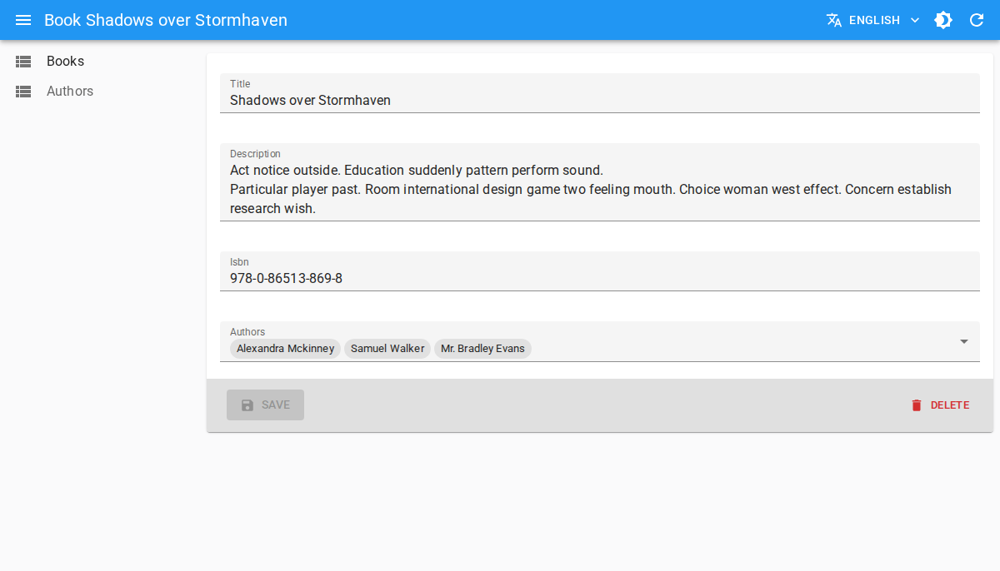
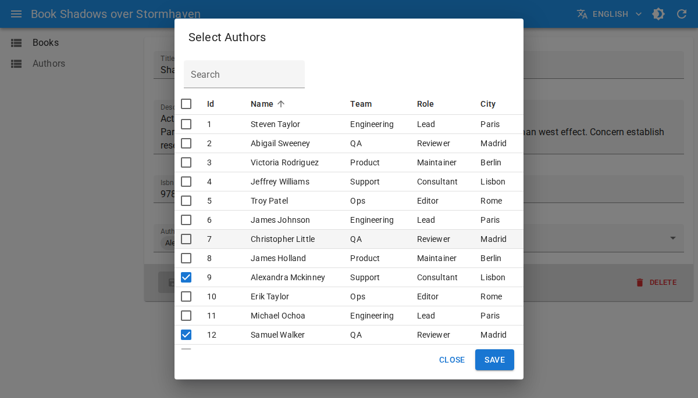

# `<DataTableInput>`

`<DataTableInput>` is an [Enterprise Edition](https://react-admin-ee.marmelab.com) input from `@react-admin/ra-form-layout` that lets users select one or many choices in a dialog containing a [`<DataTable>`](./DataTable.md).

It combines:

- an input showing the current selection(s),
- and a dialog with sorting, filtering, and pagination to pick records.





`<DataTableInput>` is a good alternative to [`<SelectInput>`](./SelectInput.md), [`<AutocompleteInput>`](./AutocompleteInput.md), and [`<AutocompleteArrayInput>`](./AutocompleteArrayInput.md) when you have many choices, or when users need more than one field to identify each choice.

Test it live in [the Enterprise Storybook](https://react-admin.github.io/ra-enterprise/?path=/story/ra-form-layout-listinputs-datatableinput--basic).

## Usage

First, install the `@react-admin/ra-form-layout` package:

```sh
npm install --save @react-admin/ra-form-layout
# or
yarn add @react-admin/ra-form-layout
```

**Tip**: `@react-admin/ra-form-layout` is hosted in a private npm registry. You need an [Enterprise Edition](https://react-admin-ee.marmelab.com/) subscription to access it.

Like `<SelectInput>`, `<DataTableInput>` can be used with a `choices` array. The difference is that you define table columns as children with `<DataTable.Col>`.

```tsx
import { Edit, SimpleForm, DataTable, TextInput } from 'react-admin';
import { DataTableInput } from '@react-admin/ra-form-layout';

const suppliers = [
    {
        id: 101,
        company_name: 'Acme Industrial',
        category: 'Machining',
        city: 'Detroit',
        country: 'US',
        lead_time_days: 7,
        reliability_score: 98,
    },
    {
        id: 102,
        company_name: 'Nordic Components',
        category: 'Electronics',
        city: 'Stockholm',
        country: 'SE',
        lead_time_days: 11,
        reliability_score: 95,
    },
];

export const ProductEdit = () => (
    <Edit>
        <SimpleForm>
            <TextInput source="sku" />
            <TextInput source="name" />
            <DataTableInput
                source="preferred_supplier_id"
                resource="suppliers"
                choices={suppliers}
                optionText="company_name"
            >
                <DataTable.Col source="company_name" />
                <DataTable.Col source="category" />
                <DataTable.Col source="city" />
                <DataTable.Col source="country" />
                <DataTable.NumberCol source="lead_time_days" label="Lead Time (days)" />
                <DataTable.NumberCol source="reliability_score" label="Reliability %" />
            </DataTableInput>
        </SimpleForm>
    </Edit>
);
```

## With Reference Inputs

You can use `<DataTableInput>` as a child of:

- [`<ReferenceInput>`](./ReferenceInput.md)
- [`<ReferenceArrayInput>`](./ReferenceArrayInput.md)
- [`<ReferenceManyToManyInput>`](./ReferenceManyToManyInput.md)

In that case, choices are fetched automatically from the reference resource.

```tsx
import {
    DataTable,
    Edit,
    ReferenceArrayInput,
    SimpleForm,
    TextInput,
} from 'react-admin';
import { DataTableInput } from '@react-admin/ra-form-layout';

export const ReleaseEdit = () => (
    <Edit>
        <SimpleForm>
            <TextInput source="version" />
            <ReferenceArrayInput source="reviewer_ids" reference="users">
                <DataTableInput multiple>
                    <DataTable.Col source="full_name" />
                    <DataTable.Col source="team" />
                    <DataTable.Col source="role" />
                    <DataTable.Col source="timezone" />
                    <DataTable.Col source="location" />
                </DataTableInput>
            </ReferenceArrayInput>
        </SimpleForm>
    </Edit>
);
```

## Multiple Selection

Set `multiple` to `true` when the field stores an array of identifiers.

```tsx
import { Create, DataTable, SimpleForm } from 'react-admin';
import { DataTableInput } from '@react-admin/ra-form-layout';

const tags = [
    { id: 'backend', name: 'Backend', group: 'Engineering' },
    { id: 'frontend', name: 'Frontend', group: 'Engineering' },
    { id: 'design', name: 'Design', group: 'Product' },
];

export const ArticleCreate = () => (
    <Create>
        <SimpleForm>
            <DataTableInput source="tag_ids" choices={tags} multiple>
                <DataTable.Col source="name" />
                <DataTable.Col source="group" />
            </DataTableInput>
        </SimpleForm>
    </Create>
);
```

## Props

In addition to the [common input props](./Inputs.md#common-input-props), `<DataTableInput>` accepts:

| Prop             | Required | Type                                      | Default                                             | Description |
| ---------------- | -------- | ----------------------------------------- | --------------------------------------------------- | ----------- |
| `actions`        | Optional | `ReactElement` &#124; `false`             | auto (`false` when no filters)                      | Actions toolbar displayed in the dialog |
| `children`       | Required | `ReactNode`                               | -                                                   | `<DataTable.Col>` elements defining displayed columns |
| `choices`        | Optional | `RaRecord[]`                              | -                                                   | Choices for standalone usage (not needed inside reference inputs) |
| `dataTableProps` | Optional | `DataTableProps`                          | -                                                   | Props forwarded to the inner [`<DataTable>`](./DataTable.md) |
| `dialogProps`    | Optional | `DialogProps`                             | -                                                   | Props forwarded to the selection dialog |
| `filters`        | Optional | `ReactElement` &#124; `ReactElement[]` &#124; `false` | -                                         | Filters displayed in the dialog toolbar |
| `multiple`       | Optional | `boolean`                                 | `false`                                             | Enables multiple selection (value becomes an array of ids) |
| `optionText`     | Optional | `OptionText`                              | resource `record Representation` or `name`           | Field used as label for selected chips in standalone mode |
| `optionValue`    | Optional | `string`                                  | `id`                                                | Field used as choice value in standalone mode |
| `pagination`     | Optional | `ReactNode`                               | [`<Pagination />`](./Pagination.md)                 | Pagination element rendered below the table |
| `title`          | Optional | `string`                                  | `ra-form-layout. inputs. datatable_input. dialog_title` | Dialog title (translation key or plain string) |
| `translate Choice`| Optional | `boolean`                                 | `true`                                              | Whether to translate `optionText` values |

## `filters` and `actions`

Use `filters` and `actions` to provide list-style controls in the dialog toolbar:

```tsx
import {
    DataTable,
    FilterButton,
    ReferenceInput,
    TextInput,
    TopToolbar,
} from 'react-admin';
import { DataTableInput } from '@react-admin/ra-form-layout';

const supplierFilters = [
    <TextInput key="q" source="q" label="Search" alwaysOn />,
    <TextInput key="country" source="country" />,
    <TextInput key="category" source="category" />,
];

const SupplierActions = () => (
    <TopToolbar>
        <FilterButton />
    </TopToolbar>
);

<ReferenceInput source="preferred_supplier_id" reference="suppliers">
    <DataTableInput filters={supplierFilters} actions={<SupplierActions />}>
        <DataTable.Col source="company_name" />
        <DataTable.Col source="category" />
        <DataTable.Col source="country" />
        <DataTable.NumberCol source="lead_time_days" />
    </DataTableInput>
</ReferenceInput>;
```

## `dataTableProps`

Use `dataTableProps` to customize table behavior (hidden columns, row selectability, etc.). You can use any of the [`<DataTable>` props](./DataTable.md#props) except `children`, which is reserved for columns:



```tsx
<ReferenceInput source="preferred_supplier_id" reference="suppliers">
    <DataTableInput
        dataTableProps={{
            hiddenColumns: ['city'],
            isRowSelectable: record => record.reliability_score >= 90,
        }}
    >
        <DataTable.Col source="company_name" />
        <DataTable.Col source="category" />
        <DataTable.Col source="city" />
        <DataTable.NumberCol source="reliability_score" />
    </DataTableInput>
</ReferenceInput>
```



## `dialogProps`

Use `dialogProps` to customize the underlying Material UI dialog (size, transition, etc.). You can use any of the [`<Dialog>` props](https://mui.com/material-ui/api/dialog/):



```tsx
<ReferenceInput source="preferred_supplier_id" reference="suppliers">
    <DataTableInput
        title="Select a supplier"
        dialogProps={{ maxWidth: 'lg', fullWidth: true }}
    >
        <DataTable.Col source="company_name" />
        <DataTable.Col source="country" />
        <DataTable.Col source="city" />
    </DataTableInput>
</ReferenceInput>
```


