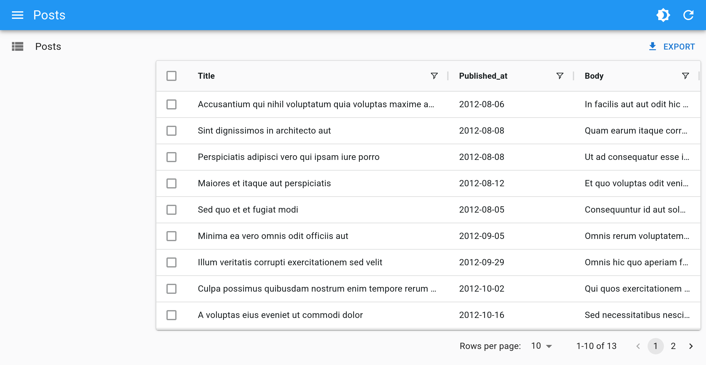

# `<DatagridAG>`

This [Enterprise Edition](https://react-admin-ee.marmelab.com) component is an alternative datagrid component with advanced features, based on [ag-grid](https://www.ag-grid.com/).

<video controls autoplay playsinline muted loop>
  <source src="https://react-admin-ee.marmelab.com/assets/DatagridAG.mp4" type="video/mp4"/>
  Your browser does not support the video tag.
</video>

Here is a (non-exhaustive) list of [features](https://www.ag-grid.com/react-data-grid/) that `<DatagridAG>` offers:

-   In place editing of cells or rows
-   Columns resizing and reordering
-   Row and column pinning
-   Advanced filtering
-   DOM Virtualization
-   Row selection and bulk actions
-   Row animation
-   Draggable rows
-   Multi-column sorting
-   Keyboard navigation
-   Themes
-   Automatic page size
-   Automatic column size
-   Compatibility with React Admin fields

Additionally, `<DatagridAG>` is compatible with the [Enterprise version of ag-grid](https://www.ag-grid.com/react-data-grid/licensing/), which offers even more features:

-   Row Grouping
-   Range selection
-   Aggregation
-   Tree Data
-   Pivoting
-   Master Detail views
-   Range Selection
-   Excel Export
-   Status bar
-   Context menu
-   More advanced filtering
-   And more...

<video controls autoplay playsinline muted loop>
  <source src="https://react-admin-ee.marmelab.com/assets/DatagridAG-enterprise.mp4" type="video/mp4"/>
  Your browser does not support the video tag.
</video>

You can test it live in [the Enterprise Edition Storybook](https://react-admin.github.io/ra-enterprise/?path=/story/ra-datagrid-ag-datagridag--basic).

## Installation

```sh
npm install --save @react-admin/ra-datagrid-ag
# or
yarn add @react-admin/ra-datagrid-ag
```

**Tip**: `ra-datagrid-ag` is part of the [React-Admin Enterprise Edition](https://marmelab.com/ra-enterprise/), and hosted in a private npm registry. You need to subscribe to one of the Enterprise Edition plans to access this package.

## Data Fetching

This package proposes 2 components, each with its own data fetching strategy:

-  [`<DatagridAG>`](#datagridag) works just like `<Datagrid>`, displaying the data fetched by its parent component (usually a `<List>`) and calling the API each time the user changes the sorting, filtering, or pagination. However it is not compatible with some of the features provided by `ag-grid` (see [limitations](#limitations)).
-  [`<DatagridAGClient>`](#datagridagclient) fetches all the data from the API at once, and then performs filtering, sorting and pagination **client-side**. This allows for a more responsive UI and enables some client-side only features, but only works for limited datasets (around a few thousand records). The client-side performance isn't affected by a large number of records, as ag-grid uses [DOM virtualization](https://www.ag-grid.com/react-data-grid/dom-virtualisation/).

`<DatagridAG>` doesn't currently support ag-grid's [server-side row model](https://www.ag-grid.com/react-data-grid/row-models/).

## `<DatagridAG>`

`<DatagridAG>` is an alternative datagrid component with advanced features, based on [ag-grid](https://www.ag-grid.com/).



### Usage

Use `<DatagridAG>` as a child of a react-admin `<List>`, `<ReferenceManyField>`, or any other component that creates a `ListContext`.


```tsx
import '@ag-grid-community/styles/ag-grid.css';
import '@ag-grid-community/styles/ag-theme-alpine.css';
import React from 'react';
import { List } from 'react-admin';
import { DatagridAG } from '@react-admin/ra-datagrid-ag';

export const PostList = () => {
    const columnDefs = [
        { field: 'title' },
        { field: 'published_at' },
        { field: 'body' },
    ];
    return (
        <List>
            <DatagridAG columnDefs={columnDefs} />
        </List>
    );
};
```


Here are the important things to note:

-   You need to import the ag-grid stylesheets `ag-grid.css` and `ag-theme-alpine.css`.
-   The columns are defined using the `columnDefs` prop. See [the dedicated doc section](#columndefs) for more information.

### Usage Inside An `<InfiniteList>`

`<DatagridAG>` also supports being used as a child of a react-admin [`<InfiniteList>`](./InfiniteList.md).

It only requires setting the `pagination` prop to `false`, because `<DatagridAG>` will itself detect when it needs to fetch more data, and the `<InfiniteList>` default pagination component would conflict with this behavior.

```tsx
import '@ag-grid-community/styles/ag-grid.css';
import '@ag-grid-community/styles/ag-theme-alpine.css';
import React from 'react';
import { InfiniteList } from 'react-admin';
import { DatagridAG } from '@react-admin/ra-datagrid-ag';

export const PostList = () => {
    const columnDefs = [
        { field: 'title' },
        { field: 'published_at' },
        { field: 'body' },
    ];
    return (
        <InfiniteList pagination={false}>
            <DatagridAG columnDefs={columnDefs} />
        </InfiniteList>
    );
};
```

<video controls autoplay playsinline muted loop>
  <source src="https://react-admin-ee.marmelab.com/assets/DatagridAG-infinite.mp4" type="video/mp4"/>
  Your browser does not support the video tag.
</video>

### Filter Syntax

`<DatagridAG>` displays the data fetched by its parent (usually `<List>`).

`<DatagridAG>` provides advanced filtering controls and uses a special syntax to support operators ("contains", "equals", "not equals", etc.). This syntax isn't supported by `dataProvider.getList()` by default, so `<DatagridAG>` converts the internal filter representation into key-value pairs, using the familiar filter syntax:

```js
// ag-grid internal filter format
{
    athlete: {
        filterType: 'text',
        type: 'equals',
        filter: 'mich',
    },
    age: {
        filterType: 'number',
        type: 'lessThan',
        filter: 30,
    },
    gold_medals: {
        filterType: 'number',
        type: 'inRange',
        filter: 5,
        filterTo: 10,
    },
    country: {
        filterType: 'text',
        type: 'blank',
    },
}
// is turned into react-admin filter format by default
{
    athlete_eq: 'mich',
    age_lt: 30,
    gold_medals_gte: 5,
    gold_medals_lte: 10,
    country_eq: null,
}
```

This conversion is done via to the [`getRaFilters`](#getrafilters) and [`getAgGridFilters`](#getaggridfilters) callbacks, that you can override to customize the format of the filter param sent to the dataProvider.

`ag-grid` provides default filters for [text](https://www.ag-grid.com/react-data-grid/filter-text/#text-filter-options), [number](https://www.ag-grid.com/react-data-grid/filter-number/#number-filter-options), and [date](https://www.ag-grid.com/react-data-grid/filter-date/#filter-options) columns. Some filters may not be supported by your backend, like `startsWith` or `endsWith`. You can remove these unsupported filters using the `defaultColDef` and the `columnDefs` props.


```tsx
import { List } from 'react-admin';
import { DatagridAG } from '@react-admin/datagrid-ag';

const OlympicWinnersList = () => {
    const stringFilterParams = {
        filterParams: { 
            // allow only some filter types for string columns
            filterOptions: ['contains', 'equals', 'notEqual', 'blank'],
        },
    };

    const columnDefs = [
        { field: 'athlete', ...stringFilterParams },
        { field: 'age' },
        { field: 'country', ...stringFilterParams },
        { field: 'year' },
    ];

    const defaultColDef = {
        filterParams: {
            maxNumConditions: 1, // limit the number of conditions to 1
            filterOptions: [ // list supported filter types by default
                'equals',
                'notEqual',
                'greaterThan',
                'greaterThanOrEqual',
                'lessThan',
                'lessThanOrEqual',
                'contains',
                'inRange',
                'blank',
            ],
        },
    };

    return (
        <List>
            <DatagridAG columnDefs={columnDefs} defaultColDef={defaultColDef} />
        </List>
    );
};
```


### Limitations

`<DatagridAG>` is designed to work with partial datasets and load data upon request, thanks to the `ListContext`. It allows to work with a larger dataset, as it uses the dataProvider to fetch paginated data. However, this means that it can't use some of the features offered by `ag-grid` such as:

- Row grouping
- Pivoting
- Aggregation
- Advanced filtering (and having multiple filters)
- Multi-column sorting
- Automatic page size

If you need to use these features, you can use the [`<DatagridAGClient>`](#datagridagclient) component instead of `<DatagridAG>`.

### Props

| Prop                | Required | Type                        | Default                      | Description                                                                                                                            |
| ------------------- | -------- | --------------------------- | ---------------------------- | -------------------------------------------------------------------------------------------------------------------------------------- |
| `columnDefs`        | Required | Array                       | n/a                          | The columns definitions                                                                                                                |
| `bulkActionButtons` | Optional | Element                     | `<BulkDelete Button>`        | The component used to render the bulk action buttons                                                                                   |
| `cellRenderer`      | Optional | String, Function or Element |                              | Allows to use a custom component to render the cell content                                                                            |
| `darkTheme`         | Optional | String                      | `'ag-theme-alpine-dark'`     | The name of the ag-grid dark theme                                                                                                     |
| `defaultColDef`     | Optional | Object                      |                              | The default column definition (applied to all columns)                                                                                 |
| `getAgGridFilters`   | Optional | Function                      |                              | A function mapping react-admin filters to ag-grid filters  |
| `getRaFilters`   | Optional | Function                      |                              | A function mapping ag-grid filters to react-admin filters  |
| `mutationOptions`   | Optional | Object                      |                              | The mutation options                                                                                                                   |
| `preferenceKey`     | Optional | String or `false`           | `${resource}.ag-grid.params` | The key used to persist [`gridState`](https://www.ag-grid.com/react-data-grid/grid-state/) in the Store. `false` disables persistence. |
| `sx`                | Optional | Object                      |                              | The sx prop passed down to the wrapping `<div>` element                                                                                |
| `theme`             | Optional | String                      | `'ag-theme-alpine'`          | The name of the ag-grid theme                                                                                                          |

`<DatagridAG>` also accepts the same props as [`<AgGridReact>`](https://www.ag-grid.com/react-data-grid/grid-options/) with the exception of `rowData`, since the data is fetched from the List context.

### `bulkActionButtons`

You can use the `bulkActionButtons` prop to customize the bulk action buttons, displayed when at least one row is selected. Don't forget to add an initial column in the `columnDefs` to allow row selection.


```tsx
import '@ag-grid-community/styles/ag-grid.css';
import '@ag-grid-community/styles/ag-theme-alpine.css';
import React from 'react';
import { List, BulkExportButton, BulkDeleteButton } from 'react-admin';
import { DatagridAG } from '@react-admin/ra-datagrid-ag';

// Define the custom bulk action buttons
const PostBulkActionButtons = () => (
    <>
        <BulkExportButton />
        <BulkDeleteButton />
    </>
);

export const PostList = () => {
    const columnDefs = [
        // Add a column for row selection
        {
            headerCheckboxSelection: true,
            checkboxSelection: true,
            editable: false,
            minWidth: 48,
            maxWidth: 48,
            suppressColumnsToolPanel: true,
            suppressHeaderFilterButton: true,
        },
        { field: 'title' },
        { field: 'published_at' },
        { field: 'body' },
    ];
    return (
        <List>
            <DatagridAG
                columnDefs={columnDefs}
                // Pass the custom bulk action buttons
                bulkActionButtons={<PostBulkActionButtons />}
            />
        </List>
    );
};
```


### `cellRenderer`

In a column definition, you can use the `cellRenderer` field to specify a custom cell renderer. In addition to [ag-grid's cell rendering abilities](https://www.ag-grid.com/react-data-grid/cell-rendering/), `<DatagridAG>` supports [react-admin fields](./Fields.md) in `cellRenderer`. This is particularly useful to render a [`<ReferenceField>`](./ReferenceField.md) for instance.

```tsx
import '@ag-grid-community/styles/ag-grid.css';
import '@ag-grid-community/styles/ag-theme-alpine.css';
import React from 'react';
import { EmailField, List, ReferenceField, TextField } from 'react-admin';
import { DatagridAG } from '@react-admin/ra-datagrid-ag';

export const CommentList = () => {
    const columnDefs = [
        {
            field: 'id',
            editable: false,
        },
        { field: 'author.name' },
        {
            field: 'author.email',
            cellRenderer: <EmailField source="author.email" />,
        },
        {
            field: 'post_id',
            headerName: 'Post',
            cellRenderer: (
                <ReferenceField source="post_id" reference="posts" />
            ),
        },
        { field: 'created_at' },
        { field: 'body' },
    ];
    return (
        <List>
            <DatagridAG columnDefs={columnDefs} />
        </List>
    );
};
```


**Note:** You still need to pass the `source` prop to the field.

### `columnDefs`

The `columnDefs` prop is the most important prop of `<DatagridAG>`. It defines the columns of the grid, and their properties. It is an array of objects, each object representing a column.

Here is an example with a complete column definitions object:


```tsx
import '@ag-grid-community/styles/ag-grid.css';
import '@ag-grid-community/styles/ag-theme-alpine.css';
import React from 'react';
import { List } from 'react-admin';
import { DatagridAG } from '@react-admin/ra-datagrid-ag';

const truncate = (str: string, n: number) => {
    return str.length > n ? str.slice(0, n - 1) + '...' : str;
};

export const PostList = () => {
    const columnDefs = [
        {
            field: 'id',
            editable: false,
            headerCheckboxSelection: true,
            checkboxSelection: true,
            minWidth: 48,
            maxWidth: 48,
            suppressColumnsToolPanel: true,
            suppressHeaderFilterButton: true,
        },
        { field: 'title' },
        {
            field: 'published_at',
            headerName: 'Publication Date',
        },
        {
            field: 'body',
            cellRenderer: ({ value }) => truncate(value, 20),
        },
    ];
    return (
        <List>
            <DatagridAG columnDefs={columnDefs} />
        </List>
    );
};
```



Have a look at [the ag-grid documentation](https://www.ag-grid.com/react-data-grid/column-properties/) for the exhaustive list of column properties.

### `darkTheme`

You can use a different dark theme for the grid by passing a `darkTheme` prop. It will be applied automatically whenever React Admin theme is set to dark.
You can for instance use one of the [themes provided by ag-grid](https://www.ag-grid.com/react-data-grid/themes/), like `ag-theme-balham` or `ag-theme-alpine-dark`:


```tsx
import '@ag-grid-community/styles/ag-grid.css';
import '@ag-grid-community/styles/ag-theme-balham.css';
import React from 'react';
import { List } from 'react-admin';
import { DatagridAG } from '@react-admin/ra-datagrid-ag';

export const PostList = () => {
    const columnDefs = [
        { field: 'title' },
        { field: 'published_at' },
        { field: 'body' },
    ];
    return (
        <List>
            <DatagridAG
                columnDefs={columnDefs}
                theme="ag-theme-balham"
                darkTheme="ag-theme-balham-dark"
            />
        </List>
    );
};
```



**Tip:** Remember to import the corresponding stylesheet (e.g. `ag-theme-balham[.min].css` for `ag-theme-balham`).

### `defaultColDef`

The `defaultColDef` prop allows you to define default properties for all columns. It is an object with the same properties as `columnDefs` objects.

In the example below, the configuration enables flex mode on the columns, and sets each column to take 1/3 of the available space:


```tsx
import '@ag-grid-community/styles/ag-grid.css';
import '@ag-grid-community/styles/ag-theme-alpine.css';
import React from 'react';
import { List } from 'react-admin';
import { DatagridAG } from '@react-admin/ra-datagrid-ag';

export const PostList = () => {
    const columnDefs = [
        { field: 'title' },
        { field: 'published_at' },
        { field: 'body' },
    ];
    const defaultColDef = {
        flex: 1,
    };
    return (
        <List>
            <DatagridAG columnDefs={columnDefs} defaultColDef={defaultColDef} />
        </List>
    );
};
```



### `getAgGridFilters`

You can use the `getAgGridFilters` prop to provide a function that transforms the filters from the dataProvider to the ag-grid format.

The default implementation turns key/value filters into ag-grid filters. For instance, the following data provider filters:


```js
{
    athlete_eq: 'mich',
    age_lt: '30',
    country_q: 'fr',
}
```


Will be turned into:


```js
{
    athlete: {
        filterType: 'text',
        type: 'equals',
        filter: 'mich',
    },
    age: {
        filterType: 'text',
        type: 'lessThan',
        filter: '30',
    },
    country: {
        filterType: 'text',
        type: 'contains',
        filter: 'fr',
    },
}
```


Pass your own `getAgGridFilter` function if your data provider uses another filter format, so that `<DatagridAG>` can display them correctly. Use the default implementation as a starting point:


```tsx
import { List } from "react-admin";
import { DatagridAG } from "@react-admin/ra-datagrid-ag";
import type { FilterModel } from "@ag-grid-community/core";

const getAgGridFilter = (
  raFilter: string,
  source: string
): FilterModel => {
  const filterMapping = {
    eq: "equals",
    neq: "notEqual",
    gt: "greaterThan",
    gte: "greaterThanOrEqual",
    lt: "lessThan",
    lte: "lessThanOrEqual",
    q: "contains",
  };

  const hasOperator = source.includes("_");
  const operator = source.split("_").at(-1);
  const colId = source.split("_").slice(0, -1).join("_");

  if (!hasOperator || !operator) {
    return {
      [source]: {
        filterType: "text",
        type: "equals",
        filter: raFilter,
      },
    };
  }

  if (!filterMapping[operator]) {
    console.warn(`Unsupported filter suffix: ${operator}`);
    return {};
  }

  return {
    [colId]: {
      filterType: "text",
      type: filterMapping[operator],
      filter: raFilter,
    },
  };
};

const getAgGridFilters = (raFilters: {
  [key: string]: string;
}): FilterModel => {
  return Object.entries(raFilters).reduce((acc, [source, raFilter]) => {
    return {
      ...acc,
      ...getAgGridFilter(raFilter, source),
    };
  }, {});
};

export const PostList = () => {
  const columnDefs = [
    { field: "title" },
    { field: "published_at" },
    { field: "body" },
  ];
  return (
    <List>
      <DatagridAG columnDefs={columnDefs} getAgGridFilters={getAgGridFilters} />
    </List>
  );
};
```


### `getRaFilters`

You can use the `getRaFilters` prop to provide a function that transforms the filters from the ag-grid format to the react-admin format.

The default implementation turns ag-grid filters into key/value pairs. For instance, the following ag-grid filters:


```js
{
    athlete: {
        filterType: 'text',
        type: 'equals',
        filter: 'mich',
    },
    age: {
        filterType: 'number',
        type: 'lessThan',
        filter: 30,
    },
    gold_medals: {
        filterType: 'number',
        type: 'inRange',
        filter: 5,
        filterTo: 10,
    },
    country: {
        filterType: 'text',
        type: 'blank',
    },
}
```


Will be turned into:


```js
{
    athlete_eq: 'mich',
    age_lt: 30,
    gold_medals_gte: 5,
    gold_medals_lte: 10,
    country_eq: null,
}
```


Pass your own `getRAFilter` function if your data provider uses another filter format. Use the default implementation as a starting point:


```tsx
import { List } from "react-admin";
import { DatagridAG } from "@react-admin/ra-datagrid-ag";
import type { FilterModel } from "@ag-grid-community/core";

const getRAFilter = (
  agFilter: FilterModel,
  source: string
): { [key: string]: string } => {
  const filterMapping = {
    equals: "_eq",
    notEqual: "_neq",
    greaterThan: "_gt",
    greaterThanOrEqual: "_gte",
    lessThan: "_lt",
    lessThanOrEqual: "_lte",
    contains: "_q",
    inRange: () => ({
      [`${source}_gte`]: agFilter.filter,
      [`${source}_lte`]: agFilter.filterTo,
    }),
    blank: () => ({
      [`${source}_eq`]: null,
    }),
  };

  if (!filterMapping[agFilter.type]) {
    console.warn(`Unsupported filter type: ${agFilter.type}`);
    return {};
  }

  const filter = filterMapping[agFilter.type];

  if (typeof filter === "function") {
    return filter();
  }

  return {
    [`${source}${filter}`]: agFilter.filter,
  };
};

const getRaFilters = (
  agGridFilters: FilterModel
): { [key: string]: string } => {
  return Object.entries(agGridFilters).reduce((acc, [source, agFilter]) => {
    return {
      ...acc,
      ...getRAFilter(agFilter, source),
    };
  }, {});
};

export const PostList = () => {
  const columnDefs = [
    { field: "title" },
    { field: "published_at" },
    { field: "body" },
  ];
  return (
    <List>
      <DatagridAG columnDefs={columnDefs} getRaFilters={getRaFilters} />
    </List>
  );
};
```


### `mutationOptions`

You can use the `mutationOptions` prop to provide options to the `dataProvider.update()` call triggered when a cell or a row is edited.

In particular, this allows to choose the [`mutationMode`](./Edit.md#mutationmode), and/or to pass a `meta` object to the dataProvider.


```tsx
import '@ag-grid-community/styles/ag-grid.css';
import '@ag-grid-community/styles/ag-theme-alpine.css';
import React from 'react';
import { List } from 'react-admin';
import { DatagridAG } from '@react-admin/ra-datagrid-ag';

export const PostList = () => {
    const columnDefs = [
        { field: 'title' },
        { field: 'published_at' },
        { field: 'body' },
    ];
    return (
        <List>
            <DatagridAG
                columnDefs={columnDefs}
                mutationOptions={{
                    meta: { foo: 'bar' },
                    mutationMode: 'optimistic',
                }}
            />
        </List>
    );
};
```


This also allows to display a notification after the mutation succeeds.


```tsx
import '@ag-grid-community/styles/ag-grid.css';
import '@ag-grid-community/styles/ag-theme-alpine.css';
import React from 'react';
import { List, useNotify } from 'react-admin';
import { DatagridAG } from '@react-admin/ra-datagrid-ag';

export const PostList = () => {
    const columnDefs = [
        { field: 'title' },
        { field: 'published_at' },
        { field: 'body' },
    ];
    const notify = useNotify();
    const onSuccess = React.useCallback(() => {
        notify('ra.notification.updated', {
            type: 'info',
            messageArgs: {
                smart_count: 1,
            },
            undoable: true,
        });
    }, [notify]);
    return (
        <List>
            <DatagridAG
                columnDefs={columnDefs}
                mutationOptions={{
                    mutationMode: 'undoable',
                    onSuccess,
                }}
            />
        </List>
    );
};
```


### `preferenceKey`

`<DatagridAG>` will store the [`gridState`](https://www.ag-grid.com/react-data-grid/grid-state/) in the [Store](./Store.md), under the key `${resource}.ag-grid.params.grid`. This `gridState` persisted in the store is applied once when the grid is created, it means that users will find the grid as they left it previously.

If you wish to change the key used to store the columns order and size, you can pass a `preferenceKey` prop to `<DatagridAG>`.

```tsx
<List>
    <DatagridAG columnDefs={columnDefs} preferenceKey="my-post-list" />
</List>
```

If, instead, you want to disable the persistence of the columns order and size, you can pass `false` to the `preferenceKey` prop:

```tsx
<List>
    <DatagridAG columnDefs={columnDefs} preferenceKey={false} />
</List>
```

**Tip:** If you update the `columnDefs` prop, and users already customized columns in a previous version of the app, the two versions will conflict. You can invite users to log out to reset the store, or add custom logic to [invalidate](./Store.md#store-invalidation) the react-admin Store.

### `sx`

You can use [the `sx` prop](./SX.md) to customize the grid's style:


```tsx
import '@ag-grid-community/styles/ag-grid.css';
import '@ag-grid-community/styles/ag-theme-alpine.css';
import React from 'react';
import { List } from 'react-admin';
import { DatagridAG } from '@react-admin/ra-datagrid-ag';

export const PostList = () => {
    const columnDefs = [
        { field: 'title' },
        { field: 'published_at' },
        { field: 'body' },
    ];
    return (
        <List>
            <DatagridAG
                columnDefs={columnDefs}
                sx={{ '& .ag-header-cell-comp-wrapper': { color: 'red' } }}
            />
        </List>
    );
};
```



It can also be helpful to change the default grid's height (`calc(100vh - 96px - ${theme.spacing(1)})`):


```tsx
import '@ag-grid-community/styles/ag-grid.css';
import '@ag-grid-community/styles/ag-theme-alpine.css';
import React from 'react';
import { List } from 'react-admin';
import { DatagridAG } from '@react-admin/ra-datagrid-ag';

export const PostList = () => {
    const columnDefs = [
        /* ... */
    ];
    return (
        <List>
            <DatagridAG
                columnDefs={columnDefs}
                sx={{ height: 'calc(100vh - 250px)' }}
            />
        </List>
    );
};
```



### `theme`

You can use a different theme for the grid by passing a `theme` prop. You can for instance use one of the [themes provided by ag-grid](https://www.ag-grid.com/react-data-grid/themes/), like `ag-theme-balham` or `ag-theme-alpine-dark`:


```tsx
import '@ag-grid-community/styles/ag-grid.css';
import '@ag-grid-community/styles/ag-theme-balham.css';
import React from 'react';
import { List } from 'react-admin';
import { DatagridAG } from '@react-admin/ra-datagrid-ag';

export const PostList = () => {
    const columnDefs = [
        { field: 'title' },
        { field: 'published_at' },
        { field: 'body' },
    ];
    return (
        <List>
            <DatagridAG columnDefs={columnDefs} theme="ag-theme-balham" />
        </List>
    );
};
```



**Tip:** Remember to import the corresponding stylesheet (e.g. `ag-theme-balham[.min].css` for `ag-theme-balham`).

### AgGrid Defaults

Under the hood, `<DatagridAG>` is a wrapper around `<AgGridReact>`. However it sets some important default values:

-   `pagination` is set to `false` as the `<List>` component handles it
-   `paginationAutoPageSize` is set to `false`
-   `animateRows` is set to `true`
-   `rowSelection` is set to `'multiple'`
-   `suppressRowClickSelection` is set to `true`
-   `readOnlyEdit` is set to `true`
-   `getRowId` is set to use the record `id` field

It also register the following default [modules](https://www.ag-grid.com/react-data-grid/modules/): `ClientSideRowModelModule`, `CommunityFeaturesModule` and `CsvExportModule`. If you wish to add custom modules, make sure you have at least the `ClientSideRowModelModule`:


```tsx
import '@ag-grid-community/styles/ag-grid.css';
import '@ag-grid-community/styles/ag-theme-alpine.css';
import React from 'react';
import { List } from 'react-admin';
import { DatagridAG } from '@react-admin/ra-datagrid-ag';
import { ClientSideRowModelModule } from '@ag-grid-community/client-side-row-model';
import { CsvExportModule } from '@ag-grid-community/csv-export';
import { ClipboardModule } from '@ag-grid-enterprise/clipboard';

const modules = [ClientSideRowModelModule, CsvExportModule, ClipboardModule];

export const PostList = () => {
    const columnDefs = [
        {
            field: 'id',
            editable: false,
            headerCheckboxSelection: true,
            checkboxSelection: true,
            minWidth: 48,
            maxWidth: 48,
            suppressColumnsToolPanel: true,
            suppressHeaderFilterButton: true,
        },
        { field: 'title' },
        {
            field: 'published_at',
            headerName: 'Publication Date',
        },
    ];
    return (
        <List>
            <DatagridAG columnDefs={columnDefs} modules={modules} />
        </List>
    );
};
```


It also includes a [`defaultColDef`](#defaultcoldef) object with the following properties:


```js
{
    resizable: true,
    filter: true,
    sortable: true,
    editable: true,
    headerCheckboxSelectionFilteredOnly: true,
    headerCheckboxSelectionCurrentPageOnly: true,
}
```


You may override any of these defaults by passing the corresponding props to `<DatagridAG>` (`defaultColDef` will be merged with the defaults).

### Accessing The Grid API

You can access the grid's `api` by passing a `ref` to `<DatagridAG>`.

In this example, we use the `api` to automatically resize all columns to fit their content on first render:


```tsx
import '@ag-grid-community/styles/ag-grid.css';
import '@ag-grid-community/styles/ag-theme-alpine.css';
import React from 'react';
import { AgGridReact } from 'ag-grid-react';
import { List } from 'react-admin';
import { DatagridAG } from '@react-admin/ra-datagrid-ag';

export const PostList = () => {
    const columnDefs = [
        { field: 'title' },
        { field: 'published_at' },
        { field: 'body' },
    ];
    const gridRef = React.useRef<AgGridReact>(null);
    const onFirstDataRendered = React.useCallback(() => {
        gridRef.current.api.autoSizeAllColumns();
    }, []);
    return (
        <List>
            <DatagridAG
                columnDefs={columnDefs}
                ref={gridRef}
                onFirstDataRendered={onFirstDataRendered}
            />
        </List>
    );
};
```


Check out the [Grid API](https://www.ag-grid.com/react-data-grid/grid-api/) documentation to learn more.

### Changing The Default Column Width

By default, ag-grid will render each column with a fixed size.

You can choose to enable flex mode by setting the `flex` prop either on the `columnDefs` or on the `defaultColDef`:


```tsx
import '@ag-grid-community/styles/ag-grid.css';
import '@ag-grid-community/styles/ag-theme-alpine.css';
import React from 'react';
import { List } from 'react-admin';
import { DatagridAG } from '@react-admin/ra-datagrid-ag';

export const PostList = () => {
    const columnDefs = [
        { field: 'title' },
        { field: 'published_at', flex: 1 },
        { field: 'body' },
    ];
    const defaultColDef = {
        flex: 2,
    };
    return (
        <List>
            <DatagridAG columnDefs={columnDefs} defaultColDef={defaultColDef} />
        </List>
    );
};
```



Alternatively, you can use the grid's `api` to call `autoSizeAllColumns` to automatically resize all columns to fit their content:


```tsx
import '@ag-grid-community/styles/ag-grid.css';
import '@ag-grid-community/styles/ag-theme-alpine.css';
import React from 'react';
import { AgGridReact } from 'ag-grid-react';
import { List } from 'react-admin';
import { DatagridAG } from '@react-admin/ra-datagrid-ag';

export const PostList = () => {
    const columnDefs = [
        { field: 'title' },
        { field: 'published_at' },
        { field: 'body' },
    ];
    const gridRef = React.useRef<AgGridReact>(null);
    const onFirstDataRendered = React.useCallback(() => {
        gridRef.current.api.autoSizeAllColumns();
    }, []);
    return (
        <List>
            <DatagridAG
                columnDefs={columnDefs}
                ref={gridRef}
                onFirstDataRendered={onFirstDataRendered}
            />
        </List>
    );
};
```



Check out the [Column Sizing](https://www.ag-grid.com/react-data-grid/column-sizing/) documentation for more information and more alternatives.

### Selecting Rows And Enabling Bulk Actions

Just like `<Datagrid>`, `<DatagridAG>` supports row selection and bulk actions.

Add a column with the following definition to enable row selection:


```js
{
    headerCheckboxSelection: true,
    checkboxSelection: true,
    editable: false,
    minWidth: 48,
    maxWidth: 48,
    suppressColumnsToolPanel: true,
    suppressHeaderFilterButton: true,
},
```


Below is an example with the `PostList` component:


```tsx
import '@ag-grid-community/styles/ag-grid.css';
import '@ag-grid-community/styles/ag-theme-alpine.css';
import React from 'react';
import { List } from 'react-admin';
import { DatagridAG } from '@react-admin/ra-datagrid-ag';

export const PostList = () => {
    const columnDefs = [
        {
            headerCheckboxSelection: true,
            checkboxSelection: true,
            editable: false,
            minWidth: 48,
            maxWidth: 48,
            suppressColumnsToolPanel: true,
            suppressHeaderFilterButton: true,
        },
        { field: 'title' },
        { field: 'published_at' },
        { field: 'body' },
    ];
    return (
        <List>
            <DatagridAG columnDefs={columnDefs} />
        </List>
    );
};
```



Just like with `<Datagrid>`, you can customize the bulk actions by passing a [`bulkActionButtons`](./Datagrid.md#bulkactionbuttons) prop to `<DatagridAG>`.


```tsx
import '@ag-grid-community/styles/ag-grid.css';
import '@ag-grid-community/styles/ag-theme-alpine.css';
import React from 'react';
import { List, BulkExportButton, BulkDeleteButton } from 'react-admin';
import { DatagridAG } from '@react-admin/ra-datagrid-ag';

const PostBulkActionButtons = () => (
    <>
        <BulkExportButton />
        <BulkDeleteButton />
    </>
);

export const PostList = () => {
    const columnDefs = [
        {
            headerCheckboxSelection: true,
            checkboxSelection: true,
            editable: false,
            minWidth: 48,
            maxWidth: 48,
            suppressColumnsToolPanel: true,
            suppressHeaderFilterButton: true,
        },
        { field: 'title' },
        { field: 'published_at' },
        { field: 'body' },
    ];
    return (
        <List>
            <DatagridAG
                columnDefs={columnDefs}
                bulkActionButtons={<PostBulkActionButtons />}
            />
        </List>
    );
};
```


### Enabling Full Row Edition

By default, editing is enabled on cells, which means you can edit a cell by double-clicking on it, and it will trigger a call to the dataProvider's `update` function.


However, if you'd like to update the full row at once instead, you can enable full row editing by passing `editType="fullRow"` to `<DatagridAG>`:


```tsx
import '@ag-grid-community/styles/ag-grid.css';
import '@ag-grid-community/styles/ag-theme-alpine.css';
import React from 'react';
import { List } from 'react-admin';
import { DatagridAG } from '@react-admin/ra-datagrid-ag';

export const PostList = () => {
    const columnDefs = [
        /* ... */
    ];
    return (
        <List>
            <DatagridAG columnDefs={columnDefs} editType="fullRow" />
        </List>
    );
};
```



### Disabling Cell Edition

Set `editable: false` in the definition of a column to disable the ability to edit its cells.


```tsx
import '@ag-grid-community/styles/ag-grid.css';
import '@ag-grid-community/styles/ag-theme-alpine.css';
import React from 'react';
import { List } from 'react-admin';
import { DatagridAG } from '@react-admin/ra-datagrid-ag';

export const PostList = () => {
    const columnDefs = [
        { field: 'title' },
        { field: 'published_at', editable: false },
        { field: 'body' },
    ];
    return (
        <List>
            <DatagridAG columnDefs={columnDefs} />
        </List>
    );
};
```


Alternatively, you can disable the ability to edit all cells by passing `editable: false` to the `defaultColDef`:


```tsx
import '@ag-grid-community/styles/ag-grid.css';
import '@ag-grid-community/styles/ag-theme-alpine.css';
import React from 'react';
import { List } from 'react-admin';
import { DatagridAG } from '@react-admin/ra-datagrid-ag';

export const PostList = () => {
    const columnDefs = [
        { field: 'title' },
        { field: 'published_at' },
        { field: 'body' },
    ];
    const defaultColDef = {
        editable: false,
    };
    return (
        <List>
            <DatagridAG columnDefs={columnDefs} defaultColDef={defaultColDef} />
        </List>
    );
};
```


### Using AG Grid Enterprise
`<DatagridAG>` is also compatible with the [Enterprise version of ag-grid](https://www.ag-grid.com/react-data-grid/licensing/).

You can follow the instructions in the _Getting Started with AG Grid Enterprise_ section of the [Getting Started](https://www.ag-grid.com/react-data-grid/getting-started/) documentation to enable the Enterprise features.

Below is a short example of what you can achieve.


```tsx
import '@ag-grid-community/styles/ag-grid.css';
import '@ag-grid-community/styles/ag-theme-alpine.css';
import { AgGridReact } from 'ag-grid-react';
import 'ag-grid-enterprise';
import React from 'react';
import { List } from 'react-admin';
import { DatagridAG } from '@react-admin/ra-datagrid-ag';

const OlympicWinnersList = () => {
    const columnDefs = [
        {
            headerCheckboxSelection: true,
            checkboxSelection: true,
            editable: false,
            minWidth: 48,
            maxWidth: 48,
            suppressColumnsToolPanel: true,
            suppressHeaderFilterButton: true,
        },
        { field: 'athlete' },
        { field: 'age' },
        { field: 'country' },
        { field: 'year' },
        { field: 'date' },
        { field: 'sport' },
        { field: 'gold' },
        { field: 'silver' },
        { field: 'bronze' },
        { field: 'total' },
    ];
    const gridRef = React.useRef<AgGridReact>(null);
    const onFirstDataRendered = React.useCallback(() => {
        gridRef.current.api.autoSizeAllColumns();
    }, []);
    const defaultColDef = {
        enableRowGroup: true,
    };
    return (
        <List>
            <DatagridAG
                columnDefs={columnDefs}
                defaultColDef={defaultColDef}
                ref={gridRef}
                onFirstDataRendered={onFirstDataRendered}
                rowGroupPanelShow="always"
                groupSelectsChildren
            />
        </List>
    );
};
```


<video controls autoplay playsinline muted loop>
  <source src="https://react-admin-ee.marmelab.com/assets/DatagridAG-enterprise.mp4" type="video/mp4"/>
  Your browser does not support the video tag.
</video>

### Adding An Expandable Panel (Master/Detail)

You can leverage [ag-grid Master Detail Module](https://www.ag-grid.com/react-data-grid/master-detail/) to add an expandable panel.

For instance, here's how to show the comments of a post in an expandable panel:



```tsx
import '@ag-grid-community/styles/ag-grid.css';
import '@ag-grid-community/styles/ag-theme-alpine.css';
import { AgGridReact } from 'ag-grid-react';
import { ColDef, CommunityFeaturesModule } from '@ag-grid-community/core';
import { ClientSideRowModelModule } from '@ag-grid-community/client-side-row-model';
import { CsvExportModule } from '@ag-grid-community/csv-export';
import { MasterDetailModule } from '@ag-grid-enterprise/master-detail';
import React from 'react';
import { List, useDataProvider, useNotify } from 'react-admin';
import { DatagridAG } from '@react-admin/ra-datagrid-ag';

export const PostList = () => {
    const dataProvider = useDataProvider();
    const notify = useNotify();

    const columnDefs: ColDef<any, any>[] = [
        {
            headerCheckboxSelection: true,
            checkboxSelection: true,
            editable: false,
            minWidth: 48,
            maxWidth: 48,
            suppressColumnsToolPanel: true,
            suppressHeaderFilterButton: true,
        },
        { field: 'title', flex: 1, cellRenderer: 'agGroupCellRenderer' },
        { field: 'published_at' },
    ];

    const detailCellRendererParams = {
        // provide the Grid Options to use on the Detail Grid
        detailGridOptions: {
            columnDefs: [{ field: 'body', flex: 1 }, { field: 'author.name' }],
        },
        // get the rows for each Detail Grid
        getDetailRowData: params => {
            dataProvider
                .getManyReference('comments', {
                    target: 'post_id',
                    id: params.data.id,
                    pagination: { page: 1, perPage: 100 },
                    sort: { field: 'created_at', order: 'DESC' },
                    filter: {},
                })
                .then(({ data }) => {
                    params.successCallback(data);
                })
                .catch(error => {
                    notify(error.message, { type: 'error' });
                    params.successCallback([]);
                });
        },
    };

    return (
        <List resource="posts">
            <DatagridAG
                masterDetail
                columnDefs={columnDefs}
                detailCellRendererParams={detailCellRendererParams}
                modules={[
                    ClientSideRowModelModule,
                    CommunityFeaturesModule,
                    CsvExportModule,
                    MasterDetailModule,
                ]}
            />
        </List>
    );
};
```


## `<DatagridAGClient>`

`<DatagridAGClient>` is an alternative datagrid component with advanced features, based on [ag-grid](https://www.ag-grid.com/). It is designed for small datasets that can be entirely loaded client-side (around a few thousand records). It supports infinite scrolling, grouping, multi-column sorting, and advanced filtering.

The client-side performance isn't affected by a large number of records, as ag-grid uses [DOM virtualization](https://www.ag-grid.com/react-data-grid/dom-virtualisation/).


### Usage

Use `<DatagridAGClient>` as a child of a react-admin `<List>`, `<ReferenceManyField>`, or any other component that creates a `ListContext`.


```tsx
import '@ag-grid-community/styles/ag-grid.css';
import '@ag-grid-community/styles/ag-theme-alpine.css';
import React from 'react';
import { List } from 'react-admin';
import { DatagridAGClient } from '@react-admin/ra-datagrid-ag';

export const PostList = () => {
    const columnDefs = [
        { field: 'title' },
        { field: 'published_at' },
        { field: 'body' },
    ];
    return (
        <List perPage={10000} pagination={false}>
            <DatagridAGClient columnDefs={columnDefs} />
        </List>
    );
};
```


Here are the important things to note:

-   You need to import the ag-grid stylesheets `ag-grid.css` and `ag-theme-alpine.css`.
-   To benefit from ag-grid's filtering and sorting features (as well as some Enterprise features like grouping), you need to load the entire list of records client-side. To do so, you must set `<List perPage>` to a high number (e.g. 10,000).
-   As the pagination is handled by ag-grid, you can disable react-admin's pagination with `<List pagination={false}>`.
-   The columns are defined using the `columnDefs` prop. See [the dedicated doc section](#columndefs) for more information.
-   [`<InfiniteList>`](./InfiniteList.md) is not supported.

The client-side performance isn't affected by a large number of records, as ag-grid uses [DOM virtualization](https://www.ag-grid.com/react-data-grid/dom-virtualisation/). `<DatagridAGClient>` has been tested with 10,000 records without any performance issue.

### Props

| Prop                | Required | Type                        | Default                      | Description                                                                                                                            |
| ------------------- | -------- | --------------------------- | ---------------------------- | -------------------------------------------------------------------------------------------------------------------------------------- |
| `columnDefs`        | Required | Array                       | n/a                          | The columns definitions                                                                                                                |
| `bulkActionButtons` | Optional | Element                     | `<BulkDelete Button>`        | The component used to render the bulk action buttons                                                                                   |
| `cellRenderer`      | Optional | String, Function or Element |                              | Allows to use a custom component to render the cell content                                                                            |
| `darkTheme`         | Optional | String                      | `'ag-theme-alpine-dark'`     | The name of the ag-grid dark theme                                                                                                     |
| `defaultColDef`     | Optional | Object                      |                              | The default column definition (applied to all columns)                                                                                 |
| `mutationOptions`   | Optional | Object                      |                              | The mutation options                                                                                                                   |
| `preferenceKey`     | Optional | String or `false`           | `${resource}.ag-grid.params` | The key used to persist [`gridState`](https://www.ag-grid.com/react-data-grid/grid-state/) in the Store. `false` disables persistence. |
| `sx`                | Optional | Object                      |                              | The sx prop passed down to the wrapping `<div>` element                                                                                |
| `theme`             | Optional | String                      | `'ag-theme-alpine'`          | The name of the ag-grid theme                                                                                                          |
| `pagination`        | Optional | Boolean                     | `true`                       | Enable or disable pagination                                                                                                           |

`<DatagridAGClient>` also accepts the same props as [`<AgGridReact>`](https://www.ag-grid.com/react-data-grid/grid-options/) with the exception of `rowData`, since the data is fetched from the List context.

### `bulkActionButtons`

You can use the `bulkActionButtons` prop to customize the bulk action buttons, displayed when at least one row is selected.


```tsx
import '@ag-grid-community/styles/ag-grid.css';
import '@ag-grid-community/styles/ag-theme-alpine.css';
import React from 'react';
import { List, BulkExportButton, BulkDeleteButton } from 'react-admin';
import { DatagridAGClient } from '@react-admin/ra-datagrid-ag';

const PostBulkActionButtons = () => (
    <>
        <BulkExportButton />
        <BulkDeleteButton />
    </>
);

export const PostList = () => {
    const columnDefs = [
        {
            headerCheckboxSelection: true,
            checkboxSelection: true,
            editable: false,
            minWidth: 48,
            maxWidth: 48,
            suppressColumnsToolPanel: true,
            suppressHeaderFilterButton: true,
        },
        { field: 'title' },
        { field: 'published_at' },
        { field: 'body' },
    ];
    return (
        <List perPage={10000} pagination={false}>
            <DatagridAGClient
                columnDefs={columnDefs}
                bulkActionButtons={<PostBulkActionButtons />}
            />
        </List>
    );
};
```


### `cellRenderer`

In a column definition, you can use the `cellRenderer` field to specify a custom cell renderer. In addition to [ag-grid's cell rendering abilities](https://www.ag-grid.com/react-data-grid/cell-rendering/), `<DatagridAGClient>` supports [react-admin fields](./Fields.md) in `cellRenderer`. This is particularly useful to render a [`<ReferenceField>`](./ReferenceField.md) for instance.


```tsx
import '@ag-grid-community/styles/ag-grid.css';
import '@ag-grid-community/styles/ag-theme-alpine.css';
import React from 'react';
import { EmailField, List, ReferenceField, TextField } from 'react-admin';
import { DatagridAGClient } from '@react-admin/ra-datagrid-ag';

export const CommentList = () => {
    const columnDefs = [
        {
            field: 'id',
            editable: false,
        },
        { field: 'author.name' },
        {
            field: 'author.email',
            cellRenderer: <EmailField source="author.email" />,
        },
        {
            field: 'post_id',
            headerName: 'Post',
            cellRenderer: (
                <ReferenceField source="post_id" reference="posts" />
            ),
        },
        { field: 'created_at' },
        { field: 'body' },
    ];
    return (
        <List perPage={10000} pagination={false}>
            <DatagridAGClient columnDefs={columnDefs} />
        </List>
    );
};
```



**Note:** You still need to pass the `source` prop to the field.

### `columnDefs`

The `columnDefs` prop is the most important prop of `<DatagridAGClient>`. It defines the columns of the grid, and their properties. It is an array of objects, each object representing a column.

Here is an example with a complete column definitions object:


```tsx
import '@ag-grid-community/styles/ag-grid.css';
import '@ag-grid-community/styles/ag-theme-alpine.css';
import React from 'react';
import { List } from 'react-admin';
import { DatagridAGClient } from '@react-admin/ra-datagrid-ag';

const truncate = (str: string, n: number) => {
    return str.length > n ? str.slice(0, n - 1) + '...' : str;
};

export const PostList = () => {
    const columnDefs = [
        {
            field: 'id',
            editable: false,
            headerCheckboxSelection: true,
            checkboxSelection: true,
            minWidth: 48,
            maxWidth: 48,
            suppressColumnsToolPanel: true,
            suppressHeaderFilterButton: true,
        },
        { field: 'title' },
        {
            field: 'published_at',
            headerName: 'Publication Date',
        },
        {
            field: 'body',
            cellRenderer: ({ value }) => truncate(value, 20),
        },
    ];
    return (
        <List perPage={10000} pagination={false}>
            <DatagridAGClient columnDefs={columnDefs} />
        </List>
    );
};
```



Have a look at [the ag-grid documentation](https://www.ag-grid.com/react-data-grid/column-properties/) for the exhaustive list of column properties.

### `darkTheme`

You can use a different dark theme for the grid by passing a `darkTheme` prop. It will be applied automatically whenever React Admin theme is set to dark.
You can for instance use one of the [themes provided by ag-grid](https://www.ag-grid.com/react-data-grid/themes/), like `ag-theme-balham` or `ag-theme-alpine-dark`:


```tsx
import '@ag-grid-community/styles/ag-grid.css';
import '@ag-grid-community/styles/ag-theme-balham.css';
import React from 'react';
import { List } from 'react-admin';
import { DatagridAGClient } from '@react-admin/ra-datagrid-ag';

export const PostList = () => {
    const columnDefs = [
        { field: 'title' },
        { field: 'published_at' },
        { field: 'body' },
    ];
    return (
        <List perPage={10000} pagination={false}>
            <DatagridAGClient
                columnDefs={columnDefs}
                theme="ag-theme-balham"
                darkTheme="ag-theme-balham-dark"
            />
        </List>
    );
};
```



**Tip:** Remember to import the corresponding stylesheet (e.g. `ag-theme-balham[.min].css` for `ag-theme-balham`).

### `defaultColDef`

The `defaultColDef` prop allows you to define default properties for all columns. It is an object with the same properties as `columnDefs` objects.

In the example below, we enable flex mode on the columns, and set each column to take 1/3 of the available space:


```tsx
import '@ag-grid-community/styles/ag-grid.css';
import '@ag-grid-community/styles/ag-theme-alpine.css';
import React from 'react';
import { List } from 'react-admin';
import { DatagridAGClient } from '@react-admin/ra-datagrid-ag';

export const PostList = () => {
    const columnDefs = [
        { field: 'title' },
        { field: 'published_at' },
        { field: 'body' },
    ];
    const defaultColDef = {
        flex: 1,
    };
    return (
        <List perPage={10000} pagination={false}>
            <DatagridAGClient columnDefs={columnDefs} defaultColDef={defaultColDef} />
        </List>
    );
};
```



### `mutationOptions`

You can use the `mutationOptions` prop to provide options to the `dataProvider.update()` call triggered when a cell or a row is edited.

In particular, this allows to choose the [`mutationMode`](./Edit.md#mutationmode), and/or to pass a `meta` object to the dataProvider.



```tsx
import '@ag-grid-community/styles/ag-grid.css';
import '@ag-grid-community/styles/ag-theme-alpine.css';
import React from 'react';
import { List } from 'react-admin';
import { DatagridAGClient } from '@react-admin/ra-datagrid-ag';

export const PostList = () => {
    const columnDefs = [
        { field: 'title' },
        { field: 'published_at' },
        { field: 'body' },
    ];
    return (
        <List perPage={10000} pagination={false}>
            <DatagridAGClient
                columnDefs={columnDefs}
                mutationOptions={{
                    meta: { foo: 'bar' },
                    mutationMode: 'optimistic',
                }}
            />
        </List>
    );
};
```



This also allows to display a notification after the mutation succeeds.


```tsx
import '@ag-grid-community/styles/ag-grid.css';
import '@ag-grid-community/styles/ag-theme-alpine.css';
import React from 'react';
import { List, useNotify } from 'react-admin';
import { DatagridAGClient } from '@react-admin/ra-datagrid-ag';

export const PostList = () => {
    const columnDefs = [
        { field: 'title' },
        { field: 'published_at' },
        { field: 'body' },
    ];
    const notify = useNotify();
    const onSuccess = React.useCallback(() => {
        notify('ra.notification.updated', {
            type: 'info',
            messageArgs: {
                smart_count: 1,
            },
            undoable: true,
        });
    }, [notify]);
    return (
        <List perPage={10000} pagination={false}>
            <DatagridAGClient
                columnDefs={columnDefs}
                mutationOptions={{
                    mutationMode: 'undoable',
                    onSuccess,
                }}
            />
        </List>
    );
};
```


### `pagination`

By default, the `pagination` prop is set to `true`, so that the records are paginated.

If you would like to view all the records at once, you can set the `pagination` prop to `false`. Thanks to [ag-grid's DOM virtualization](https://www.ag-grid.com/react-data-grid/dom-virtualisation/), you will be able to scroll across all of them with no performance issues.


```tsx
import '@ag-grid-community/styles/ag-grid.css';
import '@ag-grid-community/styles/ag-theme-alpine.css';
import React from 'react';
import { List } from 'react-admin';
import { DatagridAGClient } from '@react-admin/ra-datagrid-ag';

const CarList = () => {
    const columnDefs = [
        { field: 'make' },
        { field: 'model' },
        { field: 'price' },
    ];
    const defaultColDef = {
        flex: 1,
    };
    return (
        <List perPage={10000} pagination={false}>
            <DatagridAGClient
                columnDefs={columnDefs}
                defaultColDef={defaultColDef}
                pagination={false}
            />
        </List>
    );
};
```


<video controls autoplay playsinline muted loop>
  <source src="https://react-admin-ee.marmelab.com/assets/DatagridAG-without-pagination.mp4" type="video/mp4"/>
  Your browser does not support the video tag.
</video>

If you have subscribed to the [Enterprise version of ag-grid](https://www.ag-grid.com/react-data-grid/licensing/), you can also add a [Status Bar](https://www.ag-grid.com/react-data-grid/status-bar/) to show the total number of rows.


```tsx
import '@ag-grid-community/styles/ag-grid.css';
import '@ag-grid-community/styles/ag-theme-alpine.css';
import React, { useMemo } from 'react';
import { List } from 'react-admin';
import { DatagridAGClient } from '@react-admin/ra-datagrid-ag';
import 'ag-grid-enterprise';

const CarList = () => {
    const statusBar = useMemo(() => {
        return {
            statusPanels: [
                {
                    statusPanel: 'agTotalAndFilteredRowCountComponent',
                    align: 'left',
                },
            ],
        };
    }, []);
    const columnDefs = [
        { field: 'make' },
        { field: 'model' },
        { field: 'price' },
    ];
    const defaultColDef = {
        flex: 1,
    };
    return (
        <List perPage={10000} pagination={false}>
            <DatagridAGClient
                columnDefs={columnDefs}
                defaultColDef={defaultColDef}
                pagination={false}
                statusBar={statusBar}
            />
        </List>
    );
};
```



### `preferenceKey`

`<DatagridAGClient>` will store the [`gridState`](https://www.ag-grid.com/react-data-grid/grid-state/) in the [Store](./Store.md), under the key `${resource}.ag-grid.params.grid`. This `gridState` persisted in the store is applied once when the grid is created, it means that users will find the grid as they left it previously.

If you wish to change the key used to store the columns order and size, you can pass a `preferenceKey` prop to `<DatagridAGClient>`.

```tsx
<List perPage={10000} pagination={false}>
    <DatagridAGClient columnDefs={columnDefs} preferenceKey="my-post-list" />
</List>
```

If, instead, you want to disable the persistence of the columns order and size, you can pass `false` to the `preferenceKey` prop:

```tsx
<List perPage={10000} pagination={false}>
    <DatagridAGClient columnDefs={columnDefs} preferenceKey={false} />
</List>
```

**Tip:** If you update the `columnDefs` prop, make sure to clear or [invalidate](./Store.md#store-invalidation) the React-admin store in order to view your changes.

### `sx`

You can also use [the `sx` prop](./SX.md) to customize the grid's style:



```tsx
import '@ag-grid-community/styles/ag-grid.css';
import '@ag-grid-community/styles/ag-theme-alpine.css';
import React from 'react';
import { List } from 'react-admin';
import { DatagridAGClient } from '@react-admin/ra-datagrid-ag';

export const PostList = () => {
    const columnDefs = [
        { field: 'title' },
        { field: 'published_at' },
        { field: 'body' },
    ];
    return (
        <List perPage={10000} pagination={false}>
            <DatagridAGClient
                columnDefs={columnDefs}
                sx={{ '& .ag-header-cell-comp-wrapper': { color: 'red' } }}
            />
        </List>
    );
};
```



It can also be helpful to change the default grid's height (`calc(100vh - 96px - ${theme.spacing(1)})`):


```tsx
import '@ag-grid-community/styles/ag-grid.css';
import '@ag-grid-community/styles/ag-theme-alpine.css';
import React from 'react';
import { List } from 'react-admin';
import { DatagridAGClient } from '@react-admin/ra-datagrid-ag';

export const PostList = () => {
    const columnDefs = [
        /* ... */
    ];
    return (
        <List perPage={10000} pagination={false}>
            <DatagridAGClient
                columnDefs={columnDefs}
                sx={{ height: 'calc(100vh - 250px)' }}
            />
        </List>
    );
};
```



### `theme`

You can use a different theme for the grid by passing a `theme` prop. You can for instance use one of the [themes provided by ag-grid](https://www.ag-grid.com/react-data-grid/themes/), like `ag-theme-balham` or `ag-theme-alpine-dark`:


```tsx
import '@ag-grid-community/styles/ag-grid.css';
import '@ag-grid-community/styles/ag-theme-balham.css';
import React from 'react';
import { List } from 'react-admin';
import { DatagridAGClient } from '@react-admin/ra-datagrid-ag';

export const PostList = () => {
    const columnDefs = [
        { field: 'title' },
        { field: 'published_at' },
        { field: 'body' },
    ];
    return (
        <List perPage={10000} pagination={false}>
            <DatagridAGClient columnDefs={columnDefs} theme="ag-theme-balham" />
        </List>
    );
};
```



**Tip:** Remember to import the corresponding stylesheet (e.g. `ag-theme-balham[.min].css` for `ag-theme-balham`).

### AgGrid Defaults

Under the hood, `<DatagridAGClient>` is a wrapper around `<AgGridReact>`. However, it sets some important default values:

-   `pagination` is set to `true`
-   `paginationAutoPageSize` is set to `true`
-   `animateRows` is set to `true`
-   `rowSelection` is set to `'multiple'`
-   `suppressRowClickSelection` is set to `true`
-   `readOnlyEdit` is set to `true`
-   `getRowId` is set to use the record `id` field

It also register the following default [modules](https://www.ag-grid.com/react-data-grid/modules/): `ClientSideRowModelModule`, `CommunityFeaturesModule` and `CsvExportModule`. If you wish to add custom modules, make sure you have at least the `ClientSideRowModelModule`:


```tsx
import '@ag-grid-community/styles/ag-grid.css';
import '@ag-grid-community/styles/ag-theme-alpine.css';
import React from 'react';
import { List } from 'react-admin';
import { DatagridAGClient } from '@react-admin/ra-datagrid-ag';
import { ClientSideRowModelModule } from '@ag-grid-community/client-side-row-model';
import { CsvExportModule } from '@ag-grid-community/csv-export';
import { ClipboardModule } from '@ag-grid-enterprise/clipboard';

const modules = [ClientSideRowModelModule, CsvExportModule, ClipboardModule];

export const PostList = () => {
    const columnDefs = [
        {
            field: 'id',
            editable: false,
            headerCheckboxSelection: true,
            checkboxSelection: true,
            minWidth: 48,
            maxWidth: 48,
            suppressColumnsToolPanel: true,
            suppressHeaderFilterButton: true,
        },
        { field: 'title' },
        {
            field: 'published_at',
            headerName: 'Publication Date',
        },
    ];
    return (
        <List perPage={10000} pagination={false}>
            <DatagridAGClient columnDefs={columnDefs} modules={modules} />
        </List>
    );
};
```


It also includes a [`defaultColDef`](#defaultcoldef) object with the following properties:


```js
{
    resizable: true,
    filter: true,
    sortable: true,
    editable: true,
    headerCheckboxSelectionFilteredOnly: true,
    headerCheckboxSelectionCurrentPageOnly: true,
}
```


You may override any of these defaults by passing the corresponding props to `<DatagridAGClient>` (`defaultColDef` will be merged with the defaults).

### Accessing The Grid API

You can access the grid's `api` by passing a `ref` to `<DatagridAGClient>`.

In this example, we use the `api` to automatically resize all columns to fit their content on first render:


```tsx
import '@ag-grid-community/styles/ag-grid.css';
import '@ag-grid-community/styles/ag-theme-alpine.css';
import React from 'react';
import { AgGridReact } from 'ag-grid-react';
import { List } from 'react-admin';
import { DatagridAGClient } from '@react-admin/ra-datagrid-ag';

export const PostList = () => {
    const columnDefs = [
        { field: 'title' },
        { field: 'published_at' },
        { field: 'body' },
    ];
    const gridRef = React.useRef<AgGridReact>(null);
    const onFirstDataRendered = React.useCallback(() => {
        gridRef.current.api.autoSizeAllColumns();
    }, []);
    return (
        <List perPage={10000} pagination={false}>
            <DatagridAGClient
                columnDefs={columnDefs}
                ref={gridRef}
                onFirstDataRendered={onFirstDataRendered}
            />
        </List>
    );
};
```


Check out the [Grid API](https://www.ag-grid.com/react-data-grid/grid-api/) documentations to learn more.

### Changing The Default Column Width

By default, ag-grid will render each column with a fixed size.

You can choose to enable flex mode by setting the `flex` prop either on the `columnDefs` or on the `defaultColDef`:


```tsx
import '@ag-grid-community/styles/ag-grid.css';
import '@ag-grid-community/styles/ag-theme-alpine.css';
import React from 'react';
import { List } from 'react-admin';
import { DatagridAGClient } from '@react-admin/ra-datagrid-ag';

export const PostList = () => {
    const columnDefs = [
        { field: 'title' },
        { field: 'published_at', flex: 1 },
        { field: 'body' },
    ];
    const defaultColDef = {
        flex: 2,
    };
    return (
        <List perPage={10000} pagination={false}>
            <DatagridAGClient columnDefs={columnDefs} defaultColDef={defaultColDef} />
        </List>
    );
};
```



Alternatively, you can use the grid's `api` to call `autoSizeAllColumns` to automatically resize all columns to fit their content:


```tsx
import '@ag-grid-community/styles/ag-grid.css';
import '@ag-grid-community/styles/ag-theme-alpine.css';
import React from 'react';
import { AgGridReact } from 'ag-grid-react';
import { List } from 'react-admin';
import { DatagridAGClient } from '@react-admin/ra-datagrid-ag';

export const PostList = () => {
    const columnDefs = [
        { field: 'title' },
        { field: 'published_at' },
        { field: 'body' },
    ];
    const gridRef = React.useRef<AgGridReact>(null);
    const onFirstDataRendered = React.useCallback(() => {
        gridRef.current.api.autoSizeAllColumns();
    }, []);
    return (
        <List perPage={10000} pagination={false}>
            <DatagridAGClient
                columnDefs={columnDefs}
                ref={gridRef}
                onFirstDataRendered={onFirstDataRendered}
            />
        </List>
    );
};
```



Check out the [Column Sizing](https://www.ag-grid.com/react-data-grid/column-sizing/) documentation for more information and more alternatives.

### Selecting Rows And Enabling Bulk Actions

Just like `<Datagrid>`, `<DatagridAGClient>` supports row selection and bulk actions.

Add a column with the following definition to enable row selection:


```js
{
    headerCheckboxSelection: true,
    checkboxSelection: true,
    editable: false,
    minWidth: 48,
    maxWidth: 48,
    suppressColumnsToolPanel: true,
    suppressHeaderFilterButton: true,
},
```


Below is an example with the `PostList` component:


```tsx
import '@ag-grid-community/styles/ag-grid.css';
import '@ag-grid-community/styles/ag-theme-alpine.css';
import React from 'react';
import { List } from 'react-admin';
import { DatagridAGClient } from '@react-admin/ra-datagrid-ag';

export const PostList = () => {
    const columnDefs = [
        {
            headerCheckboxSelection: true,
            checkboxSelection: true,
            editable: false,
            minWidth: 48,
            maxWidth: 48,
            suppressColumnsToolPanel: true,
            suppressHeaderFilterButton: true,
        },
        { field: 'title' },
        { field: 'published_at' },
        { field: 'body' },
    ];
    return (
        <List perPage={10000} pagination={false}>
            <DatagridAGClient columnDefs={columnDefs} />
        </List>
    );
};
```



Just like with `<Datagrid>`, you can customize the bulk actions by passing a [`bulkActionButtons`](./Datagrid.md#bulkactionbuttons) prop to `<DatagridAGClient>`.


```tsx
import '@ag-grid-community/styles/ag-grid.css';
import '@ag-grid-community/styles/ag-theme-alpine.css';
import React from 'react';
import { List, BulkExportButton, BulkDeleteButton } from 'react-admin';
import { DatagridAGClient } from '@react-admin/ra-datagrid-ag';

const PostBulkActionButtons = () => (
    <>
        <BulkExportButton />
        <BulkDeleteButton />
    </>
);

export const PostList = () => {
    const columnDefs = [
        {
            headerCheckboxSelection: true,
            checkboxSelection: true,
            editable: false,
            minWidth: 48,
            maxWidth: 48,
            suppressColumnsToolPanel: true,
            suppressHeaderFilterButton: true,
        },
        { field: 'title' },
        { field: 'published_at' },
        { field: 'body' },
    ];
    return (
        <List perPage={10000} pagination={false}>
            <DatagridAGClient
                columnDefs={columnDefs}
                bulkActionButtons={<PostBulkActionButtons />}
            />
        </List>
    );
};
```


### Enabling Infinite Pagination

By default, `<DatagridAGClient>` renders pagination controls at the bottom of the list. You can disable these controls to switch to an infinite pagination mode, where the grid shows the next rows on scroll. Thanks to [ag-grid's DOM virtualization](https://www.ag-grid.com/react-data-grid/dom-virtualisation/), this mode causes no performance problem.

<video controls autoplay playsinline muted loop>
  <source src="https://react-admin-ee.marmelab.com/assets/DatagridAG-without-pagination.mp4" type="video/mp4"/>
  <source src="https://react-admin-ee.marmelab.com/assets/DatagridAG-without-pagination.webm" type="video/webm"/>
  Your browser does not support the video tag.
</video>

To enable infinite pagination, set the `pagination` prop to `false`. 


```tsx
import 'ag-grid-community/styles/ag-grid.css';
import 'ag-grid-community/styles/ag-theme-alpine.css';
import React from 'react';
import { List } from 'react-admin';
import { DatagridAGClient } from '@react-admin/ra-datagrid-ag';

const CarList = () => {
    const columnDefs = [
        { field: 'make' },
        { field: 'model' },
        { field: 'price' },
    ];
    const defaultColDef = {
        flex: 1,
    };
    return (
        <List perPage={10000} pagination={false}>
            <DatagridAGClient
                columnDefs={columnDefs}
                defaultColDef={defaultColDef}
                pagination={false}
            />
        </List>
    );
};
```


If you have subscribed to the [Enterprise version of ag-grid](https://www.ag-grid.com/react-data-grid/licensing/), you can also add a [Status Bar](https://www.ag-grid.com/react-data-grid/status-bar/) to show the total number of rows.



```tsx
import 'ag-grid-community/styles/ag-grid.css';
import 'ag-grid-community/styles/ag-theme-alpine.css';
import React, { useMemo } from 'react';
import { List } from 'react-admin';
import { DatagridAGClient } from '@react-admin/ra-datagrid-ag';
import 'ag-grid-enterprise';

const CarList = () => {
    const statusBar = useMemo(() => {
        return {
            statusPanels: [
                {
                    statusPanel: 'agTotalAndFilteredRowCountComponent',
                    align: 'left',
                },
            ],
        };
    }, []);
    const columnDefs = [{ field: 'make' }, { field: 'model' }, { field: 'price' }];
    const defaultColDef = { flex: 1 };
    return (
        <List perPage={10000} pagination={false}>
            <DatagridAGClient
                columnDefs={columnDefs}
                defaultColDef={defaultColDef}
                pagination={false}
                statusBar={statusBar}
            />
        </List>
    );
};
```


### Enabling Full Row Edition

By default, editing is enabled on cells, which means you can edit a cell by double-clicking on it, and it will trigger a call to the dataProvider's `update` function.


However, if you'd like to update the full row at once instead, you can enable full row editing by passing `editType="fullRow"` to `<DatagridAGClient>`:


```tsx
import '@ag-grid-community/styles/ag-grid.css';
import '@ag-grid-community/styles/ag-theme-alpine.css';
import React from 'react';
import { List } from 'react-admin';
import { DatagridAGClient } from '@react-admin/ra-datagrid-ag';

export const PostList = () => {
    const columnDefs = [
        /* ... */
    ];
    return (
        <List perPage={10000} pagination={false}>
            <DatagridAGClient columnDefs={columnDefs} editType="fullRow" />
        </List>
    );
};
```



### Disabling Cell Edition

Set `editable: false` in the definition of a column to disable the ability to edit its cells.


```tsx
import '@ag-grid-community/styles/ag-grid.css';
import '@ag-grid-community/styles/ag-theme-alpine.css';
import React from 'react';
import { List } from 'react-admin';
import { DatagridAGClient } from '@react-admin/ra-datagrid-ag';

export const PostList = () => {
    const columnDefs = [
        { field: 'title' },
        { field: 'published_at', editable: false },
        { field: 'body' },
    ];
    return (
        <List perPage={10000} pagination={false}>
            <DatagridAGClient columnDefs={columnDefs} />
        </List>
    );
};
```


Alternatively, you can disable the ability to edit all cells by passing `editable: false` to the `defaultColDef`:


```tsx
import '@ag-grid-community/styles/ag-grid.css';
import '@ag-grid-community/styles/ag-theme-alpine.css';
import React from 'react';
import { List } from 'react-admin';
import { DatagridAGClient } from '@react-admin/ra-datagrid-ag';

export const PostList = () => {
    const columnDefs = [
        { field: 'title' },
        { field: 'published_at' },
        { field: 'body' },
    ];
    const defaultColDef = {
        editable: false,
    };
    return (
        <List perPage={10000} pagination={false}>
            <DatagridAGClient
                columnDefs={columnDefs}
                defaultColDef={defaultColDef}
            />
        </List>
    );
};
```


### Using AG Grid Enterprise

`<DatagridAGClient>` is also compatible with the [Enterprise version of ag-grid](https://www.ag-grid.com/react-data-grid/licensing/).

You can follow the instructions in the _Getting Started with AG Grid Enterprise_ section of the [Getting Started](https://www.ag-grid.com/react-data-grid/getting-started/) documentation to enable the Enterprise features.

Below is a short example of what you can achieve.


```tsx
import '@ag-grid-community/styles/ag-grid.css';
import '@ag-grid-community/styles/ag-theme-alpine.css';
import { AgGridReact } from 'ag-grid-react';
import 'ag-grid-enterprise';
import React from 'react';
import { List } from 'react-admin';
import { DatagridAGClient } from '@react-admin/ra-datagrid-ag';

const OlympicWinnersList = () => {
    const columnDefs = [
        {
            headerCheckboxSelection: true,
            checkboxSelection: true,
            editable: false,
            minWidth: 48,
            maxWidth: 48,
            suppressColumnsToolPanel: true,
            suppressHeaderFilterButton: true,
        },
        { field: 'athlete' },
        { field: 'age' },
        { field: 'country' },
        { field: 'year' },
        { field: 'date' },
        { field: 'sport' },
        { field: 'gold' },
        { field: 'silver' },
        { field: 'bronze' },
        { field: 'total' },
    ];
    const gridRef = React.useRef<AgGridReact>(null);
    const onFirstDataRendered = React.useCallback(() => {
        gridRef.current.api.autoSizeAllColumns();
    }, []);
    const defaultColDef = {
        enableRowGroup: true,
    };
    return (
        <List perPage={10000} pagination={false}>
            <DatagridAGClient
                columnDefs={columnDefs}
                defaultColDef={defaultColDef}
                ref={gridRef}
                onFirstDataRendered={onFirstDataRendered}
                rowGroupPanelShow="always"
                groupSelectsChildren
            />
        </List>
    );
};
```


### Adding An Expandable Panel (Master/Detail)

You can leverage [ag-grid Master Detail Module](https://www.ag-grid.com/react-data-grid/master-detail/) to add an expandable panel.

For instance, here's how to show the comments of a post in an expandable panel:



```tsx
import '@ag-grid-community/styles/ag-grid.css';
import '@ag-grid-community/styles/ag-theme-alpine.css';
import { AgGridReact } from 'ag-grid-react';
import { ColDef, CommunityFeaturesModule } from '@ag-grid-community/core';
import { ClientSideRowModelModule } from '@ag-grid-community/client-side-row-model';
import { CsvExportModule } from '@ag-grid-community/csv-export';
import { MasterDetailModule } from '@ag-grid-enterprise/master-detail';
import React from 'react';
import { List, useDataProvider, useNotify } from 'react-admin';
import { DatagridAGClient } from '@react-admin/ra-datagrid-ag';

export const PostList = () => {
    const dataProvider = useDataProvider();
    const notify = useNotify();
    const columnDefs: ColDef<any, any>[] = [
        {
            headerCheckboxSelection: true,
            checkboxSelection: true,
            editable: false,
            minWidth: 48,
            maxWidth: 48,
            suppressColumnsToolPanel: true,
            suppressHeaderFilterButton: true,
        },
        { field: 'title', flex: 1, cellRenderer: 'agGroupCellRenderer' },
        { field: 'published_at' },
    ];
    const detailCellRendererParams = {
        // provide the Grid Options to use on the Detail Grid
        detailGridOptions: {
            columnDefs: [{ field: 'body', flex: 1 }, { field: 'author.name' }],
        },
        // get the rows for each Detail Grid
        getDetailRowData: params => {
            dataProvider
                .getManyReference('comments', {
                    target: 'post_id',
                    id: params.data.id,
                    pagination: { page: 1, perPage: 100 },
                    sort: { field: 'created_at', order: 'DESC' },
                    filter: {},
                })
                .then(({ data }) => {
                    params.successCallback(data);
                })
                .catch(error => {
                    notify(error.message, { type: 'error' });
                    params.successCallback([]);
                });
        },
    };

    return (
        <List resource="posts" pagination={false}>
            <DatagridAGClient
                masterDetail
                columnDefs={columnDefs}
                detailCellRendererParams={detailCellRendererParams}
                pagination={false}
                modules={[
                    ClientSideRowModelModule,
                    CommunityFeaturesModule,
                    CsvExportModule,
                    MasterDetailModule,
                ]}
            />
        </List>
    );
};
```

