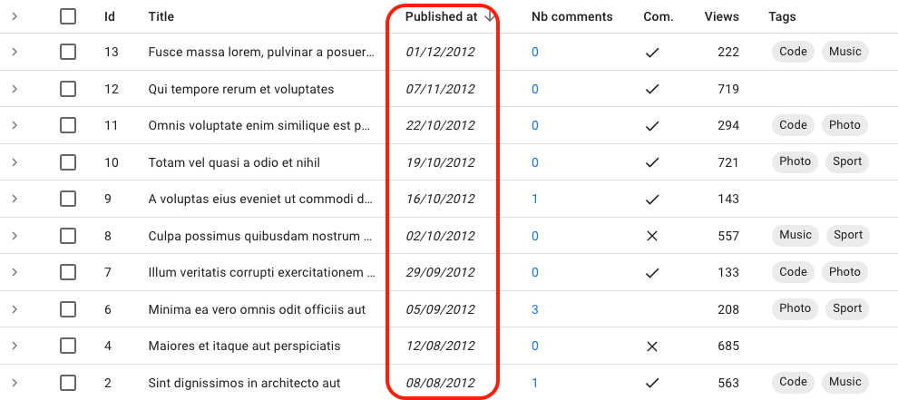

# `<DateField>`

Displays a date, datetime or time using the browser locale (thanks to `Date.toLocaleDateString()`, `Date.toLocaleString()` and `Date.toLocaleTimeString()`).



## Usage

In a List or a Show view, use `<DateField>` as any other field component to render a date value:

```jsx
import { List, Datagrid, TextField, DateField } from 'react-admin';

export const PostList = () => (
    <List>
        <Datagrid>
            <TextField source="id" />
            <TextField source="title" />
            <DateField source="published_at" />
            ...
        </Datagrid>
    </List>
)
```

`<DateField>` renders the record `{ id: 1234, published_at: '2017-04-23' }` as `<span>04/23/2017</span>` in US English and `<span>23/04/2017</span>` in French.

`<DateField>` works for values that are dates (e.g. `new Date('2017-04-23')`) or strings that convert to dates (e.g. `'2017-04-23'`).

`<DateField>` uses the `Intl.DateTimeFormat` browser API if available, passing the `locales` and `options` props as arguments. This allows a perfect display of dates, datetimes and times. See [Intl.DateTimeFormat documentation](https://developer.mozilla.org/en-US/docs/Web/JavaScript/Reference/Global_Objects/Intl/DateTimeFormat/DateTimeFormat#options) for [the `options` prop](#options) syntax. If Intl is not available, `<DateField>` outputs dates as is (and ignores the `locales` and `options` props).

## Props

| Prop       | Required | Type    | Default | Description                                                                                              |
| ---------- | -------- | ------- | ------- | -------------------------------------------------------------------------------------------------------- |
| `locales`  | Optional | string  | ''      | Override the browser locale in the date formatting. Passed as first argument to `Intl.DateTimeFormat()`. |
| `options`  | Optional | Object  | -       | Date formatting options. Passed as second argument to `Intl.DateTimeFormat()`.                           |
| `showTime` | Optional | boolean | `false` | If true, show the time                                         |
| `showDate` | Optional | boolean | `true` | If true, show the date                                          |
| `transform`| Optional | Function| -       | A function to transform the value before display.                                                      |

`<DateField>` also accepts the [common field props](./Fields.md#common-field-props).

## `locales`

Override the browser locale for the date formatting. Passed as first argument to `Intl.DateTimeFormat()`.

```jsx
<DateField source="published_at" locales="fr-FR" />
// renders the record { id: 1234, published_at: new Date('2017-04-23') } as
<span>23/04/2017</span>
```

When no `locales` prop is passed, `<DateField>` uses the browser locale.

## `options`

Options passed to `Intl.DateTimeFormat()`. See [Intl.DateTimeFormat documentation](https://developer.mozilla.org/en-US/docs/Web/JavaScript/Reference/Global_Objects/Intl/DateTimeFormat/DateTimeFormat#options) for the `options` prop syntax.


```jsx
<DateField source="published_at" options={{
    weekday: 'long',
    year: 'numeric',
    month: 'long',
    day: 'numeric'
}} />
// renders the record { id: 1234, published_at: new Date('2017-04-23') } as
<span>Sunday, April 23, 2017</span>
```


**Tip**: If you need more formatting options than what `Intl.DateTimeFormat` can provide, build your own field component leveraging a third-party library like [moment.js](https://momentjs.com/).

## `showDate`

By default, `<DateField>` displays a date using `date.toLocaleDateString()`. Set `showDate` to `false` to only display the time.

```jsx
<DateField source="published_at" showTime showDate={false} />
// renders the record { id: 1234, published_at: new Date('2017-04-23 23:05') } as
<span>11:05:00 PM</span>
```

When `showDate` is false, `<DateField>` uses the `date.toLocaleTimeString()` to format the time.

## `showTime`

By default, `<DateField>` displays a date using `date.toLocaleDateString()`. Set `showTime` to `true` to display both the date and time, using `date.toLocaleString()`.

```jsx
<DateField source="published_at" showTime />
// renders the record { id: 1234, published_at: new Date('2017-04-23 23:05') } as
<span>4/23/2017, 11:05:00 PM</span>
```

You can also set `showDate` to `false` to only display the time.

```jsx
<DateField source="published_at" showTime showDate={false} />
// renders the record { id: 1234, published_at: new Date('2017-04-23 23:05') } as
<span>11:05:00 PM</span>
```

## `transform`

`<DateField>` excepts the field value to be a date or a string. If it's a string, it does an automatic conversion to date (using the `new Date()` constructor) before formatting that date.

You may want to override that string to date conversion if the value uses a special format. Use the `transform` prop for that. It expects a function that takes the field value as argument and returns the transformed value.

```jsx
<DateField 
    source="published_at"
    transform={value =>
        new Date(value.replace(/(\d{2})-(\d{2})-(\d{2})/, '20$3-$1-$2'))
    }
 />
// renders the record { id: 1234, published_at: '01-23-16' } as
<span>01/23/2016</span>
```