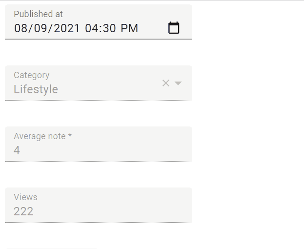

# `<DateTimeInput>`

An input for editing dates with time. `<DateTimeInput>` renders an `<input type="datetime-local" >` element, that most browsers display as [date and time picker](https://developer.mozilla.org/en-US/docs/Web/HTML/Element/input/datetime-local).



The appearance depends on the browser, and falls back to a text input on safari. The date formatting in this input depends on the user's locale.

## Usage

```jsx
import { DateTimeInput } from 'react-admin';

<DateTimeInput source="published_at" />
```

The input value must be a valid date string, i.e. a string understood by JavasSript's [`Date.parse()` method](https://developer.mozilla.org/en-US/docs/Web/JavaScript/Reference/Global_Objects/Date/parse). Strings with [the ISO 8601 format](https://en.wikipedia.org/wiki/ISO_8601) 'yyyy-MM-ddThh:mm' are the most common (e.g. `'2022-04-30T12:30'`). The field value may contain a timezone offset, e.g. `'2022-04-30T12:30+02:00'`. If no timezone is specified, the browser's timezone is used.

After modification by the user, the value is stored as a `Date` object, using the browser's timezone. When transformed to JSON, the date is serialized as a string in the ISO 8601 format ('yyyy-MM-ddThh:mm').

`<DateTimeInput>` also accepts the [common input props](./Inputs.md#common-input-props).

**Tip**: For a MUI styled `<DateTimeInput>` component, check out [MUI Date pickers](https://mui.com/x/react-date-pickers/getting-started/#date-pickers)
