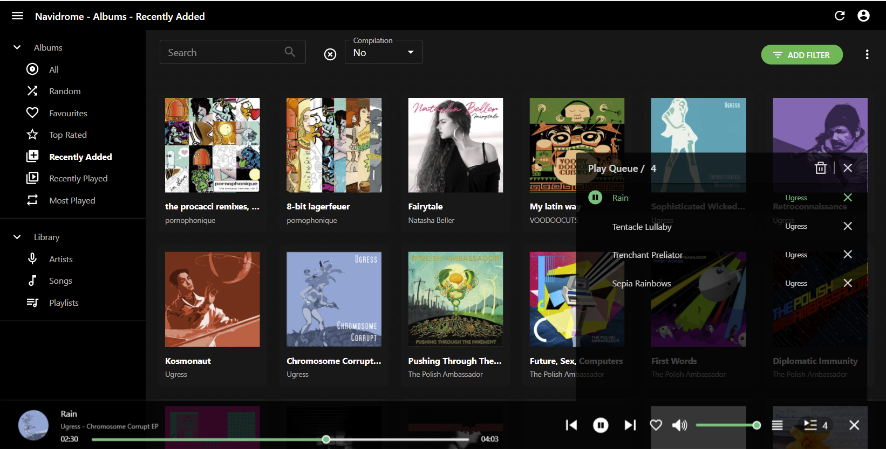

# React-admin Demos

If you want to see what react-admin is capable of, or if you want to learn from apps built by seasoned react-admin developers, check out these demos.

## E-commerce

The admin of a fictional poster shop, allowing to manage sales, products, customers and reviews. Built by the core team.

* Demo: [https://marmelab.com/react-admin-demo/](https://marmelab.com/react-admin-demo/)
* Source code: [https://github.com/marmelab/react-admin/tree/master/examples/demo](https://github.com/marmelab/react-admin/tree/master/examples/demo)

The source shows how to implement the following features:

- [Custom theme with white AppBar](https://github.com/marmelab/react-admin/blob/master/examples/demo/src/layout/themes.ts)
- [d3.js chart with Recharts](https://github.com/marmelab/react-admin/blob/master/examples/demo/src/dashboard/OrderChart.tsx)
- [List widget embedded in another page](https://github.com/marmelab/react-admin/blob/master/examples/demo/src/dashboard/NewCustomers.tsx)
- [Tabbed Datagrid](https://github.com/marmelab/react-admin/blob/master/examples/demo/src/orders/OrderList.tsx)
- [Row expand with a custom show view](https://github.com/marmelab/react-admin/blob/master/examples/demo/src/invoices/InvoiceList.tsx)
- [Grid list showing a list of images](https://github.com/marmelab/react-admin/blob/master/examples/demo/src/products/GridList.tsx)
- [Filter sidebar](https://github.com/marmelab/react-admin/blob/master/examples/demo/src/products/Aside.tsx)
- [Custom form layout](https://github.com/marmelab/react-admin/blob/master/examples/demo/src/visitors/VisitorEdit.tsx)
- [Custom page with static list](https://github.com/marmelab/react-admin/blob/master/examples/demo/src/routes.tsx)
- [Edit view in a sidebar](https://github.com/marmelab/react-admin/blob/master/examples/demo/src/reviews/ReviewList.tsx)

## CRM

A complete CRM app allowing to manage contacts, companies, deals, notes, tasks, and tags. Built by the core team.

<video src="https://user-images.githubusercontent.com/99944/116970434-4a926480-acb8-11eb-8ce2-0602c680e45e.mp4" controls="controls" style="max-width: 100%"></video>

* Demo: [https://marmelab.com/react-admin-crm/](https://marmelab.com/react-admin-crm/)
* Source code: [https://github.com/marmelab/react-admin/tree/master/examples/crm](https://github.com/marmelab/react-admin/tree/master/examples/crm)

The source shows how to implement the following features:

- [Horizontal navigation](https://github.com/marmelab/react-admin/blob/7c60db09aea34a90607a4e7560e9e4b51bd7b9a3/examples/crm/src/Layout.tsx)
- [Custom d3.js / Nivo Chart in the dashboard](https://github.com/marmelab/react-admin/blob/7c60db09aea34a90607a4e7560e9e4b51bd7b9a3/examples/crm/src/dashboard/DealsChart.tsx)
- [Add or remove tags to a contact](https://github.com/marmelab/react-admin/blob/7c60db09aea34a90607a4e7560e9e4b51bd7b9a3/examples/crm/src/contacts/TagsListEdit.tsx)
- [Use dataProvider hooks to update notes](https://github.com/marmelab/react-admin/blob/7c60db09aea34a90607a4e7560e9e4b51bd7b9a3/examples/crm/src/notes/Note.tsx)
- [Custom grid layout for companies](https://github.com/marmelab/react-admin/blob/7c60db09aea34a90607a4e7560e9e4b51bd7b9a3/examples/crm/src/companies/GridList.tsx)
- [Filter by "my favorites" in the company list](https://github.com/marmelab/react-admin/blob/7c60db09aea34a90607a4e7560e9e4b51bd7b9a3/examples/crm/src/deals/OnlyMineInput.tsx)
- [Trello-like board for the deals pipeline](https://github.com/marmelab/react-admin/blob/7c60db09aea34a90607a4e7560e9e4b51bd7b9a3/examples/crm/src/deals/DealListContent.tsx)

## Help Desk

A simple help desk app allowing to manage tickets, users, and tags. Built by the core team.

<video src="https://user-images.githubusercontent.com/99944/212743583-a4ee135f-f55b-4305-86c4-a3da1c49bb98.mov" controls="controls" style="max-width: 100%"></video>

* Demo: [https://marmelab.com/react-admin-helpdesk/](https://marmelab.com/react-admin-helpdesk/)
* Source code: [https://github.com/marmelab/react-admin-helpdesk](https://github.com/marmelab/react-admin-helpdesk)

The source shows how to implement the following features:

* [Real-time notifications](https://github.com/marmelab/react-admin-helpdesk/blob/main/src/ConnectionWatcher.tsx)
* [Real-time reads and locks](https://github.com/marmelab/react-admin-helpdesk/blob/6208ab49597544f0e8d7e238c5c676f73f30c114/src/tickets/ActivityField.tsx)
* [Site search](https://github.com/marmelab/react-admin-helpdesk/blob/6208ab49597544f0e8d7e238c5c676f73f30c114/src/App.tsx#L22)
* [Reference counting](https://github.com/marmelab/react-admin-helpdesk/blob/main/src/products/ProductList.tsx)
* [Show Aside](https://github.com/marmelab/react-admin-helpdesk/blob/6208ab49597544f0e8d7e238c5c676f73f30c114/src/customers/CustomerShowAside.tsx#L10-L20)
* [Lifecycle callbacks](https://github.com/marmelab/react-admin-helpdesk/blob/6208ab49597544f0e8d7e238c5c676f73f30c114/src/dataProvider/dataProvider.tsx#L32-L71)
* [Tabs with count](https://github.com/marmelab/react-admin-helpdesk/blob/6208ab49597544f0e8d7e238c5c676f73f30c114/src/products/ProductShow.tsx#L30)
* [Custom list layout with side filters](https://github.com/marmelab/react-admin-helpdesk/blob/6208ab49597544f0e8d7e238c5c676f73f30c114/src/tickets/TicketList.tsx)
* [Custom List layout for messages](https://github.com/marmelab/react-admin-helpdesk/blob/6208ab49597544f0e8d7e238c5c676f73f30c114/src/tickets/MessageList.tsx)
* [Custom creation form](https://github.com/marmelab/react-admin-helpdesk/blob/6208ab49597544f0e8d7e238c5c676f73f30c114/src/tickets/NewMessageForm.tsx)
* [Latest Reference Field](https://github.com/marmelab/react-admin-helpdesk/blob/6208ab49597544f0e8d7e238c5c676f73f30c114/src/tickets/SubjectField.tsx#L14-L21)
* [Mark as read on visit](https://github.com/marmelab/react-admin-helpdesk/blob/6208ab49597544f0e8d7e238c5c676f73f30c114/src/tickets/TicketShow.tsx#L18)
* [List with live updates](https://github.com/marmelab/react-admin-helpdesk/blob/6208ab49597544f0e8d7e238c5c676f73f30c114/src/tickets/useGetTicketReadsForRecord.ts)

## Music Player

Navidrome is a Spotify clone allowing to manage songs, artists, playlists, and favorites.

* Demo: [https://demo.navidrome.org/app/](https://demo.navidrome.org/app/)
* Source code: [https://github.com/navidrome/navidrome/](https://github.com/navidrome/navidrome/)

## Blog

A simple application with posts, comments and users that we use for our e2e tests. Not designed to have a good UX, but to use most of the react-admin features. Built by the core team.

* Demo: [https://stackblitz.com/github/marmelab/react-admin/tree/master/examples/simple](https://stackblitz.com/github/marmelab/react-admin/tree/master/examples/simple)
* Source code: [https://github.com/marmelab/react-admin/tree/master/examples/simple](https://github.com/marmelab/react-admin/tree/master/examples/simple)

## Broadcom Layer 7 API Hub

A framework built on top of react-admin for building developer portals.

<iframe width="560" height="315" src="https://www.youtube.com/embed/ecHsgNmug9E" title="YouTube video player" frameborder="0" allow="accelerometer; autoplay; clipboard-write; encrypted-media; gyroscope; picture-in-picture" allowfullscreen></iframe>

* Source code: [https://github.com/CAAPIM/APIHub](https://github.com/CAAPIM/APIHub)

## Other Apps

Check out [Issue #4027](https://github.com/marmelab/react-admin/issues/4027) on the react-admin GitHub for a list of apps built by other people.

## Your App Here / showcase

Did you publish an app built with react-admin with open-source code? Open a PR on this page to add it to this list.
