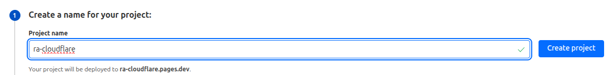

# Deploy React-admin

You have created an awesome React-admin application. Well done! But now, you want to deploy your application in production so users can actually use it.

## Single Page Application

React-admin is a framework to build [Single Page Applications](https://developer.mozilla.org/en-US/docs/Glossary/SPA). It means that your app can be served by a simple static web server.

**Warning**: If you chose Next.js or Remix, you **have to use a dynamic web server** (e.g. CloudFlare pages, Vercel, etc.).

With the default configuration of React-admin, that you can have using [`create-react-admin`](./CreateReactAdmin.md), you can run `yarn build` or `npm run build` to compile your application with [`vite`](https://vite.dev).

This builds your application in the `dist` directory at the application root. Let's have a look to what's in there:

```tree
dist/
  ├ assets/
  │  └ index-F74jyUxd.js
  ├ favicon.ico
  ├ index.html
  └ manifest.json
```

As you can see, your app is contained in a single Javascript file, used in a simple `index.html`. To deploy your application, you just need to serve this directory with all URLs handled by `index.html`.

There are multiple ways to deploy your app automatically to various hosts which does not require you to setup a web server manually. Some of these are addressed in this page.

## Deploy With GitHub Actions And GitHub Pages

You can deploy your application with [GitHub Pages](https://pages.github.com) by setting up a [GitHub Actions](https://github.com/features/actions) workflow. To set it up, you need to [configure the source of your GitHub Pages to GitHub Actions](https://docs.github.com/en/pages/getting-started-with-github-pages/configuring-a-publishing-source-for-your-github-pages-site#publishing-with-a-custom-github-actions-workflow).

Then, initialize a new workflow in `.github/workflows/admin.yml` with the following content:

```yaml
name: Build and deploy React-admin

on:
  push:
    branches:
      - main

jobs:
  build:
    name: Build the admin panel to be deployed
    runs-on: ubuntu-latest
    environment: github-pages
    steps:
      # Pull the latest version of the application.
      - uses: actions/checkout@v4

      # Setup NodeJS tools.
      - uses: actions/setup-node@v4
        with:
          node-version: lts/*
      - name: Enable corepack to use latest stable yarn
        run: corepack enable

      # Build the React-admin application.
      - name: Build
        run: yarn build
        
      # Upload the built application as a GitHub Pages artifact.
      - name: Upload static files as artifact
        uses: actions/upload-pages-artifact@v3
        with:
          path: dist/

  deploy:
    name: Deploy React-admin application to GitHub Pages
    runs-on: ubuntu-latest
    needs: build
      
    environment:
      name: github-pages
      url: ${{ steps.deployment.outputs.page_url }}

    # Grant GITHUB_TOKEN the permissions required to make a Pages deployment
    permissions:
      pages: write      # to deploy to Pages
      id-token: write   # to verify the deployment originates from an appropriate source

    steps:
      # Deploy the GitHub Pages artifact.
      - name: Deploy artifact to GitHub Pages
        uses: actions/deploy-pages@v4
```

This workflow will run everytime you push or merge something in the main branch of your repository. You can find the URL of the deployed website in `Settings > Pages` in your GitHub repository.


## Deploy With GitHub Actions to Cloudflare

To deploy to [Cloudflare Pages](https://pages.cloudflare.com/), you need to have a [Cloudflare](https://www.cloudflare.com/) account. First, retrieve your account ID from Cloudflare, the documentation on how to retrieve it is available on the [Cloudflare documentation](https://developers.cloudflare.com/fundamentals/account/find-account-and-zone-ids/)

Then, create a new API token from your [Cloudflare Profile page](https://dash.cloudflare.com/profile/api-tokens):
- First click on `Create Token`
- Then on the `Edit Cloudflare Workers` template
- Select your organization inside the `Account Resources`
- Select `All Zones` for `Zone Resources`
- Then `Continue to Summary`
- Then `Create Token`.

More information on how to create an API token is available on the [Cloudflare documentation](https://developers.cloudflare.com/fundamentals/api/get-started/create-token/).

To create a new Cloudflare Page App, go to your Cloudflare dashboard, then on `Compute (workers) > Workers & Pages > Create > Pages tab`. Create a new pages from direct upload, enter your project name and then click on `Create Project`, then go back to the `Compute page`.



Once you have configured your API token and retrieved your Account ID, you can setup the following secrets in your repository by going to `Settings > Secrets and variables > Actions` on your GitHub repository:


```sh
# Your Cloudlfare API token
CLOUDFLARE_API_TOKEN=

# Your Cloudlfare Account ID
CLOUDFLARE_ACCOUNT_ID=

# The Cloudflare Pages 
CLOUDFLARE_PROJECT_NAME=
```

Once your project has been configured, initialize a new workflow in your repository `.github/workflows/admin.yml` with the following content:
```yml
name: Build and deploy React-admin

on:
  push:
    branches:
      - main

jobs:
  build:
    name: Build the admin panel to be deployed
    runs-on: ubuntu-latest
    steps:
      - uses: actions/checkout@v4

      - uses: actions/setup-node@v4
        with:
          node-version: lts/*

      - name: Install dependencies
        run: npm install

      - name: Build
        run: npm run build

      - name: Upload dist folder as an artifact
        uses: actions/upload-artifact@v4
        with:
          name: dist
          path: dist

  deploy:
    name: Deploy React-admin Application to Cloudflare
    runs-on: ubuntu-latest
    needs: build

    permissions:
      contents: read
      deployments: write

    steps:
      - name: Download prebuilt admin
        uses: actions/download-artifact@v4
        with:
          name: dist
          path: dist

      - name: Display structure of downloaded files
        run: ls -R

      - name: Deploy artifact to Cloudflare
        uses: cloudflare/wrangler-action@v3
        with:
          apiToken: ${{ secrets.CLOUDFLARE_API_TOKEN }}
          accountId: ${{ secrets.CLOUDFLARE_ACCOUNT_ID }}
          command: pages deploy dist --project-name=${{ secrets.CLOUDFLARE_PROJECT_NAME }}
          gitHubToken: ${{ secrets.GITHUB_TOKEN }}
```

Now, each time your code will be pushed to your main branch, an action will be started that will automatically deploy your app to your Cloudflare Pages app.
