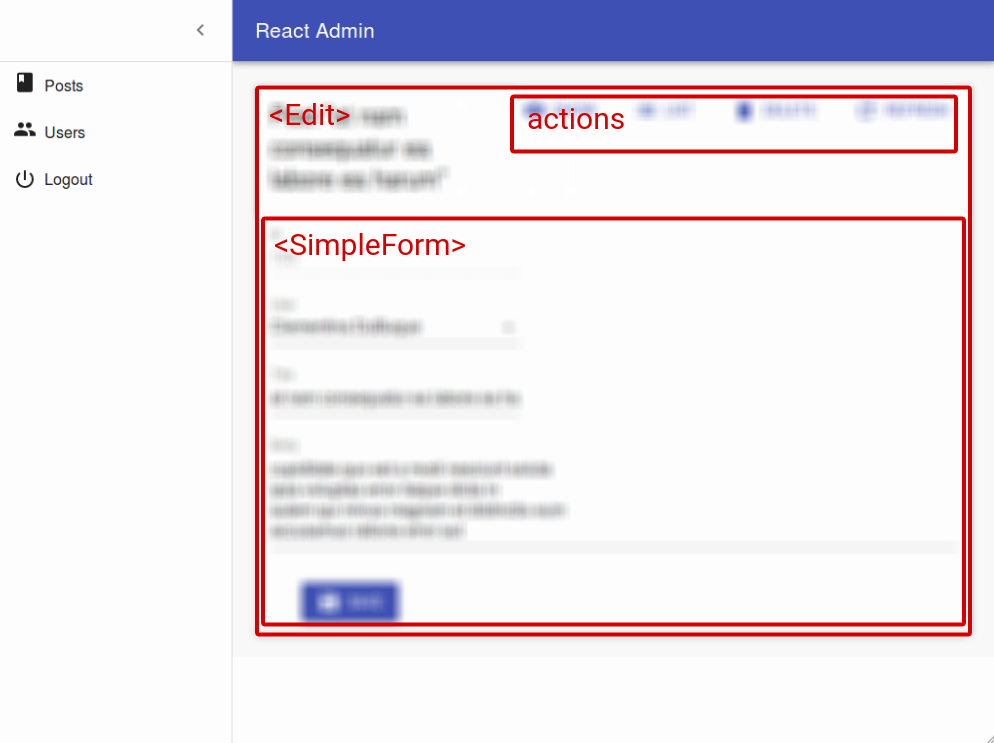

# `<Edit>`

The `<Edit>` component is the main component for edition pages. It fetches a record based on the URL, prepares a form submit handler, and renders the page title and actions. It is not responsible for rendering the actual form - that's the job of its child component (usually a form component, like [`<SimpleForm>`](./SimpleForm.md)). This form component uses its children ([`<Input>`](./Inputs.md) components) to render each form input.



The `<Edit>` component calls `dataProvider.getOne()`, using the `id` from the URL. It creates a `RecordContext` with the result. It also creates a [`SaveContext`](./useSaveContext.md) containing a `save` callback, which calls `dataProvider.update()` when executed, and [an `EditContext`](./useEditContext.md) containing both the record and the callback.

## Usage

Wrap the `<Edit>` component around the form you want to create, then pass it as `edit` prop of a given `<Resource>`. `<Edit>` requires no prop by default - it deduces the `resource` and the `id` from the current URL.

For instance, the following component will render an edition form for posts when users browse to `/posts/edit/1234`:

```jsx
// in src/posts.js
import * as React from "react";
import { Edit, SimpleForm, TextInput, DateInput, ReferenceManyField, Datagrid, TextField, DateField, EditButton, required } from 'react-admin';
import RichTextInput from 'ra-input-rich-text';

export const PostEdit = () => (
    <Edit>
        <SimpleForm>
            <TextInput disabled label="Id" source="id" />
            <TextInput source="title" validate={required()} />
            <TextInput multiline source="teaser" validate={required()} />
            <RichTextInput source="body" validate={required()} />
            <DateInput label="Publication date" source="published_at" />
            <ReferenceManyField label="Comments" reference="comments" target="post_id">
                <Datagrid>
                    <TextField source="body" />
                    <DateField source="created_at" />
                    <EditButton />
                </Datagrid>
            </ReferenceManyField>
        </SimpleForm>
    </Edit>
);

// in src/App.js
import * as React from "react";
import { Admin, Resource } from 'react-admin';
import jsonServerProvider from 'ra-data-json-server';

import { PostEdit } from './posts';

const App = () => (
    <Admin dataProvider={jsonServerProvider('https://jsonplaceholder.typicode.com')}>
        <Resource name="posts" edit={PostEdit} />
    </Admin>
);

export default App;
```

You can customize the `<Edit>` component using the following props:

* [`actions`](#actions): override the actions toolbar with a custom component
* [`aside`](#aside): component to render aside to the main content
* `children`: the components that renders the form
* `className`: passed to the root component
* [`component`](#component): override the root component
* [`disableAuthentication`](#disableauthentication): disable the authentication check
* [`id`](#id): the id of the record to edit
* [`mutationMode`](#mutationmode): switch to optimistic or pessimistic mutations (undoable by default)
* [`mutationOptions`](#mutationoptions): options for the `dataProvider.update()` call
* [`queryOptions`](#queryoptions): options for the `dataProvider.getOne()` call
* [`redirect`](#redirect): change the redirect location after successful creation
* [`resource`](#resource): override the name of the resource to create
* [`sx`](#sx-css-api): Override the styles
* [`title`](#title): override the page title
* [`transform`](#transform): transform the form data before calling `dataProvider.update()`

## `actions`

You can replace the list of default actions by your own elements using the `actions` prop:

```jsx
import * as React from "react";
import Button from '@mui/material/Button';
import { TopToolbar, ListButton, ShowButton, Edit } from 'react-admin';

const PostEditActions = () => (
    <TopToolbar>
        <ShowButton />
        {/* Add your custom actions */}
        <ListButton />
        <Button color="primary" onClick={customAction}>Custom Action</Button>
    </TopToolbar>
);

export const PostEdit = () => (
    <Edit actions={<PostEditActions />}>
        ...
    </Edit>
);
```

Common buttons used as Edit actions are:

- [`<CreateButton>`](./CreateButton.md) to create a new record
- [`<ListButton>`](./Buttons.md#listbutton) to go back to the list
- [`<ShowButton>`](./Buttons.md#showbutton) to go to the show page
- [`<UpdateButton>`](./UpdateButton.md) to trigger a change in the data
- [`<CloneButton>`](./Buttons.md#clonebutton) to clone the current record

And you can add your own button, leveraging the `useRecordContext()` hook:

```jsx
import * as React from "react";
import { useRecordContext, useUpdate, useNotify } from 'react-admin';

const ResetViewsButton = () => {
    const record = useRecordContext();
    const [update, { isLoading }] = useUpdate();
    const notify  = useNotify();
    const handleClick = () => {
        update(
            'posts',
            { id: record.id, data: { views: 0 }, previousData: record },
            {
                onSuccess: () => {
                    notify('Views reset');
                },
                onFailure: error => notify(`Error: ${error.message}`, 'warning'),
            }
        );
    };
    return (
        <Button onClick={handleClick} disabled={isLoading}>
            Reset views
        </Button>
    );
};
```

## `aside`


You may want to display additional information on the side of the form. Use the `aside` prop for that, passing the component of your choice:


```jsx
const Aside = () => (
    <Box sx={{ width: '200px', margin: '1em' }}>
        <Typography variant="h6">Instructions</Typography>
        <Typography variant="body2">
            Posts will only be published once an editor approves them
        </Typography>
    </Box>
);

const PostEdit = () => (
    <Edit aside={<Aside />}>
       // ...
    </Edit>
);
```


The aside component renders in the same `RecordContext` as the `Edit` child component. That means you can display non-editable details of the current `record` in the aside component:


```jsx
const Aside = () => {
    const record = useRecordContext();
    return (
        <div style={{ width: 200, margin: '1em' }}>
            <Typography variant="h6">Post details</Typography>
            {record && (
                <Typography variant="body2">
                    Creation date: {record.createdAt}
                </Typography>
            )}
        </div>
    );
};
```


**Tip**: Always test the record is defined before using it, as react-admin starts rendering the UI before the `dataProvider.getOne()` call is over.

## `component`

By default, the `<Edit>` view render the main form inside a Material UI `<Card>` element. The actual layout of the form depends on the `Form` component you're using ([`<SimpleForm>`](./SimpleForm.md), [`<TabbedForm>`](./TabbedForm.md), or a custom form component).

Some form layouts also use `Card`, in which case the user ends up seeing a card inside a card, which is bad UI. To avoid that, you can override the main page container by passing a `component` prop :

```jsx
// use a div as root component
const PostEdit = () => (
    <Edit component="div">
        ...
    </Edit>
);

// use a custom component as root component 
const PostEdit = () => (
    <Edit component={MyComponent}>
        ...
    </Edit>
);
```

The default value for the `component` prop is `Card`.

## `disableAuthentication`

By default, the `<Edit>` component will automatically redirect the user to the login page if the user is not authenticated. If you want to disable this behavior and allow anonymous access to a creation page, set the `disableAuthentication` prop to `true`.

```jsx
const PostEdit = () => (
    <Edit disableAuthentication>
        ...
    </Edit>
);
```

## `id`

Components based on `<Edit>` are often used as `<Resource edit>` props, and therefore rendered when the URL matches `/[resource]/[id]`. The `<Edit>` component generates a call to `dataProvider.update()` using the id from the URL by default.

You can decide to use a `<Edit>` component in another path, or embedded in a page editing a related record (e.g. in a Dialog). In that case, you can explicitly set the `id` value:

```jsx
const PostEdit = () => (
    <Edit id={1234}>
        ...
    </Edit>
);
```

## `mutationMode`

The `<Edit>` view exposes two buttons, Save and Delete, which perform "mutations" (i.e. they alter the data). React-admin offers three modes for mutations. The mode determines when the side effects (redirection, notifications, etc.) are executed:

- `pessimistic`: The mutation is passed to the dataProvider first. When the dataProvider returns successfully, the mutation is applied locally, and the side effects are executed. 
- `optimistic`: The mutation is applied locally and the side effects are executed immediately. Then the mutation is passed to the dataProvider. If the dataProvider returns successfully, nothing happens (as the mutation was already applied locally). If the dataProvider returns in error, the page is refreshed and an error notification is shown. 
- `undoable` (default): The mutation is applied locally and the side effects are executed immediately. Then a notification is shown with an undo button. If the user clicks on undo, the mutation is never sent to the dataProvider, and the page is refreshed. Otherwise, after a 5 seconds delay, the mutation is passed to the dataProvider. If the dataProvider returns successfully, nothing happens (as the mutation was already applied locally). If the dataProvider returns in error, the page is refreshed and an error notification is shown.

By default, pages using `<Edit>` use the `undoable` mutation mode. This is part of the "optimistic rendering" strategy of react-admin ; it makes user interactions more reactive. 

You can change this default by setting the `mutationMode` prop - and this affects both the Save and Delete buttons. For instance, to remove the ability to undo the changes, use the `optimistic` mode:

```jsx
const PostEdit = () => (
    <Edit mutationMode="optimistic">
        // ...
    </Edit>
);
```

And to make both the Save and Delete actions blocking, and wait for the dataProvider response to continue, use the `pessimistic` mode:

```jsx
const PostEdit = () => (
    <Edit mutationMode="pessimistic">
        // ...
    </Edit>
);
```

**Tip**: When using any other mode than `undoable`, the `<DeleteButton>` displays a confirmation dialog before calling the dataProvider. 

**Tip**: If you want a [confirmation dialog](./Confirm.md) for the Delete button but don't mind undoable Edits, then pass a [custom toolbar](./SimpleForm.md#toolbar) to the form, as follows:


```jsx
import * as React from "react";
import {
    Toolbar,
    SaveButton,
    DeleteButton,
    Edit,
    SimpleForm,
} from 'react-admin';

const CustomToolbar = props => (
    <Toolbar
        {...props}
        sx={{ display: 'flex', justifyContent: 'space-between' }}
    >
        <SaveButton />
        <DeleteButton mutationMode="pessimistic" />
    </Toolbar>
);

const PostEdit = () => (
    <Edit>
        <SimpleForm toolbar={<CustomToolbar />}>
            ...
        </SimpleForm>
    </Edit>
);
```


## `mutationOptions`

`<Edit>` calls `dataProvider.update()` via react-query's `useMutation` hook. You can customize the options you pass to this hook, e.g. to pass [a custom `meta`](./Actions.md#meta-parameter) to the `dataProvider.update()` call.


```jsx
import { Edit, SimpleForm } from 'react-admin';

const PostEdit = () => (
    <Edit mutationOptions={{ meta: { foo: 'bar' } }}>
        <SimpleForm>
            ...
        </SimpleForm>
    </Edit>
);
```


You can also use `mutationOptions` to override success or error side effects, by setting the `mutationOptions` prop. Refer to the [useMutation documentation](https://tanstack.com/query/v3/docs/react/reference/useMutation) in the react-query website for a list of the possible options.

Let's see an example with the success side effect. By default, when the save action succeeds, react-admin shows a notification, and redirects to the list page. You can override this behavior and pass custom success side effects by providing a `mutationOptions` prop with an `onSuccess` key:


```jsx
import * as React from 'react';
import { useNotify, useRefresh, useRedirect, Edit, SimpleForm } from 'react-admin';

const PostEdit = () => {
    const notify = useNotify();
    const refresh = useRefresh();
    const redirect = useRedirect();

    const onSuccess = () => {
        notify(`Changes saved`);
        redirect('/posts');
        refresh();
    };

    return (
        <Edit mutationOptions={{ onSuccess }}>
            <SimpleForm>
                ...
            </SimpleForm>
        </Edit>
    );
}
```


The default `onSuccess` function is:

```js
() => {
    notify('ra.notification.updated', {
        messageArgs: { smart_count: 1 },
        undoable: mutationMode === 'undoable'
    });
    redirect('list', resource, data.id, data);
}
```

**Tip**: If you just want to customize the redirect behavior, you can use [the `redirect` prop](#redirect) instead.

**Tip**: When you use `mutationMode="pessimistic"`, the `onSuccess` function receives the response from the `dataProvider.update()` call, which is the created/edited record (see [the dataProvider documentation for details](./DataProviderWriting.md#response-format)). You can use that response in the success side effects: 

```jsx
import * as React from 'react';
import { useNotify, useRefresh, useRedirect, Edit, SimpleForm } from 'react-admin';

const PostEdit = () => {
    const notify = useNotify();
    const refresh = useRefresh();
    const redirect = useRedirect();

  const onSuccess = (data) => {
        notify(`Changes to post "${data.title}" saved`);
        redirect('/posts');
        refresh();
    };

    return (
        <Edit mutationOptions={{ onSuccess }} mutationMode="pessimistic">
            <SimpleForm>
                ...
            </SimpleForm>
        </Edit>
    );
}
```

**Tip**: If you want to have different success side effects based on the button clicked by the user (e.g. if the creation form displays two submit buttons, one to "save and redirect to the list", and another to "save and display an empty form"), you can set the `mutationOptions` prop on [the `<SaveButton>` component](./SaveButton.md), too.

Similarly, you can override the failure side effects with an `onError` option. By default, when the save action fails at the dataProvider level, react-admin shows a notification error.


```jsx
import * as React from 'react';
import { useNotify, useRefresh, useRedirect, Edit, SimpleForm } from 'react-admin';

const PostEdit = () => {
    const notify = useNotify();
    const refresh = useRefresh();
    const redirect = useRedirect();

    const onError = (error) => {
        notify(`Could not edit post: ${error.message}`);
        redirect('/posts');
        refresh();
    };

    return (
        <Edit mutationOptions={{ onError }}>
            <SimpleForm>
                ...
            </SimpleForm>
        </Edit>
    );
}
```


The `onError` function receives the error from the `dataProvider.update()` call. It is a JavaScript Error object (see [the dataProvider documentation for details](./DataProviderWriting.md#error-format)).

The default `onError` function is:

```jsx
(error) => {
    notify(typeof error === 'string' ? error : error.message || 'ra.notification.http_error', { type: 'error' });
    if (mutationMode === 'undoable' || mutationMode === 'pessimistic') {
        refresh();
    }
}
```

**Tip**: If you want to have different failure side effects based on the button clicked by the user, you can set the `mutationOptions` prop on the `<SaveButton>` component, too.

## `queryOptions`

`<Edit>` calls `dataProvider.getOne()` on mount via react-query's `useQuery` hook. You can customize the options you pass to this hook by setting the `queryOptions` prop.

This can be useful e.g. to pass [a custom `meta`](./Actions.md#meta-parameter) to the `dataProvider.getOne()` call.


```jsx
import { Edit, SimpleForm } from 'react-admin';

export const PostShow = () => (
    <Edit queryOptions={{ meta: { foo: 'bar' } }}>
        <SimpleForm>
            ...
        </SimpleForm>
    </Edit>
);
```


You can also use `queryOptions` to force a refetch on reconnect:


```jsx
const PostEdit = () => (
    <Edit queryOptions={{ refetchOnReconnect: true }}>
        ...
    </Edit>
);
```


Refer to the [useQuery documentation](https://tanstack.com/query/v3/docs/react/reference/useQuery) in the react-query website for a list of the possible options.

## `redirect`

By default, submitting the form in the `<Edit>` view redirects to the `<List>` view.

You can customize the redirection by setting the `redirect` prop to one of the following values:

- `'list'`: redirect to the List view (the default)
- `'show'`: redirect to the Show view
- `false`: do not redirect
- A function `(resource, id, data) => string` to redirect to different targets depending on the record

```jsx
const PostEdit = () => (
    <Edit redirect="show">
        ...
    </Edit>
);
```

Note that the `redirect` prop is ignored if you set [the `mutationOptions` prop](#mutationoptions). See that prop for how to set a different redirection path in that case. 

## `resource`

Components based on `<Edit>` are often used as `<Resource edit>` props, and therefore rendered when the URL matches `/[resource]/[id]`. The `<Edit>` component generates a call to `dataProvider.update()` using the resource name from the URL by default.

You can decide to use a `<Edit>` component in another path, or embedded in a page using another resource name (e.g. in a Dialog). In that case, you can explicitly set the `resource` name:

```jsx
const PostEdit = () => (
    <Edit resource="posts">
        ...
    </Edit>
);
```

## `sx`: CSS API

The `<Edit>` components accept the usual `className` prop, but you can override many class names injected to the inner components by React-admin thanks to the `sx` property (as most Material UI components, see their [documentation about it](https://mui.com/material-ui/customization/how-to-customize/#overriding-nested-component-styles)). This property accepts the following keys:

| Rule name               | Description                                                                          |
|-------------------------|--------------------------------------------------------------------------------------|
| `& .RaEdit-main`      | Applied to the main container                                                        |
| `& .RaEdit-noActions` | Applied to the main container when `actions` prop is `false`                         |
| `& .RaEdit-card`      | Applied to the child component inside the main container (Material UI's `Card` by default)   |

To override the style of all instances of `<Edit>` components using the [Material UI style overrides](https://mui.com/material-ui/customization/theme-components/#theme-style-overrides), use the `RaEdit` key.

## `title`

By default, the title for the Edit view is “Edit [resource_name] #[record_id]”.

You can customize this title by specifying a custom `title` prop:

```jsx
const PostTitle = () => {
    const record = useRecordContext();
    return <span>Post {record ? `"${record.title}"` : ''}</span>;
};

export const PostEdit = () => (
    <Edit title={<PostTitle />}>
        ...
    </Edit>
);
```

The `title` value can be a string or a React element.

## `transform`

To transform a record after the user has submitted the form but before the record is passed to `dataProvider.update()`, use the `transform` prop. It expects a function taking a record as argument, and returning a modified record. For instance, to add a computed field upon edition:

```jsx
export const UserEdit = (props) => {
    const transform = data => ({
        ...data,
        fullName: `${data.firstName} ${data.lastName}`
    });
    return (
        <Edit {...props} transform={transform}>
            ...
        </Edit>
    );
}
```

The `transform` function can also return a `Promise`, which allows you to do all sorts of asynchronous calls (e.g. to the `dataProvider`) during the transformation.

**Tip**: If you want to have different transformations based on the button clicked by the user (e.g. if the creation form displays two submit buttons, one to "save", and another to "save and notify other admins"), you can set the `transform` prop on [the `<SaveButton>` component](./SaveButton.md), too.

**Tip**: The `transform` function also get the `previousData` in its second argument:

```jsx
export const UserEdit = (props) => {
    const transform = (data, { previousData }) => ({
        ...data,
        avoidChangeField: previousData.avoidChangeField
    });
    return (
        <Edit {...props} transform={transform}>
            ...
        </Edit>
    );
}
```

## Cleaning Up Empty Strings

As a reminder, HTML form inputs always return strings, even for numbers and booleans. So the empty value for a text input is the empty string, not `null` or `undefined`. This means that the data sent to `dataProvider.update()` will contain empty strings:

```js
{
    title: '',
    average_note: '',
    body: '',
    // etc.
}
```

If you prefer to have `null` values, or to omit the key for empty values, use [the `transform` prop](#transform) to sanitize the form data before submission:

```jsx
export const UserEdit = (props) => {
    const transform = (data) => {
        const sanitizedData = {};
        for (const key in data) {
            if (typeof data[key] === "string" && data[key].trim().length === 0) continue;
            sanitizedData[key] = data[key]; 
        }
        return sanitizedData;
    };
    return (
        <Edit {...props} transform={transform}>
            ...
        </Edit>
    );
}
```

As an alternative, you can clean up empty values at the input level, using [the `parse` prop](./Inputs.md#transforming-input-value-tofrom-record).

## Adding `meta` To The DataProvider Call

You can pass a custom `meta` to the `dataProvider` call, using either `queryOptions`, or `mutationOptions`:

- Use [the `queryOptions` prop](#queryoptions) to pass [a custom `meta`](./Actions.md#meta-parameter) to the `dataProvider.getOne()` call.
- Use [the `mutationOptions` prop](#mutationoptions) to pass [a custom `meta`](./Actions.md#meta-parameter) to the `dataProvider.update()` call.


```jsx
import { Edit, SimpleForm } from 'react-admin';

const PostEdit = () => (
    <Edit mutationOptions={{ meta: { foo: 'bar' } }}>
        <SimpleForm>
            ...
        </SimpleForm>
    </Edit>
);
```


## Changing The Notification Message

Once the `dataProvider` returns successfully after save, users see a generic notification ("Element updated"). You can customize this message by passing a custom success side effect function in [the `mutationOptions` prop](#mutationoptions):


```jsx
import * as React from 'react';
import { useNotify, useRedirect, Edit, SimpleForm } from 'react-admin';

const PostEdit = () => {
    const notify = useNotify();
    const redirect = useRedirect();

    const onSuccess = () => {
        notify(`Post updated successfully`); // default message is 'ra.notification.updated'
        redirect('list', 'posts');
    };

    return (
        <Edit mutationOptions={{ onSuccess }}>
            <SimpleForm>
                ...
            </SimpleForm>
        </Edit>
    );
}
```


**Tip**: In `optimistic` and `undoable` mutation modes, react-admin calls the the `onSuccess` callback method with no argument. In `pessimistic` mode, it calls it with the response returned by the dataProvider as argument.

You can do the same for error notifications, by passing a custom `onError`  callback.

**Tip**: The notification message will be translated.

## Editing A Record In A Modal

`<Edit>` is designed to be a page component, passed to the `edit` prop of the `<Resource>` component. But you may want to let users edit a record from another page. 

<video controls autoplay playsinline muted loop>
  <source src="https://marmelab.com/ra-enterprise/modules/assets/edit-dialog.webm" type="video/webm" />
  <source src="https://marmelab.com/ra-enterprise/modules/assets/edit-dialog.mp4" type="video/mp4" />
  Your browser does not support the video tag.
</video>

* If you want to allow edition from the `list` page, use [the `<EditDialog>` component](./EditDialog.md)
* If you want to allow edition from another page, use [the `<EditInDialogButton>` component](./EditInDialogButton.md)

## Live Updates

If you want to subscribe to live updates on the record (topic: `resource/[resource]/[id]`), use [the `<EditLive>` component](./EditLive.md) instead.

```diff
-import { Edit, SimpleForm, TextInput } from 'react-admin';
+import { SimpleForm, TextInput } from 'react-admin';
+import { EditLive } from '@react-admin/ra-realtime';

const PostEdit = () => (
-   <Edit>
+   <EditLive>
        <SimpleForm>
            <TextInput source="title" />
        </SimpleForm>
-   </Edit>
+   </EditLive>
);
```

The user will see alerts when other users update or delete the record.

## Linking Two Inputs

Edition forms often contain linked inputs, e.g. country and city (the choices of the latter depending on the value of the former).

React-admin relies on [react-hook-form](https://react-hook-form.com/) for form handling. You can grab the current form values using react-hook-form's [useWatch](https://react-hook-form.com/docs/usewatch) hook.

```jsx
import * as React from 'react';
import { Edit, SimpleForm, SelectInput } from 'react-admin';
import { useWatch } from 'react-hook-form';

const countries = ['USA', 'UK', 'France'];
const cities = {
    USA: ['New York', 'Los Angeles', 'Chicago', 'Houston', 'Phoenix'],
    UK: ['London', 'Birmingham', 'Glasgow', 'Liverpool', 'Bristol'],
    France: ['Paris', 'Marseille', 'Lyon', 'Toulouse', 'Nice'],
};
const toChoices = items => items.map(item => ({ id: item, name: item }));

const CityInput = props => {
    const country = useWatch({ name: 'country' });
    return (
        <SelectInput
            choices={country ? toChoices(cities[country]) : []}
            {...props}
        />
    );
};

const OrderEdit = () => (
    <Edit>
        <SimpleForm>
            <SelectInput source="country" choices={toChoices(countries)} />
            <CityInput source="cities" />
        </SimpleForm>
    </Edit>
);

export default OrderEdit;
```

**Tip:** If you'd like to avoid creating an intermediate component like `<CityInput>`, or are using an `<ArrayInput>`, you can use the [`<FormDataConsumer>`](./Inputs.md#linking-two-inputs) component as an alternative.
