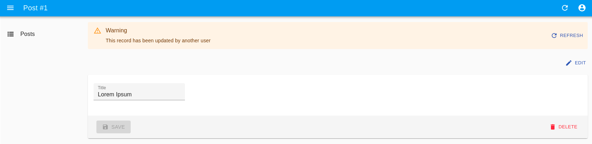

# `<EditLive>`

`<EditLive>` is an [Enterprise Edition](https://marmelab.com/ra-enterprise) component that renders an Edit view. It displays a warning when the record is updated by another user and offers to refresh the page. Also, it displays a warning when the record is deleted by another user.



## Usage

Use `<EditLive>` instead of `<Edit>`:

```jsx
import { SimpleForm, TextInput } from 'react-admin';
import { EditLive } from '@react-admin/ra-realtime';

const PostEdit = () => (
    <EditLive>
        <SimpleForm>
            <TextInput source="title" />
        </SimpleForm>
    </EditLive>
);
```

To trigger `<EditLive>` features, the API has to publish events containing at least the following:

```js
{
    topic : '/resource/{resource}/{recordIdentifier}',
    type: '{deleted || updated}',
    payload: { id: [{ recordIdentifier }]},
}
```

`<EditLive>` accepts the same props as `<Edit>`. Refer to [the `<Edit>` documentation](./Edit.md) for more information.

## `onEventReceived`

The `<EditLive>` allows you to customize the side effects triggered when it receives a new event, by passing a function to the `onEventReceived` prop:

```jsx
import { SimpleForm, TextInput, useRefresh } from 'react-admin';
import { EditLive, EventType } from '@react-admin/ra-realtime';

const PostEdit = () => {
    const notify = useNotify();

    const handleEventReceived = (
        event,
        { setDeleted, setUpdated, setUpdatedDisplayed }
    ) => {
        if (event.type === EventType.Updated) {
            notify('Record updated');
            setUpdated(true);
            setUpdatedDisplayed(true);
        } else if (event.type === EventType.Deleted) {
            notify('Record deleted');
            setDeleted(true);
            setUpdated(false);
            setUpdatedDisplayed(true);
        }
    };

    return (
        <EditLive onEventReceived={handleEventReceived}>
            <SimpleForm>
                <TextInput source="title" />
            </SimpleForm>
        </EditLive>
    );
};
```

The function passed to `onEventReceived` will be called with the event as its first argument and an object containing functions that will update the UI:

-   `setDeleted`: If set to `true`, the edit view will show a message to let users know this record has been deleted.
-   `setUpdated`: If set to `true`, the edit view will show a message to let users know this record has been updated.
-   `setUpdatedDisplayed`: Must be set to true after calling `setUpdated`. This is used to show the message about the record being updated only for a few seconds.
