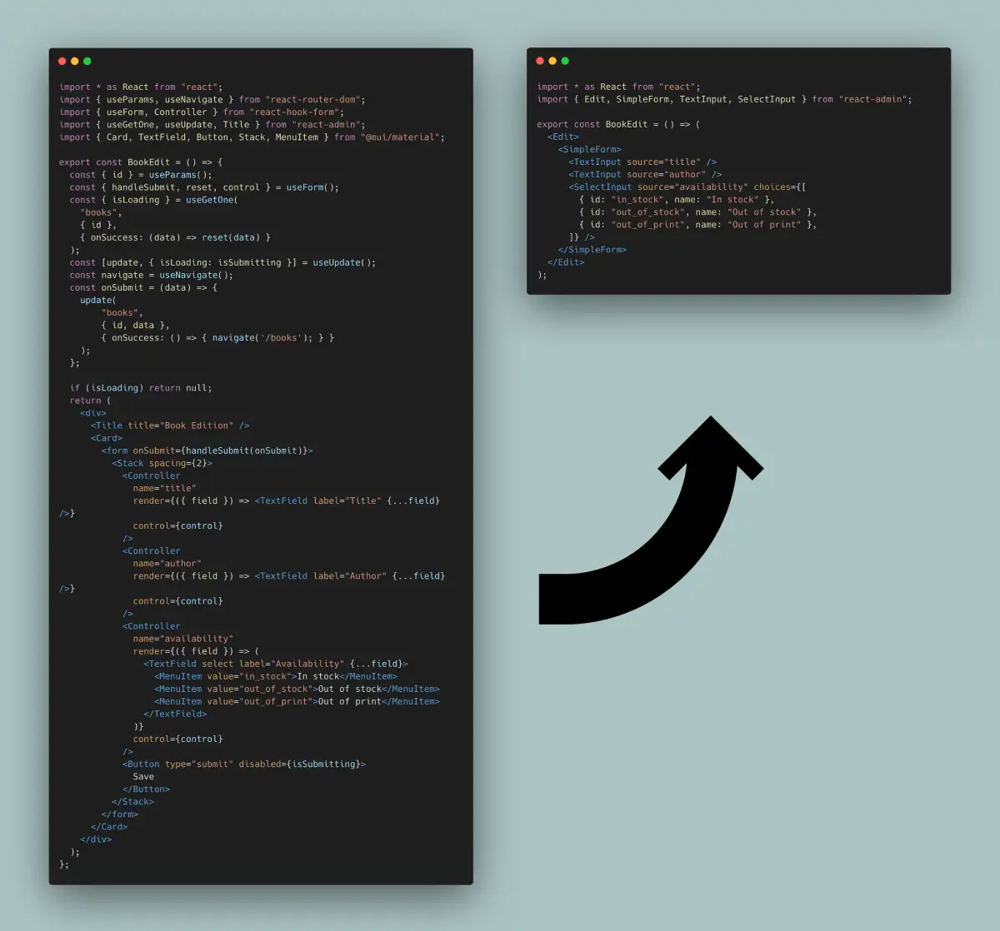

# The Creation and Edition Pages

React-admin provides many hooks and components to let you build custom user experiences for editing and creating records, leveraging Material UI and react-hook-form.


## An Edition View Built By Hand

Edition views are very common in single-page apps. The most usual way to allow a user to update a record is to fetch the record from an API based on the URL parameters, initialize a form with the record, update the inputs as the user changes the values, and call the API to update the record with the new values upon submission. 

[](./img/edit-from-react-to-react-admin.webp)

To better understand how to use the various react-admin hooks and components dedicated to editing and creating, let's start by building such an edition view by hand.

Here is how you could write a book edition view in pure React, leveraging react-admin's [data fetching hooks](./Actions.md), and [react-hook-form](https://react-hook-form.com/) to bind form inputs with a record object:

```jsx
import * as React from "react";
import { useParams, useNavigate } from "react-router-dom";
import { useForm, Controller } from "react-hook-form";
import { useGetOne, useUpdate, Title } from "react-admin";
import { Card, TextField, Button, Stack, MenuItem } from "@mui/material";

export const BookEdit = () => {
  const { id } = useParams();
  const { handleSubmit, reset, control } = useForm();
  const { isPending } = useGetOne(
    "books",
    { id },
    { onSuccess: (data) => reset(data) }
  );
  const [update, { isPending: isSubmitting }] = useUpdate();
  const navigate = useNavigate();
  const onSubmit = (data) => {
    update(
        "books",
        { id, data },
        { onSuccess: () => { navigate('/books'); } }
    );
  };

  if (isPending) return null;
  return (
    <div>
      <Title title="Book Edition" />
      <Card>
        <form onSubmit={handleSubmit(onSubmit)}>
          <Stack spacing={2}>
            <Controller
              name="title"
              render={({ field }) => <TextField label="Title" {...field} />}
              control={control}
            />
            <Controller
              name="author"
              render={({ field }) => <TextField label="Author" {...field} />}
              control={control}
            />
            <Controller
              name="availability"
              render={({ field }) => (
                <TextField select label="Availability" {...field}>
                  <MenuItem value="in_stock">In stock</MenuItem>
                  <MenuItem value="out_of_stock">Out of stock</MenuItem>
                  <MenuItem value="out_of_print">Out of print</MenuItem>
                </TextField>
              )}
              control={control}
            />
            <Button type="submit" disabled={isSubmitting}>
              Save
            </Button>
          </Stack>
        </form>
      </Card>
    </div>
  );
};
```

This form displays 3 inputs (two text inputs and one select input), and redirects to the book list view upon successful submission. It doesn't even contain default values, validation, or dependent inputs. Yet, it's already quite verbose.

It's a super common component. In fact, many of its features could be extracted for reuse in other pages. Let's see how to improve the code and the developer experience in the same process. 

## `<Form>`: Form Logic

To use `react-hook-form` with Material UI inputs, the previous example leverages the `<Controller>` tag, which expects a `control` object generated by the `useForm` hook ([see the related `react-hook-form` doc](https://react-hook-form.com/get-started#IntegratingControlledInputs)).

We can avoid the call to `useForm` by putting its logic inside a custom component. That's exaclty what react-admin's [`<Form>` component](./Form.md) does. `<Form>` also creates a react-hook-form `<FormProvider>`, so we no longer need to pass the `control` prop to each `<Controller>` element. 

```diff
import * as React from "react";
import { useParams, useNavigate } from "react-router-dom";
-import { useForm, Controller } from "react-hook-form";
+import { Controller } from "react-hook-form";
-import { useGetOne, useUpdate, Title } from "react-admin";
+import { useGetOne, useUpdate, Title, Form } from "react-admin";
import { Card, TextField, Stack, MenuItem } from "@mui/material";

export const BookEdit = () => {
  const { id } = useParams();
- const { handleSubmit, reset, control } = useForm();
- const { isPending } = useGetOne(
+ const { isPending, data } = useGetOne(
    "books",
    { id },
-   { onSuccess: (data) => reset(data) }
  );
  const [update, { isPending: isSubmitting }] = useUpdate();
  const navigate = useNavigate();
  const onSubmit = (data) => {
    update(
        "books",
        { id, data },
        { onSuccess: () => { navigate('/books'); } }
    );
  };
  if (isPending) return null;
  return (
    <div>
      <Title title="Book Edition" />
      <Card>
-       <form onSubmit={handleSubmit(onSubmit)}>
+       <Form record={data} onSubmit={onSubmit}>
          <Stack spacing={2}>
            <Controller
              name="title"
              render={({ field }) => <TextField label="Title" {...field} />}
-             control={control}
            />
            <Controller
              name="author"
              render={({ field }) => <TextField label="Author" {...field} />}
-             control={control}
            />
            <Controller
              name="availability"
              render={({ field }) => (
                <TextField select label="Availability" {...field}>
                  <MenuItem value="in_stock">In stock</MenuItem>
                  <MenuItem value="out_of_stock">Out of stock</MenuItem>
                  <MenuItem value="out_of_print">Out of print</MenuItem>
                </TextField>
              )}
-             control={control}
            />
            <Button type="submit" disabled={isSubmitting}>
              Save
            </Button>
          </Stack>
-       </form>
+       </Form>
      </Card>
    </div>
  );
};
```

## `<SimpleForm>`: Stacked Layout

Displaying inputs in a Stack is a common UI pattern. [The `<SimpleForm>` component](./SimpleForm.md) is a convenience wrapper around `<Form>` that provides this stacked layout. It also includes a submit button, so the `BookEdit` component code is now more focused on business logic.

```diff
import * as React from "react";
import { useParams, useNavigate } from "react-router-dom";
import { Controller } from "react-hook-form";
-import { useGetOne, useUpdate, Title, Form } from "react-admin";
+import { useGetOne, useUpdate, Title, SimpleForm } from "react-admin";
-import { Card, TextField, Stack, MenuItem } from "@mui/material";
+import { Card, TextField, MenuItem } from "@mui/material";

export const BookEdit = () => {
  const { id } = useParams();
  const { isPending, data } = useGetOne("books", { id });
  const [update, { isPending: isSubmitting }] = useUpdate();
  const navigate = useNavigate();
  const onSubmit = (data) => {
    update(
        "books",
        { id, data },
        { onSuccess: () => { navigate('/books'); } }
    );
  };
  if (isPending) return null;
  return (
    <div>
      <Title title="Book Edition" />
      <Card>
-       <Form record={data} onSubmit={onSubmit}>
+       <SimpleForm record={data} onSubmit={onSubmit}>
-         <Stack spacing={2}>
          <Controller
            name="title"
            render={({ field }) => <TextField label="Title" {...field} />}
          />
          <Controller
            name="author"
            render={({ field }) => <TextField label="Author" {...field} />}
          />
          <Controller
            name="availability"
            render={({ field }) => (
              <TextField select label="Availability" {...field}>
                <MenuItem value="in_stock">In stock</MenuItem>
                <MenuItem value="out_of_stock">Out of stock</MenuItem>
                <MenuItem value="out_of_print">Out of print</MenuItem>
              </TextField>
            )}
          />
-         <Button type="submit" disabled={isSubmitting}>
-           Save
-         </Button>
-       </Stack>
-       </Form>
+       </SimpleForm>
      </Card>
    </div>
  );
};
```

React-admin proposes alternative form layouts ([`<TabbedForm>`](./TabbedForm.md), [`<AccordionForm>`](./AccordionForm.md), [`<WizardForm>`](./WizardForm.md), [`<CreateDialog>, <EditDialog> & <ShowDialog>`](https://react-admin-ee.marmelab.com/documentation/ra-form-layout#createdialog-editdialog--showdialog) as well as a headless [`<Form>`](./Form.md) component.

## Using Input Components

Wrapping form inputs with a `<Controller>` tag is a common pattern, so react-admin provides a shortcut for all the common input types: [Input components](./Inputs.md). This means the `BookEdit` component doesn't need to use `react-hook-form`'s `<Controller>` directly:

```diff
import * as React from "react";
import { useParams, useNavigate } from "react-router-dom";
-import { Controller } from "react-hook-form";
-import { useGetOne, useUpdate, Title, SimpleForm } from "react-admin";
+import { useGetOne, useUpdate, Title, SimpleForm, TextInput, SelectInput } from "react-admin";
-import { Card, TextField, MenuItem } from "@mui/material";
+import { Card } from "@mui/material";

export const BookEdit = () => {
  const { id } = useParams();
  const { isPending, data } = useGetOne("books", { id });
  const [update, { isPending: isSubmitting }] = useUpdate();
  const navigate = useNavigate();
  const onSubmit = (data) => {
    update(
        "books",
        { id, data },
        { onSuccess: () => { navigate('/books'); } }
    );
  };
  if (isPending) return null;
  return (
    <div>
      <Title title="Book Edition" />
      <Card>
        <SimpleForm record={data} onSubmit={onSubmit}>
-         <Controller
-           name="title"
-           render={({ field }) => <TextField label="Title" {...field} />}
-         />
+         <TextInput source="title" />
-         <Controller
-           name="author"
-           render={({ field }) => <TextField label="Author" {...field} />}
-         />
+         <TextInput source="author" />
-         <Controller
-           name="availability"
-           render={({ field }) => (
-             <TextField select label="Availability" {...field}>
-               <MenuItem value="in_stock">In stock</MenuItem>
-               <MenuItem value="out_of_stock">Out of stock</MenuItem>
-               <MenuItem value="out_of_print">Out of print</MenuItem>
-             </TextField>
-           )}
-         />
+         <SelectInput source="availability" choices={[
+           { id: "in_stock", name: "In stock" },
+           { id: "out_of_stock", name: "Out of stock" },
+           { id: "out_of_print", name: "Out of print" },
+         ]} />
        </SimpleForm>
      </Card>
    </div>
  );
};
```

## `<EditContext>` Exposes Data And Callbacks

Instead of passing the `record` and `onSubmit` callback to the `<SimpleForm>` element, react-admin prefers putting them in an [`<EditContext>`](./useEditContext.md) context. This allows any descendant element to "pull" the data and callback from the context.


```diff
import * as React from "react";
import { useParams, useNavigate } from "react-router-dom";
-import { useGetOne, useUpdate, Title, SimpleForm, TextInput, SelectInput } from "react-admin";
+import { useGetOne, useUpdate, Title, EditContextProvider, SimpleForm, TextInput, SelectInput } from "react-admin";
import { Card } from "@mui/material";

export const BookEdit = () => {
  const { id } = useParams();
  const { isPending, data } = useGetOne("books", { id });
  const [update, { isPending: isSubmitting }] = useUpdate();
  const navigate = useNavigate();
  const onSubmit = (data) => {
    update(
        "books",
        { id, data },
        { onSuccess: () => { navigate('/books'); } }
    );
  };
  if (isPending) return null;
  return (
+   <EditContextProvider value={{
+     record: data,
+     isPending,
+     save: onSubmit,
+     saving: isSubmitting,
+   }}>
      <div>
        <Title title="Book Edition" />
        <Card>
-         <SimpleForm record={data} onSubmit={onSubmit}>
+         <SimpleForm>
            <TextInput source="title" />
            <TextInput source="author" />
            <SelectInput source="availability" choices={[
              { id: "in_stock", name: "In stock" },
              { id: "out_of_stock", name: "Out of stock" },
              { id: "out_of_print", name: "Out of print" },
            ]} />
          </SimpleForm>
        </Card>
      </div>
+   </EditContextProvider>
  );
};
```


Thanks to `<EditContextProvider>`, the `<SimpleForm>` component no longer needs explicit props. This may look a bit more verbose, but standardizing the `EditContext` value gives react-admin components a simplified API. And it enables further simplifications, explained below. 

## `useEditController`: The Controller Logic

The initial logic that grabs the id from the location, fetches the record from the API, and prepares the `save` callback is also common, and react-admin exposes [the `useEditController` hook](./useEditController.md) to do it:


```diff
import * as React from "react";
-import { useParams, useNavigate } from "react-router-dom";
-import { useGetOne, useUpdate, Title, EditContextProvider, SimpleForm, TextInput, SelectInput } from "react-admin";
+import { useEditController, Title, EditContextProvider, SimpleForm, TextInput, SelectInput } from "react-admin";
import { Card } from "@mui/material";

export const BookEdit = () => {
- const { id } = useParams();
- const { isPending, data } = useGetOne("books", { id });
- const [update, { isPending: isSubmitting }] = useUpdate();
- const navigate = useNavigate();
- const onSubmit = (data) => {
-   update(
-       "books",
-       { id, data },
-       { onSuccess: () => { navigate('/books'); } }
-   );
- };
+ const editContext = useEditController();
- if (isPending) return null;
+ if (editContext.isPending) return null;
  return (
-   <EditContextProvider value={{
-     record: data,
-     isPending,
-     save: onSubmit,
-     saving: isSubmitting,
-   }}>
+   <EditContextProvider value={editContext}>
      <div>
        <Title title="Book Edition" />
        <Card>
          <SimpleForm>
            <TextInput source="title" />
            <TextInput source="author" />
            <SelectInput source="availability" choices={[
              { id: "in_stock", name: "In stock" },
              { id: "out_of_stock", name: "Out of stock" },
              { id: "out_of_print", name: "Out of print" },
            ]} />
          </SimpleForm>
        </Card>
      </div>
    </EditContextProvider>
  );
};
```


Notice that `useEditController` doesn’t need the ‘books’ resource name - it relies on the `ResourceContext`, set by the `<Resource>` component, to guess it.

## `<EditBase>`: Component Version Of The Controller

As calling the `useEditController` hook and putting its result into a context is also common, react-admin provides [the `<EditBase>` component](./EditBase.md) to do it. So the example can be further simplified to the following:

```diff
import * as React from "react";
-import { useEditController, Title, EditContextProvider, SimpleForm, TextInput, SelectInput } from "react-admin";
+import { EditBase, Title, SimpleForm, TextInput, SelectInput } from "react-admin";
import { Card } from "@mui/material";

export const BookEdit = () => {
- const editContext = useEditController();
- if (editContext.isPending) return null;
  return (
-   <EditContextProvider value={editContext}>
+   <EditBase>
      <div>
        <Title title="Book Edition" />
        <Card>
          <SimpleForm>
            <TextInput source="title" />
            <TextInput source="author" />
            <SelectInput source="availability" choices={[
              { id: "in_stock", name: "In stock" },
              { id: "out_of_stock", name: "Out of stock" },
              { id: "out_of_print", name: "Out of print" },
            ]} />
          </SimpleForm>
        </Card>
      </div>
-   </EditContextProvider>
+   </EditBase>
  );
};
```

## `<Edit>` Renders Title, Fields, And Actions

`<EditBase>` is a headless component: it renders only its children. But almost every edition view needs a wrapping `<div>`, a title, and a `<Card>`. That’s why react-admin provides [the `<Edit>` component](./Edit.md), which includes the `<EditBase>` component, a title built from the resource name, and even a "Show" button if the resource has a show component:

```diff
import * as React from "react";
-import { EditBase, Title, SimpleForm, TextInput, SelectInput } from "react-admin";
+import { Edit, SimpleForm, TextInput, SelectInput } from "react-admin";

export const BookEdit = () => (
- <EditBase>
-   <div>
-     <Title title="Book Edition" />
-     <Card>
+ <Edit>
    <SimpleForm>
      <TextInput source="title" />
      <TextInput source="author" />
      <SelectInput source="availability" choices={[
        { id: "in_stock", name: "In stock" },
        { id: "out_of_stock", name: "Out of stock" },
        { id: "out_of_print", name: "Out of print" },
      ]} />
    </SimpleForm>
-     </Card>
-   </div>
- </EditBase>
+ </Edit>
);
```

And that’s it! Now, the code is concise, expressive, and easier to maintain. 

## A Typical React-Admin Edit View

The react example had almost 60 lines of code, the react-admin one only has a quarter of that:

```jsx
import * as React from "react";
import { Edit, SimpleForm, TextInput, SelectInput } from "react-admin";

export const BookEdit = () => (
  <Edit>
    <SimpleForm>
      <TextInput source="title" />
      <TextInput source="author" />
      <SelectInput source="availability" choices={[
        { id: "in_stock", name: "In stock" },
        { id: "out_of_stock", name: "Out of stock" },
        { id: "out_of_print", name: "Out of print" },
      ]} />
    </SimpleForm>
  </Edit>
);
```

React-admin components are not magic, they are React components designed to let you focus on the business logic and avoid repetitive tasks. 

**Tip:** Actually, `<Edit>` does more than the code it replaces in the previous example: it handles notification and redirection upon submission, it sets the page title, and handles the error logic.
