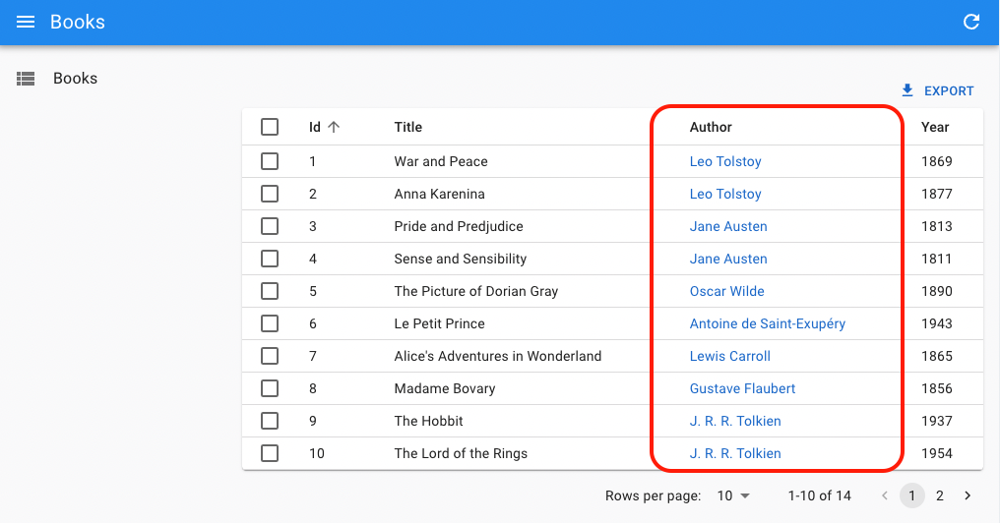
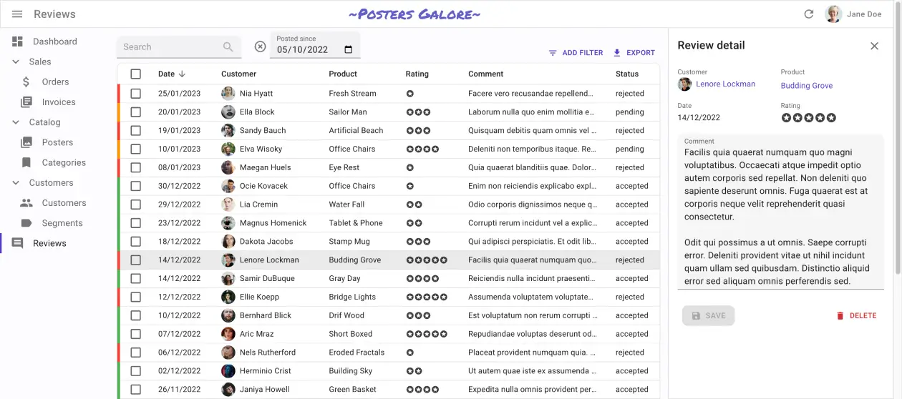
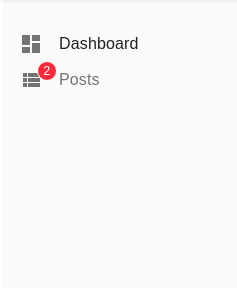
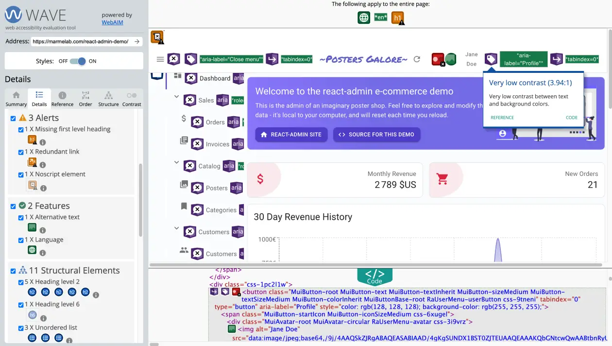

# Features

React-admin is a **rich framework** that covers most of the needs of typical admin & B2B applications. It's a great time saver that unlocks your creativity and helps you build great apps. Its unique and opinionated features make it the best choice for Single-Page Apps developers.

## Awesome Developer Experience

With react-admin, developers assemble application components without having to worry about low-level details. They need less code for the same result, and they can **focus on the business logic** of their app.

[](./ListTutorial.md#from-pure-react-to-react-admin)

We've crafted the API of react-admin's components and hooks to be as **intuitive** as possible. The react-admin core team uses react-admin every day, and we're always looking for ways to improve the developer experience.

React-admin provides the **best-in-class documentation**, demo apps, and support. Error messages are clear and actionable. Thanks to extensive TypeScript types and JSDoc, it's easy to use react-admin in any IDE. The API is stable and **breaking changes are very rare**. You can debug your app with the [query](./DataProviders.md#enabling-query-logs) and [form](https://react-hook-form.com/dev-tools) developer tools, and inspect the react-admin code right in your browser.

That probably explains why more than 3,000 new apps are published every month using react-admin. 

So react-admin is not just the assembly of [react-query](https://react-query.tanstack.com/), [react-hook-form](https://marmelab.com/react-admin/assets/techs/react-hook-form.jpeg), [react-router](https://reacttraining.com/react-router/), [Material UI](https://mui.com/material-ui/getting-started/) and [Emotion](https://github.com/emotion-js/emotion). It's a **framework** made to speed up and facilitate the development of single-page apps in React.

## Basic CRUD

Most admin and B2B apps start with a few basic screens to manipulate records:

- A list page, including the ability to filter, paginate and sort the records
- A read-only page, displaying the record details
- An edition page, allowing to update the record via a form
- A creation page

We call this type of interface a "CRUD" interface because it allows us to Create, Read, Update and Delete records.

React-admin started as an engine to generate such CRUD interfaces, and it still does it very well. **Building CRUD interfaces with react-admin requires little to no effort**, and it's very easy to customize them.

<video controls autoplay playsinline muted loop width="100%">
  <source src="./img/CRUD.webm" type="video/webm" />
  <source src="./img/CRUD.mp4" type="video/mp4" />
  Your browser does not support the video tag.
</video>


The basic building blocks of a CRUD interface in react-admin are:

- [`<Resource>`](./Resource.md), which defines CRUD routes for given API resource
- [`<List>`](./ListTutorial.md), which displays a list of records
- [`<Edit>`](./EditTutorial.md), which displays a form to edit a record
- [`<Create>`](./Create.md), which displays a form to create a record
- [`<Show>`](./Show.md), which displays a record in read-only mode

But of course, react-admin is not limited to CRUD interfaces. It also provides components to build tailored interfaces for your needs.

## Backend Agnostic

React-admin apps run in the browser - they are "Single-Page Apps". They rely on APIs to fetch and update data.

Which kind of API? **All kinds**. React-admin is backend agnostic. It doesn't care if your API is a REST API, a GraphQL API, a SOAP API, a JSON-RPC API, or even a local API. It doesn't care if your API is written in PHP, Python, Ruby, Java, or even JavaScript. It doesn't care if your API is a third-party API or a home-grown API.


React-admin ships with [more than 50 adapters](./DataProviderList.md) for popular API flavors, and gives you all the tools to build your own adapter. This works thanks to a powerful abstraction layer called the [Data Provider](./DataProviderIntroduction.md).

In a react-admin app, you don't write API Calls. Instead, you communicate with your API using a set of high-level functions, called "Data Provider methods". For instance, to fetch a list of posts, you call the `getList()` method, passing the resource name and the query parameters. 

```jsx
import { useState, useEffect } from 'react';
import { useDataProvider } from 'react-admin';

const PostList = () => {
    const [posts, setPosts] = useState();
    const [error, setError] = useState([]);
    const dataProvider = useDataProvider();
    useEffect(() => {
        dataProvider.getList('posts', { 
            pagination: { page: 1, perPage: 10 },
            sort: { field: 'published_at', order: 'DESC' },
            filter: { status: 'published' } 
        })
            .then(({ data }) => setPosts(data))
            .catch(error => setError(error));
    }, []);
    if (posts) { return <Loading />; }
    if (error) { return <p>ERROR</p>; }
    return (
        <ul>
            {posts.map(post => (
                <li key={post.id}>{post.title}</li>
            ))}
        </ul>
    );
};
```

The data provider object is responsible for translating the data provider method calls into HTTP requests, and for translating the HTTP responses into data provider method results.

And by the way, using `useEffect` for data fetching is cumbersome. Instead, you can rely on the [specialized data provider hooks](./Actions.md#dataprovider-method-hooks), such as `useGetList`:

```jsx
import { useGetList } from 'react-admin';

const PostList = () => {
    const { data, isLoading, error } = useGetList('posts', {
        pagination: { page: 1, perPage: 10 },
        sort: { field: 'published_at', order: 'DESC' },
        filter: { status: 'published' }
    });
    if (isLoading) { return <Loading />; }
    if (error) { return <p>ERROR</p>; }
    return (
        <ul>
            {data.map(post => (
                <li key={post.id}>{post.title}</li>
            ))}
        </ul>
    );
};
```

React-admin is also **backend agnostic for authentication and authorization**. Whether your API uses JWT, OAuth, a third-party provider like Auth0 or Cognito, or even Azure Active Directory, you can communicate with the authentication backend through an adapter object called [the Auth Provider](./Authentication.md).

You can then use specialized hooks on your components to restrict access. For instance, to forbid anonymous access, use `useAuthenticated`: 

```jsx
import { useAuthenticated } from 'react-admin';

const MyPage = () => {
    useAuthenticated(); // redirects to login if not authenticated
    return (
        <div>
            ...
        </div>
    )
};

export default MyPage;
```

## Relationships

APIs often expose a relational model, i.e. endpoints returning foreign keys to other endpoints. **React-admin leverages relational APIs** to provide smart components that display related records and components that allow editing of related records. 

```
┌──────────────┐       ┌────────────────┐
│ books        │       │ authors        │
│--------------│       │----------------│
│ id           │   ┌───│ id             │
│ author_id    │╾──┘   │ first_name     │
│ title        │       │ last_name      │
│ published_at │       │ date_of_birth  │
└──────────────┘       └────────────────┘
```

For instance, `<ReferenceField>` displays the name of a related record, like the name of an author for a book. 

```jsx
const BookList = () => (
    <List>
        <Datagrid>
            <TextField source="id" />
            <TextField source="title" />
            <ReferenceField source="authorId" reference="authors" />
            <TextField source="year" />
        </Datagrid>
    </List>
);
```



You don't need anything fancy on the API side to support that. Simple CRUD routes for both the `books` and `authors` resources are enough. `<ReferenceField>` will fetch the book authors via one single API call: 

```
GET https://my.api.url/authors?filter={ids:[1,2,3,4,5,6,7]}
```

`<ReferenceField>` is smart enough to **aggregate the calls for related authors** and avoid [the N+1 query problem](https://stackoverflow.com/questions/97197/what-is-the-n1-selects-problem-in-orm-object-relational-mapping), without the need for embeddings or sub-queries on the server-side.

Similarly, reference Input components let users edit related records together with the main record. For instance, to edit the variants of a product:

```jsx
const ProductEdit = () => (
    <Edit mutationMode="optimistic">
        <SimpleForm>
            <TextInput source="name" />
            <NumberInput source="price" />
            <ReferenceInput source="category_id" reference="categories" />
            <ReferenceManyInput reference="variants" target="product_id">
                <SimpleFormIterator inline>
                    <TextInput source="sku" />
                    <SelectInput source="size" choices={sizes} />
                    <SelectInput source="color" choices={colors} />
                    <NumberInput source="stock" defaultValue={0} />
                </SimpleFormIterator>
            </ReferenceManyInput>
        </SimpleForm>
    </Edit>
);
```

<video controls autoplay playsinline muted loop>
  <source src="./img/reference-many-input.webm" type="video/webm"/>
  <source src="./img/reference-many-input.mp4" type="video/mp4"/>
  Your browser does not support the video tag.
</video>


Reference Input components are also very useful to filter a view by a related record. For instance, to display the list of books of a given author:

```jsx
const BookList = () => (
    <List filters={[
        <ReferenceInput source="authorId" reference="authors" alwaysOn />,
    ]}>
        <Datagrid rowClick="edit">
            <TextField source="id" />
            <TextField source="title" />
            <ReferenceField source="authorId" reference="authors" />
            <TextField source="year" />
        </Datagrid>
    </List>
);
```

<video controls autoplay playsinline muted loop width="100%">
  <source src="./img/reference-input-filter.webm" type="video/webm" />
  <source src="./img/reference-input-filter.mp4" type="video/mp4" />
  Your browser does not support the video tag.
</video>

React-admin supports **one-to-many**, **many-to-one**, **one-to-one**, and **many-to-many relationships**. The [Fields For Relationships](./FieldsForRelationships.md) page lists all reference fields together with their common usage. Check the following components to learn more about relationships:

- [`<ReferenceField>`](./ReferenceField.md)
- [`<ReferenceArrayField>`](./ReferenceArrayField.md)
- [`<ReferenceManyField>`](./ReferenceManyField.md)
- [`<ReferenceManyCount>`](./ReferenceManyCount.md)
- [`<ReferenceManyToManyField>`](./ReferenceManyToManyField.md)
- [`<ReferenceOneField>`](./ReferenceOneField.md)
- [`<ReferenceInput>`](./ReferenceInput.md)
- [`<ReferenceArrayInput>`](./ReferenceArrayInput.md)
- [`<ReferenceManyInput>`](./ReferenceManyInput.md)
- [`<ReferenceManyToManyInput>`](./ReferenceManyToManyInput.md)
- [`<ReferenceOneInput>`](./ReferenceOneInput.md)

Reference components are a tremendous development accelerator for complex frontend features. They also liberate the backend developers from the burden of implementing complex joins.

## Not Ugly

Let's be realistic: Many developers focus on features first and don't have much time to spend polishing the User Interface (UI). We tend to be like that, too! The result is that quite often, admin apps are ugly. Spacing isn't consistent, buttons aren't in the best place, and color schemes hurt the eyes.

React-admin provides **components that look pretty good out of the box**, so even if you don't spend time on the UI, it won't look bad (unless you try hard). React-admin uses [Material UI](https://mui.com/material-ui/getting-started/), which is a React implementation of the [Material Design](https://material.io/) guidelines, the most battle-tested design system.

<video controls autoplay playsinline muted loop width="100%">
  <source src="https://user-images.githubusercontent.com/99944/116970434-4a926480-acb8-11eb-8ce2-0602c680e45e.mp4" type="video/webm" />
  Your browser does not support the video tag.
</video>

And if the default design isn't good enough for you, you can easily customize it: all react-admin components are **fully themeable**, and you can even replace them with your own components (see [Theming](#theming)).

## Dense UI

Modern web apps are often very visually pleasing, but they can be difficult to use due to low information density. End users need a lot of scrolling and clicking to complete moderately complex tasks.

On the other hand, the default React-admin skin is designed to be dense, giving **more space to the content and less to the chrome**, which allows for faster user interaction. 

[](https://marmelab.com/react-admin-demo/#/)

We have made many improvements to this default layout based on user feedback. In our experience, for admin apps, dashboards, and B2B apps, efficiency is more important than large margins. If this is not your use case, you can easily **customize the margin and density** of the UI using the [theme](./Theming.md).

And for mobile users, react-admin renders a different layout with larger margins and less information density (see [Responsive](#responsive)).

## Guessers & Scaffolding

When mapping a new API route to a CRUD view, adding fields one by one can be tedious. React-admin provides a set of guessers that can automatically **generate a complete CRUD UI based on an API response**. 

For instance, the following code will generate a complete CRUD UI for the `posts` resource:

```jsx
import { Admin, Resource, ListGuesser, EditGuesser, ShowGuesser } from 'react-admin';

const App = () => (
    <Admin dataProvider={dataProvider}>
        <Resource name="posts" list={ListGuesser} edit={EditGuesser} show={ShowGuesser} />
    </Admin>
);
```

Guesser components start by fetching data from the API, analyzing the shape of the response, then picking up Field and Input components that match the data type. They also dump the generated code in the console, to let you start customizing the UI.


Check the following components to learn more about guessers:

- [`<ListGuesser>`](./ListGuesser.md)
- [`<EditGuesser>`](./EditGuesser.md)
- [`<ShowGuesser>`](./ShowGuesser.md)

## Search & Filtering

In most admin and B2B apps, the most common task is to look for a record. React-admin includes many features to help you **build a user experience that streamlines the search workflow**.

<table><tbody>
<tr style="border:none">
    <td style="width:50%;border:none;text-align:center">
        <a title="Filter Button/Form Combo" href="./img/list_filter.webm">
            <video controls autoplay playsinline muted loop>
                <source src="./img/list_filter.webm" type="video/webm"/>
                <source src="./img/list_filter.mp4" type="video/mp4"/>
                Your browser does not support the video tag.
            </video>
        </a>
        <a href="./FilteringTutorial.html#the-filter-buttonform-combo" style="display: block;transform: translateY(-10px);">Filter Button/Form Combo</a>
    </td>
    <td style="width:50%;border:none;text-align:center">
         <a title="<FilterList> Sidebar" href="./img/filter-sidebar.webm">
            <video controls autoplay playsinline muted loop>
                <source src="./img/filter-sidebar.webm" type="video/webm"/>
                <source src="./img/filter-sidebar.mp4" type="video/mp4"/>
                Your browser does not support the video tag.
            </video>
        </a>
        <a href="./FilteringTutorial.html#the-filterlist-sidebar" style="display: block;transform: translateY(-10px);"><code>&lt;FilterList&gt;</code> Sidebar</a>
    </td>
</tr>
<tr style="border:none;background-color:#fff;">
    <td style="width:50%;border:none;text-align:center">
        <a title="Stacked Filters" href="https://marmelab.com/ra-enterprise/modules/assets/ra-form-layout/latest/stackedfilters-overview.webm">
            <video controls autoplay playsinline muted loop width="90%" style="margin:1rem;box-shadow:0px 4px 4px 0px rgb(0 0 0 / 24%);">
                <source src="https://marmelab.com/ra-enterprise/modules/assets/ra-form-layout/latest/stackedfilters-overview.webm" type="video/mp4" />
                    Your browser does not support the video tag.
            </video>
        </a>
        <a href="./FilteringTutorial.html#the-stackedfilters-component" style="display: block;transform: translateY(-10px);"><code>&lt;StackedFilters&gt;</code> Dialog</a>
    </td>
    <td style="width:50%;border:none;text-align:center;vertical-align:top;">
        <a title="<Search> input" href="https://marmelab.com/ra-enterprise/modules/assets/ra-search-overview.gif"></a>
        <a href="./FilteringTutorial.html#global-search" style="display: block;transform: translateY(-10px);">Global <code>&lt;Search&gt;</code></a>
    </td>
</tr>
</tbody></table>

These features rely on powerful components with an intuitive API. For instance, you can set the Filter Button/Form Combo with the `<List filters>` prop, using the same input components as in edition forms: 

```jsx
import { List, TextInput } from 'react-admin';

const postFilters = [
    <TextInput label="Search" source="q" alwaysOn />,
    <TextInput label="Title" source="title" defaultValue="Hello, World!" />,
];

export const PostList = () => (
    <List filters={postFilters}>
        {/* ... */}
    </List>
);
```

Check the following chapters to learn more about each search and filtering component:

- [The Filter Button/Form Combo](./FilteringTutorial.md#the-filter-buttonform-combo)
- [`<FilterList>`](./FilterList.md)
- [`<StackedFilters>`](./StackedFilters.md)
- [`<Search>`](./Search.md)

Users often apply the same filters over and over again. Saved Queries **let users save a combination of filters** and sort parameters into a new, personal filter, that persists between sessions. 

<video controls autoplay playsinline muted loop>
  <source src="./img/SavedQueriesList.webm" type="video/webm"/>
  <source src="./img/SavedQueriesList.mp4" type="video/mp4"/>
  Your browser does not support the video tag.
</video>


Here is an example `<FilterList>` sidebar with saved queries:

```jsx
import { FilterList, FilterListItem, List, Datagrid } from 'react-admin';
import { Card, CardContent } from '@mui/material';

import { SavedQueriesList } from 'react-admin';

const SongFilterSidebar = () => (
    <Card>
        <CardContent>
            <SavedQueriesList />
            <FilterList label="Record Company" icon={<BusinessIcon />}>
                ...
            </FilterList>
            <FilterList label="Released" icon={<DateRangeeIcon />}>
               ...
            </FilterList>
        </CardContent>
    </Card>
);

const SongList = () => (
    <List aside={<SongFilterSidebar />}>
        <Datagrid>
            ...
        </Datagrid>
    </List>
);
```

Check [the Saved Queries Tutorial](./FilteringTutorial.md#saved-queries-let-users-save-filter-and-sort) to learn more.

Finally, react-admin offers low-level components and hooks to **build your own search UI**:

- [`<FilterButton>`](./FilterButton.md)
- [`<SearchInput>`](./FilteringTutorial.md#searchinput)
- [`<FilterLiveSearch>`](./FilterLiveSearch.md)
- [`<SavedQueriesList>`](./SavedQueriesList.md)
- [`useListContext()`](./useListContext.md)
- [`useList()`](./useList.md)

Check the [Building A Custom Filter Tutorial](./FilteringTutorial.md#building-a-custom-filter) to learn more.

## Forms & Validation

Many admin apps let users perform complex tasks implying the update of many fields and records. To allow such complex workflows, developers must be able to build sophisticated forms, with elaborate validation rules.

React-admin offers a **rich set of input components and form layouts** to build forms, powered by [Material UI](https://mui.com/material-ui/getting-started/) and [react-hook-form](https://react-hook-form.com/). React-admin's form components also take care of binding the form values to the record being edited and validating the form inputs.

For instance, here is how to build a tabbed form for editing a blog post:

```jsx
import {
    TabbedForm,
    Edit,
    Datagrid,
    TextField,
    DateField,
    TextInput,
    ReferenceManyField,
    NumberInput,    
    DateInput,
    BooleanInput,
    EditButton
} from 'react-admin';

export const PostEdit = () => (
    <Edit>
        <TabbedForm>
            <TabbedForm.Tab label="summary">
                <TextInput disabled label="Id" source="id" />
                <TextInput source="title" validate={required()} />
                <TextInput multiline source="teaser" validate={required()} />
            </TabbedForm.Tab>
            <TabbedForm.Tab label="body">
                <RichTextInput source="body" validate={required()} label={false} />
            </TabbedForm.Tab>
            <TabbedForm.Tab label="Miscellaneous">
                <TextInput label="Password (if protected post)" source="password" type="password" />
                <DateInput label="Publication date" source="published_at" />
                <NumberInput source="average_note" validate={[ number(), minValue(0) ]} />
                <BooleanInput label="Allow comments?" source="commentable" defaultValue />
                <TextInput disabled label="Nb views" source="views" />
            </TabbedForm.Tab>
            <TabbedForm.Tab label="comments">
                <ReferenceManyField reference="comments" target="post_id" label={false}>
                    <Datagrid>
                        <TextField source="body" />
                        <DateField source="created_at" />
                        <EditButton />
                    </Datagrid>
                </ReferenceManyField>
            </TabbedForm.Tab>
        </TabbedForm>
    </Edit>
);
```

<video controls autoplay playsinline muted loop>
  <source src="./img/tabbed-form.webm" type="video/webm"/>
  <source src="./img/tabbed-form.mp4" type="video/mp4"/>
  Your browser does not support the video tag.
</video>

### Form Layouts

React-admin offers, out of the box, several form layouts:

- [`<SimpleForm>`](./SimpleForm.md) for a single-column layout
- [`<TabbedForm>`](./TabbedForm.md) for a tabbed layout
- [`<AccordionForm>`](./AccordionForm.md) for long forms with collapsible sections
- [`<LongForm>`](./LongForm.md) for long forms with a navigation sidebar
- [`<WizardForm>`](./WizardForm.md) for multi-step forms
- [`<EditDialog>`](./EditDialog.md) for sub-forms in a modal dialog
- and [`Form`](./Form.md), a headless component to use as a base for your custom layouts

### Input Components

Inside forms, you can use specialize [input components](./Inputs.md), designed for many types of data: 

| Data Type             | Example value                                                | Input Components                                                                                                                                                                                     |
|-----------------------|--------------------------------------------------------------|------------------------------------------------------------------------------------------------------------------------------------------------------------------------------------------------------|
| String                | `'Lorem Ipsum'`                                              | [`<TextInput>`](./TextInput.md)                                                                                                                                                                      |
| Rich text             | `<p>Lorem Ipsum</p>`                                         | [`<RichTextInput>`](./RichTextInput.md)                                                                                                                                                              |
| Markdown              | `# Lorem Ipsum`                                              | [`<MarkdownInput>`](./MarkdownInput.md)                                                                                                                                                              |
| Password              | `'********'`                                                 | [`<PasswordInput>`](./PasswordInput.md)                                                                                                                                                              |
| Image URL             | `'https://example.com/image.png'`                            | [`<ImageInput>`](./ImageInput.md)                                                                                                                                                                    |
| File URL              | `'https://example.com/file.pdf'`                             | [`<FileInput>`](./FileInput.md)                                                                                                                                                                      |
| Number                | `42`, `1.345`                                                | [`<NumberInput>`](./NumberInput.md)                                                                                                                                                                  |
| Boolean               | `true`                                                       | [`<BooleanInput>`](./BooleanInput.md), [`<NullableBooleanInput>`](./NullableBooleanInput.md)                                                                                                         |
| Date                  | `'2022-10-23'`                                               | [`<DateInput>`](./DateInput.md)                                                                                                                                                                      |
| Time                  | `'14:30:00'`                                                 | [`<TimeInput>`](./TimeInput.md)                                                                                                                                                                      |
| Date & time           | `'2022-10-24T19:40:28.003Z'`                                 | [`<DateTimeInput>`](./DateTimeInput.md)                                                                                                                                                              |
| Object                | `{ foo: 'bar' }`                                             | All inputs (see [ `source`](./Inputs.md#source))                                                                                                                                                                |
| Enum                  | `'foo'`                                                      | [`<SelectInput>`](./SelectInput.md), [`<AutocompleteInput>`](./AutocompleteInput.md), [`<RadioButtonGroupInput>`](./RadioButtonGroupInput.md)                                                        |
| Foreign key           | `42`                                                         | [`<ReferenceInput>`](./ReferenceInput.md)                                                                                                                                                            |
| Array of objects      | `[{ item: 'jeans', qty: 3 }, { item: 'shirt', qty: 1 }]`     | [`<ArrayInput>`](./ArrayInput.md)                                                                                                                                                                    |
| Array of Enums        | `['foo', 'bar']`                                             | [`<SelectArrayInput>`](./SelectArrayInput.md), [`<AutocompleteArrayInput>`](./AutocompleteArrayInput.md), [`<CheckboxGroupInput>`](./CheckboxGroupInput.md), [`<DualListInput>`](./DualListInput.md) |
| Array of foreign keys | `[42, 43]`                                                   | [`<ReferenceArrayInput>`](./ReferenceArrayInput.md)                                                                                                                                                  |
| Translations          | `{ en: 'Hello', fr: 'Bonjour' }`                             | [`<TranslatableInputs>`](./TranslatableInputs.md)                                                                                                                                                    |
| Related records       | `[{ id: 42, title: 'Hello' }, { id: 43, title: 'World' }]`   | [`<ReferenceManyInput>`](./ReferenceManyInput.md), [`<ReferenceManyToManyInput>`](./ReferenceManyToManyInput.md), [`<ReferenceOneInput>`](./ReferenceOneInput.md)                                    |

### Dependent Inputs 

You can build dependent inputs, using the [react-hook-form's `useWatch` hook](https://react-hook-form.com/docs/usewatch). For instance, here is a `CityInput` that displays the cities of the selected country:

```jsx
import * as React from 'react';
import { Edit, SimpleForm, SelectInput } from 'react-admin';
import { useWatch } from 'react-hook-form';

const countries = ['USA', 'UK', 'France'];
const cities = {
    USA: ['New York', 'Los Angeles', 'Chicago', 'Houston', 'Phoenix'],
    UK: ['London', 'Birmingham', 'Glasgow', 'Liverpool', 'Bristol'],
    France: ['Paris', 'Marseille', 'Lyon', 'Toulouse', 'Nice'],
};
const toChoices = items => items.map(item => ({ id: item, name: item }));
// toChoices(coutries) should be [{ id: 'USA', name: 'USA' }, ...]


const CityInput = props => {
    const country = useWatch({ name: 'country' });
    return (
        <SelectInput
            choices={country ? toChoices(cities[country]) : []}
            {...props}
        />
    );
};

const OrderEdit = () => (
    <Edit>
        <SimpleForm>
            <SelectInput source="country" choices={toChoices(countries)} />
            <CityInput source="cities" />
        </SimpleForm>
    </Edit>
);

export default OrderEdit;
```

### Validation

React-admin ships with a powerful and versatile validation engine.


React-admin forms support the most common validation strategies:

* [per field validators](./Validation.md#per-input-validation-built-in-field-validators),
* [form validation](./Validation.md#global-validation),
* [validation schema powered by yup or zod](./Validation.md#schema-validation),
* [server-side validation](./Validation.md#server-side-validation).

Here is an example of per-field validation:

```jsx
import {
    required,
    minLength,
    maxLength,
    minValue,
    maxValue,
    number,
    regex,
    email,
    choices
} from 'react-admin';

const validateFirstName = [required(), minLength(2), maxLength(15)];
const validateEmail = email();
const validateAge = [number(), minValue(18)];
const validateZipCode = regex(/^\d{5}$/, 'Must be a valid Zip Code');
const validateGender = choices(['m', 'f', 'nc'], 'Please choose one of the values');

export const UserCreate = () => (
    <Create>
        <SimpleForm>
            <TextInput label="First Name" source="firstName" validate={validateFirstName} />
            <TextInput label="Email" source="email" validate={validateEmail} />
            <TextInput label="Age" source="age" validate={validateAge}/>
            <TextInput label="Zip Code" source="zip" validate={validateZipCode}/>
            <SelectInput label="Gender" source="gender" choices={[
                { id: 'm', name: 'Male' },
                { id: 'f', name: 'Female' },
                { id: 'nc', name: 'Prefer not say' },
            ]} validate={validateGender}/>
        </SimpleForm>
    </Create>
);
```

### AutoSave

React-admin lets you build forms saving changes automatically with [`<AutoSave>`](./AutoSave.md), so that users never lose their changes.

<video controls autoplay playsinline muted loop>
  <source src="./img/AutoSave.webm" type="video/webm"/>
  <source src="./img/AutoSave.mp4" type="video/mp4"/>
  Your browser does not support the video tag.
</video>

### JSON Schema Forms

Finally, you can generate entire **forms based on a JSON schema**, using the [`<JsonSchemaForm>` component](./JsonSchemaForm.md).


```jsx
import { Edit } from "react-admin";
import { JsonSchemaForm } from "@react-admin/ra-json-schema-form";

const CustomerEdit = () => (
  <Edit>
    <JsonSchemaForm
      schema={{
        type: "object",
        properties: {
          id: { type: "number" },
          first_name: { type: "string", title: "First name" },
          last_name: { type: "string", minLength: 3 },
          dob: { type: "string", format: "date" },
          sex: { type: "string", enum: ["male", "female"] },
          employer_id: { type: "number" },
          occupations: {
            type: "array",
            items: {
              type: "object",
              properties: {
                name: { type: "string" },
                from: { type: "string", format: "date" },
                to: { type: "string", format: "date" },
              },
            },
          },
        },
        required: ["id", "last_name", "employer_id"],
      }}
      uiSchema={{
        id: { "ui:disabled": true },
        employer_id: {
          "ui:widget": "reference",
          "ui:options": {
            reference: "employers",
            optionText: "name",
          },
        },
      }}
      onChange={(change) =>
        process.env.NODE_ENV !== "test" && console.log("changed", change)
      }
      onError={(error) =>
        process.env.NODE_ENV !== "test" && console.log("error", error)
      }
    />
  </Edit>
);
```



And if you want something super custom that react-admin doesn't support out of the box, you can always use [react-hook-form](https://react-hook-form.com/) directly.

## AI-Powered Components

React-admin leverages recent breakthroughs in Artificial Intelligence (AI) to **boost user productivity**.

One example is [`<PredictiveTextInput>`](./PredictiveTextInput.md), which suggests completion for the input value, using your favorite AI backend. Users can accept the completion by pressing the `Tab` key. It's like Intellisense or Copilot for your forms.

<video controls autoplay playsinline muted loop>
  <source src="./img/PredictiveTextInput.mp4" type="video/mp4"/>
  Your browser does not support the video tag.
</video>

Use `<PredictiveTextInput>` in any react-admin form:

```jsx
import { Edit, SimpleForm, TextInput } from 'react-admin';
import { PredictiveTextInput } from '@react-admin/ra-ai';

const PersonEdit = () => (
    <Edit>
        <SimpleForm>
            <TextInput source="firstName" />
            <TextInput source="lastName" />
            <TextInput source="company" />
            <PredictiveTextInput source="email" />
            <PredictiveTextInput source="website" />
            <PredictiveTextInput source="bio" multiline />
        </SimpleForm>
    </Edit>
);
```

You can also use the [`<SmartRichTextInput>`](./SmartRichTextInput.md) component, which lets users edit HTML documents in WYSIWYG with superpowers:

<video controls playsinline muted loop poster="https://marmelab.com/ra-enterprise/modules/assets/SmartRichTextInput.png" >
  <source src="https://marmelab.com/ra-enterprise/modules/assets/SmartRichTextInput.mp4" type="video/mp4" />
  Your browser does not support the video tag.
</video>

## Fast


React-admin takes advantage of the Single-Page-Application architecture, implementing various performance optimizations that make react-admin apps incredibly fast by default.

- **Non-Blocking Data Fetching**: Instead of waiting for API data before starting to render the UI, React-admin initiates the rendering process immediately. This strategy ensures a snappy application where user interactions receive instant feedback, outperforming Server-side Rendered apps by eliminating waiting times for server responses.
- **Stale While Revalidate**: This technique allows pages to display data from previous requests while newer data is being fetched. In most instances, the fresh data remains the same (e.g., when revisiting a list page), ensuring users won't notice any delays due to network requests.
- **Local Database Mirror**: React-admin populates its internal cache with individual records fetched using `dataProvider.getList()`. When a user views a specific record, React-admin leverages its internal database to pre-fill the `dataProvider.getOne()` query response. As a result, record details are displayed instantaneously, without any wait time for server responses.
- **Optimistic Updates**: When a user edits a record and hits the "Save" button, React-admin immediately updates its local database and displays the revised data, prior to sending the update query to the server. The resulting UI changes are instant - no server response wait time required. The same logic applies to record deletions.
- **Query Deduplication**: React-admin identifies instances where multiple components on a page call the same data provider query for identical data. In such cases, it ensures only a single call to the data provider is made.
- **Query Aggregation**: React-admin intercepts all calls to `dataProvider.getOne()` for related data when a `<ReferenceField>` is used in a list. It aggregates and deduplicates the requested ids, and issues a single `dataProvider.getMany()` request. This technique effectively addresses the n+1 query problem, reduces server queries, and accelerates list view rendering.
- **Opt-In Query Cache**: React-admin provides an option to prevent refetching an API endpoint for a specified duration, which can be used when you're confident that the API response will remain consistent over time.

## Undo

When users submit a form, or delete a record, the UI reflects their change immediately. They also see a confirmation message for the change, containing an "Undo" button. If they click on it before the confirmation slides out (the default delay is 5s), react-admin reverts to the previous state and cancels the call to the data provider. 

<video controls autoplay playsinline muted loop>
  <source src="./img/tutorial_post_edit_undo.webm" type="video/webm"/>
  <source src="./img/tutorial_post_edit_undo.mp4" type="video/mp4"/>
  Your browser does not support the video tag.
</video>

This undo feature is enabled by default, and requires no particular setup on the server side. In fact, react-admin delays the call to the data provider for mutations, to give users a "grace" period. That's why the actual call to `dataProvider.update()` occurs 5 seconds after the user submits an update form - even though the UI reflects the changes immediately.

You can disable this feature page by page by choosing a different [mutationMode](./Edit.md#mutationmode).

## Roles & Permissions

It's the server's responsibility to check that an action is allowed for a given user, and to filter the content based on user permissions. But roles and permissions are also a client-side concern, because you want to hide or disable actions based on the user's role. For example, you may not want to show a "Delete" button for users who don't have the `admin` role.

React-admin lets you **customize the user interface based on a simple set of rules**, and to define the permissions for each role in a centralized place. Whether you need to have custom pages for specific roles, or to change the props of a component based on the user's role, react-admin lets you do it. This feature uses the same adapter approach as for the `dataProvider`, which means you can use any authentication backend you want.

<video controls="controls" style="max-width: 100%">
    <source src="./img/ra-rbac.mp4" type="video/mp4" />
</video>

You can define permissions for pages, fields, buttons, etc. Roles and permissions are managed by the `authProvider`, which means you can use any data source you want (including an ActiveDirectory server).

The above demo uses the following set of permissions:

```jsx
const roles = {
    accountant: [
        { action: ['list', 'show'], resource: 'products' },
        { action: 'read', resource: 'products.*' },
        { type: 'deny', action: 'read', resource: 'products.description' },
        { action: 'list', resource: 'categories' },
        { action: 'read', resource: 'categories.*' },
        { action: ['list', 'show'], resource: 'customers' },
        { action: 'read', resource: 'customers.*' },
        { action: '*', resource: 'invoices' },
    ],
    contentEditor: [
        {
            action: ['list', 'create', 'edit', 'delete', 'export'],
            resource: 'products',
        },
        { action: 'read', resource: 'products.*' },
        { type: 'deny', action: 'read', resource: 'products.stock' },
        { type: 'deny', action: 'read', resource: 'products.sales' },
        { action: 'write', resource: 'products.*' },
        { type: 'deny', action: 'write', resource: 'products.stock' },
        { type: 'deny', action: 'write', resource: 'products.sales' },
        { action: 'list', resource: 'categories' },
        { action: ['list', 'edit'], resource: 'customers' },
        { action: ['list', 'edit'], resource: 'reviews' },
    ],
    stockManager: [
        { action: ['list', 'edit', 'export'], resource: 'products' },
        { action: 'read', resource: 'products.*' },
        {
            type: 'deny',
            action: 'read',
            resource: 'products.description',
        },
        { action: 'write', resource: 'products.stock' },
        { action: 'write', resource: 'products.sales' },
        { action: 'list', resource: 'categories' },
    ],
    administrator: [{ action: '*', resource: '*' }],
};
```

To learn more about authentication, roles, and permissions, check out the following pages:

- The [Security introduction](./Authentication.md)
- [Role-Based Access Control (RBAC)](./AuthRBAC.md)
- [`Authenticated`](./Authenticated.md)
- [`IfCanAccess`](./IfCanAccess.md)
- [`WithPermissions`](./WithPermissions.md)
- [`useAuthProvider`](./useAuthProvider.md)
- [`useAuthenticated`](./useAuthenticated.md)
- [`useAuthstate`](./useAuthState.md)
- [`useGetIdentity`](./useGetIdentity.md)
- [`useLogin`](./useLogin.md)
- [`useLogout`](./useLogout.md)
- [`usePermissions`](./usePermissions.md)
- [`useCanAccess`](./useCanAccess.md)
- [`canAccess`](./canAccess.md)

## Audit Log

Most admin and B2B apps require that user actions are recorded for audit purposes. React-admin provides templates for displaying such audit logs, and helpers to automatically **record user actions**.

<video controls autoplay playsinline muted loop>
  <source src="https://marmelab.com/ra-enterprise/modules/assets/ra-audit-log/latest/ra-audit-log.webm" type="video/webm" />
  <source src="https://marmelab.com/ra-enterprise/modules/assets/ra-audit-log/latest/ra-audit-log.mp4" type="video/mp4" />
  Your browser does not support the video tag.
</video>

```jsx
import { useGetList } from "react-admin";
import { Timeline } from "@react-admin/ra-audit-log";

const Dashboard = () => {
  const { data, isLoading } = useGetList(
    "events",
    { page: 1, perPage: 25 },
    { field: "date", order: "desc" }
  );

  return <Timeline isLoading={isLoading} records={data} />;
};
```

These features are available through the following components:

- [`<Timeline>`](https://marmelab.com/ra-enterprise/modules/ra-audit-log#timeline) shows a list of all recent changes in the admin. It's a great component for dashboards.
- [`<RecordTimeline>`](https://marmelab.com/ra-enterprise/modules/ra-audit-log#recordtimeline) shows a list of all recent changes for a given record, usually embedded in a `<Show>` or `<Edit>` view.
- [`<EventList>`](https://marmelab.com/ra-enterprise/modules/ra-audit-log#eventlist) is a ready-to-use List component for navigating in your admin history, complete with filters and pagination.

And you can use [the `addEventsForMutations` helper](https://marmelab.com/ra-enterprise/modules/ra-audit-log#client-side-tracking) to record user actions:

```jsx
import { addEventsForMutations } from "@react-admin/ra-audit-log";
import simpleRestProvider from "ra-data-simple-rest";
import authProvider from "./authProvider";

const dataProvider = addEventsForMutations(
  simpleRestProvider("http://path.to.my.api/"),
  authProvider
);
```

## Calendar

If your app needs to display **events**, **appointments**, **time intervals**, or any other kind of time-based data, you can use the [`<Calendar>`](./Calendar.md) component.

<video controls autoplay playsinline muted loop>
  <source src="https://marmelab.com/ra-enterprise/modules/assets/ra-calendar.webm" type="video/webm" />
  <source src="https://marmelab.com/ra-enterprise/modules/assets/ra-calendar.mp4" type="video/mp4" />
  Your browser does not support the video tag.
</video>

```jsx
import { Calendar, getFilterValuesFromInterval } from '@react-admin/ra-calendar';
import { List } from 'react-admin';

const EventList = () => (
    <List
        filterDefaultValues={getFilterValuesFromInterval()}
        perPage={1000}
        pagination={false}
    >
        <Calendar />
    </List>
);
```

The user interface offers everything you expect:

- month, week, and day views
- list view
- drag and resize events
- whole-day events
- creating an event by clicking on the calendar
- edition of the event title, and metadata
- events spanning multiple days
- recurring events
- background events
- theming
- locales and timezones
- resource time grid (e.g. rooms) (requires an additional license from Full Calendar)

Check the following components for more details:

- [`<CompleteCalendar>`](https://marmelab.com/ra-enterprise/modules/ra-calendar#completecalendar)
- [`<Calendar>`](./Calendar.md)

## Tree View

To manage directories, categories, and any other **hierarchical data**, admins often rely on tree structures. Navigating and editing tree structures can be tricky, but React-admin provides a set of components to make it easy.

<video controls autoplay playsinline muted loop>
  <source src="./img/treewithdetails.webm" type="video/webm"/>
  <source src="./img/treewithdetails.mp4" type="video/mp4"/>
  Your browser does not support the video tag.
</video>


```jsx
import { Create, Edit, SimpleForm, TextInput } from 'react-admin';
import { CreateNode, EditNode, EditNodeToolbar, TreeWithDetails } from '@react-admin/ra-tree';

// a Create view for a tree uses <CreateNode> instead of the standard <Create>
const CategoriesCreate = () => (
    <CreateNode>
        <SimpleForm>
            <TextInput source="name" />
        </SimpleForm>
    </CreateNode>
);

// an Edit view for a tree uses <EditNode> instead of the standard <Edit>
const CategoriesEdit = () => (
    <EditNode>
        <SimpleForm toolbar={<EditNodeToolbar />}>
            <TextInput source="title" />
        </SimpleForm>
    </EditNode>
);

// a List view for a tree uses <TreeWithDetails>
export const CategoriesList = () => (
    <TreeWithDetails create={CategoriesCreate} edit={CategoriesEdit} />
);
```

Check out the following components for displaying hierarchical data:

- [`<TreeWithDetails>`](./TreeWithDetails.md): A list view for tree structures, with a details panel.
- [`<TreeInput>`](./TreeInput.md): An input component for tree structures.
- [`<Tree>`](https://marmelab.com/ra-enterprise/modules/ra-tree#tree-component): A list view for tree structures, with a Material UI skin.

## Application Building Blocks

A UI kit like Material UI provides basic building blocks like a button, a form, a table, etc. React-admin goes one level higher and provides a set of **[application components](./Reference.md#components)** specifically designed for building admin and B2B *applications*.

<video controls autoplay playsinline muted loop>
  <source src="https://marmelab.com/ra-enterprise/modules/assets/ra-editable-datagrid/latest/ra-editable-datagrid-overview.webm" type="video/webm" />
  <source src="https://marmelab.com/ra-enterprise/modules/assets/ra-editable-datagrid/latest/ra-editable-datagrid-overview.mp4" type="video/mp4" />
  Your browser does not support the video tag.
</video>

These building blocks include:

- A [notification system](./useNotify.md) 
- A smart location framework, simplifying the management of [breadcrumbs](./Breadcrumb.md) an [hierarchical menus](./MultiLevelMenu.md)
- [Import](https://github.com/benwinding/react-admin-import-csv) / [export](./Buttons.md#exportbutton) buttons
- An [editable datagrid](./EditableDatagrid.md)
- A [guided tour system](https://marmelab.com/ra-enterprise/modules/ra-tour)
- A [user menu](./Theming.md#usermenu-customization)
- A [rich text editor](./RichTextInput.md),
- A [markdown editor](./MarkdownInput.md)
- A [clone button](./Buttons.md#clonebutton)
- Various navigation menus ([simple](./Menu.md), [hierarchical](./MultiLevelMenu.md), [horizontal](./HorizontalMenu.md), etc.)
- Various [page](./ContainerLayout.md) and [form](https://marmelab.com/ra-enterprise/modules/ra-form-layout) layouts
- ...and many more. 

And if you want to create your building blocks, you can use any of the [75+ hooks](./Reference.md#hooks) that carry **headless, reusable logic**. To name a few of them:

- [`useRecordContext`](./useRecordContext.md) to get the current record anywhere in the app
- [`useWarnWhenUnsavedChanges`](./EditTutorial.md#warning-about-unsaved-changes) to warn the user when he tries to leave a page with unsaved changes
- [`useSaveContext`](./useSaveContext.md) to tweak form submission
- [`useTheme`](./Theming.md#changing-the-theme-programmatically) to change the theme programmatically

## Pub/Sub and Live Updates

React-admin provides hooks and UI components for **collaborative applications** where several people work in parallel. It allows publishing and subscribing to real-time events, updating views when another user pushes a change, notifying end users of events, and **preventing data loss** when two editors work on the same resource concurrently.

<video controls autoplay playsinline muted width="100%">
  <source src="./img/CollaborativeDemo.mp4" type="video/mp4" />
  Your browser does not support the video tag.
</video>

At its core, the real-time system provides a **pub/sub mechanism** to send and receive real-time events. Events are sent to a topic, and all subscribers to this topic receive the event.

```jsx
// on the publisher side
const [publish] = usePublish();
publish(topic, event);

// on the subscriber side
useSubscribe(topic, callback);
```

Check the following low-level hooks for more details:

-   [`usePublish`](./usePublish.md)
-   [`useSubscribe`](./useSubscribe.md)
-   [`useSubscribeCallback`](./useSubscribeCallback.md)
-   [`useSubscribeToRecord`](./useSubscribeToRecord.md)
-   [`useSubscribeToRecordList`](./useSubscribeToRecordList.md)

React-admin provides **live updates** via specialized hooks and components. This means that when a user edits a resource, the other users working on the same resource see the changes in real time whether they are in a list, a show view, or an edit view.

For instance, replace `<List>` with `<ListLive>` to have a list refreshing automatically when an element is added, updated, or deleted:

```diff
import {
-   List,
    Datagrid,
    TextField,
    NumberField,
    Datefield,
} from 'react-admin';
+import { ListLive } from '@react-admin/ra-realtime';

const PostList = () => (
-   <List>
+   <ListLive>
        <Datagrid>
            <TextField source="title" />
            <NumberField source="views" />
            <DateField source="published_at" />
        </Datagrid>
-   </List>
+   </ListLive>
);
```

<video controls autoplay playsinline muted loop>
  <source src="./img/useSubscribeToRecordList.webm" type="video/webm"/>
  <source src="./img/useSubscribeToRecordList.mp4" type="video/mp4"/>
  Your browser does not support the video tag.
</video>


This feature leverages the following hooks:

-   [`useGetListLive`](./useGetListLive.md)
-   [`useGetOneLive`](./useGetOneLive.md)

And the following components:

-   [`<ListLive>`](./ListLive.md)
-   [`<EditLive>`](./EditLive.md)
-   [`<ShowLive>`](./ShowLive.md)

React-admin also provides **badge notifications in the Menu**, so that users can see that something new happened to a resource list while working on another one.



Use `<MenuLive>` instead of react-admin's `<Menu>` to get this feature:

```jsx
import React from 'react';
import { Admin, Layout, Resource } from 'react-admin';
import { MenuLive } from '@react-admin/ra-realtime';

import { PostList, PostShow, PostEdit, realTimeDataProvider } from '.';

const CustomLayout = (props) => (
    <Layout {...props} menu={MenuLive} />
);

const MyReactAdmin = () => (
    <Admin dataProvider={realTimeDataProvider} layout={CustomLayout}>
        <Resource name="posts" list={PostList} show={PostShow} edit={PostEdit} />
    </Admin>
);
```

This feature leverages the following components:

-   [`<MenuLive>`](./MenuLive.md)
-   [`<MenuLiveItemLink>`](./MenuLive.md)

And last but not least, react-admin provides a **lock mechanism** to prevent two users from editing the same resource at the same time.

<video controls autoplay playsinline muted loop>
  <source src="./img/locks-demo.webm" type="video/webm"/>
  <source src="./img/locks-demo.mp4" type="video/mp4"/>
  Your browser does not support the video tag.
</video>


A user can lock a resource, either by voluntarily asking for a lock or by editing a resource. When a resource is locked, other users can't edit it. When the lock is released, other users can edit the resource again.

```tsx
export const NewMessageForm = () => {
    const [create, { isLoading: isCreating }] = useCreate();
    const record = useRecordContext();

    const { data: lock } = useGetLockLive('tickets', { id: record.id });
    const { identity } = useGetIdentity();
    const isFormDisabled = lock && lock.identity !== identity?.id;

    const [doLock] = useLockOnCall({ resource: 'tickets' });
    const handleSubmit = (values: any) => {
        /* ... */
    };

    return (
        <Form onSubmit={handleSubmit}>
            <TextInput
                source="message"
                multiline
                onFocus={() => {
                    doLock();
                }}
                disabled={isFormDisabled}
            />
            <SelectInput
                source="status"
                choices={statusChoices}
                disabled={isFormDisabled}
            />
            <Button type="submit" disabled={isCreating || isFormDisabled}>
                Submit
            </Button>
        </Form>
    );
};
```

This feature leverages the following hooks:

-   [`useLock`](./useLock.md)
-   [`useUnlock`](./useUnlock.md)
-   [`useGetLock`](./useGetLock.md)
-   [`useGetLockLive`](./useGetLockLive.md)
-   [`useGetLocks`](./useGetLocks.md)
-   [`useGetLocksLive`](./useGetLocksLive.md)
-   [`useLockOnCall`](./useLockOnCall.md)
-   [`useLockOnMount`](./useLockOnMount.md)

## Preferences

End-users tweak the UI to their liking, and **they expect these preferences to be saved** so that they don't need to do it again the next time they visit the app. React-admin provides a persistent `Store` for user preferences and uses it in many components. 

For instance, the Saved Queries feature lets users **save a combination of filters** and sort parameters into a new, personal filter.

<video controls autoplay playsinline muted loop>
  <source src="./img/SavedQueriesList.webm" type="video/webm"/>
  <source src="./img/SavedQueriesList.mp4" type="video/mp4"/>
  Your browser does not support the video tag.
</video>


Saved queries persist between sessions, so users can find their custom queries even after closing and reopening the admin. Saved queries are available both for the Filter Button/Form combo and for the `<FilterList>` Sidebar. It's enabled by default for the Filter Button/Form combo but you have to add it yourself in the `<FilterList>` Sidebar.

```diff
import { FilterList, FilterListItem, List, Datagrid } from 'react-admin';
import { Card, CardContent } from '@mui/material';

+import { SavedQueriesList } from 'react-admin';

const SongFilterSidebar = () => (
    <Card>
        <CardContent>
+           <SavedQueriesList />
            <FilterList label="Record Company" icon={<BusinessIcon />}>
                ...
            </FilterList>
            <FilterList label="Released" icon={<DateRangeeIcon />}>
               ...
            </FilterList>
        </CardContent>
    </Card>
);

const SongList = () => (
    <List aside={<SongFilterSidebar />}>
        <Datagrid>
            ...
        </Datagrid>
    </List>
);
```

React-admin also **persists the light/dark mode and the language choice** of end-users. 

<video controls autoplay playsinline muted loop>
  <source src="./img/ToggleThemeButton.webm" type="video/webm"/>
  <source src="./img/ToggleThemeButton.mp4" type="video/mp4"/>
  Your browser does not support the video tag.
</video>


To learn more about the `Store` and how to use it, check the following sections:

- [The `Store`](./Store.md)
- [`useStore`](./useStore.md)
- [`useStoreContext`](./useStoreContext.md)
- [`useResetStore`](./useResetStore.md)
- [`<SavedQueriesList>`](./FilteringTutorial.md#saved-queries-let-users-save-filter-and-sort)
- [`<ToggleThemeButton>`](./ToggleThemeButton.md)
- [`<LocalesMenuButton>`](./LocalesMenuButton.md)

## Configurable UI

An extension of preferences is Configurable components. Because no matter how polished your UI is, it will never fit all use cases. That's why react-admin provides a way to let end users **customize the features of many components visually**, via the inspector.

<video controls autoplay playsinline muted loop>
  <source src="./img/DatagridConfigurable.webm" type="video/webm"/>
  <source src="./img/DatagridConfigurable.mp4" type="video/mp4"/>
  Your browser does not support the video tag.
</video>


To enable this feature, replace a component (in that example, `<Datagrid>`) with its configurable counterpart:

```diff
import {
    List,
-   Datagrid,
+   DatagridConfigurable,
    TextField,
} from 'react-admin';

const PostList = () => (
    <List>
-       <Datagrid>
+       <DatagridConfigurable>
            <TextField source="id" />
            <TextField source="title" />
            <TextField source="author" />
            <TextField source="year" />
-       </Datagrid>
+       </DatagridConfigurable>
    </List>
);
```

React-admin even provides primitives and components to **make your own components configurable**.

Check the following components for details:

- [`<Configurable>`](./Configurable.md)
- [`<DatagridConfigurable>`](./Datagrid.md#configurable)
- [`<SimpleListConfigurable>`](./SimpleList.md#configurable)
- [`<SimpleFormConfigurable>`](./SimpleForm.md#configurable)

## Theming

The default [Material Design](https://material.io/) look and feel is nice, but a bit... Google-y. If this bothers you, or if you need to brand your app, rest assured: react-admin is fully themeable.

For instance, you can use react-admin to build a [Music Player](https://demo.navidrome.org/app/):


Use the `sx` prop on almost every react-admin component to override its default style - and the style of its descendants. For instance, here is how to change the width of Datagrid columns:


```jsx
import {
    BooleanField,
    Datagrid,
    DateField,
    EditButton,
    List,
    NumberField,
    TextField,
    ShowButton,
} from 'react-admin';
import Icon from '@mui/icons-material/Person';

export const VisitorIcon = Icon;

export const PostList = () => (
    <List>
        <Datagrid
            sx={{
                backgroundColor: "Lavender",
                "& .RaDatagrid-headerCell": {
                    backgroundColor: "MistyRose",
                },
            }}
        >
            <TextField source="id" />
            <TextField source="title" />
            <DateField source="published_at" sortByOrder="DESC" />
            <BooleanField source="commentable" sortable={false} />
            <NumberField source="views" sortByOrder="DESC" />
            <EditButton />
            <ShowButton />
        </Datagrid>
    </List>
);
```


React-admin relies on [Emotion](https://github.com/emotion-js/emotion), a popular CSS-in-JS library, to let you customize not only individual components but also the theme constants (colors, fonts, spacing, etc.).

```jsx
import { defaultTheme } from 'react-admin';
import indigo from '@mui/material/colors/indigo';
import pink from '@mui/material/colors/pink';
import red from '@mui/material/colors/red';

const myTheme = {
    ...defaultTheme,
    palette: {
        primary: indigo,
        secondary: pink,
        error: red,
        contrastThreshold: 3,
        tonalOffset: 0.2,
    },
    typography: {
        // Use the system font instead of the default Roboto font.
        fontFamily: ['-apple-system', 'BlinkMacSystemFont', '"Segoe UI"', 'Arial', 'sans-serif'].join(','),
    },
};
```

And if you find yourself needing to override the style of a component multiple times, you can do it in the theme, too:

```jsx
import { defaultTheme } from 'react-admin';

const theme = {
    ...defaultTheme,
    components: {
        ...defaultTheme.components,
        RaDatagrid: {
            styleOverrides: {
              root: {
                  backgroundColor: "Lavender",
                  "& .RaDatagrid-headerCell": {
                      backgroundColor: "MistyRose",
                  },
              }
           }
        }
    }
};

const App = () => (
    <Admin theme={theme}>
        // ...
    </Admin>
);
```

To learn more about theming in react-admin, check the following sections:

- [The `sx` prop](./Theming.md#sx-overriding-a-component-style)
- [Global theme overrides](./Theming.md#global-theme-overrides)
- [Writing a custom theme](./Theming.md#writing-a-custom-theme)
- [`<ToggleThemeButton>`](./Theming.md#letting-users-choose-the-theme)
- [`useTheme`](./Theming.md#changing-the-theme-programmatically)
- [`useMediaQuery`](./Theming.md#usemediaquery-hook)

## I18n

React-admin is **fully internationalized**.

<video controls autoplay playsinline muted loop>
  <source src="./img/LocalesMenuButton.webm" type="video/webm"/>
  <source src="./img/LocalesMenuButton.mp4" type="video/mp4"/>
  Your browser does not support the video tag.
</video>


The default interface messages (for buttons, tooltips, input labels, etc) are in English. You can translate them to any of [the 30+ languages supported by react-admin](./TranslationLocales.md) by importing the appropriate translation package. For instance, to translate to French:

```jsx
import { Admin } from 'react-admin';
import polyglotI18nProvider from 'ra-i18n-polyglot';
import fr from 'ra-language-french';

export const i18nProvider = polyglotI18nProvider(() => fr, 'fr');

export const App = () => (
    <Admin i18nProvider={i18nProvider}>
        // ...
    </Admin>
);
```

If you need to translate to a language not yet supported by react-admin, you can write a custom translation package. Check the [Writing a Custom Translation Package](./TranslationWriting.md) page for details.

If your app needs to support more than one language, you can use the [`<LocalesMenuButton>`](./LocalesMenuButton.md) component to **let users choose their language**:

```jsx
import { LocalesMenuButton, TitlePortal } from 'react-admin';
import { AppBar, Toolbar } from '@mui/material';

export const MyAppBar = () => (
    <AppBar>
        <Toolbar>
            <TitlePortal />
            <LocalesMenuButton />
        </Toolbar>
    </AppBar>
);
```

And in your components, to translate a message, use the `useTranslate` hook:

```jsx
import { useTranslate } from 'react-admin';

const MyHelloButton = () => {
    const translate = useTranslate();
    return (
        <button>{translate('myroot.hello.world')}</button>
    );
};

export default MyHelloButton;
```

The underlying translation library, [polyglot.js](https://airbnb.io/polyglot.js/), supports [pluralization](https://airbnb.io/polyglot.js/#pluralization) and [interpolation](https://airbnb.io/polyglot.js/#interpolation). It is popular, fast, and lightweight. But if you prefer to store your translations in GETTEXT or YAML files rather than JSON, the adapter approach lets you use any translation library you want.

React-admin is used by thousands of companies across the world, so the internationalization support is mature and well-tested. Check the following sections to learn more about react-admin's i18n support:

- [The `i18nProvider` prop](./Translation.md)
- [Translation messages](./TranslationTranslating.md)
- [`<LocalesMenuButton>`](./LocalesMenuButton.md)
- [`useTranslate`](./useTranslate.md)
- [`useLocaleState`](./useLocaleState.md)

## Accessibility

The react-admin core team has a **strong commitment to accessibility**. React-admin uses the [Material UI](https://mui.com/material-ui/getting-started/) components, which are accessible by default. For its own components, react-admin uses the [WAI-ARIA](https://www.w3.org/TR/wai-aria/) standard to make them accessible. This includes `aria-` attributes, keyboard navigation, and focus management.

We routinely test react-admin with the [WAVE](https://wave.webaim.org/) and [Axe](https://www.deque.com/axe/) accessibility tools.



## Responsive

The react-admin layouts and components are primarily designed for desktop screens. But they also **work well on mobile devices**. On mobile, buttons with a label become icon buttons, the sidebar menu becomes a drawer, the size of clickable elements is increased, the form toolbar becomes fixed, and many more adjustments.

<video controls autoplay playsinline muted loop width="100%">
  <source src="./img/responsive.webm" type="video/webm" />
  <source src="./img/responsive.mp4" type="video/mp4" />
  Your browser does not support the video tag.
</video>

React-admin provides specific components for mobile screens and gives you the tools to adapt the content to the screen size.

For a given component, the `sx` prop lets you customize its style based on the screen size. For instance, to reduce the width of an element on mobile screens:


```jsx
<Box
    sx={{
        width: {
            xs: 100, // theme.breakpoints.up('xs')
            sm: 200, // theme.breakpoints.up('sm')
            md: 300, // theme.breakpoints.up('md')
            lg: 400, // theme.breakpoints.up('lg')
            xl: 500, // theme.breakpoints.up('xl')
        },
    }}
>
    This box has a responsive width.
</Box>
```


To make a component responsive, you can also render it conditionally based on the screen size. For instance, to render a `<SimpleList>` on desktop and a `<Datagrid>` on mobile:

```jsx
import * as React from 'react';
import { useMediaQuery } from '@mui/material';
import { List, SimpleList, Datagrid, TextField, ReferenceField, EditButton } from 'react-admin';

export const PostList = () => {
    const isSmall = useMediaQuery(theme => theme.breakpoints.down('sm'));
    return (
        <List>
            {isSmall ? (
                <SimpleList
                    primaryText={record => record.title}
                    secondaryText={record => `${record.views} views`}
                    tertiaryText={record => new Date(record.published_at).toLocaleDateString()}
                />
            ) : (
                <Datagrid>
                    <TextField source="id" />
                    <ReferenceField label="User" source="userId" reference="users">
                        <TextField source="name" />
                    </ReferenceField>
                    <TextField source="title" />
                    <TextField source="body" />
                    <EditButton />
                </Datagrid>
            )}
        </List>
    );
};
```

Check the following sections for help on making your app responsive:

- [The `sx` prop](./Theming.md#sx-overriding-a-component-style)
- [`<SimpleList>`](./SimpleList.md)
- [`useMediaQuery`](./Theming.md#usemediaquery-hook)

## Type-Safe

React-admin is written in TypeScript. That doesn't mean you have to use TypeScript to use react-admin - **you can write react-admin apps in JavaScript**. But if you do, you get compile-time type checking for your components, hooks, data providers, auth providers, translation messages, and more. 

And if your IDE supports TypeScript, you get autocompletion and inline documentation for all react-admin components and hooks.

<video controls autoplay playsinline muted loop width="100%">
  <source src="./img/typescript.webm" type="video/webm" />
  <source src="./img/typescript.mp4" type="video/mp4" />
  Your browser does not support the video tag.
</video>

Building react-admin apps with TypeScript brings more safety and productivity to your development workflow.

## Sustainable

Last but not least, react-admin is here to stay. That's because the development of the open-source project is **funded by the customers** of the [Enterprise Edition](https://marmelab.com/ra-enterprise/). 

Maintaining a large open-source project in the long term is a challenge. But the react-admin core team, hosted by [Marmelab](https://marmelab.com), doesn't have to worry about the next funding round, or about paying back venture capital by raising prices. React-admin has zero debt, has already **passed the break-even point**, and the team will only grow as the number of customers grows.

The core team is fortunate to be able to work full-time on react-admin, and this allows us to:

- release bug fixes every week
- release new features every month
- provide support to our customers
- maintain the documentation
- refactor the codebase
- create demos and tutorials
- stay up-to-date with the latest React and libraries versions
- contribute to the open-source community

At Marmelab, "sustainable" also means **low carbon footprint**. React-admin is regularly audited with [GreenFrame](https://greenframe.io/), a tool that measures the carbon footprint of software projects. Technical choices are also made with the environment in mind. For instance, the use of [React Query](https://react-query-v3.tanstack.com/) for caching data in react-admin reduces the number of HTTP requests, and thus reduces the carbon footprint of the application.
