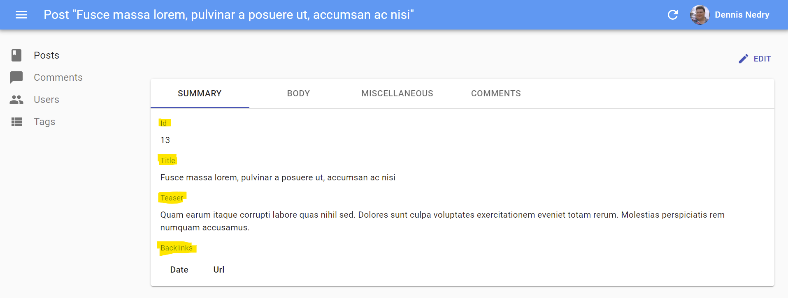

# Field Components

A `Field` component displays a given property of a REST resource. Such components are used in the `List` and `Show` views, but you can also use them in the `Edit` and `Create` views for read-only fields. 

The most usual of all field components is `<TextField>`, and it displays one field of the current record in plain text:

```jsx
// in src/posts.js
import * as React from "react";
import { List, Datagrid, TextField } from 'react-admin';

export const PostList = () => (
    <List>
        <Datagrid>
            <TextField source="id" />
            <TextField source="title" />
            <TextField source="body" />
        </Datagrid>
    </List>
);
```

`Field` components read the current `record` from the current `RecordContext` (set by react-admin). There is nothing magic there - you can easily write your own:


```jsx
import { useRecordContext } from 'react-admin';

const PurpleTextField = ({ source }) => {
    const record = useRecordContext();
    return (<span style={{ color: 'purple' }}>{record && record[source]}</span>);
};
```


React-admin Field components also accept a `record` prop. This allows you to use them outside a `RecordContext`, or to use another `record` than the one in the current context.

```jsx
// a post looks like
// { id: 123, title: "Hello, world", author: "John Doe", body: "..." }

const PostShow = ({ id }) => {
    const { data, isLoading } = useGetOne('books', { id });
    if (isLoading) return <span>Loading</span>; 
    return (
        <dl>
            <dt>Title</dt>
            <dd><TextField record={data} source="title" /></dd>
            <dt>Author</dt>
            <dd><PurpleTextField record={data} source="author" /></dd>
        </dl>   
    );
}
```

## Common Field Props

All Field components accept the following props:

| Prop                                                      | Required | Type                           | Default  | Description                                                                                                                                                                        |
|-----------------------------------------------------------| -------- |--------------------------------| -------- |------------------------------------------------------------------------------------------------------------------------------------------------------------------------------------|
| `record`                                                  | Optional | `Object`                       | -        | Object containing the properties to display, to override the record from the current `RecordContext`                                                                               |
| `source`                                                  | Required | `string`                       | -        | Name of the property to display                                                                                                                                                    |
| `label`                                                   | Optional | `string` &#124; `ReactElement` | `source` | Used as a table header or an input label                                                                                                                                           |
| `sortable`                                                | Optional | `boolean`                      | `true`   | When used in a `List`, should the list be sortable using the `source` attribute? Setting it to `false` disables the click handler on the column header.                            |
| `sortBy`                                                  | Optional | `string`                       | `source` | When used in a `List`, specifies the actual `source` to be used for sorting when the user clicks the column header                                                                 |
| `sortByOrder`                                             | Optional | `ASC` &#124; `DESC`            | `ASC`    | When used in a `List`, specifies the sort order to be used for sorting when the user clicks the column header                                                                      |
| `className`                                               | Optional | `string`                       | -        | A class name (usually generated by JSS) to customize the look and feel of the field element itself                                                                                 |
| `cellClassName`                                           | Optional | `string`                       | -        | A class name (usually generated by JSS) to customize the look and feel of the field container (e.g. the `<td>` in a `Datagrid`)                                                    |
| `headerClassName`                                         | Optional | `string`                       | -        | A class name (usually generated by JSS) to customize the look and feel of the field header (e.g. the `<th>` in a `Datagrid`)                                                       |
| `formClassName`                                           | Optional | `string`                       | -        | A class name (usually generated by JSS) to customize the look and feel of the field container when it is used inside `<SimpleForm>` or `<TabbedForm>`                              |
| `addLabel`                                                | Optional | `boolean`                      | `false`  | Defines the visibility of the label when the field is used in `<SimpleForm>`, `<FormTab>`, `<SimpleShowLayout>`, or `<Tab>`. It's `true` for all react-admin `<Field>` components. |
| `textAlign`                                               | Optional | `string`                       | 'left'   | Defines the text alignment inside a cell. Set to `right` for right alignment (e.g. for numbers)                                                                                    |
| `emptyText`                                               | Optional | `string`                       | ''       | Defines a text to be shown when a field has no value (not supported in array fields)                                                                                               |
| [`sx`](https://mui.com/system/the-sx-prop/#main-content)  | Optional | `SxProps`                      | ''       | MUI shortcut for defining custom styles with access to the theme                                                                                                                   |

**Tip**: You can use field components inside the `Edit` or `Show` views, too:

```jsx
export const PostShow = ({ ...props }) => (
    <Show {...props}>
        <SimpleShowLayout>
            <TextField source="title" />
        </SimpleShowLayout>
    </Show>
);
```

**Tip**: If you display a record with a complex structure, you can use a path with dot separators as the `source` attribute. For instance, if the API returns the following 'book' record:

```js
{
    id: 1234,
    title: 'War and Peace',
    author: {
        firstName: 'Leo',
        lastName: 'Tolstoi'
    }
}
```

Then you can display the author first name as follows:

```jsx
<TextField source="author.firstName" />
```

**Tip**: If you want to display data from more than one field, check out the [`<FunctionField>`](./FunctionField.md), which accepts a `render` function:

```jsx
import { FunctionField } from 'react-admin';

<FunctionField
    label="Name"
    render={record => `${record.first_name} ${record.last_name}`}
/>;
```

**Tip**: If you want to format a field according to the value, use a higher-order component to do conditional formatting, as described in the [Theming documentation](./Theming.md#conditional-formatting).

**Tip**: If your interface has to support multiple languages, don't use the `label` prop, and put the localized labels in a dictionary instead. See the [Translation documentation](./Translation.md#translating-resource-and-field-names) for details.

## Recipes

### Styling Fields

All field components accept a `className` prop, allowing you to customize their style to your liking. We advise you to use the Material UI styling solution, JSS, to generate those classes. See their [documentation](https://material-ui.com/customization/css-in-js/#api) about that.

```jsx
import { makeStyles } from '@material-ui/core/styles';

const useStyles = makeStyles({
    price: { color: 'purple' },
});

const PriceField = props => {
    const classes = useStyles();
    return <TextField className={classes.price} {...props} />;
};

export const ProductList = () => (
    <List>
        <Datagrid>
            <PriceField source="price" />
        </Datagrid>
    </List>
);

// renders in the Datagrid as
<td><span class="[class name generated by JSS]">2</span></td>
```

React-admin usually delegates the rendering of field components to material-ui components. Refer to the material-ui documentation to see the default styles for elements.

You may want to customize the cell style inside a `Datagrid`. You can use the `cellClassName` for that:


```jsx
import { makeStyles } from '@material-ui/core/styles';

const useStyles = makeStyles({
    priceCell: { fontWeight: 'bold' },
});

const PriceField = props => {
    const classes = useStyles();
    return <TextField cellClassName={classes.priceCell} {...props} />;
};

export const ProductList = () => (
    <List>
        <Datagrid>
            <PriceField source="price" />
        </Datagrid>
    </List>
);

// renders in the Datagrid as
<td class="[class name generated by JSS]"><span>2</span></td>
```


You may want to override the field header (the `<th>` element in the `Datagrid`). In that case, use the `headerClassName` prop:


```jsx
import { makeStyles } from '@material-ui/core/styles';

const useStyles = makeStyles({
    priceHeader: { fontWeight: 'bold' },
});

const PriceField = props => {
    const classes = useStyles();
    return <TextField headerClassName={classes.priceHeader} {...props} />;
}

export const ProductList = () => (
    <List>
        <Datagrid>
            <PriceField source="price" />
        </Datagrid>
    </List>
);
// renders in the table header as
<th class="[class name generated by JSS]"><button>Price</button></th>
```


Finally, sometimes, you just want to right align the text of a cell. Use the `textAlign` prop, which accepts either `left` or `right`:


```jsx
const PriceField = props => (
    <TextField {...props} />
);

PriceField.defaultProps = {
    textAlign: 'right',
};
```


## Writing Your Own Field Component

If you don't find what you need in the list above, you can write your own Field component. It must be a regular React component, accepting a `source` attribute and retrieving the `record` from the `RecordContext` with the `useRecordContext` hook. React-admin will set the `record` in this context based on the API response data at render time. The field component only needs to find the `source` in the `record` and display it.

For instance, here is an equivalent of react-admin's `<TextField>` component:

```jsx
import * as React from "react";
import PropTypes from 'prop-types';
import { useRecordContext } from 'react-admin';

const TextField = (props) => {
    const { source } = props;
    const record = useRecordContext(props);
    return <span>{record[source]}</span>;
}

TextField.propTypes = {
    label: PropTypes.string,
    record: PropTypes.object,
    source: PropTypes.string.isRequired,
};

export default TextField;
```

**Tip**: The `label` attribute isn't used in the `render()` method, but react-admin uses it to display the table header.

**Tip**: If you want to support deep field sources (e.g. source values like `author.name`), use [lodash/get](https://www.npmjs.com/package/lodash.get) to replace the simple object lookup:

```jsx
import * as React from "react";
import PropTypes from 'prop-types';
import get from 'lodash/get';
import { useRecordContext } from 'react-admin';

const TextField = (props) => {
    const { source } = props;
    const record = useRecordContext(props);

    return <span>{get(record, source)}</span>;
}
```

If you are not looking for reusability, you can create even simpler components, with no attributes. Let's say an API returns user records with `firstName` and `lastName` properties, and that you want to display a full name in a user list.

```js
{
    id: 123,
    firstName: 'John',
    lastName: 'Doe'
}
```

The component will be:

```jsx
import * as React from "react";
import { List, Datagrid, TextField, useRecordContext } from 'react-admin';

const FullNameField = (props) => {
    const record = useRecordContext(props);

    return <span>{record.firstName} {record.lastName}</span>;
}

FullNameField.defaultProps = { label: 'Name' };

export const UserList = () => (
    <List>
        <Datagrid>
            <FullNameField source="lastName" />
        </Datagrid>
    </List>
);
```

**Tip**: In such custom fields, the `source` is optional. React-admin uses it to determine which column to use for sorting when the column header is clicked. In case you use the `source` property for additional purposes, the sorting can be overridden by the `sortBy` property on any `Field` component.

### Adding A Label To Custom Field Components

When you use one of the react-admin `Field` components in an `Edit`, `Create` or `Show` view, react-admin includes a label on top of the field value, as in the following example:



For your custom fields, however, the label doesn't appear by default. You need to opt in this feature by setting the `addLabel` prop to `true` in the `defaultProps`.

```diff
const FullNameField = (props) => {
    const record = useRecordContext(props);
    return (
        <span>
            {record.firstName} {record.lastName}
        </span>
    );
}

FullNameField.defaultProps = {
    label: 'Name',
+   addLabel: true,
};
```

React-admin uses a trick to make it work: the view layouts (`<SimpleShowLayout>`, `<TabbedShowLayout>`, `<SimpleForm>`, `<TabbedForm>`) inspect their children, and whenever one has the `addLabel` prop set to `true`, the layout decorates the component with a label.

If you don't use any of these layouts, the `addLabel` trick won't work. You'll have to add a label manually by decorating your field with [the `<Labeled>` component](./Inputs.md#using-labeled):

```jsx
import { Labeled } from 'react-admin';

const MyShowLayout = () => (
    <div>
        <Labeled label="Name">
            <FullNameField />
        </Labeled>
    </div>
);
```

You can also leverage the default label resolution mechanism by providing the `resource` and `source` props instead of the `label`:

```jsx
import { Labeled } from 'react-admin';

const MyShowLayout = () => (
    <div>
        <Labeled resource="users" source="name">
            <TextField source="name" />
        </Labeled>
    </div>
);
```

### Hiding A Field Based On The Value Of Another

In a Show view, you may want to display or hide fields based on the value of another field - for instance, show an `email` field only if the `hasEmail` boolean field is `true`.

For such cases, you can use the custom field approach: use the injected `record` prop, and render another Field based on the value.

```jsx
import * as React from "react";
import { EmailField } from 'react-admin';

const ConditionalEmailField = (props) => {
    const record = useRecordContext(props);
    return record && record.hasEmail
        ? <EmailField source="email" {...props} />
        : null;
}

export default ConditionalEmailField;
```

**Tip**: Always check the `record` is defined before inspecting its properties, as react-admin displays the `Show` view *before* fetching the record from the data provider. So the first time it renders the show view for a resource, the `record` is `undefined`.

This `ConditionalEmailField` is properly hidden when `hasEmail` is `false`. But when `hasEmail` is `true`, the Show layout renders it... without a label. And if you add a `addLabel` default prop, the `Show` layout will render the label regardless of the `hasEmail` value...

One solution is to add the label manually in the custom component:

```jsx
import * as React from "react";
import { Labeled, EmailField } from 'react-admin';

const ConditionalEmailField = (props) => {
    const record = useRecordContext(props);

    return record && record.hasEmail
        ? (
            <Labeled label="Email">
                <EmailField source="email" {...props} />
            </Labeled>
        )
        : null;
}

export default ConditionalEmailField;
```

This comes with a drawback, though: the `<ConditionalEmailField>` cannot be used in a List view anymore, as it will always have a label. If you want to reuse the custom component in a List, this isn't the right solution.

An alternative solution is to split the `<Show>` component. Under the hood, the `<Show>` component is composed of two sub-components: the `<ShowController>` component, which fetches the record, and the `<ShowView>`, which is responsible for rendering the view title, actions, and children. `<ShowController>` uses the *render props* pattern:

```jsx
// inside react-admin
const Show = props => (
    <ShowController {...props}>
        {controllerProps => <ShowView {...props} {...controllerProps} />}
    </ShowController>
);
```

The `<ShowController>` fetches the `record` from the data provider, and passes it to its child function when received (among the `controllerProps`). That means the following code:

```jsx
import { Show, SimpleShowLayout, TextField } from 'react-admin';

const UserShow = props => (
    <Show {...props}>
        <SimpleShowLayout>
            <TextField source="username" />
            <TextField source="email" />
        </SimpleShowLayout>
    </Show>
);
```

Is equivalent to:

```jsx
import { ShowController, ShowView, SimpleShowLayout, TextField } from 'react-admin';

const UserShow = props => (
    <ShowController {...props}>
        {controllerProps =>
            <ShowView {...props} {...controllerProps}>
                <SimpleShowLayout>
                    <TextField source="username" />
                    <TextField source="email" />
                </SimpleShowLayout>
            </ShowView>
        }
    </ShowController>
);
```

If you want one field to be displayed based on the `record`, for instance to display the email field only if the `hasEmail` field is `true`, you just need to test the value from `controllerProps.record`, as follows:

```jsx
import { ShowController, ShowView, SimpleShowLayout, TextField } from 'react-admin';

const UserShow = props => (
    <ShowController {...props}>
        {controllerProps =>
            <ShowView {...props} {...controllerProps}>
                <SimpleShowLayout>
                    <TextField source="username" />
                    {controllerProps.record && controllerProps.record.hasEmail &&
                        <TextField source="email" />
                    }
                </SimpleShowLayout>
            </ShowView>
        }
    </ShowController>
);
```

And now you can use a regular Field component, and the label displays correctly in the Show view.

### Linking To Other Records

A custom Field component might need to display a link to another record. Build the URL to the distant record using the resource name and the id, as follows:

```js
import { useRecordContext, useGetOne } from 'react-admin';
import { Link } from 'react-router-dom';

const AuthorField = () => {
    const post = useRecordContext(props);
    const { data, isLoading } = useGetOne('users', { id: post.user_id });
    const userShowPage = `/users/${post.user_id}/show`;

    return isLoading ? null : <Link to={userShowPage}>{data.username}</Link>;
};
```

## Third-Party Components

You can find components for react-admin in third-party repositories.

- [OoDeLally/react-admin-clipboard-list-field](https://github.com/OoDeLally/react-admin-clipboard-list-field): a quick and customizable copy-to-clipboard field.
- [MrHertal/react-admin-json-view](https://github.com/MrHertal/react-admin-json-view): JSON field and input for react-admin.
