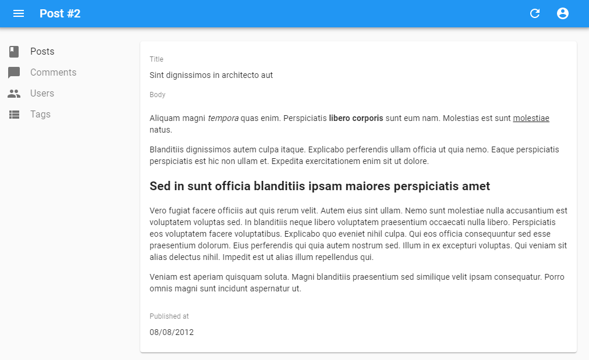

# Field Components

A `Field` component displays a given property of a REST resource. Such components are used in the `List` view, but you can also use them in the `Edit` and `Create` views for read-only fields. The most usual of all field components is `<TextField>`:

```js
// in src/posts.js
import React from 'react';
import { List, Datagrid, TextField } from 'admin-on-rest/lib/mui';

export const PostList = (props) => (
    <List {...props}>
        <Datagrid>
            <TextField source="id" />
            <TextField source="title" />
            <TextField source="body" />
        </Datagrid>
    </List>
);
```

All field components accept the following attributes:

* `source`: Property name of your entity to view/edit. This attribute is required.
* `label`: Used as a table header of an input label. Defaults to the `source` when omitted.

```js
<TextField source="zb_title" label="Title" />
```

If you display a record with a complex structure, you can use a path with dot separators as the `source` attribute. For instance, if the API returns the following 'book' record:

```js
{
    id: 1234,
    title: 'War and Peace',
    author: {
        firstName: 'Leo',
        lastName: 'Tolstoi'
    }
}
```

Then you can display the author first name as follows:

```js
<TextField source="author.firstName" />
```

## `<ChipField>`

Displays a value inside a ["Chip"](http://www.material-ui.com/#/components/chip), which is Material UI's term for a label.

``` js
import { ChipField } from 'admin-on-rest/mui';

<ChipField source="category" />
```

This field type is especially useful for one to many relationships, e.g. to display a list of books for a given author:

``` js
import { ChipField, SingleFieldList, ReferenceManyField } from 'admin-on-rest/mui';

<ReferenceManyField reference="books" target="author_id">
    <SingleFieldList>
        <ChipField source="title" />
    </SingleFieldList>
</ReferenceManyField>
```

## `<DateField>`

Displays a date or datetime.

``` js
import { DateField } from 'admin-on-rest/mui';

<DateField source="publication_date" />
```

This component accepts a `showTime` attribute (false by default) to force the display of time in addition to date (using `Date.toLocaleString()`):

```js
<DateField source="publication_date" showTime={true} />
```

## `<EmailField>`

`<EmailField>` displays an email as a `<a href="mailto:" />` link.

``` js
import { EmailField } from 'admin-on-rest/mui';

<EmailField source="personal_email" />
```

## `<RichTextField>`



This component displays some HTML content. The content is "rich" (i.e. unescaped) by default.

``` js
import { RichTextField } from 'admin-on-rest/mui';

<RichTextField record={record} source="body" stripTags={true} />
```

The `stripTags` attribute (`false` by default) allows you to remove any HTML markup, preventing some display glitches (which is especially useful in list views).

## `<TextField>`

The most simple as all fields, `<TextField>` simply displays the record property as plain text.

``` js
import { TextField } from 'admin-on-rest/mui';

<TextField label="Author Name" source="name" />
```

## `<UrlField>`

`<UrlField>` displays an url in an `< a href="">` tag.

``` js
import { UrlField } from 'admin-on-rest/mui';

<UrlField source="site_url" />
```
