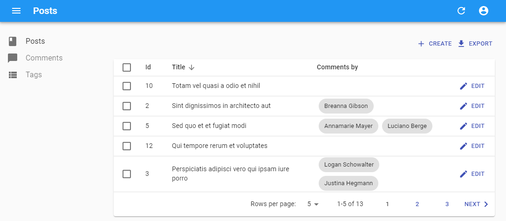
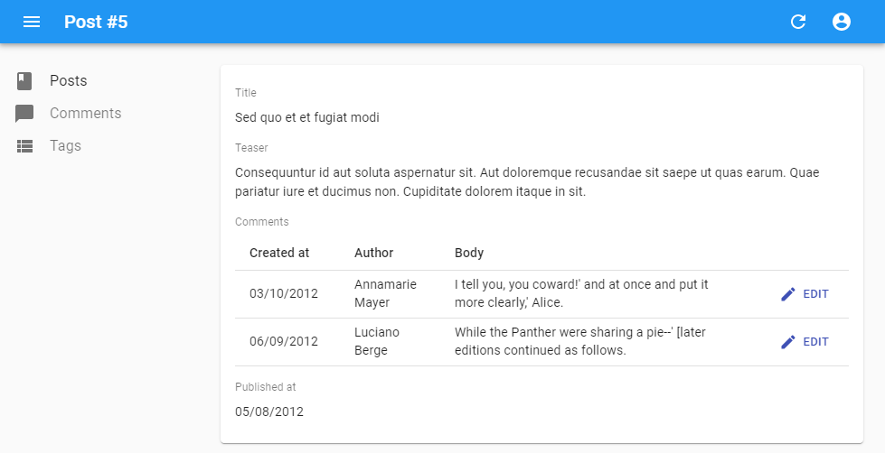

# Field Components

A `Field` component displays a given property of a REST resource. Such components are used in the `List` and `Show` views, but you can also use them in the `Edit` and `Create` views for read-only fields. 

The most usual of all field components is `<TextField>`, and it displays one field of the current record in plain text:

```jsx
// in src/posts.js
import * as React from "react";
import { List, Datagrid, TextField } from 'react-admin';

export const PostList = (props) => (
    <List {...props}>
        <Datagrid>
            <TextField source="id" />
            <TextField source="title" />
            <TextField source="body" />
        </Datagrid>
    </List>
);
```

`Field` components read the current `record` from the current `RecordContext` (set by react-admin). There is nothing magic there - you can easily write your own:


```jsx
import { useRecordContext } from 'react-admin';

const PurpleTextField = ({ source }) => {
    const record = useRecordContext();
    return (<span style={{ color: 'purple' }}>{record && record[source]}</span>);
};
```


React-admin Field components also accept a `record` prop. This allows you to use them outside a `RecordContext`, or to use another `record` than the one in the current context.

```jsx
// a post looks like
// { id: 123, title: "Hello, world", author: "John Doe", body: "..." }

const PostShow = ({ id }) => {
    const { data, loaded } = useGetOne('books', id);
    if (!loaded) return <span>Loading</span>; 
    return (
        <dl>
            <dt>Title</dt>
            <dd><TextField record={data} source="title" /></dd>
            <dt>Author</dt>
            <dd><PurpleTextField record={data} source="author" /></dd>
        </dl>   
    );
}
```

## Common Field Props

All Field components accept the following props:

| Prop              | Required | Type                           | Default  | Description                                                                                                                                                                        |
| ----------------- | -------- | ------------------------------ | -------- | ---------------------------------------------------------------------------------------------------------------------------------------------------------------------------------- |
| `record`          | Optional | `Object`                       | -        | Object containing the properties to display, to override the record from the current `RecordContext` |
| `source`          | Required | `string`                       | -        | Name of the property to display                                                                                                                                                    |
| `label`           | Optional | `string` &#124; `ReactElement` | `source` | Used as a table header or an input label                                                                                                                                           |
| `sortable`        | Optional | `boolean`                      | `true`   | When used in a `List`, should the list be sortable using the `source` attribute? Setting it to `false` disables the click handler on the column header.                            |
| `sortBy`          | Optional | `string`                       | `source` | When used in a `List`, specifies the actual `source` to be used for sorting when the user clicks the column header                                                                 |
| `sortByOrder`     | Optional | `ASC` &#124; `DESC`            | `ASC`    | When used in a `List`, specifies the sort order to be used for sorting when the user clicks the column header                                                                      |
| `className`       | Optional | `string`                       | -        | A class name (usually generated by JSS) to customize the look and feel of the field element itself                                                                                 |
| `cellClassName`   | Optional | `string`                       | -        | A class name (usually generated by JSS) to customize the look and feel of the field container (e.g. the `<td>` in a `Datagrid`)                                                    |
| `headerClassName` | Optional | `string`                       | -        | A class name (usually generated by JSS) to customize the look and feel of the field header (e.g. the `<th>` in a `Datagrid`)                                                       |
| `formClassName`   | Optional | `string`                       | -        | A class name (usually generated by JSS) to customize the look and feel of the field container when it is used inside `<SimpleForm>` or `<TabbedForm>`                              |
| `addLabel`        | Optional | `boolean`                      | `false`  | Defines the visibility of the label when the field is used in `<SimpleForm>`, `<FormTab>`, `<SimpleShowLayout>`, or `<Tab>`. It's `true` for all react-admin `<Field>` components. |
| `textAlign`       | Optional | `string`                       | 'left'   | Defines the text alignment inside a cell. Set to `right` for right alignment (e.g. for numbers)                                                                                    |
| `emptyText`       | Optional | `string`                       | ''       | Defines a text to be shown when a field has no value (not supported in array fields)                                                                                                                               |

**Tip**: You can use field components inside the `Edit` or `Show` views, too:

```jsx
export const PostShow = ({ ...props }) => (
    <Show {...props}>
        <SimpleShowLayout>
            <TextField source="title" />
        </SimpleShowLayout>
    </Show>
);
```

**Tip**: If you display a record with a complex structure, you can use a path with dot separators as the `source` attribute. For instance, if the API returns the following 'book' record:

```js
{
    id: 1234,
    title: 'War and Peace',
    author: {
        firstName: 'Leo',
        lastName: 'Tolstoi'
    }
}
```

Then you can display the author first name as follows:

```jsx
<TextField source="author.firstName" />
```

**Tip**: If you want to display data from more than one field, check out [the `<FunctionField>`](#functionfield), which accepts a `render` function:

```jsx
import { FunctionField } from 'react-admin';

<FunctionField
    label="Name"
    render={record => `${record.first_name} ${record.last_name}`}
/>;
```

**Tip**: If you want to format a field according to the value, use a higher-order component to do conditional formatting, as described in the [Theming documentation](./Theming.md#conditional-formatting).

**Tip**: If your interface has to support multiple languages, don't use the `label` prop, and put the localized labels in a dictionary instead. See the [Translation documentation](./Translation.md#translating-resource-and-field-names) for details.

## Basic Fields

### `<BooleanField>`

Displays a boolean value as a check.

```jsx
import { BooleanField } from 'react-admin';

<BooleanField source="commentable" />
```


#### Properties

| Prop              | Required | Type             | Default                    | Description                       |
| ----------------- | -------- | ---------------- | -------------------------- | -------------------------------------------------------------------- |
| `valueLabelTrue`  | Optional | string           | 'true'                     | Aria label for the truthy value   |
| `valueLabelFalse` | Optional | string           | 'false'                    | Aria label for the falsy value    |
| `TrueIcon`        | Optional | SvgIconComponent | `@material-ui/icons/Done`  | Icon to show for the truthy value |
| `FalseIcon`       | Optional | SvgIconComponent | `@material-ui/icons/Clear` | Icon to show for the falsy value  |
| `looseValue`      | Optional | boolean          | `false`                    | If `true` the field's value is not evaluated strictly as a `boolean` |

`<BooleanField>` also accepts the [common field props](./Fields.md#common-field-props).

#### CSS API

| Rule name  | Description                 |
| ---------- | --------------------------- |
| `root`     | Applied to the root element |

To override the style of all instances of `<BooleanField>` using the [material-ui style overrides](https://v4.mui.com/customization/globals/#css), use the `RaBooleanField` key.

#### Usage

The `<BooleanField>` includes a tooltip text for accessibility (or to query in "end to end" tests). By default, it is the translated value ('true' or 'false' in English).

If you need to override it, you can use the `valueLabelTrue` and `valueLabelFalse` props, which both accept a string. These strings may be translation keys:

```jsx
// English labels
<BooleanField source="published" valueLabelTrue="Has been published" valueLabelFalse="Has not been published yet" />

// Translation keys
<BooleanField source="published" valueLabelTrue="myapp.published.true" valueLabelFalse="myapp.published.false" />
```

You can customize the icons to show by setting the `TrueIcon` and `FalseIcon` props which accept a SvgIcon type.

```jsx
import AlarmOnIcon from '@material-ui/icons/AlarmOn';
import AlarmOffIcon from '@material-ui/icons/AlarmOff';

<BooleanField source="alarm" TrueIcon={AlarmOnIcon} FalseIcon={AlarmOffIcon} />
``` 

### `<ChipField>`

Displays a value inside a ["Chip"](https://v4.mui.com/components/chips), which is Material UI's term for a label.

#### CSS API

| Rule name  | Description                                              |
| ---------- | -------------------------------------------------------- |
| `chip`     | Applied to the underlying Material UI's `Chip` component |

To override the style of all instances of `<ChipField>` using the [material-ui style overrides](https://v4.mui.com/customization/globals/#css), use the `RaChipField` key.

#### Usage

```jsx
import { ChipField } from 'react-admin';

<ChipField source="category" />
```


This field type is especially useful for one to many relationships, e.g. to display a list of books for a given author:

```jsx
import { ChipField, SingleFieldList, ReferenceManyField } from 'react-admin';

<ReferenceManyField reference="books" target="author_id">
    <SingleFieldList>
        <ChipField source="title" />
    </SingleFieldList>
</ReferenceManyField>
```

Any additional props are passed to material-ui's `<Chip>` element. Check [The material-ui `<Chip>` documentation](https://v4.mui.com/api/chip/) for details.

### `<DateField>`

Displays a date or datetime using the browser locale (thanks to `Date.toLocaleDateString()` and `Date.toLocaleString()`).

```jsx
import { DateField } from 'react-admin';

<DateField source="publication_date" />
```

#### Properties

| Prop       | Required | Type    | Default | Description                                                                                              |
| ---------- | -------- | ------- | ------- | -------------------------------------------------------------------------------------------------------- |
| `locales`  | Optional | string  | ''      | Override the browser locale in the date formatting. Passed as first argument to `Intl.DateTimeFormat()`. |
| `options`  | Optional | Object  | -       | Date formatting options. Passed as second argument to `Intl.DateTimeFormat()`.                           |
| `showTime` | Optional | boolean | `false` | If true, show date and time. If false, show only date                                                    |

`<DateField>` also accepts the [common field props](./Fields.md#common-field-props).

#### Usage

This component accepts a `showTime` attribute (`false` by default) to force the display of time in addition to date. It uses `Intl.DateTimeFormat()` if available, passing the `locales` and `options` props as arguments. If Intl is not available, it ignores the `locales` and `options` props.


```jsx
<DateField source="publication_date" />
// renders the record { id: 1234, publication_date: new Date('2017-04-23') } as
<span>4/23/2017</span>

<DateField source="publication_date" showTime />
// renders the record { id: 1234, publication_date: new Date('2017-04-23 23:05') } as
<span>4/23/2017, 11:05:00 PM</span>

<DateField source="publication_date" options={{ weekday: 'long', year: 'numeric', month: 'long', day: 'numeric' }} />
// renders the record { id: 1234, publication_date: new Date('2017-04-23') } as
<span>Sunday, April 23, 2017</span>

<DateField source="publication_date" locales="fr-FR" />
// renders the record { id: 1234, publication_date: new Date('2017-04-23') } as
<span>23/04/2017</span>
```


See [Intl.DateTimeFormat documentation](https://developer.mozilla.org/en-US/docs/Web/JavaScript/Reference/Global_Objects/Date/toLocaleDateString) for the `options` prop syntax.

**Tip**: If you need more formatting options than what `Intl.DateTimeFormat` can provide, build your own field component leveraging a third-party library like [moment.js](https://momentjs.com/).

### `<EmailField>`

`<EmailField>` displays an email as a Material UI's `<Link href="mailto:" />` component.

```jsx
import { EmailField } from 'react-admin';

<EmailField source="personal_email" />
```

### `<FunctionField>`

If you need a special function to render a field, `<FunctionField>` is the perfect match. It passes the `record` to a `render` function supplied by the developer. For instance, to display the full name of a `user` record based on `first_name` and `last_name` properties:

```jsx
import { FunctionField } from 'react-admin';

<FunctionField label="Name" render={record => `${record.first_name} ${record.last_name}`} />
```

#### Properties

| Prop     | Required | Type     | Default | Description                                                                |
| -------- | -------- | -------- | ------- | -------------------------------------------------------------------------- |
| `render` | Required | function | -       | A function returning a string (or an element) to display based on a record |

`<FunctionField>` also accepts the [common field props](./Fields.md#common-field-props).

**Tip**: Technically, you can omit the `source` and `sortBy` properties for the `<FunctionField>` since you provide the render function. However, providing a `source` or a `sortBy` will allow the `Datagrid` to make the column sortable, since when a user clicks on a column, the `Datagrid` uses these properties to sort. Should you provide both, `sortBy` will override `source` for sorting the column.

### `<ImageField>`

If you need to display an image based on a path contained in a record field, you can use the `<ImageField />` component:

```jsx
import { ImageField } from 'react-admin';

<ImageField source="url" title="title" />

// renders the record { id: 123, url: 'cat.png', title: 'meow' } as 
<div>
    
</div>
```

This field is also often used within the [`<ImageInput />`](./Inputs.md#imageinput) component to display a preview.

#### Properties

| Prop    | Required | Type   | Default      | Description                                                                              |
| ------- | -------- | ------ | ------------ | ---------------------------------------------------------------------------------------- |
| `src`   | Optional | string | -            | A function returning a string (or an element) to display based on a record               |
| `title` | Optional | string | record.title | The name of the property containing the image source if the value is an array of objects |

`<ImageField>` also accepts the [common field props](./Fields.md#common-field-props).

#### CSS API

| Rule name  | Description                                                                    |
| ---------- | ------------------------------------------------------------------------------ |
| `list`     | Applied to the underlying `<ul>` component when `sourceValue` prop is an array |
| `image`    | Applied to each underlying `` component                                   |

To override the style of all instances of `<ImageField>` using the [material-ui style overrides](https://v4.mui.com/customization/globals/#css), use the `RaImageField` key.

#### Usage

The optional `title` prop points to the picture title property, used for both `alt` and `title` attributes. It can either be a hard-written string, or a path within your JSON object:

```jsx
// { picture: { url: 'cover.jpg', title: 'Larry Cover (French pun intended)' } }

<ImageField source="picture.url" title="picture.title" />
// renders img title as "Larry Cover (French pun intended)"

<ImageField source="picture.url" title="Picture" />
// renders img title as "Picture", since "Picture" is not a path in previous given object
```

If the record actually contains an array of images in the property defined by the `source` prop, the `src` prop will be needed to determine the `src` value of the images, for example:

```js
// This is the record
{
    pictures: [
        { url: 'image1.jpg', desc: 'First image' },
        { url: 'image2.jpg', desc: 'Second image' },
    ],
}

<ImageField source="pictures" src="url" title="desc" />
```

### `<FileField>`

If you need to render a link to a file based on a path contained in a record field, you can use the `<FileField />` component:

```jsx
import { FileField } from 'react-admin';

<FileField source="url" title="title" />

// renders the record { id: 123, url: 'doc.pdf', title: 'Presentation' } as 
<div>
    <a href="doc.pdf" title="Presentation">Presentation</a>
</div>
```

This field is also often used within a [`<FileInput />`](./Inputs.md#fileinput) component to display preview.

#### Properties

| Prop       | Required | Type                      | Default      | Description                                                                                                                                            |
| ---------- | -------- | ------------------------- | ------------ | ------------------------------------------------------------------------------------------------------------------------------------------------------ |
| `src`      | Optional | `string`                  | -            | A function returning a string (or an element) to display based on a record                                                                             |
| `title`    | Optional | `string`                  | record.title | The name of the property containing the image source if the value is an array of objects                                                               |
| `target`   | Optional | `string`                  | -            | The link target. Set to "_blank" to open the file on a new tab                                                                                         |
| `download` | Optional | `boolean` &#124; `string` | -            | Prompts the user to save the linked URL instead of navigating to it                                                                                    |
| `ping`     | Optional | `string`                  | -            | A space-separated list of URLs. When the link is followed, the browser will send POST requests with the body PING to the URLs. Typically for tracking. |
| `rel`      | Optional | `string`                  | -            | The relationship of the linked URL as space-separated link types (e.g. 'noopener', 'canonical', etc.).                                                 |

`<FileField>` also accepts the [common field props](./Fields.md#common-field-props).

#### CSS API

| Rule name  | Description                 |
| ---------- | --------------------------- |
| `root`     | Applied to the root element |

To override the style of all instances of `<FileField>` using the [material-ui style overrides](https://v4.mui.com/customization/globals/#css), use the `RaFileField` key.

#### Usage

The optional `title` prop points to the file title property, used for `title` attributes. It can either be a hard-written string, or a path within your JSON object:

```jsx
// { file: { url: 'doc.pdf', title: 'Presentation' } }

<FileField source="file.url" title="file.title" />
// renders the file name as "Presentation"

<FileField source="file.url" title="File" />
// renders the file name as "File", since "File" is not a path in previous given object
```

If the record actually contains an array of files in its property defined by the `source` prop, the `src` prop will be needed to determine the `href` value of the links, for example:

```js
// This is the record
{
    files: [
        { url: 'image1.jpg', desc: 'First image' },
        { url: 'image2.jpg', desc: 'Second image' },
    ],
}

<FileField source="files" src="url" title="desc" />
```

You can optionally set the `target` prop to choose which window will the link try to open in.

```jsx
// Will make the file open in new window
<FileField source="file.url" target="_blank" />
```

### `<MarkdownField>`

This [Enterprise Edition](https://marmelab.com/ra-enterprise) component allows to render Markdown data as HTML.

```jsx
import { Show, SimpleShowLayout, TextField } from 'react-admin';
import { MarkdownField } from '@react-admin/ra-markdown';

const PostShow = props => (
    <Show {...props}>
        <SimpleShowLayout>
            <TextField source="title" />
            <MarkdownField source="description" />
        </SimpleShowLayout>
    </Show>
);
```

Check [the `ra-markdown` documentation](https://marmelab.com/ra-enterprise/modules/ra-markdown) for more details.

### `<NumberField>`

Displays a number formatted according to the browser locale, right aligned.

```jsx
import { NumberField }  from 'react-admin';

<NumberField source="score" />
// renders the record { id: 1234, score: 567 } as
<span>567</span>
```

#### Properties

| Prop      | Required | Type   | Default | Description                                                                                              |
| --------- | -------- | ------ | ------- | -------------------------------------------------------------------------------------------------------- |
| `locales` | Optional | string | ''      | Override the browser locale in the date formatting. Passed as first argument to `Intl.NumberFormat()`.   |
| `options` | Optional | Object | -       | Number formatting options. Passed as second argument to `Intl.NumberFormat()`.                           |

`<NumberField>` also accepts the [common field props](./Fields.md#common-field-props).

#### Usage

`<NumberField>` uses `Intl.NumberFormat()` if available, passing the `locales` and `options` props as arguments. This allows a perfect display of decimals, currencies, percentages, etc. See [Intl.NumberFormat documentation](https://developer.mozilla.org/en-US/docs/Web/JavaScript/Reference/Global_Objects/Intl/NumberFormat/NumberFormat) for the `options` prop syntax.

If Intl is not available, `<NumberField>` outputs numbers as is (and ignores the `locales` and `options` props).


```jsx
import { NumberField }  from 'react-admin';

<NumberField source="score" options={{ maximumFractionDigits: 2 }}/>
// renders the record { id: 1234, score: 567.3567458569 } as
<span>567.35</span>

<NumberField source="share" options={{ style: 'percent' }} />
// renders the record { id: 1234, share: 0.2545 } as
<span>25%</span>

<NumberField source="price" options={{ style: 'currency', currency: 'USD' }} />
// renders the record { id: 1234, price: 25.99 } as
<span>$25.99</span>

<NumberField source="price" locales="fr-FR" options={{ style: 'currency', currency: 'USD' }} />
// renders the record { id: 1234, price: 25.99 } as
<span>25,99 $US</span>
```


**Tip**: If you need more formatting options than what `Intl.NumberFormat` can provide, build your own field component leveraging a third-party library like [numeral.js](http://numeraljs.com/).

**Tip**: When used in a `Show` view, the right alignment may look weird. Disable it by setting the `textAlign` attribute to "left":

```jsx
import { NumberField }  from 'react-admin';

<NumberField source="score" textAlign="left" />
```

### `<RichTextField>`

This component displays some HTML content. The content is "rich" (i.e. unescaped) by default.

```jsx
import { RichTextField } from 'react-admin';

<RichTextField source="body" />
```


#### Properties

| Prop        | Required | Type      | Default  | Description                                          |
| ----------- | -------- | --------- | -------- | ---------------------------------------------------- |
| `stripTags` | Optional | `boolean` | `false`  | If `true`, remove all HTML tags and render text only |

`<RichTextField>` also accepts the [common field props](./Fields.md#common-field-props).

#### Usage

The `stripTags` prop allows to remove all HTML markup, preventing some display glitches (which is especially useful in list views, or when truncating the content).

```jsx
import { RichTextField } from 'react-admin';

<RichTextField source="body" stripTags />
```

### `<TextField>`

The simplest of all fields, `<TextField>` simply displays the record property as plain text.

```jsx
import { TextField } from 'react-admin';

<TextField label="Author Name" source="name" />
```

**Tip**: If you want to display data from more than one field, check out [the `<FunctionField>`](#functionfield), which accepts a `render` function:

```jsx
import { FunctionField } from 'react-admin';

<FunctionField
    label="Name"
    render={record => `${record.first_name} ${record.last_name}`}
/>;
```

### `<UrlField>`

`<UrlField>` displays a url in a Material UI's `<Link href="" />` component.

```jsx
import { UrlField } from 'react-admin';

<UrlField source="site_url" />
```

## Choice Fields

### `<SelectField>`

When you need to display an enumerated field, `<SelectField>` maps the value to a string.

For instance, if the `gender` field can take values "M" and "F", here is how to display it as either "Male" or "Female":

```jsx
import { SelectField } from 'react-admin';

<SelectField source="gender" choices={[
   { id: 'M', name: 'Male' },
   { id: 'F', name: 'Female' },
]} />
```

#### Properties

| Prop              | Required | Type                          | Default | Description                                                                                                                                  |
| ----------------- | -------- | ----------------------------- | ------- | -------------------------------------------------------------------------------------------------------------------------------------------- |
| `choices`         | Required | `Object[]`                    | -       | List of items to show as options                                                                                                             |
| `optionText`      | Optional | `string | Function | Element` | 'name'  | Name of the field to use to display the matching choice, or function returning that field name, or a React element to render for that choice |
| `optionValue`     | Optional | `string`                      | 'id'    | Name of the field to compare to the value to find the matching choice                                                                        |
| `translateChoice` | Optional | `boolean`                     | `true`  | Whether or not the choice text should be translated                                                                                          |

`<SelectField>` also accepts the [common field props](./Fields.md#common-field-props).

#### Usage

By default, the option is built by:

- finding a choice where the `id` property equals the field value
- using the `name` property as the option text

You can also customize the properties to use for the lookup value and text, thanks to the `optionValue` and `optionText` attributes.

```jsx
const choices = [
   { _id: 123, full_name: 'Leo Tolstoi', sex: 'M' },
   { _id: 456, full_name: 'Jane Austen', sex: 'F' },
];
<SelectField source="author_id" choices={choices} optionText="full_name" optionValue="_id" />
```

`optionText` also accepts a function, so you can shape the option text at will:

```jsx
const choices = [
   { id: 123, first_name: 'Leo', last_name: 'Tolstoi' },
   { id: 456, first_name: 'Jane', last_name: 'Austen' },
];
const optionRenderer = choice => `${choice.first_name} ${choice.last_name}`;
<SelectField source="author_id" choices={choices} optionText={optionRenderer} />
```

`optionText` also accepts a React Element, that will be cloned and receive the related choice as the `record` prop. You can use Field components there.

```jsx
const choices = [
   { id: 123, first_name: 'Leo', last_name: 'Tolstoi' },
   { id: 456, first_name: 'Jane', last_name: 'Austen' },
];
const FullNameField = ({ record }) => <Chip>{record.first_name} {record.last_name}</Chip>;
<SelectField source="author_id" choices={choices} optionText={<FullNameField />}/>
```

The current choice is translated by default, so you can use translation identifiers as choices:

```js
const choices = [
   { id: 'M', name: 'myroot.gender.male' },
   { id: 'F', name: 'myroot.gender.female' },
];
```

However, in some cases (e.g. inside a `<ReferenceField>`), you may not want the choice to be translated. In that case, set the `translateChoice` prop to `false`.

```jsx
<SelectField source="gender" choices={choices} translateChoice={false}/>
```

**Tip**: `<SelectField>` sets `translateChoice` to `true` by default.

## Array Fields

### `<ArrayField>`

Display a collection using `<Field>` child components.

Ideal for embedded arrays of objects, e.g. `tags` and `backlinks` in the following `post` object:

```js
{
    id: 123,
    tags: [
        { name: 'foo' },
        { name: 'bar' }
    ],
    backlinks: [
        {
            uuid: '34fdf393-f449-4b04-a423-38ad02ae159e',
            date: '2012-08-10T00:00:00.000Z',
            url: 'http://example.com/foo/bar.html',
        },
        {
            uuid: 'd907743a-253d-4ec1-8329-404d4c5e6cf1',
            date: '2012-08-14T00:00:00.000Z',
            url: 'https://blog.johndoe.com/2012/08/12/foobar.html',
        }
    ]
}
```

The child must be an iterator component (like `<Datagrid>` or `<SingleFieldList>`).

Here is how to display all the backlinks of the current post as a `<Datagrid>`:

```jsx
<ArrayField source="backlinks">
    <Datagrid>
        <DateField source="date" />
        <UrlField source="url" />
    </Datagrid>
</ArrayField>
```

And here is how to display all the tags of the current post as `<Chip>` components:

```jsx
<ArrayField source="tags">
    <SingleFieldList>
        <ChipField source="name" />
    </SingleFieldList>
</ArrayField>
```

#### Properties

| Prop       | Required | Type   | Default | Description                                                   |
| ---------- | -------- | ------ | ------- | ------------------------------------------------------------- |
| `fieldKey` | Optional | string | -       | Name for the field to be used as key when displaying children |

`<ArrayField>` also accepts the [common field props](./Fields.md#common-field-props), except `emptyText` (use the child `empty` prop instead).

#### Usage

If the array value contains a lot of items, you may experience slowdowns in the UI. In such cases, set the `fieldKey` prop to use one field as key, and reduce CPU and memory usage:

```diff
-<ArrayField source="backlinks">
+<ArrayField source="backlinks" fieldKey="uuid">
    <Datagrid>
        <DateField source="date" />
        <UrlField source="url" />
    </Datagrid>
</ArrayField>
```

**Tip**: If you need to render a custom collection, it's often simpler to write your own component:

```jsx
const TagsField = ({ record }) => (
    <ul>
        {record.tags.map(item => (
            <li key={item.name}>{item.name}</li>
        ))}
    </ul>
)
TagsField.defaultProps = {
    addLabel: true
};
```

## Reference Fields

### `<ReferenceField>`

`<ReferenceField>` is useful for displaying many-to-one and one-to-one relationships. This component fetches a referenced record (using the `dataProvider.getMany()` method), and passes it to its child. A `<ReferenceField>` displays nothing on its own, it just fetches the data and expects its child to render it. Usual child components for `<ReferenceField>` are other `<Field>` components.

For instance, if a `post` has one author from the `users` resource, referenced by a `user_id` field, here is how to fetch the `user` related to each `post` record in a list, and display the `name` for each:

```jsx
import * as React from "react";
import { List, Datagrid, ReferenceField, TextField, EditButton } from 'react-admin';

export const PostList = (props) => (
    <List {...props}>
        <Datagrid>
            <TextField source="id" />
            <ReferenceField label="User" source="user_id" reference="users">
                <TextField source="name" />
            </ReferenceField>
            <TextField source="title" />
            <EditButton />
        </Datagrid>
    </List>
);
```

With this configuration, `<ReferenceField>` wraps the user's name in a link to the related user `<Edit>` page.


#### Properties

| Prop        | Required | Type                | Default  | Description                                                                                                         |
| ----------- | -------- | ------------------- | -------- | ------------------------------------------------------------------------------------------------------------------- |
| `reference` | Required | `string`            | -        | The name of the resource for the referenced records, e.g. 'posts'                                                   |
| `children`  | Required | `Element`           | -        | The Field element used to render the referenced record                                                              |
| `link`      | Optional | `string | Function` | `edit`   | Target of the link wrapping the rendered child. Set to `false` to disable the link.                                 |
| `sortBy`    | Optional | `string | Function` | `source` | Name of the field to use for sorting when the user clicks on the column header.                                     |

`<ReferenceField>` also accepts the [common field props](./Fields.md#common-field-props).

#### CSS API

| Rule name  | Description                   |
| ---------- | ----------------------------- |
| `link`     | Applied to each child element |

To override the style of all instances of `<ReferenceField>` using the [material-ui style overrides](https://v4.mui.com/customization/globals/#css), use the `RaReferenceField` key.

#### Usage

`<ReferenceField>` accepts a `reference` attribute, which specifies the resource to fetch for the related record.

**Note**: You **must** add a `<Resource>` for the reference resource - react-admin needs it to fetch the reference data. You *can* omit the `list` prop in this reference if you want to hide it in the sidebar menu.

```jsx
<Admin dataProvider={myDataProvider}>
    <Resource name="posts" list={PostList} />
    <Resource name="users" />
</Admin>
```

To change the link from the `<Edit>` page to the `<Show>` page, set the `link` prop to "show".

```jsx
<ReferenceField label="User" source="user_id" reference="users" link="show">
    <TextField source="name" />
</ReferenceField>
```

By default, `<ReferenceField>` is sorted by its `source`. To specify another attribute to sort by, set the `sortBy` prop to the according attribute's name.

```jsx
<ReferenceField label="User" source="user_id" reference="users" sortBy="user.name">
    <TextField source="name" />
</ReferenceField>
```

You can also prevent `<ReferenceField>` from adding a link to children by setting `link` to `false`.

```jsx
// No link
<ReferenceField label="User" source="user_id" reference="users" link={false}>
    <TextField source="name" />
</ReferenceField>
```

You can also use a custom `link` function to get a custom path for the children. This function must accept `record` and `reference` as arguments.

```jsx
// Custom path
<ReferenceField label="User" source="user_id" reference="users" link={(record, reference) => `/my/path/to/${reference}/${record.id}`}>
    <TextField source="name" />
</ReferenceField>
```

**Tip**: React-admin accumulates and deduplicates the ids of the referenced records to make *one* `dataProvider.getMany()` call for the entire list, instead of n `dataProvider.getOne()` calls. So for instance, if the API returns the following list of posts:

```js
[
    {
        id: 123,
        title: 'Totally agree',
        user_id: 789,
    },
    {
        id: 124,
        title: 'You are right my friend',
        user_id: 789
    },
    {
        id: 125,
        title: 'Not sure about this one',
        user_id: 735
    }
]
```

Then react-admin renders the `<PostList>` with a loader for the `<ReferenceField>`, fetches the API for the related users in one call (`GET http://path.to.my.api/users?filter={"ids":[789,735]}`), and re-renders the list once the data arrives. This accelerates the rendering and minimizes network load.

### `<ReferenceManyField>`

`<ReferenceManyField>` is useful for displaying one-to-many relationships, when the foreign key is carried by the referenced resource. For instance, if a `user` has many `books` and the `books` resource exposes a `user_id` field, `<ReferenceManyField>` can fetch all the books authored by a given user.

This component fetches a list of referenced records by a reverse lookup of the current `record.id` in the `target` field of another resource (using the `dataProvider.getManyReference()` REST method), and passes them to its child. The child must be an iterator component (like `<SingleFieldList>` or `<Datagrid>`), which usually has one or more child `<Field>` components.

For instance, here is how to show the authors of the comments related to each post in a list by matching `post.id` to `comment.post_id`. We're using `<SingleFieldList>` to display an inline list using only one field for each of the referenced record:

```jsx
import * as React from "react";
import { List, Datagrid, ChipField, ReferenceManyField, SingleFieldList, TextField } from 'react-admin';

export const PostList = (props) => (
    <List {...props}>
        <Datagrid>
            <TextField source="id" />
            <TextField source="title" type="email" />
            <ReferenceManyField label="Comments by" reference="comments" target="post_id">
                <SingleFieldList>
                    <ChipField source="author.name" />
                </SingleFieldList>
            </ReferenceManyField>
            <EditButton />
        </Datagrid>
    </List>
);
```



#### Properties

| Prop         | Required | Type               | Default                          | Description                                                                         |
| ------------ | -------- | ------------------ | -------------------------------- | ----------------------------------------------------------------------------------- |
| `children`   | Required | `Element`          | -                                | The Iterator element used to render the referenced records                          |
| `reference`  | Required | `string`           | -                                | The name of the resource for the referenced records, e.g. 'books'                   |
| `target`     | Required | string             | -                                | Target field carrying the relationship on the referenced resource, e.g. 'user_id'   |
| `filter`     | Optional | `Object`           | -                                | Filters to use when fetching the related records, passed to `getManyReference()`    |
| `pagination` | Optional | `Element`          | -                                | Pagination element to display pagination controls. empty by default (no pagination) |
| `perPage`    | Optional | `number`           | 25                               | Maximum number of referenced records to fetch                                       |
| `sort`       | Optional | `{ field, order }` | `{ field: 'id', order: 'DESC' }` | Sort order to use when fetching the related records, passed to `getManyReference()` |

`<ReferenceManyField>` also accepts the [common field props](./Fields.md#common-field-props), except `emptyText` (use the child `empty` prop instead).

#### Usage

`<ReferenceManyField>` accepts a `reference` attribute, which specifies the resource to fetch for the related record. It also accepts a `source` attribute which defines the field containing the value to look for in the `target` field of the referenced resource. By default, this is the `id` of the resource (`post.id` in the previous example).

**Note**: You **must** add a `<Resource>` for the reference resource - react-admin needs it to fetch the reference data. You *can* omit the `list` prop in this reference if you want to hide it in the sidebar menu.

You can use a `<Datagrid>` instead of a `<SingleFieldList>` - but not inside another `<Datagrid>`! This is useful if you want to display a read-only list of related records. For instance, if you want to show the `comments` related to a `post` in the post's `<Show>` view:

```jsx
import * as React from 'react';
import { ReferenceManyField, Datagrid, DateField, EditButton, Show, SimpleShowLayout, TextField } from "react-admin";

const PostShow = props => (
  <Show {...props}>
    <SimpleShowLayout>
      <TextField source="title" />
      <TextField source="teaser" />
      <ReferenceManyField
        reference="comments"
        target="post_id"
        label="Comments"
      >
        <Datagrid>
          <DateField source="created_at" />
          <TextField source="author.name" />
          <TextField source="body" />
          <EditButton />
        </Datagrid>
      </ReferenceManyField>
      <DateField source="published_at" />
    </SimpleShowLayout>
  </Show>
);
```



By default, react-admin restricts the possible values to 25 and displays no pagination control. You can change the limit by setting the `perPage` prop:

```jsx
<ReferenceManyField perPage={10} reference="comments" target="post_id">
   ...
</ReferenceManyField>
```

And if you want to allow users to paginate the list, pass a `<Pagination>` element as the `pagination` prop:

```jsx
import { Pagination } from 'react-admin';

<ReferenceManyField pagination={<Pagination />} reference="comments" target="post_id">
   ...
</ReferenceManyField>
```

By default, it orders the possible values by id desc. You can change this order by setting the `sort` prop (an object with `field` and `order` properties).


```jsx
<ReferenceManyField sort={{ field: 'created_at', order: 'DESC' }} reference="comments" target="post_id">
   ...
</ReferenceManyField>
```


Also, you can filter the query used to populate the possible values. Use the `filter` prop for that.


```jsx
<ReferenceManyField filter={{ is_published: true }} reference="comments" target="post_id">
   ...
</ReferenceManyField>
```


### `<ReferenceManyToManyField>`

This [Enterprise Edition](https://marmelab.com/ra-enterprise) component fetches a list of referenced records by lookup in an associative table, and passes the records down to its child component, which must be an iterator component.

For instance, here is how to fetch the authors related to a book record by matching `book.id` to `book_authors.book_id`, then matching `book_authors.author_id` to `authors.id`, and then display the author last_name for each, in a `<ChipField>`:

```jsx
import * as React from 'react';
import { 
    Show,
    SimpleShowLayout,
    TextField,
    DateField,
    SingleFieldList,
    ChipField,
    EditButton,
} from 'react-admin';
import { ReferenceManyToManyField } from '@react-admin/ra-many-to-many';

export const BookShow = props => (
    <Show {...props}>
        <SimpleShowLayout>
            <TextField source="title" />
            <DateField source="publication_date" />
            <ReferenceManyToManyField 
                reference="authors"
                through="book_authors"
                using="book_id,author_id"
            >
                <SingleFieldList>
                    <ChipField source="last_name" />
                </SingleFieldList>
            </ReferenceManyToManyField>
            <EditButton />
        </SimpleShowLayout>
    </Show>
);
```

This example uses the following schema:

```
┌──────────────────┐       ┌──────────────┐      ┌───────────────┐
│ books            │       │ book_authors │      │ authors       │
│------------------│       │--------------│      │---------------│
│ id               │───┐   │ id           │      │ id            │
│ title            │   └──╼│ book_id      │   ┌──│ first_name    │
│ body             │       │ author_id    │╾──┘  │ last_name     │
│ publication_date │       │ is_public    │      │ date_of_birth │
└──────────────────┘       └──────────────┘      └───────────────┘
```

Check [the `ra-relationships` documentation](https://marmelab.com/ra-enterprise/modules/ra-relationships) for more details.

### `<ReferenceArrayField>`

Use `<ReferenceArrayField>` to display a one-to-many relationship based on an array of foreign keys. This component fetches a list of referenced records (using the `dataProvider.getMany()` method), and passes them to its child. A `<ReferenceArrayField>` displays nothing on its own, it just fetches the data and expects its child to render it.

For instance, if each post contains a list of tag ids (e.g. `{ id: 1234, title: 'Lorem Ipsum', tag_ids: [1, 23, 4] }`), here is how to fetch the list of tags for each post in a list, and display the `name` for each `tag` in a `<ChipField>`:

```jsx
import * as React from "react";
import { List, Datagrid, ChipField, ReferenceArrayField, SingleFieldList, TextField } from 'react-admin';

export const PostList = (props) => (
    <List {...props}>
        <Datagrid>
            <TextField source="id" />
            <TextField source="title" />
            <ReferenceArrayField label="Tags" reference="tags" source="tag_ids">
                <SingleFieldList>
                    <ChipField source="name" />
                </SingleFieldList>
            </ReferenceArrayField>
            <EditButton />
        </Datagrid>
    </List>
);
```


`<ReferenceArrayField>` fetches the `tag` resources related to each `post` resource by matching `post.tag_ids` to `tag.id`. Once it receives the related resources, `<ReferenceArrayField>` passes them to its child component using the `ids` and `data` props, so the child must be an iterator component (like `<SingleFieldList>` or `<Datagrid>`). The iterator component usually has one or more child `<Field>` components.

#### Properties

| Prop         | Required | Type                | Default                          | Description                                                                                                                                |
| ------------ | -------- | ------------------- | -------------------------------- | ------------------------------------------------------------------------------------------------------------------------------------------ |
| `reference`  | Required | `string`            | -                                | The name of the resource for the referenced records, e.g. 'tags'                                                                           |
| `children`   | Required | `Element`           | -                                | The Field element used to render the referenced records                                                                                    |
| `sortBy`     | Optional | `string | Function` | `source`                         | When used in a `List`, name of the field to use for sorting when the user clicks on the column header. |
| `filter`     | Optional | `Object`            | -                                | Filters to use when fetching the related records (the filtering is done client-side)                                                       |
| `pagination` | Optional | `Element`           | -                                | Pagination element to display pagination controls. empty by default (no pagination)                                                        |
| `perPage`    | Optional | `number`            | 1000                             | Maximum number of results to display                                                                                                       |
| `sort`       | Optional | `{ field, order }`  | `{ field: 'id', order: 'DESC' }` | Sort order to use when displaying the related records (the sort is done client-side)                                                       |

`<ReferenceArrayField>` also accepts the [common field props](./Fields.md#common-field-props), except `emptyText` (use the child `empty` prop instead).

#### CSS API

| Rule name  | Description                                                                            |
| ---------- | -------------------------------------------------------------------------------------- |
| `progress` | Applied to the Material UI's `LinearProgress` component while `loaded` prop is `false` |

To override the style of all instances of `<ReferenceArrayField>` using the [material-ui style overrides](https://v4.mui.com/customization/globals/#css), use the `RaReferenceArrayField` key.

#### Usage

`<ReferenceArrayField>` expects a `reference` attribute, which specifies the resource to fetch for the related records. It also expects a `source` attribute, which defines the field containing the list of ids to look for in the referenced resource.

**Note**: You **must** add a `<Resource>` component for the reference resource to your `<Admin>` component, because react-admin needs it to fetch the reference data. You can omit the `list` prop in this Resource if you don't want to show an entry for it in the sidebar menu.

```jsx
export const App = () => (
    <Admin dataProvider={restProvider('http://path.to.my.api')}>
        <Resource name="posts" list={PostList} />
        <Resource name="tags" /> {/* <= this one is compulsory */}
    </Admin>
);
```

In an Edit of Show view, you can combine `<ReferenceArrayField>` with `<Datagrid>` to display related resources in a table. For instance, to display more details about the tags related to a post in the `PostShow` view:

```jsx
import * as React from "react";
import { Show, SimpleShowLayout, TextField, ReferenceArrayField, Datagrid, ShowButton } from 'react-admin';

export const PostShow = (props) => (
    <Show {...props}>
        <SimpleShowLayout>
            <TextField source="id" />
            <TextField source="title" />
            <ReferenceArrayField label="Tags" reference="tags" source="tag_ids">
                <Datagrid>
                    <TextField source="id" />
                    <TextField source="name" />
                    <ShowButton />
                </Datagrid>
            </ReferenceArrayField>
            <EditButton />
        </SimpleShowLayout>
    </Show>
);
```

## Translatable Fields

You may have fields which are translated in multiple languages and want users to verify each translation. To display them, you can use the `<TranslatableFields>` component, which expects the translatable values to have the following structure:

```js
{
    name: {
        en: 'The english value',
        fr: 'The french value',
        tlh: 'The klingon value',
    },
    description: {
        en: 'The english value',
        fr: 'The french value',
        tlh: 'The klingon value',
    }
}
```

This is how to use it:

```jsx
<TranslatableFields locales={['en', 'fr']}>
    <TextField source="name" />
    <TextField source="description" />
</TranslatableFields>
```

React-admin uses the user locale as the default locale in this field. You can override this setting using the `defaultLocale` prop.

```jsx
<TranslatableFields locales={['en', 'fr']} defaultLocale="fr">
    <TextField source="name" />
    <TextField source="description" />
</TranslatableFields>
```

By default, `<TranslatableFields>` will allow users to select the displayed locale using Material-ui tabs with the locale code as their labels.

You may override the tabs labels using translation keys following this format: `ra.locales.[locale_code]`. For instance, `ra.locales.en` or `ra.locales.fr`.

You may override the language selector using the `selector` prop, which accepts a React element:

```jsx
const Selector = () => {
    const {
        locales,
        selectLocale,
        selectedLocale,
    } = useTranslatableContext();

    const handleChange = event => {
        selectLocale(event.target.value);
    };

    return (
        <select
            aria-label="Select the locale"
            onChange={handleChange}
            value={selectedLocale}
        >
            {locales.map(locale => (
                <option
                    key={locale}
                    value={locale}
                    // This allows to correctly link the containers for each locale to their labels
                    id={`translatable-header-${locale}`}
                >
                    {locale}
                </option>
            ))}
        </select>
    );
};

<TranslatableFields
    record={record}
    resource="products"
    basePath="/products"
    locales={['en', 'fr']}
    selector={<Selector />}
>
    <TextField source="name" />
    <TextField source="description" />
</TranslatableFields>
```

If you have multiple `TranslatableFields` on the same page, you should specify a `groupKey` so that react-admin can create unique identifiers for accessibility.

```jsx
<TranslatableFields locales={['en', 'fr']} groupKey="essential-fields">
    <TextField source="name" />
    <TextField source="description" />
</TranslatableFields>
```

### Using Translatable Fields In List or Show views

The `TranslatableFields` component is not meant to be used inside a `List` as you probably don't want to have tabs inside multiple lines. The simple solution to display a translatable value would be to specify its source like this: `name.en`. However, you may want to display its translation for the current admin locale.

In this case, you'll have to get the current locale through the `useLocale` hook and set the translatable field `source` dynamically.


```jsx
const PostList = props => {
    const locale = useLocale();

    return (
        <List {...props}>
            <Datagrid>
                <TextField source={`name.${locale}`} />
                <ReferenceArrayField
                    label="Tags"
                    reference="tags"
                    source="tags"
                    sortBy="tags.name"
                    sort={{ field: `name.${locale}`, order: 'ASC' }}
                >
                    <SingleFieldList>
                        <ChipField source={`name.${locale}`} size="small" />
                    </SingleFieldList>
                </ReferenceArrayField>
            </Datagrid>
        </List>
    )
}
```


Note that you can't have an [optimized](https://marmelab.com/react-admin/List.html#performance) Datagrid when doing so, as changing the locale wouldn't trigger a render of its children.

The same pattern applies to show views when you don't want to display all translations: get the locale from the `useLocale` hook and dynamically set the `source` prop of the translatable fields.

## Recipes

### Styling Fields

All field components accept a `className` prop, allowing you to customize their style to your liking. We advise you to use the Material UI styling solution, JSS, to generate those classes. See their [documentation](https://v4.mui.com/customization/css-in-js/#api) about that.

```jsx
import { makeStyles } from '@material-ui/core/styles';

const useStyles = makeStyles({
    price: { color: 'purple' },
});

const PriceField = props => {
    const classes = useStyles();
    return <TextField className={classes.price} {...props} />;
};

export const ProductList = (props) => (
    <List {...props}>
        <Datagrid>
            <PriceField source="price" />
        </Datagrid>
    </List>
);

// renders in the Datagrid as
<td><span class="[class name generated by JSS]">2</span></td>
```

React-admin usually delegates the rendering of field components to material-ui components. Refer to the material-ui documentation to see the default styles for elements.

You may want to customize the cell style inside a `Datagrid`. You can use the `cellClassName` for that:


```jsx
import { makeStyles } from '@material-ui/core/styles';

const useStyles = makeStyles({
    priceCell: { fontWeight: 'bold' },
});

const PriceField = props => {
    const classes = useStyles();
    return <TextField cellClassName={classes.priceCell} {...props} />;
};

export const ProductList = (props) => (
    <List {...props}>
        <Datagrid>
            <PriceField source="price" />
        </Datagrid>
    </List>
);

// renders in the Datagrid as
<td class="[class name generated by JSS]"><span>2</span></td>
```


You may want to override the field header (the `<th>` element in the `Datagrid`). In that case, use the `headerClassName` prop:


```jsx
import { makeStyles } from '@material-ui/core/styles';

const useStyles = makeStyles({
    priceHeader: { fontWeight: 'bold' },
});

const PriceField = props => {
    const classes = useStyles();
    return <TextField headerClassName={classes.priceHeader} {...props} />;
}

export const ProductList = (props) => (
    <List {...props}>
        <Datagrid>
            <PriceField source="price" />
        </Datagrid>
    </List>
);
// renders in the table header as
<th class="[class name generated by JSS]"><button>Price</button></th>
```


Finally, sometimes, you just want to right align the text of a cell. Use the `textAlign` prop, which accepts either `left` or `right`:


```jsx
const PriceField = props => (
    <TextField {...props} />
);

PriceField.defaultProps = {
    textAlign: 'right',
};
```


## Writing Your Own Field Component

If you don't find what you need in the list above, you can write your own Field component. It must be a regular React component, accepting a `source` attribute and retrieving the `record` from the `RecordContext` with the `useRecordContext` hook. React-admin will set the `record` in this context based on the API response data at render time. The field component only needs to find the `source` in the `record` and display it.

For instance, here is an equivalent of react-admin's `<TextField>` component:

```jsx
import * as React from "react";
import PropTypes from 'prop-types';
import { useRecordContext } from 'react-admin';

const TextField = (props) => {
    const { source } = props;
    const record = useRecordContext(props);
    return <span>{record[source]}</span>;
}

TextField.propTypes = {
    label: PropTypes.string,
    record: PropTypes.object,
    source: PropTypes.string.isRequired,
};

export default TextField;
```

**Tip**: The `label` attribute isn't used in the `render()` method, but react-admin uses it to display the table header.

**Tip**: If you want to support deep field sources (e.g. source values like `author.name`), use [lodash/get](https://www.npmjs.com/package/lodash.get) to replace the simple object lookup:

```jsx
import * as React from "react";
import PropTypes from 'prop-types';
import get from 'lodash/get';
import { useRecordContext } from 'react-admin';

const TextField = (props) => {
    const { source } = props;
    const record = useRecordContext(props);

    return <span>{get(record, source)}</span>;
}
```

If you are not looking for reusability, you can create even simpler components, with no attributes. Let's say an API returns user records with `firstName` and `lastName` properties, and that you want to display a full name in a user list.

```js
{
    id: 123,
    firstName: 'John',
    lastName: 'Doe'
}
```

The component will be:

```jsx
import * as React from "react";
import { List, Datagrid, TextField, useRecordContext } from 'react-admin';

const FullNameField = (props) => {
    const record = useRecordContext(props);

    return <span>{record.firstName} {record.lastName}</span>;
}

FullNameField.defaultProps = { label: 'Name' };

export const UserList = (props) => (
    <List {...props}>
        <Datagrid>
            <FullNameField source="lastName" />
        </Datagrid>
    </List>
);
```

**Tip**: In such custom fields, the `source` is optional. React-admin uses it to determine which column to use for sorting when the column header is clicked. In case you use the `source` property for additional purposes, the sorting can be overridden by the `sortBy` property on any `Field` component.

### Adding A Label To Custom Field Components

When you use one of the react-admin `Field` components in an `Edit`, `Create` or `Show` view, react-admin includes a label on top of the field value, as in the following example:


For your custom fields, however, the label doesn't appear by default. You need to opt in this feature by setting the `addLabel` prop to `true` in the `defaultProps`.

```diff
const FullNameField = (props) => {
    const record = useRecordContext(props);
    return (
        <span>
            {record.firstName} {record.lastName}
        </span>
    );
}

FullNameField.defaultProps = {
    label: 'Name',
+   addLabel: true,
};
```

React-admin uses a trick to make it work: the view layouts (`<SimpleShowLayout>`, `<TabbedShowLayout>`, `<SimpleForm>`, `<TabbedForm>`) inspect their children, and whenever one has the `addLabel` prop set to `true`, the layout decorates the component with a label.

If you don't use any of these layouts, the `addLabel` trick won't work. You'll have to add a label manually by decorating your field with [the `<Labeled>` component](./Inputs.md#using-labeled):

```jsx
import { Labeled } from 'react-admin';

const MyShowLayout = () => (
    <div>
        <Labeled label="Name">
            <FullNameField />
        </Labeled>
    </div>
);
```

You can also leverage the default label resolution mechanism by providing the `resource` and `source` props instead of the `label`:

```jsx
import { Labeled } from 'react-admin';

const MyShowLayout = () => (
    <div>
        <Labeled resource="users" source="name">
            <TextField source="name" />
        </Labeled>
    </div>
);
```

### Hiding A Field Based On The Value Of Another

In a Show view, you may want to display or hide fields based on the value of another field - for instance, show an `email` field only if the `hasEmail` boolean field is `true`.

For such cases, you can use the custom field approach: use the injected `record` prop, and render another Field based on the value.

```jsx
import * as React from "react";
import { EmailField } from 'react-admin';

const ConditionalEmailField = (props) => {
    const record = useRecordContext(props);
    return record && record.hasEmail
        ? <EmailField source="email" {...props} />
        : null;
}

export default ConditionalEmailField;
```

**Tip**: Always check the `record` is defined before inspecting its properties, as react-admin displays the `Show` view *before* fetching the record from the data provider. So the first time it renders the show view for a resource, the `record` is `undefined`.

This `ConditionalEmailField` is properly hidden when `hasEmail` is `false`. But when `hasEmail` is `true`, the Show layout renders it... without a label. And if you add a `addLabel` default prop, the `Show` layout will render the label regardless of the `hasEmail` value...

One solution is to add the label manually in the custom component:

```jsx
import * as React from "react";
import { Labeled, EmailField } from 'react-admin';

const ConditionalEmailField = (props) => {
    const record = useRecordContext(props);

    return record && record.hasEmail
        ? (
            <Labeled label="Email">
                <EmailField source="email" {...props} />
            </Labeled>
        )
        : null;
}

export default ConditionalEmailField;
```

This comes with a drawback, though: the `<ConditionalEmailField>` cannot be used in a List view anymore, as it will always have a label. If you want to reuse the custom component in a List, this isn't the right solution.

An alternative solution is to split the `<Show>` component. Under the hood, the `<Show>` component is composed of two sub-components: the `<ShowController>` component, which fetches the record, and the `<ShowView>`, which is responsible for rendering the view title, actions, and children. `<ShowController>` uses the *render props* pattern:

```jsx
// inside react-admin
const Show = props => (
    <ShowController {...props}>
        {controllerProps => <ShowView {...props} {...controllerProps} />}
    </ShowController>
);
```

The `<ShowController>` fetches the `record` from the data provider, and passes it to its child function when received (among the `controllerProps`). That means the following code:

```jsx
import { Show, SimpleShowLayout, TextField } from 'react-admin';

const UserShow = props => (
    <Show {...props}>
        <SimpleShowLayout>
            <TextField source="username" />
            <TextField source="email" />
        </SimpleShowLayout>
    </Show>
);
```

Is equivalent to:

```jsx
import { ShowController, ShowView, SimpleShowLayout, TextField } from 'react-admin';

const UserShow = props => (
    <ShowController {...props}>
        {controllerProps =>
            <ShowView {...props} {...controllerProps}>
                <SimpleShowLayout>
                    <TextField source="username" />
                    <TextField source="email" />
                </SimpleShowLayout>
            </ShowView>
        }
    </ShowController>
);
```

If you want one field to be displayed based on the `record`, for instance to display the email field only if the `hasEmail` field is `true`, you just need to test the value from `controllerProps.record`, as follows:

```jsx
import { ShowController, ShowView, SimpleShowLayout, TextField } from 'react-admin';

const UserShow = props => (
    <ShowController {...props}>
        {controllerProps =>
            <ShowView {...props} {...controllerProps}>
                <SimpleShowLayout>
                    <TextField source="username" />
                    {controllerProps.record && controllerProps.record.hasEmail &&
                        <TextField source="email" />
                    }
                </SimpleShowLayout>
            </ShowView>
        }
    </ShowController>
);
```

And now you can use a regular Field component, and the label displays correctly in the Show view.

### Linking To Other Records

A custom Field component might need to display a link to another record. React Admin provides a `linkToRecord(basePath, id[, linkType])` method for this purpose.

```js
import { linkToRecord, useRecordContext, useGetOne } from 'react-admin';
import { Link } from 'react-router-dom';

const AuthorField = () => {
    const post = useRecordContext(props);
    const { data, loaded } = useGetOne('users', post.user_id);
    const userShowPage = linkToRecord('/users', post.user_id, 'show');

    return loaded ? <Link to={userShowPage}>{data.username}</Link> : null;
};
```

## Third-Party Components

You can find components for react-admin in third-party repositories.

- [OoDeLally/react-admin-clipboard-list-field](https://github.com/OoDeLally/react-admin-clipboard-list-field): a quick and customizable copy-to-clipboard field.
- [MrHertal/react-admin-json-view](https://github.com/MrHertal/react-admin-json-view): JSON field and input for react-admin.
