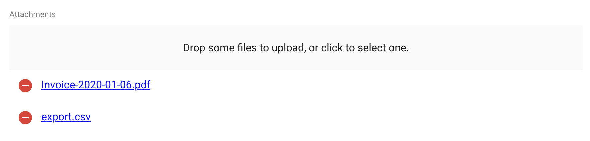

# `<FileInput>`

`<FileInput>` allows uploading files using [react-dropzone](https://github.com/okonet/react-dropzone).



## Properties

| Prop            | Required | Type                 | Default                         | Description                                                                                                                                                                                                                                                                                                                                            |
| --------------- | -------- | -------------------- | ------------------------------- | -----------------------------------------------------------------------------------------------------------------------------------------------------------------------------------------------------------------------------------------------------------------------------------------------------------------------------------------------------  |
| `accept`        | Optional | `string | string[]`  | -                               | Accepted file type(s), e. g. 'application/json,video/*' or 'application/vnd.openxmlformats-officedocument.spreadsheetml.sheet'. If left empty, all file types are accepted. Equivalent of the `accept` attribute of an `<input type="file">`. See [MDN input docs](https://developer.mozilla.org/en-US/docs/Web/HTML/Element/input/file#accept) for syntax and examples. |
| `children`      | Optional | `ReactNode`          | -                               | Element used to display the preview of a file (cloned several times if the select accepts multiple files).                                                                                                                                                                                                                                             |
| `minSize`       | Optional | `number`             | 0                               | Minimum file size (in bytes), e.g. 5000 for 5KB                                                                                                                                                                                                                                                                                                       |
| `maxSize`       | Optional | `number`             | `Infinity`                      | Maximum file size (in bytes), e.g. 5000000 for 5MB                                                                                                                                                                                                                                                                                                     |
| `multiple`      | Optional | `boolean`            | `false`                         | Set to true if the input should accept a list of files, false if it should only accept one file                                                                                                                                                                                                                                                        |
| `labelSingle`   | Optional | `string`             | 'ra.input.file. upload_single'  | Invite displayed in the drop zone if the input accepts one file                                                                                                                                                                                                                                                                                        |
| `labelMultiple` | Optional | `string`             | 'ra.input.file. upload_several' | Invite displayed in the drop zone if the input accepts several files                                                                                                                                                                                                                                                                                   |
| `placeholder`   | Optional | `ReactNode`          | -                               | Invite displayed in the drop zone, overrides `labelSingle` and `labelMultiple`                                                                                                                                                                                                                                                                         |
| `options`       | Optional | `Object`             | `{}`                            | Additional options passed to react-dropzone's `useDropzone()` hook. See [the react-dropzone source](https://github.com/react-dropzone/react-dropzone/blob/master/src/index.js)  for details .                                                                                                                                                          |

`<FileInput>` also accepts the [common input props](./Inputs.md#common-input-props).

## Usage

Files are accepted or rejected based on the `accept`, `multiple`, `minSize` and `maxSize` props. `accept` must be a valid [MIME type](https://www.iana.org/assignments/media-types/media-types.xhtml) according to [input element specification](https://www.w3.org/wiki/HTML/Elements/input/file) or a valid file extension. If `multiple` is set to false and additional files are dropped, all files besides the first will be rejected. Any file which does not have a size in the [`minSize`, `maxSize`] range, will be rejected as well.

`FileInput` delegates the preview of currently selected files to its child. `FileInput` clones its child as many times as there are selected files, passing the file as the `record` prop. To preview a simple list of files names, you can use `<FileField>` as child, as follows:

```jsx
<FileInput source="files" label="Related files" accept="application/pdf">
    <FileField source="src" title="title" />
</FileInput>
```

Writing a custom preview component is quite straightforward: it's a standard [field](./Fields.md#writing-your-own-field-component).

When receiving **new** files, `FileInput` will add a `rawFile` property to the object passed as the `record` prop of children. This `rawFile` is the [File](https://developer.mozilla.org/en-US/docs/Web/API/File) instance of the newly added file. This can be useful to display information about size or MIME type inside a custom field.

The `FileInput` component accepts an `options` prop into which you can pass all the [react-dropzone properties](https://react-dropzone.netlify.com/#proptypes).

If the default Dropzone label doesn't fit with your need, you can pass a `placeholder` prop to overwrite it. The value can be anything React can render (`PropTypes.node`):

```jsx
<FileInput source="files" label="Related files" accept="application/pdf" placeholder={<p>Drop your file here</p>}>
    <ImageField source="src" title="title" />
</FileInput>
```

Note that the file upload returns a [File](https://developer.mozilla.org/en/docs/Web/API/File) object. It is your responsibility to handle it depending on your API behavior. You can for instance encode it in base64, or send it as a multi-part form data. Check [this example](./DataProviders.md#handling-file-uploads) for base64 encoding data by extending the REST Client.

## CSS API

| Rule name       | Description                                                                       |
| --------------- | --------------------------------------------------------------------------------- |
| `root`          | Applied to the underlying `Labeled` component                                     |
| `dropZone`      | Applied to the main container of the component                                    |
| `preview`       | Applied to each children                                                          |
| `removeButton`  | Applied to each of the Material UI's `IconButton` component used as remove button |

To override the style of all instances of `<FileInput>` using the [material-ui style overrides](https://material-ui.com/customization/globals/#css), use the `RaFileInput` key.
