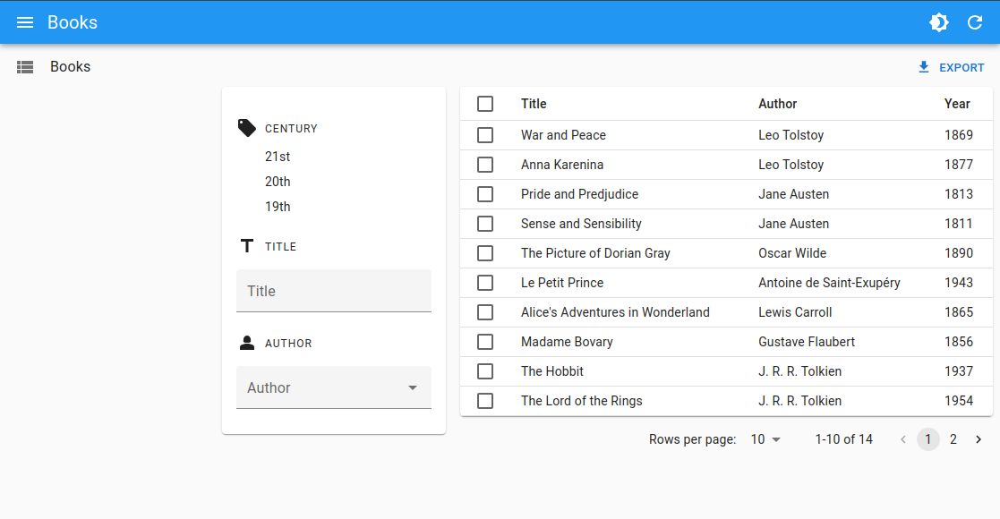

# `<FilterLiveForm>`

This component offers a convenient way to create a form that automatically updates the filters when the user changes its child input values.

It fits nicely alongside a [`<FilterList>`](./FilterList.md) component, but you can also use it at other places to create your own filter UI.

<video controls autoplay playsinline muted loop>
  <source src="./img/FilterLiveForm.mp4" type="video/mp4"/>
  Your browser does not support the video tag.
</video>

## Usage

Use `<FilterLiveForm>` inside a component that provides a [`ListContext`](./useListContext.md), such as [`<List>`](./List.md). Use any React Admin [input component](./Inputs.md) as its children.

Here is an example showing how you can use `<FilterLiveForm>` in a sidebar for the `<List>` view, alongside a [`<FilterList>`](./FilterList.md):


```tsx
import * as React from 'react';
import CategoryIcon from '@mui/icons-material/LocalOffer';
import Person2Icon from '@mui/icons-material/Person2';
import TitleIcon from '@mui/icons-material/Title';
import { Card, CardContent } from '@mui/material';
import {
    AutocompleteInput,
    FilterLiveForm,
    Datagrid,
    FilterList,
    FilterListItem,
    FilterListSection,
    List,
    ReferenceField,
    ReferenceInput,
    TextField,
    TextInput,
} from 'react-admin';

const BookListAside = () => (
    <Card sx={{ order: -1, mr: 2, mt: 6, width: 250, height: 'fit-content' }}>
        <CardContent>
            <FilterList label="Century" icon={<CategoryIcon />}>
                <FilterListItem
                    label="21st"
                    value={{ year_gte: 2000, year_lte: undefined }}
                />
                <FilterListItem
                    label="20th"
                    value={{ year_gte: 1900, year_lte: 1999 }}
                />
                <FilterListItem
                    label="19th"
                    value={{ year_gte: 1800, year_lte: 1899 }}
                />
            </FilterList>
            <FilterListSection label="Title" icon={<TitleIcon />}>
                <FilterLiveForm>
                    <TextInput source="title" resettable helperText={false} />
                </FilterLiveForm>
            </FilterListSection>
            <FilterListSection label="Author" icon={<Person2Icon />}>
                <FilterLiveForm>
                    <ReferenceInput source="authorId" reference="authors">
                        <AutocompleteInput helperText={false} />
                    </ReferenceInput>
                </FilterLiveForm>
            </FilterListSection>
        </CardContent>
    </Card>
);

export const BookList = () => (
    <List aside={<BookListAside />}>
        <Datagrid>
            <TextField source="title" />
            <ReferenceField source="authorId" reference="authors" />
            <TextField source="year" />
        </Datagrid>
    </List>
);
```


**Tip:** This example leverages `<FilterListSection>`, the wrapper used internally by `<FilterList>`, in order to obtain a consistent look and feel for the filters.



**Tip:** `<FilterLiveForm>` accepts multiple children, but you can also use several `<FilterLiveForm>` components in the same filter UI, just like we did above.

**Tip:** For simple cases where you only need a text input, you can use the [`<FilterLiveSearch>`](./FilterLiveSearch.md) component, which combines that logic in a single component.

## Props

Here are all the props you can set on the `<FilterLiveForm>` component:

| Prop            | Required | Type                | Default              | Description                                                              |
| --------------- | -------- | ------------------- | -------------------- | ------------------------------------------------------------------------ |
| `children`      | Required | `ReactNode`         | -                    | The children of the filter form (usually inputs)                         |
| `formComponent` | Optional | React Component     | Native HTML `<form>` | A React Component used to render the form                                |
| `debounce`      | Optional | `number` or `false` | 500                  | The debounce delay to set the filters (pass `false` to disable debounce) |
| `validate`      | Optional | `function`          | -                    | A function to validate the form values                                   |

Additional props are passed to `react-hook-form`'s [`useForm` hook](https://react-hook-form.com/docs/useform).

## `children`

`<FilterLiveForm>` accepts any children. It simply provides the required contexts for the inputs to work as filters.

```tsx
<FilterLiveForm>
    <TextInput source="title" resettable helperText={false} />
    <TextInput source="author" resettable helperText={false} />
</FilterLiveForm>
```

## `debounce`

You can use the `debounce` prop to customize the delay before the filters are applied. The default value is `500` milliseconds.

```tsx
<FilterLiveForm debounce={1000}>
    <TextInput source="title" resettable helperText={false} />
    <TextInput source="author" resettable helperText={false} />
</FilterLiveForm>
```

You can also disable the debounce by setting the `debounce` prop to `false`.

```tsx
<FilterLiveForm debounce={false}>
    <TextInput source="title" resettable helperText={false} />
    <TextInput source="author" resettable helperText={false} />
</FilterLiveForm>
```

## `validate`

Just like for [`<Form>`](./Form.md), you can provide a `validate` function to validate the form values.

```tsx
const validateFilters = values => {
    const errors: any = {};
    if (!values.author) {
        errors.author = 'The author is required';
    }
    return errors;
};

const GlobalValidation = () => (
    <FilterLiveForm validate={validateFilters}>
        <TextInput source="title" resettable helperText={false} />
        <TextInput source="author" resettable helperText={false} />
    </FilterLiveForm>
);
```
