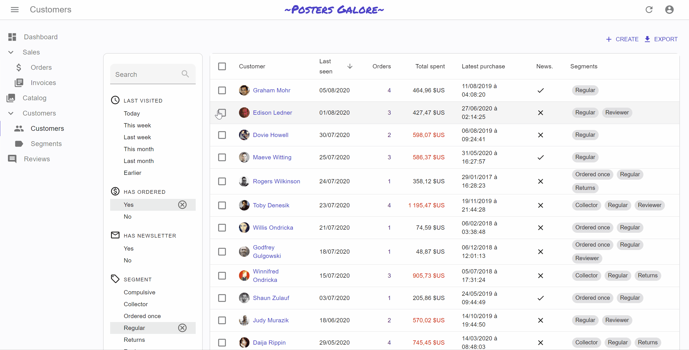

# Filtering the List

<table><tbody><tr style="border:none">
<td style="width:50%;border:none;">
<a title="Filter Button/Form Combo" href="./img/list_filter.gif"></a>
</td>
<td style="width:50%;border:none;">
<a title="<FilterList> Sidebar" href="./img/filter-sidebar.gif"></a>
</td>
</tr></tbody></table>

One of the most important features of the List page is the ability to filter the results. React-admin does its best to offer a powerful filter functionality, and to get out of the way when you want to go further. 

The next sections explain how to use the filter functionality. And first, a few explanations about the inner workings of filters:

- [Filter Query Parameter](#filter-query-parameter)
- [Linking To A Pre-Filtered List](#linking-to-a-pre-filtered-list)

React-admin proposes several UI components to let users see and modify filters, and gives you the tools to build custom ones.

- The Filter Button/Form Combo
  - [Usage](#the-filter-buttonform-combo)
  - [Full-Text Search](#full-text-search)
  - [Quick Filters](#quick-filters)
- [The `<FilterList>` Sidebar](#the-filterlist-sidebar)
- [Saved Queries: Let Users Save Filter And Sort](#saved-queries-let-users-save-filter-and-sort)
- [Building A Custom Filter](#building-a-custom-filter)

## Filter Query Parameter

React-admin uses the `filter` query parameter from the URL to determine the filters to apply to the list. To change the filters, react-admin simply changes this `filter` query parameter, and the `<List>` components fetches `dataProvider.getList()` again with the new filters.

Here is a typical List URL:

> https://myadmin.dev/#/posts?displayedFilters=%7B%22commentable%22%3Atrue%7D&filter=%7B%22commentable%22%3Atrue%2C%22q%22%3A%22lorem%20%22%7D&order=DESC&page=1&perPage=10&sort=published_at

Once decoded, the `filter` query parameter reveals as a JSON value:

```
filter={"commentable":true,"q":"lorem "}
```

You can change the filters by updating the query parameter, e.g. using the `<Link>` component or the `history.push()` method from `react-router`. 

**Tip**: Once a user sets a filter, react-admin persists the filter value in the application state, so that when the user comes back to the list, they should see the filtered list. That's a design choice.

## Linking To A Pre-Filtered List

As the filter values are taken from the URL, you can link to a pre-filtered list by setting the `filter` query parameter.

For instance, if you have a list of tags, you can display a button for each category to link to the list of posts filtered by that tag:


```jsx
import Button from '@mui/material/Button';
import { Link } from 'react-router-dom';

const LinkToRelatedProducts = ({ record }) => {
    const translate = useTranslate();
    return record ? (
        <Button
            color="primary"
            component={Link}
            to={{
                pathname: '/posts',
                search: `filter=${JSON.stringify({ category_id: record.id })}`,
            }}
        >
            All posts with the category {record.name} ; 
        </Button>
    ) : null;
};
```


You can use this button e.g. as a child of `<Datagrid>`. You can also create a custom Menu button with that technique to link to the unfiltered list by setting the filter value to `{}`.

## The Filter Button/Form Combo


The default appearance for filters is an inline form displayed on top of the list. Users also see a dropdown button allowing to add more inputs to that form. This functionality relies on the `filters` prop: 

```jsx
import { TextInput } from 'react-admin';

const postFilters = [
    <TextInput label="Search" source="q" alwaysOn />,
    <TextInput label="Title" source="title" defaultValue="Hello, World!" />,
];
```

Elements of the `filters` array are regular inputs. That means you can build sophisticated filters based on references, array values, etc. `<List>` hides all inputs in the filter form by default, except those that have the `alwaysOn` prop.

**Tip**: For technical reasons, react-admin does not accept Filter inputs having both a `defaultValue` and `alwaysOn`. To set default values for always on filters, use the [`filterDefaultValues`](#filterdefaultvalues) prop of the `<List>` component instead.

To inject the filter form in a `<List>`, use the `filters` prop:

```jsx
export const PostList = (props) => (
    <List {...props} filters={postFilters}>
        ...
    </List>
);
```

`<List>` uses the elements passed as `filters` twice:

- once to render the filter *form*
- once to render the filter *button* (using each element `label`, falling back to the humanized `source`)

### Full-Text Search


In addition to [the usual input types](./Inputs.md) (`<TextInput>`, `<SelectInput>`, `<ReferenceInput>`, etc.), you can use the `<SearchInput>`, which is designed especially for the filter form. It's like a `<TextInput resettable>` with a magnifier glass icon - exactly the type of input users look for when they want to do a full-text search. 

```jsx
import { SearchInput, TextInput } from 'react-admin';

const postFilters = [
    <SearchInput source="q" alwaysOn />
];
```

In the example given above, the `q` filter triggers a full-text search on all fields. It's your responsibility to implement the full-text filtering capabilities in your `dataProvider`, or in your API.

### Quick Filters


Users usually dislike using their keyboard to filter a list (especially on mobile). A good way to satisfy this user requirement is to turn filters into *quick filter*. A Quick filter is a filter with a non-editable `defaultValue`. Users can only enable or disable them. 

Here is how to implement a generic `<QuickFilter>` component:

```jsx
import { SearchInput } from 'react-admin';
import { makeStyles, Chip } from '@mui/material';

const useQuickFilterStyles = makeStyles(theme => ({
    chip: {
        marginBottom: theme.spacing(1),
    },
}));
const QuickFilter = ({ label }) => {
    const translate = useTranslate();
    const classes = useQuickFilterStyles();
    return <Chip className={classes.chip} label={translate(label)} />;
};

const postFilters = [
    <SearchInput source="q" alwaysOn />,
    <QuickFilter source="commentable" label="Commentable" defaultValue={true} />,
    <QuickFilter source="views_lte" label="Low views" defaultValue={150} />,
    <QuickFilter source="tags" label="Tagged Code" defaultValue={[3]} />,
];
```

**Tip**: It's currently not possible to use two quick filters for the same source. 

## The `<FilterList>` Sidebar


An alternative UI to the Filter Button/Form Combo is the FilterList Sidebar. Similar to what users usually see on e-commerce websites, it's a panel with many simple filters that can be enabled and combined using the mouse. The user experience is better than the Button/Form Combo, because the filter values are explicit, and it doesn't require typing anything in a form. But it's a bit less powerful, as only filters with a finite set of values (or intervals) can be used in the `<FilterList>`.

Check [the `<FilterList>` documentation](./FilterList.md) for more information.

If you use the FilterList, you'll probably need a search input. As the FilterList sidebar is not a form, this requires a bit of extra work. Fortunately, react-admin provides a specialized search inpurt component for that purpose: check [the `<FilterLiveSearch>` documentation](./FilterLiveSearch.md) for details.



## Saved Queries: Let Users Save Filter And Sort

[](https://marmelab.com/ra-enterprise/modules/assets/ra-preferences-SavedQueriesList.gif)

Saved Queries are an [Enterprise Edition](https://marmelab.com/ra-enterprise) feature letting users save a combination of filters and sort parameters into a new, personal filter. Saved queries persist between sessions, so users can find their custom queries even after closing and reopening the admin. Saved queries are available both for the Filter Button/Form combo and for the `<FilterList>` Sidebar:

- `<FilterWithSave>` is a drop-in replacement for react-admin's `<Filter>` component

```diff
import {
-   Filter,
    SelectInput,
    DateInput,
    List,
    Datagrid,
    TextField,
    NumberField,
    DateField
} from 'react-admin';
+import { FilterWithSave } from '@react-admin/ra-preferences';

const SongFilter = props => (
-   <Filter {...props}>
+   <FilterWithSave {...props}>
        <SelectInput
            choices={[
                { id: 'Apple', name: 'Apple' },
                { id: 'Atlantic', name: 'Atlantic' },
                { id: 'Capitol', name: 'Capitol' },
                { id: 'Chess', name: 'Chess' },
                { id: 'Columbia', name: 'Columbia' },
                { id: 'DGC', name: 'DGC' },
                { id: 'London', name: 'London' },
                { id: 'Tamla', name: 'Tamla' },
            ]}
            source="recordCompany"
        />
        <DateInput source="released_gte" label="Released after" />
        <DateInput source="released_lte" label="Released before" />
-   </Filter>
+   </FilterWithSave>
);

const SongList = props => (
    <List {...props} filters={<SongFilter />}>
        <Datagrid rowClick="edit">
            <TextField source="title" />
            <TextField source="artist" />
            <TextField source="writer" />
            <TextField source="producer" />
            <TextField source="recordCompany" />
            <NumberField source="rank" />
            <DateField source="released" />
        </Datagrid>
    </List>
);
```

- `<SavedFilterList>` is a complement to `<FilterList>` sections for the filter sidebar

```diff
import { FilterList, FilterListItem, List, Datagrid } from 'react-admin';
import { Card, CardContent } from '@mui/material';

+import { SavedQueriesList } from '@react-admin/ra-preferences';

const SongFilterSidebar = () => (
    <Card>
        <CardContent>
+           <SavedQueriesList />
            <FilterList label="Record Company" icon={<BusinessIcon />}>
                ...
            </FilterList>
            <FilterList label="Released" icon={<DateRangeeIcon />}>
               ...
            </FilterList>
        </CardContent>
    </Card>
);

const SongList = props => (
    <List {...props} aside={<SongFilterSidebar />}>
        <Datagrid>
            ...
        </Datagrid>
    </List>
);
```

For mode details about Saved Queries, check the [`ra-preferences` module](https://marmelab.com/ra-enterprise/modules/ra-preferences#savedquerieslist-and-filterwithsave-store-user-queries-in-preferences) in React-Admin Enterprise Edition. 


## Global Search

Although list filters allow to make precise queries using per-field criteria, users often prefer simpler interfaces like full-text search. After all, that's what they use every day on search engines, email clients, and in their file explorer. 

If you want to display a full-text search allowing to look for any record in the admin using a single form input, check out [ra-search](https://marmelab.com/ra-enterprise/modules/ra-search), an [Enterprise Edition](https://marmelab.com/ra-enterprise) module.


`ra-search` can plug to any existing search engine (ElasticSearch, Lucene, or custom search engine), and lets you customize the search results to provide quick navigation to related items, turning the search engine into an "Omnibox": 


For mode details about the global search, check the [`ra-search` module](https://marmelab.com/ra-enterprise/modules/ra-search) in React-Admin Enterprise Edition. 
